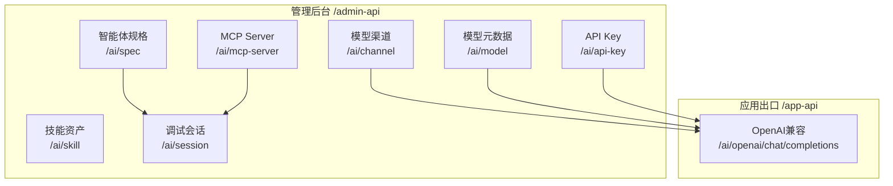
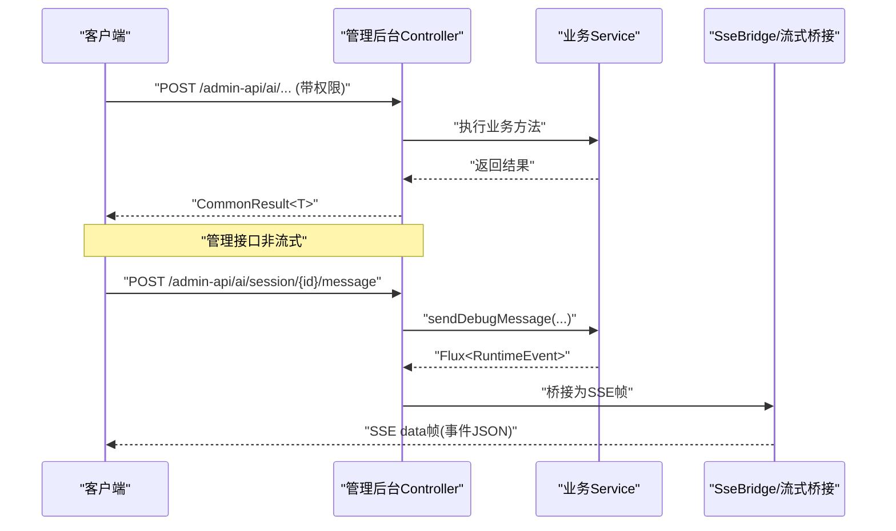
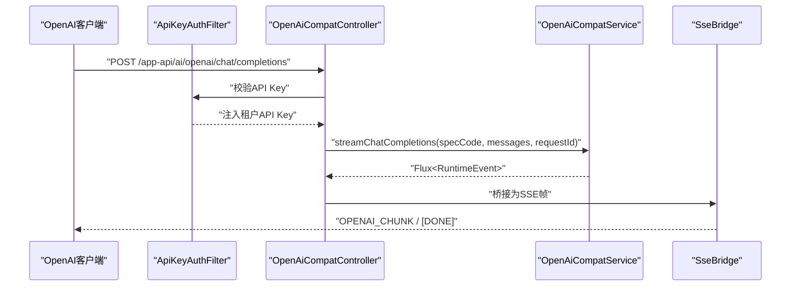
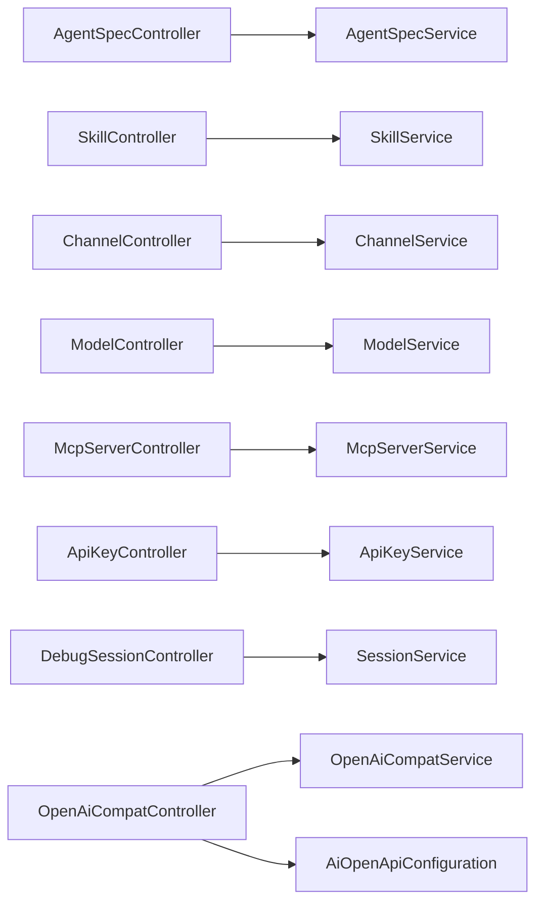

# AI业务接口

<cite>
**本文档引用的文件**
- [AgentSpecController.java](file://nexai-module-ai/src/main/java/com/gkht/ai/nexai/module/ai/agentspec/interfaces/controller/admin/spec/AgentSpecController.java)
- [SkillController.java](file://nexai-module-ai/src/main/java/com/gkht/ai/nexai/module/ai/skill/interfaces/controller/admin/skill/SkillController.java)
- [ChannelController.java](file://nexai-module-ai/src/main/java/com/gkht/ai/nexai/module/ai/channel/interfaces/controller/admin/channel/ChannelController.java)
- [ModelController.java](file://nexai-module-ai/src/main/java/com/gkht/ai/nexai/module/ai/channel/interfaces/controller/admin/channel/ModelController.java)
- [McpServerController.java](file://nexai-module-ai/src/main/java/com/gkht/ai/nexai/module/ai/mcpserver/interfaces/controller/admin/mcpserver/McpServerController.java)
- [ApiKeyController.java](file://nexai-module-ai/src/main/java/com/gkht/ai/nexai/module/ai/apikey/interfaces/controller/admin/apikey/ApiKeyController.java)
- [DebugSessionController.java](file://nexai-module-ai/src/main/java/com/gkht/ai/nexai/module/ai/session/interfaces/controller/admin/session/DebugSessionController.java)
- [OpenAiCompatController.java](file://nexai-module-ai/src/main/java/com/gkht/ai/nexai/module/ai/session/interfaces/controller/app/openai/OpenAiCompatController.java)
- [AiOpenApiConfiguration.java](file://nexai-module-ai/src/main/java/com/gkht/ai/nexai/module/ai/framework/config/AiOpenApiConfiguration.java)
- [ErrorCodeConstants.java](file://nexai-module-ai/src/main/java/com/gkht/ai/nexai/module/ai/enums/ErrorCodeConstants.java)
</cite>

## 目录
1. [简介](#简介)
2. [项目结构](#项目结构)
3. [核心组件](#核心组件)
4. [架构总览](#架构总览)
5. [详细组件分析](#详细组件分析)
6. [依赖关系分析](#依赖关系分析)
7. [性能与可靠性](#性能与可靠性)
8. [故障排查指南](#故障排查指南)
9. [结论](#结论)
10. [附录：认证、权限与数据校验](#附录认证权限与数据校验)

## 简介
本文件为NexAI平台AI业务模块的API接口文档，覆盖以下核心能力：
- Agent规格管理（创建、分页查询、详情、更新）
- 会话管理（调试会话创建、消息流式发送、审批、中断、历史与workspace文件）
- 技能管理（创建、版本登记、分页、版本内容、上架/下架、删除）
- 渠道管理（BYOK模型渠道CRUD、启停、连通性探测、启用列表）
- 模型元数据管理（模型CRUD、启停、分页、详情）
- MCP服务器管理（注册、更新、启停、删除、详情、分页、连通探测并拉取工具清单）
- API密钥管理（生成、分页、吊销）
- OpenAI兼容出口（流式对话，SSE帧格式）
- WebSocket实时通信（框架级WebSocket能力说明）

所有HTTP接口统一遵循RESTful风格，返回体使用通用包装类型。鉴权采用基于角色的访问控制（RBAC），并通过注解声明所需权限；部分公开出口通过租户API Key进行认证。

## 项目结构
AI模块按领域聚合划分，控制器位于各子模块的interfaces.controller包下，统一由Web Starter挂载到/admin-api或/app-api前缀：
- /admin-api/*：管理后台接口（需要登录态与权限）
- /app-api/*：对外应用接口（如OpenAI兼容出口，使用API Key认证）

图表来源
- [AgentSpecController.java:34-69](file://nexai-module-ai/src/main/java/com/gkht/ai/nexai/module/ai/agentspec/interfaces/controller/admin/spec/AgentSpecController.java#L34-L69)
- [SkillController.java:36-101](file://nexai-module-ai/src/main/java/com/gkht/ai/nexai/module/ai/skill/interfaces/controller/admin/skill/SkillController.java#L36-L101)
- [ChannelController.java:38-105](file://nexai-module-ai/src/main/java/com/gkht/ai/nexai/module/ai/channel/interfaces/controller/admin/channel/ChannelController.java#L38-L105)
- [ModelController.java:34-86](file://nexai-module-ai/src/main/java/com/gkht/ai/nexai/module/ai/channel/interfaces/controller/admin/channel/ModelController.java#L34-L86)
- [McpServerController.java:35-95](file://nexai-module-ai/src/main/java/com/gkht/ai/nexai/module/ai/mcpserver/interfaces/controller/admin/mcpserver/McpServerController.java#L35-L95)
- [ApiKeyController.java:31-59](file://nexai-module-ai/src/main/java/com/gkht/ai/nexai/module/ai/apikey/interfaces/controller/admin/apikey/ApiKeyController.java#L31-L59)
- [DebugSessionController.java:44-130](file://nexai-module-ai/src/main/java/com/gkht/ai/nexai/module/ai/session/interfaces/controller/admin/session/DebugSessionController.java#L44-L130)
- [OpenAiCompatController.java:42-78](file://nexai-module-ai/src/main/java/com/gkht/ai/nexai/module/ai/session/interfaces/controller/app/openai/OpenAiCompatController.java#L42-L78)

章节来源
- [AgentSpecController.java:34-69](file://nexai-module-ai/src/main/java/com/gkht/ai/nexai/module/ai/agentspec/interfaces/controller/admin/spec/AgentSpecController.java#L34-L69)
- [SkillController.java:36-101](file://nexai-module-ai/src/main/java/com/gkht/ai/nexai/module/ai/skill/interfaces/controller/admin/skill/SkillController.java#L36-L101)
- [ChannelController.java:38-105](file://nexai-module-ai/src/main/java/com/gkht/ai/nexai/module/ai/channel/interfaces/controller/admin/channel/ChannelController.java#L38-L105)
- [ModelController.java:34-86](file://nexai-module-ai/src/main/java/com/gkht/ai/nexai/module/ai/channel/interfaces/controller/admin/channel/ModelController.java#L34-L86)
- [McpServerController.java:35-95](file://nexai-module-ai/src/main/java/com/gkht/ai/nexai/module/ai/mcpserver/interfaces/controller/admin/mcpserver/McpServerController.java#L35-L95)
- [ApiKeyController.java:31-59](file://nexai-module-ai/src/main/java/com/gkht/ai/nexai/module/ai/apikey/interfaces/controller/admin/apikey/ApiKeyController.java#L31-L59)
- [DebugSessionController.java:44-130](file://nexai-module-ai/src/main/java/com/gkht/ai/nexai/module/ai/session/interfaces/controller/admin/session/DebugSessionController.java#L44-L130)
- [OpenAiCompatController.java:42-78](file://nexai-module-ai/src/main/java/com/gkht/ai/nexai/module/ai/session/interfaces/controller/app/openai/OpenAiCompatController.java#L42-L78)

## 核心组件
- 智能体规格：提供规格的创建、分页查询、详情获取与更新，支持草稿与发布快照分离。
- 技能资产：提供技能的创建、版本登记、分页、版本内容预览、上架/下架与删除。
- 模型渠道：提供BYOK渠道的CRUD、启停、连通性探测与启用列表。
- 模型元数据：提供模型的CRUD、启停、分页与详情。
- MCP服务器：提供注册、更新、启停、删除、详情、分页以及连通探测并拉取工具清单。
- API密钥：提供生成、分页与吊销。
- 调试会话：提供调试会话创建、消息流式发送、HITL审批、中断、历史加载与workspace文件操作。
- OpenAI兼容出口：提供流式对话SSE接口，适配OpenAI客户端协议。

章节来源
- [AgentSpecController.java:41-69](file://nexai-module-ai/src/main/java/com/gkht/ai/nexai/module/ai/agentspec/interfaces/controller/admin/spec/AgentSpecController.java#L41-L69)
- [SkillController.java:43-101](file://nexai-module-ai/src/main/java/com/gkht/ai/nexai/module/ai/skill/interfaces/controller/admin/skill/SkillController.java#L43-L101)
- [ChannelController.java:45-105](file://nexai-module-ai/src/main/java/com/gkht/ai/nexai/module/ai/channel/interfaces/controller/admin/channel/ChannelController.java#L45-L105)
- [ModelController.java:41-86](file://nexai-module-ai/src/main/java/com/gkht/ai/nexai/module/ai/channel/interfaces/controller/admin/channel/ModelController.java#L41-L86)
- [McpServerController.java:42-95](file://nexai-module-ai/src/main/java/com/gkht/ai/nexai/module/ai/mcpserver/interfaces/controller/admin/mcpserver/McpServerController.java#L42-L95)
- [ApiKeyController.java:38-59](file://nexai-module-ai/src/main/java/com/gkht/ai/nexai/module/ai/apikey/interfaces/controller/admin/apikey/ApiKeyController.java#L38-L59)
- [DebugSessionController.java:51-130](file://nexai-module-ai/src/main/java/com/gkht/ai/nexai/module/ai/session/interfaces/controller/admin/session/DebugSessionController.java#L51-L130)
- [OpenAiCompatController.java:55-78](file://nexai-module-ai/src/main/java/com/gkht/ai/nexai/module/ai/session/interfaces/controller/app/openai/OpenAiCompatController.java#L55-L78)

## 架构总览
整体调用链路：
- 管理后台请求进入对应Controller，经参数校验后调用Service完成业务逻辑，最终返回通用结果包装。
- 调试会话与OpenAI兼容出口使用SSE流式响应，内部将事件转换为SSE帧推送给客户端。
- OpenAI兼容出口通过过滤器以租户API Key进行认证，并在配置中放行路径。

图表来源
- [DebugSessionController.java:58-76](file://nexai-module-ai/src/main/java/com/gkht/ai/nexai/module/ai/session/interfaces/controller/admin/session/DebugSessionController.java#L58-L76)
- [OpenAiCompatController.java:55-78](file://nexai-module-ai/src/main/java/com/gkht/ai/nexai/module/ai/session/interfaces/controller/app/openai/OpenAiCompatController.java#L55-L78)
- [AiOpenApiConfiguration.java:23-63](file://nexai-module-ai/src/main/java/com/gkht/ai/nexai/module/ai/framework/config/AiOpenApiConfiguration.java#L23-L63)

章节来源
- [DebugSessionController.java:58-76](file://nexai-module-ai/src/main/java/com/gkht/ai/nexai/module/ai/session/interfaces/controller/admin/session/DebugSessionController.java#L58-L76)
- [OpenAiCompatController.java:55-78](file://nexai-module-ai/src/main/java/com/gkht/ai/nexai/module/ai/session/interfaces/controller/app/openai/OpenAiCompatController.java#L55-L78)
- [AiOpenApiConfiguration.java:23-63](file://nexai-module-ai/src/main/java/com/gkht/ai/nexai/module/ai/framework/config/AiOpenApiConfiguration.java#L23-L63)

## 详细组件分析

### 智能体规格管理（/admin-api/ai/spec）
- POST /create
  - 功能：创建规格并携带首个草稿；spec_code与归属层级创建后不可变
  - 权限：ai:spec:create
  - 请求体：规格创建命令对象（字段见服务层DTO/Command）
  - 响应：规格ID
- GET /page
  - 功能：分页查询规格（支持业务编码/归属/草稿状态过滤；用户级规格仅归属用户可见）
  - 权限：ai:spec:query
  - 查询参数：分页与过滤条件
  - 响应：分页结果
- GET /get?id=
  - 功能：获取规格详情（主体元数据+配置平铺；草稿优先；已发布无草稿时取当前生效快照）
  - 权限：ai:spec:query
  - 响应：规格详情对象
- PUT /update
  - 功能：更新规格（编辑面：整体替换主体元数据与草稿，不触碰已发布快照）
  - 权限：ai:spec:update
  - 请求体：规格更新命令对象
  - 响应：布尔值

章节来源
- [AgentSpecController.java:41-69](file://nexai-module-ai/src/main/java/com/gkht/ai/nexai/module/ai/agentspec/interfaces/controller/admin/spec/AgentSpecController.java#L41-L69)

### 技能管理（/admin-api/ai/skill）
- POST /create
  - 功能：创建技能并登记首个版本，物化到文件目录供agentscope读取
  - 权限：ai:skill:create
  - 请求体：技能创建命令对象
  - 响应：技能ID
- POST /version
  - 功能：登记新版本（版本链只增不改），物化到文件目录
  - 权限：ai:skill:update
  - 请求体：版本命令对象
  - 响应：版本号
- GET /page
  - 功能：分页查询技能（租户级租户内全见 + 用户级仅归属用户）
  - 权限：ai:skill:query
  - 查询参数：分页与过滤条件
  - 响应：分页结果
- GET /version-page?skillId=
  - 功能：列出技能版本（含当前版本标识）
  - 权限：ai:skill:query
  - 响应：版本列表
- GET /version-get?skillId=&versionNo=
  - 功能：获取版本内容（markdown全文+资源路径清单）
  - 权限：ai:skill:query
  - 响应：版本内容对象
- DELETE /delete?id=
  - 功能：删除技能（级联删除版本链）
  - 权限：ai:skill:delete
  - 响应：布尔值
- POST /publish?id=
  - 功能：上架技能（进入终端技能目录）
  - 权限：ai:skill:update
  - 响应：布尔值
- POST /unpublish?id=
  - 功能：下架技能（移出终端技能目录）
  - 权限：ai:skill:update
  - 响应：布尔值

章节来源
- [SkillController.java:43-101](file://nexai-module-ai/src/main/java/com/gkht/ai/nexai/module/ai/skill/interfaces/controller/admin/skill/SkillController.java#L43-L101)

### 渠道管理（/admin-api/ai/channel）
- POST /create
  - 功能：创建渠道（租户自带密钥BYOK；归属固定租户侧）
  - 权限：ai:channel:create
  - 请求体：渠道创建命令对象
  - 响应：渠道ID
- PUT /update
  - 功能：更新渠道（apiKey留空表示保留原密钥）
  - 权限：ai:channel:update
  - 请求体：渠道更新命令对象
  - 响应：布尔值
- PUT /update-status
  - 功能：启停渠道
  - 权限：ai:channel:update
  - 请求体：状态更新命令对象
  - 响应：布尔值
- DELETE /delete?id=
  - 功能：删除渠道（级联删除其下全部模型）
  - 权限：ai:channel:delete
  - 响应：布尔值
- GET /page
  - 功能：分页查询渠道（密钥脱敏出参）
  - 权限：ai:channel:query
  - 查询参数：分页与过滤条件
  - 响应：分页结果
- GET /get?id=
  - 功能：获取渠道详情（编辑回显；密钥脱敏，仅返回是否已配置）
  - 权限：ai:channel:query
  - 响应：渠道详情对象
- GET /simple-list
  - 功能：获取启用渠道简要列表（模型表单的渠道下拉）
  - 权限：ai:channel:query
  - 响应：渠道列表
- POST /connectivity-test
  - 功能：连通性探测（表单凭据即测不落库；携带channelId且密钥留空时回退已存密钥）
  - 权限：ai:channel:query
  - 请求体：连通性测试命令对象
  - 响应：连通性测试结果

章节来源
- [ChannelController.java:45-105](file://nexai-module-ai/src/main/java/com/gkht/ai/nexai/module/ai/channel/interfaces/controller/admin/channel/ChannelController.java#L45-L105)

### 模型元数据管理（/admin-api/ai/model）
- POST /create
  - 功能：登记模型（挂接渠道；同渠道内模型标识唯一）
  - 权限：ai:model:create
  - 请求体：模型创建命令对象
  - 响应：模型ID
- PUT /update
  - 功能：更新模型（全量替换，可改挂渠道）
  - 权限：ai:model:update
  - 请求体：模型更新命令对象
  - 响应：布尔值
- PUT /update-status
  - 功能：启停模型
  - 权限：ai:model:update
  - 请求体：状态更新命令对象
  - 响应：布尔值
- DELETE /delete?id=
  - 功能：删除模型
  - 权限：ai:model:delete
  - 响应：布尔值
- GET /page
  - 功能：分页查询模型（补充渠道显示名）
  - 权限：ai:model:query
  - 查询参数：分页与过滤条件
  - 响应：分页结果
- GET /get?id=
  - 功能：获取模型详情
  - 权限：ai:model:query
  - 响应：模型详情对象

章节来源
- [ModelController.java:41-86](file://nexai-module-ai/src/main/java/com/gkht/ai/nexai/module/ai/channel/interfaces/controller/admin/channel/ModelController.java#L41-L86)

### MCP服务器管理（/admin-api/ai/mcp-server）
- POST /create
  - 功能：注册MCP Server（三传输：stdio/SSE/StreamableHTTP + 认证；MVP租户级BYO-MCP）
  - 权限：ai:mcp-server:create
  - 请求体：MCP服务器创建命令对象
  - 响应：服务器ID
- PUT /update
  - 功能：更新MCP Server（接入配置整体替换；认证头null=保留原值）
  - 权限：ai:mcp-server:update
  - 请求体：MCP服务器更新命令对象
  - 响应：布尔值
- PUT /update-status
  - 功能：启用/停用MCP Server
  - 权限：ai:mcp-server:update
  - 请求体：状态更新命令对象
  - 响应：布尔值
- DELETE /delete?id=
  - 功能：删除MCP Server
  - 权限：ai:mcp-server:delete
  - 响应：布尔值
- GET /get?id=
  - 功能：获取MCP Server详情（不含认证头与环境变量）
  - 权限：ai:mcp-server:query
  - 响应：服务器详情对象
- GET /page
  - 功能：分页查询MCP Server
  - 权限：ai:mcp-server:query
  - 查询参数：分页与过滤条件
  - 响应：分页结果
- POST /probe?id=
  - 功能：连通探测并拉取工具清单（initialize + listTools；成功时工具名清单回写缓存）
  - 权限：ai:mcp-server:probe
  - 响应：探测结果（含工具清单）

章节来源
- [McpServerController.java:42-95](file://nexai-module-ai/src/main/java/com/gkht/ai/nexai/module/ai/mcpserver/interfaces/controller/admin/mcpserver/McpServerController.java#L42-L95)

### API密钥管理（/admin-api/ai/api-key）
- POST /create
  - 功能：生成API Key（服务端生成明文Key并密文落库；明文仅本次响应返回一次）
  - 权限：ai:api-key:create
  - 请求体：API Key创建命令对象
  - 响应：包含明文Key的创建结果对象
- GET /page
  - 功能：分页查询API Key（不含明文与哈希）
  - 权限：ai:api-key:query
  - 查询参数：分页与过滤条件
  - 响应：分页结果
- DELETE /revoke?id=
  - 功能：吊销API Key（状态单向置REVOKED，幂等）
  - 权限：ai:api-key:revoke
  - 响应：布尔值

章节来源
- [ApiKeyController.java:38-59](file://nexai-module-ai/src/main/java/com/gkht/ai/nexai/module/ai/apikey/interfaces/controller/admin/apikey/ApiKeyController.java#L38-L59)

### 调试会话管理（/admin-api/ai/session）
- POST /debug/create
  - 功能：发起调试会话（绑定规格与版本；null=当前版本），生成会话业务键
  - 权限：ai:session:create
  - 请求体：调试会话创建命令对象
  - 响应：会话ID
- POST /{id}/message（SSE）
  - 功能：发送调试消息（SSE全事件流：文本增量/思考块/工具调用/用量；错误以SESSION_ERROR事件收尾）
  - 权限：ai:session:message
  - 请求体：调试消息命令对象
  - 响应：SSE事件流（事件类型名作为event，data为事件JSON）
- POST /{id}/confirm（SSE）
  - 功能：HITL审批（对挂起中的敏感工具调用三态审批：确认/拒绝/改参数），返回续行事件流
  - 权限：ai:session:confirm
  - 请求体：审批命令对象
  - 响应：SSE事件流
- POST /{id}/interrupt
  - 功能：中断调试会话（幂等；中断当前运行流并正常收尾）
  - 权限：ai:session:interrupt
  - 响应：布尔值
- GET /page
  - 功能：分页查询调试会话（可按规格与状态过滤）
  - 权限：ai:session:query
  - 查询参数：分页与过滤条件
  - 响应：分页结果
- GET /{id}
  - 功能：获取会话详情（含规格业务编码补充）
  - 权限：ai:session:query
  - 响应：会话详情对象
- GET /{id}/pending
  - 功能：获取挂起审批上下文（ASKING状态会话恢复时渲染审批卡片）
  - 权限：ai:session:query
  - 响应：待审批列表
- GET /{id}/history
  - 功能：加载会话历史消息（重开调试台恢复）
  - 权限：ai:session:query
  - 响应：历史消息列表
- GET /{id}/workspace/files
  - 功能：列出会话workspace文件（相对路径空=根目录）
  - 权限：ai:session:query
  - 查询参数：path（可选）
  - 响应：文件路径列表
- GET /{id}/workspace/file
  - 功能：读取会话workspace文件内容（越界/不存在返回null）
  - 权限：ai:session:query
  - 查询参数：path
  - 响应：文件内容字符串

章节来源
- [DebugSessionController.java:51-130](file://nexai-module-ai/src/main/java/com/gkht/ai/nexai/module/ai/session/interfaces/controller/admin/session/DebugSessionController.java#L51-L130)

### OpenAI兼容出口（/app-api/ai/openai）
- POST /chat/completions（SSE）
  - 功能：流式对话（仅支持stream=true；model字段路由到智能体specCode；历史消息透传；tool消息MVP不支持）
  - 认证：租户API Key（由过滤器处理）
  - 请求体：ChatCompletionsRequest（agentscope协议类型）
  - 响应：SSE事件流（OPENAI_CHUNK帧；末尾[DONE]；错误首帧为OpenAI错误体）

图表来源
- [OpenAiCompatController.java:55-78](file://nexai-module-ai/src/main/java/com/gkht/ai/nexai/module/ai/session/interfaces/controller/app/openai/OpenAiCompatController.java#L55-L78)
- [OpenAiCompatController.java:94-131](file://nexai-module-ai/src/main/java/com/gkht/ai/nexai/module/ai/session/interfaces/controller/app/openai/OpenAiCompatController.java#L94-L131)
- [AiOpenApiConfiguration.java:23-63](file://nexai-module-ai/src/main/java/com/gkht/ai/nexai/module/ai/framework/config/AiOpenApiConfiguration.java#L23-L63)

章节来源
- [OpenAiCompatController.java:55-78](file://nexai-module-ai/src/main/java/com/gkht/ai/nexai/module/ai/session/interfaces/controller/app/openai/OpenAiCompatController.java#L55-L78)
- [OpenAiCompatController.java:94-131](file://nexai-module-ai/src/main/java/com/gkht/ai/nexai/module/ai/session/interfaces/controller/app/openai/OpenAiCompatController.java#L94-L131)
- [AiOpenApiConfiguration.java:23-63](file://nexai-module-ai/src/main/java/com/gkht/ai/nexai/module/ai/framework/config/AiOpenApiConfiguration.java#L23-L63)

## 依赖关系分析
- 控制器之间无直接耦合，均依赖各自Service完成业务逻辑。
- 调试会话与OpenAI兼容出口共享SSE桥接能力，统一事件封装与帧编码。
- OpenAI兼容出口依赖API Key认证过滤器与配置类进行路径放行与字符集设置。

图表来源
- [AgentSpecController.java:38-69](file://nexai-module-ai/src/main/java/com/gkht/ai/nexai/module/ai/agentspec/interfaces/controller/admin/spec/AgentSpecController.java#L38-L69)
- [SkillController.java:40-101](file://nexai-module-ai/src/main/java/com/gkht/ai/nexai/module/ai/skill/interfaces/controller/admin/skill/SkillController.java#L40-L101)
- [ChannelController.java:42-105](file://nexai-module-ai/src/main/java/com/gkht/ai/nexai/module/ai/channel/interfaces/controller/admin/channel/ChannelController.java#L42-L105)
- [ModelController.java:38-86](file://nexai-module-ai/src/main/java/com/gkht/ai/nexai/module/ai/channel/interfaces/controller/admin/channel/ModelController.java#L38-L86)
- [McpServerController.java:39-95](file://nexai-module-ai/src/main/java/com/gkht/ai/nexai/module/ai/mcpserver/interfaces/controller/admin/mcpserver/McpServerController.java#L39-L95)
- [ApiKeyController.java:35-59](file://nexai-module-ai/src/main/java/com/gkht/ai/nexai/module/ai/apikey/interfaces/controller/admin/apikey/ApiKeyController.java#L35-L59)
- [DebugSessionController.java:48-130](file://nexai-module-ai/src/main/java/com/gkht/ai/nexai/module/ai/session/interfaces/controller/admin/session/DebugSessionController.java#L48-L130)
- [OpenAiCompatController.java:52-78](file://nexai-module-ai/src/main/java/com/gkht/ai/nexai/module/ai/session/interfaces/controller/app/openai/OpenAiCompatController.java#L52-L78)
- [AiOpenApiConfiguration.java:23-63](file://nexai-module-ai/src/main/java/com/gkht/ai/nexai/module/ai/framework/config/AiOpenApiConfiguration.java#L23-L63)

章节来源
- [AgentSpecController.java:38-69](file://nexai-module-ai/src/main/java/com/gkht/ai/nexai/module/ai/agentspec/interfaces/controller/admin/spec/AgentSpecController.java#L38-L69)
- [SkillController.java:40-101](file://nexai-module-ai/src/main/java/com/gkht/ai/nexai/module/ai/skill/interfaces/controller/admin/skill/SkillController.java#L40-L101)
- [ChannelController.java:42-105](file://nexai-module-ai/src/main/java/com/gkht/ai/nexai/module/ai/channel/interfaces/controller/admin/channel/ChannelController.java#L42-L105)
- [ModelController.java:38-86](file://nexai-module-ai/src/main/java/com/gkht/ai/nexai/module/ai/channel/interfaces/controller/admin/channel/ModelController.java#L38-L86)
- [McpServerController.java:39-95](file://nexai-module-ai/src/main/java/com/gkht/ai/nexai/module/ai/mcpserver/interfaces/controller/admin/mcpserver/McpServerController.java#L39-L95)
- [ApiKeyController.java:35-59](file://nexai-module-ai/src/main/java/com/gkht/ai/nexai/module/ai/apikey/interfaces/controller/admin/apikey/ApiKeyController.java#L35-L59)
- [DebugSessionController.java:48-130](file://nexai-module-ai/src/main/java/com/gkht/ai/nexai/module/ai/session/interfaces/controller/admin/session/DebugSessionController.java#L48-L130)
- [OpenAiCompatController.java:52-78](file://nexai-module-ai/src/main/java/com/gkht/ai/nexai/module/ai/session/interfaces/controller/app/openai/OpenAiCompatController.java#L52-L78)
- [AiOpenApiConfiguration.java:23-63](file://nexai-module-ai/src/main/java/com/gkht/ai/nexai/module/ai/framework/config/AiOpenApiConfiguration.java#L23-L63)

## 性能与可靠性
- 流式接口（调试会话、OpenAI兼容出口）使用SSE事件流，降低首字节延迟，提升交互体验。
- 连通性探测（渠道、MCP Server）在表单凭据层面即时验证，避免无效配置入库。
- 分页接口统一返回PageResult，便于前端高效展示。
- 错误码集中定义，便于统一处理与定位问题。

[本节为通用指导，无需具体文件引用]

## 故障排查指南
常见错误码与含义：
- 渠道相关：渠道不存在、提供商类型不支持、配置校验失败
- 模型相关：模型不存在、模型标识重复、配置校验失败
- 规格相关：业务编码重复、归属层级不支持、配置校验失败、规格不存在、发布失败、版本不存在、版本冲突、私有文件夹文件上传失败
- 会话相关：会话不存在、装配失败、需先完成工具审批
- 技能相关：技能不存在、名称重复、归属层级不支持、配置校验失败、租户上下文缺失、版本不存在
- MCP Server相关：服务器不存在、配置校验失败、工具白名单无效、工具挂载不可用
- API Key相关：Key不存在、配置校验失败、未授权、不在目标智能体的放行规格范围内

建议排查步骤：
- 检查权限是否满足（@PreAuthorize注解）
- 校验请求体是否符合约束（@Valid/@Validated）
- 对于流式接口，关注SSE事件类型与错误帧
- 对于OpenAI兼容出口，确保stream=true且API Key有效

章节来源
- [ErrorCodeConstants.java:16-60](file://nexai-module-ai/src/main/java/com/gkht/ai/nexai/module/ai/enums/ErrorCodeConstants.java#L16-L60)

## 结论
本模块提供了完整的AI业务管理能力，涵盖规格、技能、渠道、模型、MCP服务器、API密钥与会话等核心领域。通过统一的REST接口与SSE流式能力，既满足管理后台的高效运维，也支撑外部应用的快速接入。结合集中化的错误码与权限控制，系统具备良好的可维护性与扩展性。

[本节为总结性内容，无需具体文件引用]

## 附录：认证、权限与数据校验
- 认证方式
  - 管理后台接口：基于登录态与RBAC权限（@PreAuthorize）
  - OpenAI兼容出口：租户API Key认证（ApiKeyAuthFilter），路径放行由配置类完成
- 权限控制
  - 每个接口通过注解声明所需权限，如ai:spec:create、ai:skill:query等
- 数据校验
  - 使用JSR-303/380注解进行请求体验证（@Valid/@Validated）
  - 部分接口明确说明字段规则（如apiKey留空表示保留原密钥）
- WebSocket实时通信
  - 框架提供WebSocket自动配置、消息处理器、鉴权拦截器与多种后端存储的消息发送/消费实现（本地、Redis、RabbitMQ、Kafka、RocketMQ）
  - 业务层可通过消息监听器与发送器实现实时双向通信

章节来源
- [AiOpenApiConfiguration.java:23-63](file://nexai-module-ai/src/main/java/com/gkht/ai/nexai/module/ai/framework/config/AiOpenApiConfiguration.java#L23-L63)
- [OpenAiCompatController.java:80-88](file://nexai-module-ai/src/main/java/com/gkht/ai/nexai/module/ai/session/interfaces/controller/app/openai/OpenAiCompatController.java#L80-L88)
- [AgentSpecController.java:41-69](file://nexai-module-ai/src/main/java/com/gkht/ai/nexai/module/ai/agentspec/interfaces/controller/admin/spec/AgentSpecController.java#L41-L69)
- [SkillController.java:43-101](file://nexai-module-ai/src/main/java/com/gkht/ai/nexai/module/ai/skill/interfaces/controller/admin/skill/SkillController.java#L43-L101)
- [ChannelController.java:45-105](file://nexai-module-ai/src/main/java/com/gkht/ai/nexai/module/ai/channel/interfaces/controller/admin/channel/ChannelController.java#L45-L105)
- [ModelController.java:41-86](file://nexai-module-ai/src/main/java/com/gkht/ai/nexai/module/ai/channel/interfaces/controller/admin/channel/ModelController.java#L41-L86)
- [McpServerController.java:42-95](file://nexai-module-ai/src/main/java/com/gkht/ai/nexai/module/ai/mcpserver/interfaces/controller/admin/mcpserver/McpServerController.java#L42-L95)
- [ApiKeyController.java:38-59](file://nexai-module-ai/src/main/java/com/gkht/ai/nexai/module/ai/apikey/interfaces/controller/admin/apikey/ApiKeyController.java#L38-L59)
- [DebugSessionController.java:51-130](file://nexai-module-ai/src/main/java/com/gkht/ai/nexai/module/ai/session/interfaces/controller/admin/session/DebugSessionController.java#L51-L130)