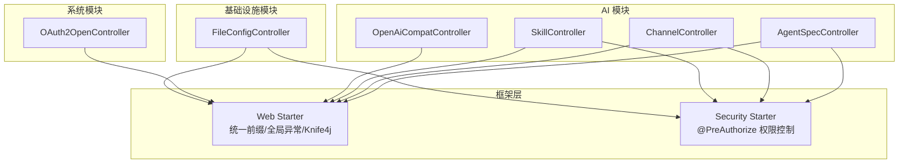
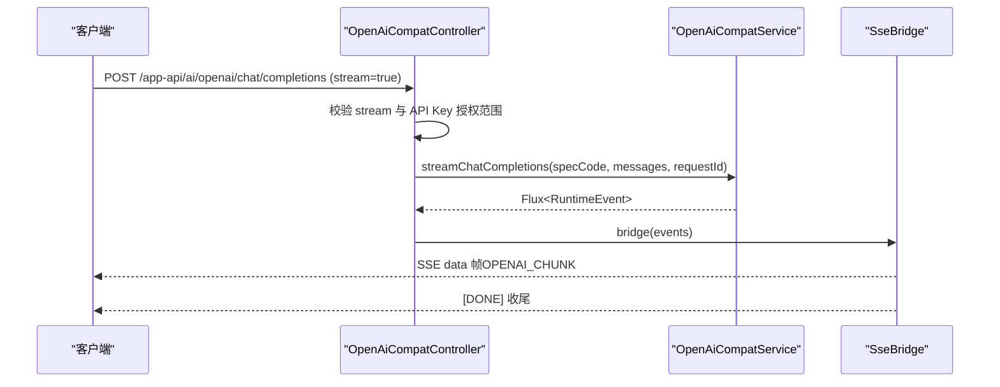
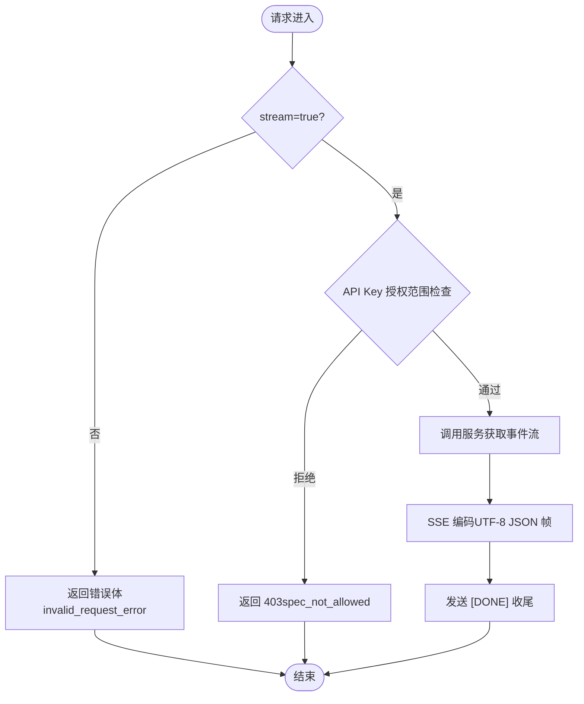
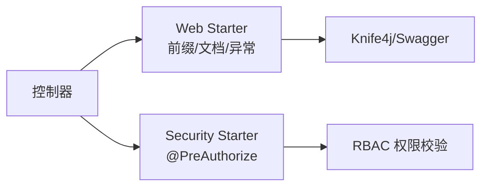

# API接口文档

<cite>
**本文引用的文件**
- [AgentSpecController.java](file://nexai-module-ai/src/main/java/com/gkht/ai/nexai/module/ai/agentspec/interfaces/controller/admin/spec/AgentSpecController.java)
- [AgentSpecVersionController.java](file://nexai-module-ai/src/main/java/com/gkht/ai/nexai/module/ai/agentspec/interfaces/controller/admin/spec/AgentSpecVersionController.java)
- [FolderFileController.java](file://nexai-module-ai/src/main/java/com/gkht/ai/nexai/module/ai/agentspec/interfaces/controller/admin/spec/FolderFileController.java)
- [ApiKeyController.java](file://nexai-module-ai/src/main/java/com/gkht/ai/nexai/module/ai/apikey/interfaces/controller/admin/apikey/ApiKeyController.java)
- [ChannelController.java](file://nexai-module-ai/src/main/java/com/gkht/ai/nexai/module/ai/channel/interfaces/controller/admin/channel/ChannelController.java)
- [ModelController.java](file://nexai-module-ai/src/main/java/com/gkht/ai/nexai/module/ai/channel/interfaces/controller/admin/channel/ModelController.java)
- [OpenAiCompatController.java](file://nexai-module-ai/src/main/java/com/gkht/ai/nexai/module/ai/session/interfaces/controller/app/openai/OpenAiCompatController.java)
- [SkillController.java](file://nexai-module-ai/src/main/java/com/gkht/ai/nexai/module/ai/skill/interfaces/controller/admin/skill/SkillController.java)
- [OAuth2OpenController.java](file://nexai-module-system/src/main/java/com/gkht/ai/nexai/module/system/controller/admin/oauth2/OAuth2OpenController.java)
- [FileConfigController.java](file://nexai-module-infra/src/main/java/com/gkht/ai/nexai/module/infra/controller/admin/file/FileConfigController.java)
- [pom.xml（web starter）](file://nexai-framework/nexai-spring-boot-starter-web/pom.xml)
- [GlobalExceptionHandler.java](file://nexai-framework/nexai-spring-boot-starter-web/src/main/java/com/gkht/ai/nexai/framework/web/core/handler/GlobalExceptionHandler.java)
</cite>

## 目录
1. [简介](#简介)
2. [项目结构](#项目结构)
3. [核心组件](#核心组件)
4. [架构总览](#架构总览)
5. [详细组件分析](#详细组件分析)
6. [依赖关系分析](#依赖关系分析)
7. [性能考虑](#性能考虑)
8. [故障排查指南](#故障排查指南)
9. [结论](#结论)
10. [附录](#附录)

## 简介
本文件为 NexAI 平台提供完整的 RESTful API 接口文档，覆盖 AI 模块、系统管理模块与基础设施模块的控制器接口。内容包括：
- 所有端点的 HTTP 方法、URL 模式、请求/响应格式说明与认证方式
- OpenAI 兼容流式接口（SSE）的连接处理、消息格式与实时交互模式
- Swagger/Knife4j 文档访问方式与在线调试方法
- 错误码定义、异常处理与状态码说明
- 接口版本管理与向后兼容性策略
- 安全考虑：身份验证、授权控制与数据加密

## 项目结构
NexAI 采用多模块分层架构：
- 业务模块：AI 模块（智能体规格、渠道、技能、会话等）、系统模块（OAuth2 开放接口）、基础设施模块（文件配置等）
- 框架层：Web Starter（统一前缀、全局异常、Knife4j/Swagger）、Security Starter（权限注解）、WebSocket Starter（实时通信）
- 入口与路由：控制器位于各模块 interfaces/controller 下，按 admin/app 区分管理后台与对外应用接口；由 Web Starter 自动挂载 /admin-api 与 /app-api 前缀

图表来源
- [AgentSpecController.java:33-69](file://nexai-module-ai/src/main/java/com/gkht/ai/nexai/module/ai/agentspec/interfaces/controller/admin/spec/AgentSpecController.java#L33-L69)
- [ChannelController.java:36-105](file://nexai-module-ai/src/main/java/com/gkht/ai/nexai/module/ai/channel/interfaces/controller/admin/channel/ChannelController.java#L36-L105)
- [SkillController.java:34-101](file://nexai-module-ai/src/main/java/com/gkht/ai/nexai/module/ai/skill/interfaces/controller/admin/skill/SkillController.java#L34-L101)
- [OpenAiCompatController.java:42-78](file://nexai-module-ai/src/main/java/com/gkht/ai/nexai/module/ai/session/interfaces/controller/app/openai/OpenAiCompatController.java#L42-L78)
- [OAuth2OpenController.java:57-142](file://nexai-module-system/src/main/java/com/gkht/ai/nexai/module/system/controller/admin/oauth2/OAuth2OpenController.java#L57-L142)
- [FileConfigController.java:24-97](file://nexai-module-infra/src/main/java/com/gkht/ai/nexai/module/infra/controller/admin/file/FileConfigController.java#L24-L97)

章节来源
- [AgentSpecController.java:33-69](file://nexai-module-ai/src/main/java/com/gkht/ai/nexai/module/ai/agentspec/interfaces/controller/admin/spec/AgentSpecController.java#L33-L69)
- [ChannelController.java:36-105](file://nexai-module-ai/src/main/java/com/gkht/ai/nexai/module/ai/channel/interfaces/controller/admin/channel/ChannelController.java#L36-L105)
- [SkillController.java:34-101](file://nexai-module-ai/src/main/java/com/gkht/ai/nexai/module/ai/skill/interfaces/controller/admin/skill/SkillController.java#L34-L101)
- [OpenAiCompatController.java:42-78](file://nexai-module-ai/src/main/java/com/gkht/ai/nexai/module/ai/session/interfaces/controller/app/openai/OpenAiCompatController.java#L42-L78)
- [OAuth2OpenController.java:57-142](file://nexai-module-system/src/main/java/com/gkht/ai/nexai/module/system/controller/admin/oauth2/OAuth2OpenController.java#L57-L142)
- [FileConfigController.java:24-97](file://nexai-module-infra/src/main/java/com/gkht/ai/nexai/module/infra/controller/admin/file/FileConfigController.java#L24-L97)

## 核心组件
- 智能体规格管理：创建、分页查询、详情获取、更新
- 智能体版本管理：发布、版本分页、版本详情、切换生效版本
- 模型渠道管理（BYOK）：创建、更新、启停、删除、分页、详情、启用列表、连通性测试
- 模型管理：创建、更新、删除
- Skill 资产管理：创建、版本登记、分页、版本列表、版本内容、删除、上架/下架
- 租户 API Key：生成、分页、吊销
- OpenAI 兼容出口：POST /chat/completions（仅流式 SSE）
- OAuth2 开放接口：令牌获取、撤销、校验、授权信息、授权申请
- 文件配置：创建、更新、设主、删除、分页、测试

章节来源
- [AgentSpecController.java:41-69](file://nexai-module-ai/src/main/java/com/gkht/ai/nexai/module/ai/agentspec/interfaces/controller/admin/spec/AgentSpecController.java#L41-L69)
- [AgentSpecVersionController.java:42-71](file://nexai-module-ai/src/main/java/com/gkht/ai/nexai/module/ai/agentspec/interfaces/controller/admin/spec/AgentSpecVersionController.java#L42-L71)
- [ChannelController.java:45-105](file://nexai-module-ai/src/main/java/com/gkht/ai/nexai/module/ai/channel/interfaces/controller/admin/channel/ChannelController.java#L45-L105)
- [ModelController.java:43-67](file://nexai-module-ai/src/main/java/com/gkht/ai/nexai/module/ai/channel/interfaces/controller/admin/channel/ModelController.java#L43-L67)
- [SkillController.java:43-101](file://nexai-module-ai/src/main/java/com/gkht/ai/nexai/module/ai/skill/interfaces/controller/admin/skill/SkillController.java#L43-L101)
- [ApiKeyController.java:38-59](file://nexai-module-ai/src/main/java/com/gkht/ai/nexai/module/ai/apikey/interfaces/controller/admin/apikey/ApiKeyController.java#L38-L59)
- [OpenAiCompatController.java:55-78](file://nexai-module-ai/src/main/java/com/gkht/ai/nexai/module/ai/session/interfaces/controller/app/openai/OpenAiCompatController.java#L55-L78)
- [OAuth2OpenController.java:84-142](file://nexai-module-system/src/main/java/com/gkht/ai/nexai/module/system/controller/admin/oauth2/OAuth2OpenController.java#L84-L142)
- [FileConfigController.java:33-97](file://nexai-module-infra/src/main/java/com/gkht/ai/nexai/module/infra/controller/admin/file/FileConfigController.java#L33-L97)

## 架构总览
NexAI 通过 Web Starter 统一挂载管理后台与应用接口前缀，并集成 Knife4j/Swagger 文档能力。安全层基于 Spring Security 与 @PreAuthorize 进行细粒度权限控制。AI 模块暴露两类接口：
- 管理后台接口（/admin-api/*）：用于运营与管理功能
- 应用接口（/app-api/*）：面向外部应用或第三方客户端，如 OpenAI 兼容流式接口

图表来源
- [OpenAiCompatController.java:55-120](file://nexai-module-ai/src/main/java/com/gkht/ai/nexai/module/ai/session/interfaces/controller/app/openai/OpenAiCompatController.java#L55-L120)

章节来源
- [OpenAiCompatController.java:55-120](file://nexai-module-ai/src/main/java/com/gkht/ai/nexai/module/ai/session/interfaces/controller/app/openai/OpenAiCompatController.java#L55-L120)

## 详细组件分析

### 智能体规格管理（AgentSpecController）
- 基础路径：/admin-api/ai/spec
- 端点
  - POST /create：创建规格（携带首个草稿；spec_code 与归属层级创建后不可变）
  - GET /page：分页查询（支持业务编码/归属/草稿状态；用户级规格仅归属用户可见）
  - GET /get：详情获取（主体元数据 + 配置平铺；草稿优先，已发布无草稿时取当前生效快照）
  - PUT /update：更新规格（整体替换主体元数据与草稿；不触碰已发布快照）
- 认证与授权：需要登录态，使用 @PreAuthorize 指定权限标识（如 ai:spec:create/query/update）
- 请求/响应：请求体为对应 Command/Query DTO；响应统一封装 CommonResult<T>

章节来源
- [AgentSpecController.java:41-69](file://nexai-module-ai/src/main/java/com/gkht/ai/nexai/module/ai/agentspec/interfaces/controller/admin/spec/AgentSpecController.java#L41-L69)

### 智能体版本管理（AgentSpecVersionController）
- 基础路径：/admin-api/ai/spec
- 端点
  - POST /publish：发布规格
  - GET /version-page：版本分页
  - GET /version-get：版本详情
  - PUT /switch-version：切换生效版本
- 认证与授权：需要登录态，使用 @PreAuthorize 指定权限标识（如 ai:spec:publish/query/update）

章节来源
- [AgentSpecVersionController.java:42-71](file://nexai-module-ai/src/main/java/com/gkht/ai/nexai/module/ai/agentspec/interfaces/controller/admin/spec/AgentSpecVersionController.java#L42-L71)

### 文件夹与文件上传（FolderFileController）
- 基础路径：/admin-api/ai/spec/folder-file
- 端点
  - POST /upload：上传文件（用于规格资源管理）
- 认证与授权：需要登录态，使用 @PreAuthorize 指定权限标识（如 ai:spec:create）

章节来源
- [FolderFileController.java:26-40](file://nexai-module-ai/src/main/java/com/gkht/ai/nexai/module/ai/agentspec/interfaces/controller/admin/spec/FolderFileController.java#L26-L40)

### 模型渠道管理（ChannelController）
- 基础路径：/admin-api/ai/channel
- 端点
  - POST /create：创建渠道（BYOK；密钥落库）
  - PUT /update：更新渠道（apiKey 留空表示保留原密钥）
  - PUT /update-status：启停渠道
  - DELETE /delete：删除渠道（级联删除其下全部模型）
  - GET /page：分页查询（密钥脱敏出参）
  - GET /get：详情获取（编辑回显；密钥脱敏，仅返回是否已配置）
  - GET /simple-list：启用渠道简要列表（下拉选择）
  - POST /connectivity-test：连通性探测（表单凭据即测不落库；携带 channelId 且密钥留空时回退已存密钥）
- 认证与授权：需要登录态，使用 @PreAuthorize 指定权限标识（如 ai:channel:create/update/delete/query）

章节来源
- [ChannelController.java:45-105](file://nexai-module-ai/src/main/java/com/gkht/ai/nexai/module/ai/channel/interfaces/controller/admin/channel/ChannelController.java#L45-L105)

### 模型管理（ModelController）
- 基础路径：/admin-api/ai/model（推测）
- 端点
  - POST /create：创建模型
  - PUT /update：更新模型
  - DELETE /delete：删除模型
- 认证与授权：需要登录态，使用 @PreAuthorize 指定权限标识（如 ai:model:create/update/delete）

章节来源
- [ModelController.java:43-67](file://nexai-module-ai/src/main/java/com/gkht/ai/nexai/module/ai/channel/interfaces/controller/admin/channel/ModelController.java#L43-L67)

### Skill 资产管理（SkillController）
- 基础路径：/admin-api/ai/skill
- 端点
  - POST /create：创建 Skill（登记首个版本，物化到文件目录供 agentscope 读取）
  - POST /version：登记 Skill 版本（版本链只增不改，物化到文件目录）
  - GET /page：分页查询（归属可见性：租户级租户内全见 + 用户级仅归属用户）
  - GET /version-page：版本列表（含当前版本标识）
  - GET /version-get：版本内容（markdown 全文 + 资源路径清单）
  - DELETE /delete：删除 Skill（级联删除版本链）
  - POST /publish：上架 Skill（进入终端技能目录）
  - POST /unpublish：下架 Skill（移出终端技能目录）
- 认证与授权：需要登录态，使用 @PreAuthorize 指定权限标识（如 ai:skill:create/update/query/delete）

章节来源
- [SkillController.java:43-101](file://nexai-module-ai/src/main/java/com/gkht/ai/nexai/module/ai/skill/interfaces/controller/admin/skill/SkillController.java#L43-L101)

### 租户 API Key（ApiKeyController）
- 基础路径：/admin-api/ai/api-key
- 端点
  - POST /create：生成 API Key（服务端生成明文 Key 并密文落库；明文仅本次响应返回一次）
  - GET /page：分页查询（不含明文与哈希）
  - DELETE /revoke：吊销 API Key（状态单向置 REVOKED；幂等）
- 认证与授权：需要登录态，使用 @PreAuthorize 指定权限标识（如 ai:api-key:create/query/revoke）

章节来源
- [ApiKeyController.java:38-59](file://nexai-module-ai/src/main/java/com/gkht/ai/nexai/module/ai/apikey/interfaces/controller/admin/apikey/ApiKeyController.java#L38-L59)

### OpenAI 兼容出口（OpenAiCompatController）
- 基础路径：/app-api/ai/openai
- 端点
  - POST /chat/completions：仅支持流式（stream=true），返回 SSE 事件流
- 认证与授权：由 ApiKeyAuthFilter 校验租户 API Key；若未认证则抛出未授权异常；若 API Key 不在目标智能体的放行规格范围内，返回 403
- 消息格式
  - 请求：遵循 ChatCompletionsRequest（role/content 透传；tool 消息 MVP 不支持）
  - 响应：SSE data 帧，包含 OPENAI_CHUNK 片段；结束时发送 [DONE] 标记
- 错误处理：SESSION_ERROR 事件会转换为 OpenAI 错误体首帧后收尾

图表来源
- [OpenAiCompatController.java:55-126](file://nexai-module-ai/src/main/java/com/gkht/ai/nexai/module/ai/session/interfaces/controller/app/openai/OpenAiCompatController.java#L55-L126)

章节来源
- [OpenAiCompatController.java:55-126](file://nexai-module-ai/src/main/java/com/gkht/ai/nexai/module/ai/session/interfaces/controller/app/openai/OpenAiCompatController.java#L55-L126)

### OAuth2 开放接口（OAuth2OpenController）
- 基础路径：/system/oauth2
- 端点
  - POST /token：获取访问令牌（支持 authorization_code、password、client_credentials、refresh_token；不支持 implicit）
  - DELETE /token：撤销访问令牌
  - POST /check-token：校验访问令牌
  - GET /authorize：获得授权信息
  - POST /authorize：申请授权（code 或 token 重定向）
- 认证与授权：部分接口允许匿名访问（PermitAll），但需传递 client_id/client_secret；授权流程依赖 Spring Security 登录态

章节来源
- [OAuth2OpenController.java:84-254](file://nexai-module-system/src/main/java/com/gkht/ai/nexai/module/system/controller/admin/oauth2/OAuth2OpenController.java#L84-L254)

### 文件配置（FileConfigController）
- 基础路径：/admin-api/infra/file-config
- 端点
  - POST /create：创建文件配置
  - PUT /update：更新文件配置
  - PUT /update-master：设置为 Master
  - DELETE /delete：删除文件配置
  - DELETE /delete-list：批量删除
  - GET /get：获取文件配置
  - GET /page：分页查询
  - GET /test：测试文件配置是否正确
- 认证与授权：需要登录态，使用 @PreAuthorize 指定权限标识（如 infra:file-config:create/update/delete/query）

章节来源
- [FileConfigController.java:33-97](file://nexai-module-infra/src/main/java/com/gkht/ai/nexai/module/infra/controller/admin/file/FileConfigController.java#L33-L97)

## 依赖关系分析
- Web Starter 提供统一前缀规则：controller.admin 包自动挂载 /admin-api；controller.app 包自动挂载 /app-api
- Knife4j/Swagger：通过 springdoc-openapi 与 knife4j-openapi3 集成，自动生成接口文档与在线调试
- 权限控制：@PreAuthorize 注解驱动 RBAC 权限拦截；未授权将触发全局异常处理器

图表来源
- [pom.xml（web starter）:49-56](file://nexai-framework/nexai-spring-boot-starter-web/pom.xml#L49-L56)
- [GlobalExceptionHandler.java:56-275](file://nexai-framework/nexai-spring-boot-starter-web/src/main/java/com/gkht/ai/nexai/framework/web/core/handler/GlobalExceptionHandler.java#L56-L275)

章节来源
- [pom.xml（web starter）:49-56](file://nexai-framework/nexai-spring-boot-starter-web/pom.xml#L49-L56)
- [GlobalExceptionHandler.java:56-275](file://nexai-framework/nexai-spring-boot-starter-web/src/main/java/com/gkht/ai/nexai/framework/web/core/handler/GlobalExceptionHandler.java#L56-L275)

## 性能考虑
- 流式接口（OpenAI 兼容）：使用 SSE 推送增量数据，降低首字节延迟；注意 UTF-8 编码以避免乱码
- 分页查询：所有分页接口均返回 PageResult，建议合理设置页大小与过滤条件
- 密钥管理：渠道与 API Key 在出参中脱敏，避免敏感信息泄露
- 连接性测试：仅在内存中进行，不落库，减少数据库压力

[本节为通用指导，无需特定文件引用]

## 故障排查指南
- 全局异常处理：框架层 GlobalExceptionHandler 统一捕获并返回标准错误体；常见包括参数校验失败、权限不足、服务异常等
- 权限问题：确认用户具备对应权限标识（如 ai:spec:query）；检查 @PreAuthorize 配置
- 认证失败：OpenAI 兼容接口需正确携带租户 API Key；未认证或未授权将返回相应错误
- 流式中断：检查 SSE 编码器与网络环境；确保客户端正确处理 [DONE] 收尾

章节来源
- [GlobalExceptionHandler.java:56-275](file://nexai-framework/nexai-spring-boot-starter-web/src/main/java/com/gkht/ai/nexai/framework/web/core/handler/GlobalExceptionHandler.java#L56-L275)

## 结论
NexAI 平台通过模块化设计与统一的 Web 框架，提供了完善的 RESTful API 与流式接口能力。结合 Knife4j/Swagger 文档与在线调试，开发者可快速接入与集成。权限与安全机制完备，满足企业级场景需求。建议在接入时严格遵循认证与授权规范，合理使用分页与流式接口，以获得最佳体验与性能。

[本节为总结性内容，无需特定文件引用]

## 附录

### 接口版本管理与向后兼容性
- 版本策略：通过 URL 前缀与模块划分实现逻辑隔离（/admin-api、/app-api）；新增能力优先以新端点形式引入，避免破坏既有接口
- 兼容性保证：对既有接口的变更保持向后兼容；废弃字段或行为将通过弃用提示与迁移指南逐步过渡

[本节为通用策略说明，无需特定文件引用]

### 安全考虑
- 身份验证：管理后台接口依赖登录态；应用接口（OpenAI 兼容）依赖租户 API Key
- 授权控制：基于 @PreAuthorize 的 RBAC 权限标识；未授权将返回标准错误
- 数据加密：API Key 明文仅响应一次，服务端存储密文（SHA-256）；渠道密钥在出参中脱敏

[本节为通用安全说明，无需特定文件引用]

### Swagger/Knife4j 文档访问与在线调试
- 文档集成：通过 springdoc-openapi 与 knife4j-openapi3 自动生成交互式文档
- 访问方式：启动服务后，访问 Knife4j UI（具体路径依部署配置而定）；可在界面中选择端点进行在线调试
- 注意事项：确保服务正常运行且文档模块已启用

章节来源
- [pom.xml（web starter）:49-56](file://nexai-framework/nexai-spring-boot-starter-web/pom.xml#L49-L56)