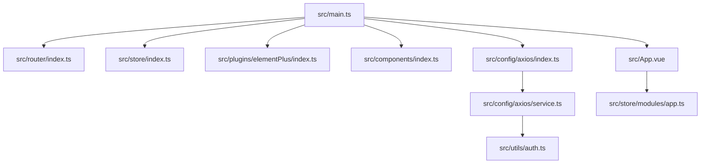
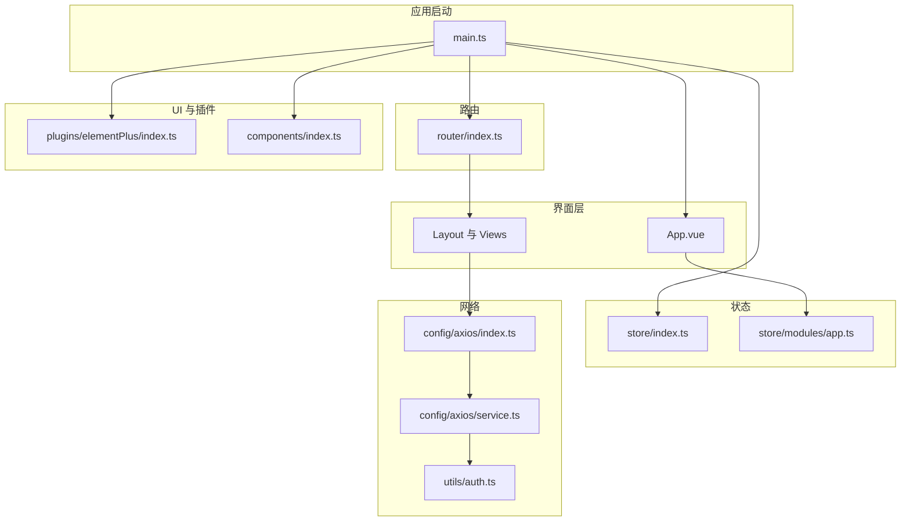
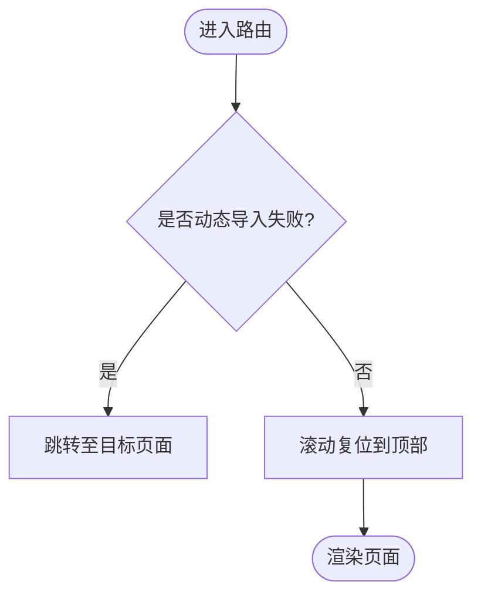
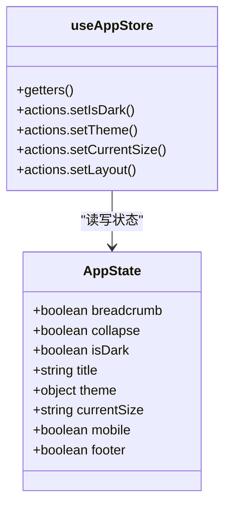
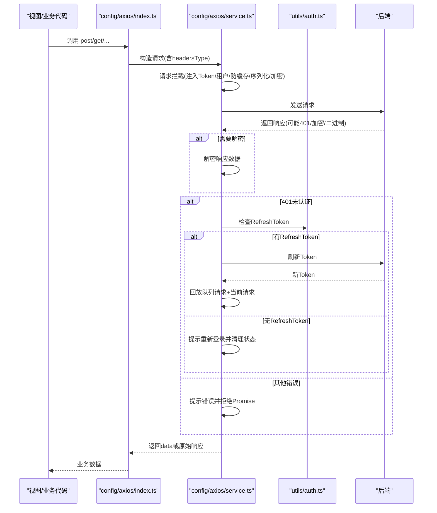
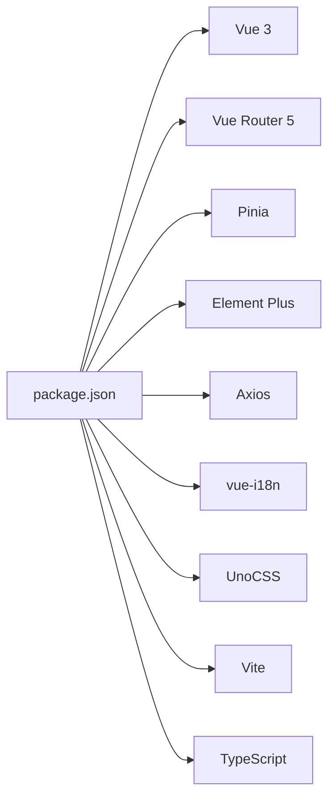
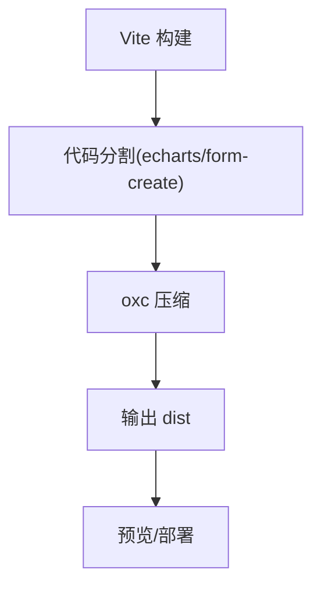

# 前端应用架构

<cite>
**本文引用的文件**
- [package.json](file://nexai-ui/package.json)
- [vite.config.ts](file://nexai-ui/vite.config.ts)
- [main.ts](file://nexai-ui/src/main.ts)
- [App.vue](file://nexai-ui/src/App.vue)
- [router/index.ts](file://nexai-ui/src/router/index.ts)
- [store/index.ts](file://nexai-ui/src/store/index.ts)
- [store/modules/app.ts](file://nexai-ui/src/store/modules/app.ts)
- [config/axios/index.ts](file://nexai-ui/src/config/axios/index.ts)
- [config/axios/service.ts](file://nexai-ui/src/config/axios/service.ts)
- [plugins/elementPlus/index.ts](file://nexai-ui/src/plugins/elementPlus/index.ts)
- [components/index.ts](file://nexai-ui/src/components/index.ts)
- [utils/auth.ts](file://nexai-ui/src/utils/auth.ts)
</cite>

## 目录
1. [简介](#简介)
2. [项目结构](#项目结构)
3. [核心组件](#核心组件)
4. [架构总览](#架构总览)
5. [详细组件分析](#详细组件分析)
6. [依赖关系分析](#依赖关系分析)
7. [性能与构建优化](#性能与构建优化)
8. [故障排查指南](#故障排查指南)
9. [结论](#结论)
10. [附录：开发规范与最佳实践](#附录开发规范与最佳实践)

## 简介
本文件为 NexAI 平台前端应用的架构文档，基于 Vue 3 + TypeScript + Element Plus 技术栈，围绕模块化组织、路由配置、状态管理、API 客户端封装（请求拦截、错误处理、Token 管理）、响应式设计与主题定制、常用 UI 组件使用与扩展、Vite 构建配置与性能优化、以及开发规范与最佳实践进行系统化说明。目标是帮助开发者快速理解并高效参与前端工程化建设。

## 项目结构
前端工程位于 nexai-ui 目录，采用功能域划分的目录组织方式：
- src/api：按业务域划分 API 接口定义（如 ai、bpm、infra、system、login 等）
- src/components：通用与业务组件，统一通过 index.ts 暴露全局注册入口
- src/config/axios：HTTP 客户端封装，包含请求/响应拦截、错误处理、Token 注入与刷新
- src/directives：指令集合（权限、聚焦等）
- src/hooks：可复用逻辑 Hook（表单、表格、国际化、缓存、网络等）
- src/layout：布局容器与子模块（菜单、面包屑、标签页、设置面板等）
- src/locales：多语言资源
- src/plugins：第三方插件初始化（Element Plus、FormCreate、ECharts、i18n、UnoCSS、SVG 图标等）
- src/router：路由配置与动态重置能力
- src/store：Pinia 状态管理，持久化插件启用
- src/styles：样式体系（SCSS、主题变量、全局样式）
- src/types：类型声明与自动导入类型
- src/utils：工具函数（鉴权、加密、日期、树形、权限等）
- src/views：页面视图（按业务域划分）

图表来源
- [main.ts:1-92](file://nexai-ui/src/main.ts#L1-L92)
- [router/index.ts:1-47](file://nexai-ui/src/router/index.ts#L1-L47)
- [store/index.ts:1-13](file://nexai-ui/src/store/index.ts#L1-L13)
- [plugins/elementPlus/index.ts:1-18](file://nexai-ui/src/plugins/elementPlus/index.ts#L1-L18)
- [components/index.ts:1-7](file://nexai-ui/src/components/index.ts#L1-L7)
- [config/axios/index.ts:1-53](file://nexai-ui/src/config/axios/index.ts#L1-L53)
- [config/axios/service.ts:1-272](file://nexai-ui/src/config/axios/service.ts#L1-L272)
- [utils/auth.ts:1-87](file://nexai-ui/src/utils/auth.ts#L1-L87)
- [App.vue:1-58](file://nexai-ui/src/App.vue#L1-L58)
- [store/modules/app.ts:1-333](file://nexai-ui/src/store/modules/app.ts#L1-L333)

章节来源
- [package.json:1-156](file://nexai-ui/package.json#L1-L156)
- [vite.config.ts:1-109](file://nexai-ui/vite.config.ts#L1-L109)

## 核心组件
- 应用启动与装配：main.ts 负责初始化 i18n、Store、全局组件、Element Plus、FormCreate、路由、指令、打印插件、DOMPurify 等，并在路由就绪后挂载根组件。
- 根组件 App.vue：提供全局尺寸与主题上下文（ConfigGlobal），集成灰度模式、路由视图与搜索框。
- 路由：vue-router 5，History 模式，滚动行为统一复位；支持动态路由重置以配合权限控制。
- 状态管理：Pinia + pinia-plugin-persistedstate，集中管理应用级配置（布局、主题、暗黑模式、尺寸、标题等）。
- HTTP 客户端：基于 Axios 的封装，统一请求头、租户头、Token 注入、GET 防缓存、表单序列化、请求/响应加密、二进制下载、错误提示与无感知 Token 刷新。
- 组件库：Element Plus 按需引入部分组件与插件（Loading、Scrollbar、Button），并通过 unplugin-element-plus 实现按需加载。
- 全局组件：统一在 components/index.ts 中注册 Icon 等基础组件。

章节来源
- [main.ts:1-92](file://nexai-ui/src/main.ts#L1-L92)
- [App.vue:1-58](file://nexai-ui/src/App.vue#L1-L58)
- [router/index.ts:1-47](file://nexai-ui/src/router/index.ts#L1-L47)
- [store/index.ts:1-13](file://nexai-ui/src/store/index.ts#L1-L13)
- [store/modules/app.ts:1-333](file://nexai-ui/src/store/modules/app.ts#L1-L333)
- [config/axios/index.ts:1-53](file://nexai-ui/src/config/axios/index.ts#L1-L53)
- [config/axios/service.ts:1-272](file://nexai-ui/src/config/axios/service.ts#L1-L272)
- [plugins/elementPlus/index.ts:1-18](file://nexai-ui/src/plugins/elementPlus/index.ts#L1-L18)
- [components/index.ts:1-7](file://nexai-ui/src/components/index.ts#L1-L7)

## 架构总览
前端采用“入口装配 + 模块化插件 + 领域驱动”的架构：
- 入口层：main.ts 编排各子系统初始化顺序，确保依赖就绪后再挂载应用。
- 表现层：App.vue 提供全局上下文，layout 与 views 组合出页面。
- 路由层：vue-router 管理导航与滚动行为，支持动态路由重置。
- 状态层：Pinia 管理应用状态，结合本地缓存实现主题、布局、尺寸等持久化。
- 数据层：Axios 封装统一访问后端，处理鉴权、租户、加解密、错误与刷新令牌。
- 基础设施：Element Plus、FormCreate、ECharts、UnoCSS、i18n、SVG 图标等插件化接入。

图表来源
- [main.ts:1-92](file://nexai-ui/src/main.ts#L1-L92)
- [App.vue:1-58](file://nexai-ui/src/App.vue#L1-L58)
- [router/index.ts:1-47](file://nexai-ui/src/router/index.ts#L1-L47)
- [store/index.ts:1-13](file://nexai-ui/src/store/index.ts#L1-L13)
- [store/modules/app.ts:1-333](file://nexai-ui/src/store/modules/app.ts#L1-L333)
- [config/axios/index.ts:1-53](file://nexai-ui/src/config/axios/index.ts#L1-L53)
- [config/axios/service.ts:1-272](file://nexai-ui/src/config/axios/service.ts#L1-L272)
- [utils/auth.ts:1-87](file://nexai-ui/src/utils/auth.ts#L1-L87)
- [plugins/elementPlus/index.ts:1-18](file://nexai-ui/src/plugins/elementPlus/index.ts#L1-L18)
- [components/index.ts:1-7](file://nexai-ui/src/components/index.ts#L1-L7)

## 详细组件分析

### 路由与权限
- 路由模式：History 模式，base 路径来自环境变量。
- 滚动行为：切换路由时滚动条回到顶部，避免跨页面残留滚动位置。
- 动态路由重置：提供 resetRouter 方法，用于登出或权限变更后清理动态路由，仅保留白名单路由。
- 预加载失败恢复：捕获动态导入失败场景，自动跳转到目标页面，提升构建后稳定性。

图表来源
- [router/index.ts:1-47](file://nexai-ui/src/router/index.ts#L1-L47)

章节来源
- [router/index.ts:1-47](file://nexai-ui/src/router/index.ts#L1-L47)

### 状态管理与主题
- Pinia 初始化并启用持久化插件，保证关键状态跨会话保持。
- app store 管理布局、主题、暗黑模式、尺寸、标题、移动端标志、页脚显示等。
- 主题机制：通过 CSS 变量注入主题色、菜单背景、边框等；暗黑模式通过 html 根节点 class 切换；主色调衍生浅色变体与 RGB 变量。
- 持久化：布局、主题、暗黑模式、尺寸等写入本地缓存，重启后恢复。

图表来源
- [store/modules/app.ts:1-333](file://nexai-ui/src/store/modules/app.ts#L1-L333)

章节来源
- [store/index.ts:1-13](file://nexai-ui/src/store/index.ts#L1-L13)
- [store/modules/app.ts:1-333](file://nexai-ui/src/store/modules/app.ts#L1-L333)
- [App.vue:1-58](file://nexai-ui/src/App.vue#L1-L58)

### API 客户端与鉴权流程
- 请求封装：index.ts 提供 get/post/delete/put/download/upload 等方法，统一 headersType 与默认 Content-Type。
- 服务实例：service.ts 创建 Axios 实例，配置 baseURL、超时、参数序列化（qs）。
- 请求拦截：
  - 注入 Authorization 头（Bearer Token），支持白名单跳过。
  - 注入租户相关头（tenant-id、visit-tenant-id）。
  - GET 请求禁用缓存（Cache-Control、Pragma）。
  - POST application/x-www-form-urlencoded 自动序列化。
  - 可选请求数据加密（isEncrypt），并设置加密标识头。
- 响应拦截：
  - 二进制流直接返回（blob/arraybuffer），否则解析 JSON。
  - 根据响应头判断是否需要解密响应数据。
  - 统一错误码处理：401 触发无感知刷新令牌；500/901/其他错误提示并拒绝 Promise。
  - 网络错误、超时、HTTP 状态码错误统一提示。
- Token 管理：
  - utils/auth.ts 提供获取/设置/删除 Token、登录表单缓存、租户 ID 存取。
  - 刷新令牌流程：队列等待、重试当前请求、失败则引导重新登录。

图表来源
- [config/axios/index.ts:1-53](file://nexai-ui/src/config/axios/index.ts#L1-L53)
- [config/axios/service.ts:1-272](file://nexai-ui/src/config/axios/service.ts#L1-L272)
- [utils/auth.ts:1-87](file://nexai-ui/src/utils/auth.ts#L1-L87)

章节来源
- [config/axios/index.ts:1-53](file://nexai-ui/src/config/axios/index.ts#L1-L53)
- [config/axios/service.ts:1-272](file://nexai-ui/src/config/axios/service.ts#L1-L272)
- [utils/auth.ts:1-87](file://nexai-ui/src/utils/auth.ts#L1-L87)

### 组件库与自定义扩展
- Element Plus：按需引入 Loading、Scrollbar、Button，并通过插件机制全局注册；同时借助 unplugin-element-plus 实现按需加载，减少包体积。
- FormCreate：可视化表单设计器与运行时渲染，便于复杂表单场景。
- 全局组件：Icon 等基础组件在 components/index.ts 中统一注册，供全局使用。
- 图标与样式：SVG 图标插件与 UnoCSS 原子化样式结合，提升开发效率与一致性。

章节来源
- [plugins/elementPlus/index.ts:1-18](file://nexai-ui/src/plugins/elementPlus/index.ts#L1-L18)
- [components/index.ts:1-7](file://nexai-ui/src/components/index.ts#L1-L7)
- [package.json:31-93](file://nexai-ui/package.json#L31-L93)

### 页面开发示例与组件复用模式
- 页面组织：views 下按业务域划分（ai、bpm、infra、system 等），每个页面由若干组件构成，复用 layout 与通用组件。
- 组件复用：
  - 列表/表单：通过 Table、Form、Search 等通用组件封装 CRUD 模式。
  - 展示类：Descriptions、Card、ContentWrap、ContentDetailWrap 等统一页面骨架。
  - 交互类：Dialog、Tooltip、UploadFile、Qrcode、MarkdownView 等增强交互体验。
- 推荐模式：
  - 页面内聚：将页面特定逻辑与组件放在同一目录下，便于维护。
  - 公共逻辑下沉：抽取为 hooks 或 utils，避免重复代码。
  - 组件契约：明确 props、emits、插槽与事件，保证可复用性。

[本节为概念性说明，不直接分析具体文件]

## 依赖关系分析
- 运行时依赖：Vue 3、Vue Router 5、Pinia、Element Plus、Axios、i18n、ECharts、FormCreate、UnoCSS、Dayjs、Lodash-es、NProgress、Video.js、LiveKit Client 等。
- 构建依赖：Vite、TypeScript、ESLint、Stylelint、Prettier、unplugin-* 系列、vite-plugin-compression、vite-plugin-svg-icons-ng、sass、postcss 等。
- 环境要求：Node >= 20.19.0，pnpm >= 8.6.0。

图表来源
- [package.json:1-156](file://nexai-ui/package.json#L1-L156)

章节来源
- [package.json:1-156](file://nexai-ui/package.json#L1-L156)

## 性能与构建优化
- 构建工具：Vite 8，使用 oxc 压缩，关闭 sourcemap（可通过环境变量开启 inline）。
- 代码分割：针对 echarts、form-create、form-designer 等大包进行独立 chunk 拆分，降低首屏压力。
- 依赖优化：optimizeDeps 控制 include/exclude，减少预构建开销。
- SCSS 全局变量注入：通过 additionalData 自动注入 variables.scss，避免重复引入。
- 产物输出：outDir 可配置，reportCompressedSize 关闭以提升构建速度。
- 调试开关：dropDebugger、dropConsole 可通过环境变量控制生产构建行为。

图表来源
- [vite.config.ts:1-109](file://nexai-ui/vite.config.ts#L1-L109)

章节来源
- [vite.config.ts:1-109](file://nexai-ui/vite.config.ts#L1-L109)
- [package.json:1-156](file://nexai-ui/package.json#L1-L156)

## 故障排查指南
- 动态导入失败：路由 onError 捕获并自动跳转目标页面，避免白屏。
- 401 未认证：
  - 尝试刷新 Token，成功则回放队列请求；失败则提示重新登录并清理状态。
  - 忽略特定刷新令牌错误消息，避免重复弹窗。
- 网络错误/超时：统一提示用户友好的错误信息。
- 二进制下载：当 responseType 为 blob/arraybuffer 时直接返回数据；若返回 JSON 则视为失败并解析错误信息。
- 响应加密：根据响应头判断并解密数据，失败抛出明确错误。

章节来源
- [router/index.ts:22-30](file://nexai-ui/src/router/index.ts#L22-L30)
- [config/axios/service.ts:108-239](file://nexai-ui/src/config/axios/service.ts#L108-L239)

## 结论
本项目以 Vue 3 + TypeScript + Element Plus 为核心，结合 Pinia、Vue Router、Axios、Vite 等现代化工具，构建了高内聚、低耦合的前端架构。通过统一的 API 客户端封装、完善的鉴权与错误处理、灵活的组件与主题系统、以及精细化的构建优化策略，有效提升了开发效率与运行性能。建议后续持续完善单元测试、接口契约校验与监控埋点，进一步提升质量与可观测性。

## 附录：开发规范与最佳实践
- 代码风格：使用 ESLint + Stylelint + Prettier 统一代码风格，提交前执行 lint-staged 检查。
- 类型安全：全面使用 TypeScript，优先使用类型推导与显式类型标注，减少 any。
- 组件设计：遵循单一职责，props/emits/slots 清晰；复杂逻辑抽离为 hooks。
- 状态管理：尽量使用 Pinia 模块化管理，避免全局状态膨胀；敏感数据谨慎持久化。
- 网络请求：统一通过 axios 封装调用，禁止直接使用 fetch/axios；注意错误处理与用户反馈。
- 路由与权限：遵循白名单与动态路由策略，登出时重置路由表。
- 主题与国际化：通过 store 与 i18n 统一管理，避免硬编码文本与颜色。
- 构建与发布：合理使用环境变量区分环境；按需引入与分包，关注首屏性能。

[本节为概念性说明，不直接分析具体文件]