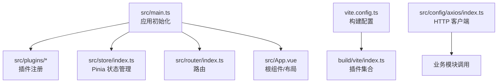
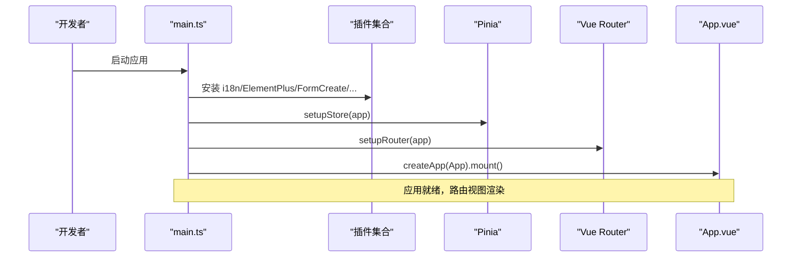
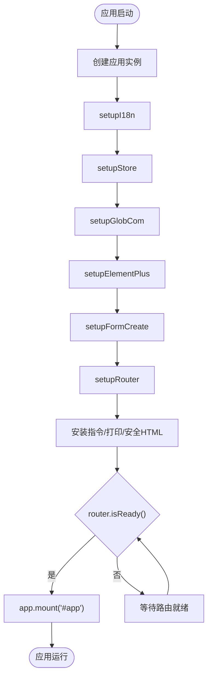
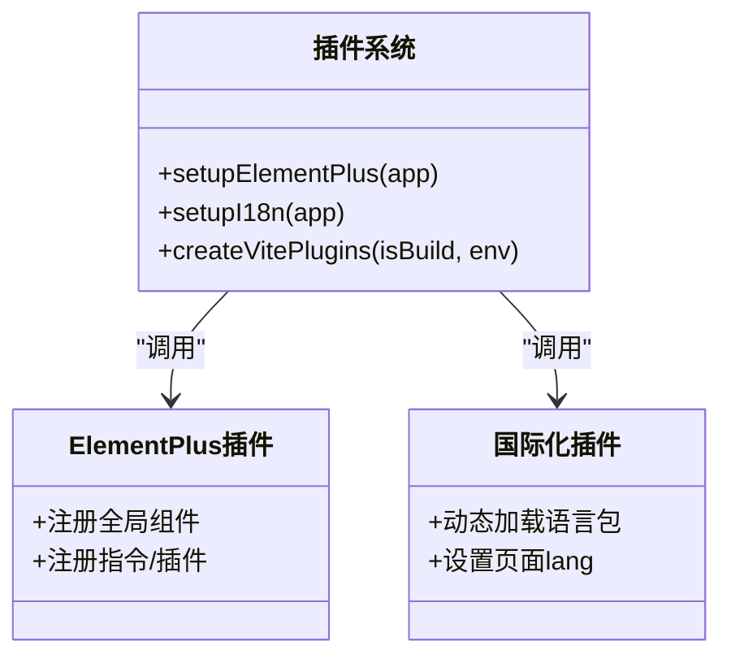
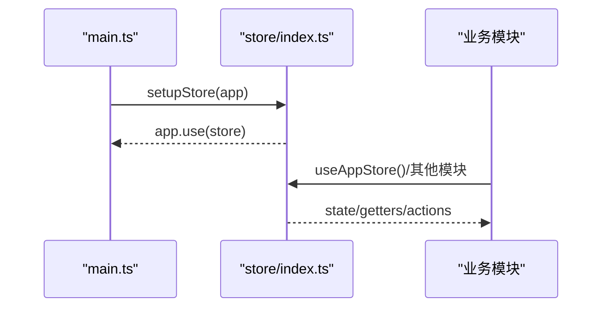
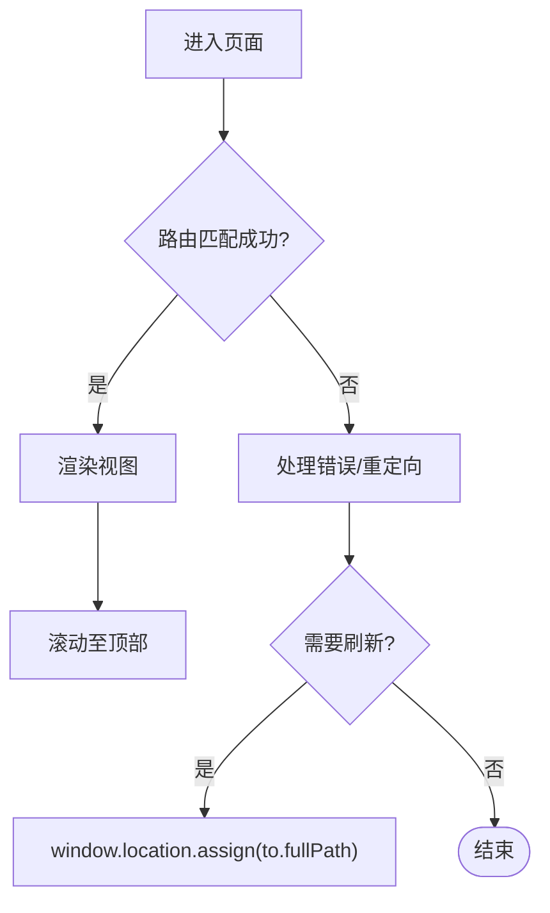
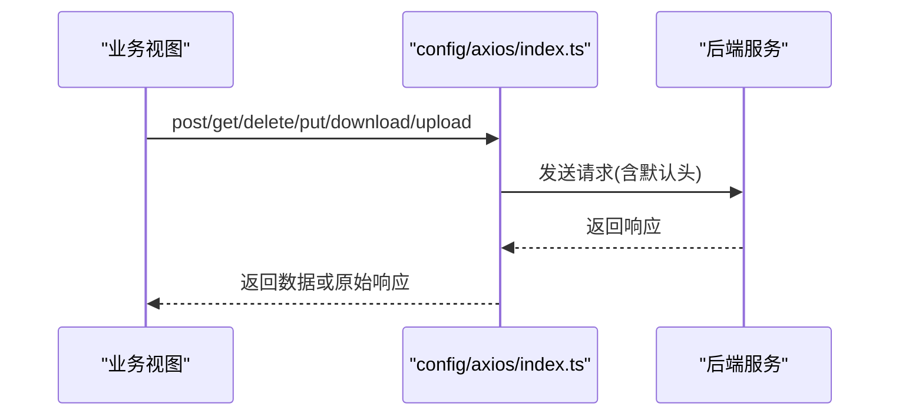
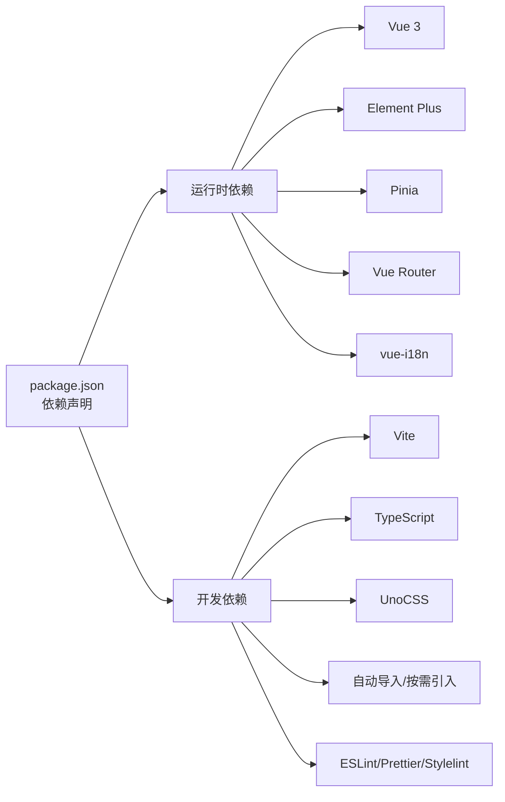
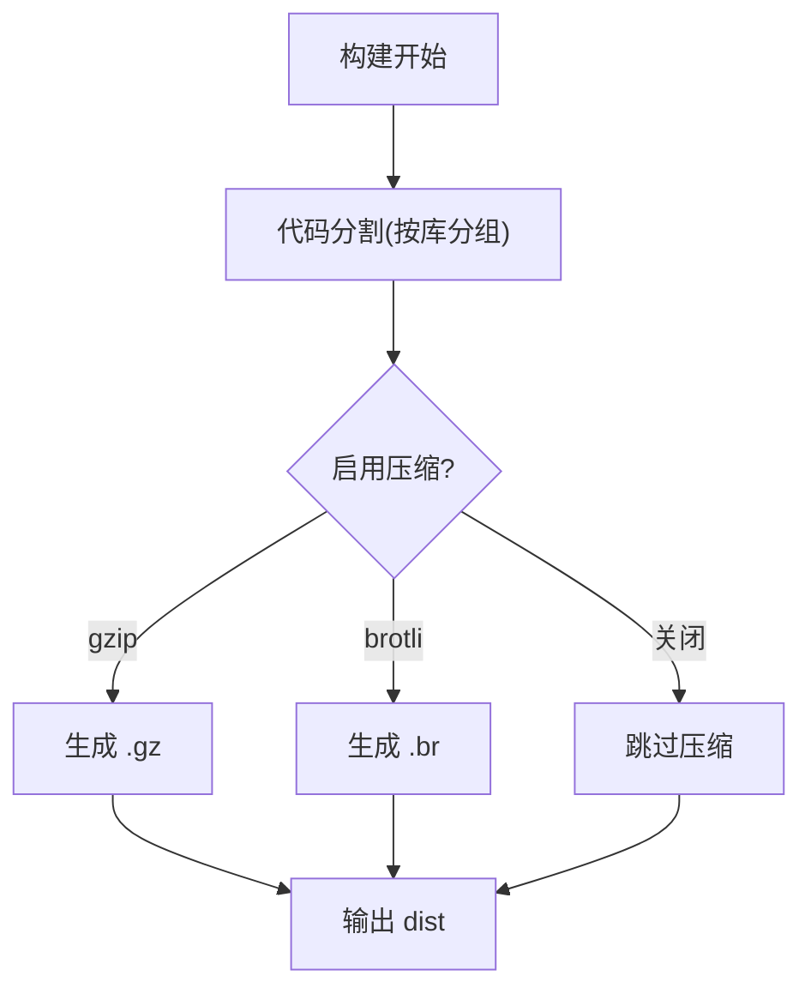

# 前端架构概览

<cite>
**本文引用的文件**
- [package.json](file://nexai-ui/package.json)
- [vite.config.ts](file://nexai-ui/vite.config.ts)
- [build/vite/index.ts](file://nexai-ui/build/vite/index.ts)
- [src/main.ts](file://nexai-ui/src/main.ts)
- [src/App.vue](file://nexai-ui/src/App.vue)
- [tsconfig.json](file://nexai-ui/tsconfig.json)
- [src/store/index.ts](file://nexai-ui/src/store/index.ts)
- [src/router/index.ts](file://nexai-ui/src/router/index.ts)
- [src/plugins/elementPlus/index.ts](file://nexai-ui/src/plugins/elementPlus/index.ts)
- [src/plugins/vueI18n/index.ts](file://nexai-ui/src/plugins/vueI18n/index.ts)
- [src/config/axios/index.ts](file://nexai-ui/src/config/axios/index.ts)
</cite>

## 目录
1. [简介](#简介)
2. [项目结构](#项目结构)
3. [核心组件](#核心组件)
4. [架构总览](#架构总览)
5. [详细组件分析](#详细组件分析)
6. [依赖关系分析](#依赖关系分析)
7. [性能与构建优化](#性能与构建优化)
8. [故障排查指南](#故障排查指南)
9. [结论](#结论)
10. [附录](#附录)

## 简介
本概览面向 NexAI 平台前端应用（位于 nexai-ui），基于 Vue 3 + TypeScript + Element Plus，采用 Vite 作为构建工具，结合 UnoCSS、Pinia、Vue Router、vue-i18n 等生态，形成高内聚、低耦合、可维护的前端工程。文档从技术选型、模块化组织、插件系统、全局配置、依赖注入、构建工具链、目录规范、开发调试到启动流程进行系统化说明，并给出关键流程图与架构图，帮助开发者快速理解与上手。

## 项目结构
前端工程以功能域与横切关注点分层组织：
- 入口与装配：main.ts 负责创建应用实例并按序安装插件、状态管理、路由、指令、国际化等；App.vue 提供全局布局容器与主题/尺寸上下文。
- 插件体系：plugins 下按能力拆分（Element Plus、i18n、SVG 图标、UnoCSS、统计等），通过统一 setupXxx 函数集中注册。
- 状态管理：store 使用 Pinia，并通过持久化插件将关键状态落盘。
- 路由：router 使用 vue-router，提供历史模式、滚动行为、动态导入失败兜底与重置能力。
- HTTP 客户端：config/axios 封装请求方法、默认头、下载/上传等场景。
- 构建与优化：vite.config.ts 聚合环境变量、别名、SCSS 变量注入、代码分割策略、压缩与 SourceMap 开关；build/vite/index.ts 统一管理插件（自动导入、按需引入、SVG 图标、压缩等）。
- 类型与编译：tsconfig.json 启用严格模式、路径别名、自动生成的类型声明。

**图表来源**
- [src/main.ts:57-86](file://nexai-ui/src/main.ts#L57-L86)
- [vite.config.ts:21-107](file://nexai-ui/vite.config.ts#L21-L107)
- [build/vite/index.ts:13-87](file://nexai-ui/build/vite/index.ts#L13-L87)

**章节来源**
- [src/main.ts:1-92](file://nexai-ui/src/main.ts#L1-L92)
- [src/App.vue:1-58](file://nexai-ui/src/App.vue#L1-L58)
- [vite.config.ts:1-109](file://nexai-ui/vite.config.ts#L1-L109)
- [build/vite/index.ts:1-89](file://nexai-ui/build/vite/index.ts#L1-L89)

## 核心组件
- 应用初始化与插件装配：在 main.ts 中按顺序完成 i18n、Store、全局组件、Element Plus、FormCreate、路由、指令、打印、安全 HTML 渲染等安装，最后挂载根组件。
- 状态管理：store/index.ts 创建 Pinia 实例并启用持久化插件，对外暴露 setupStore 供应用安装。
- 路由：router/index.ts 创建 History 模式路由，处理滚动行为与动态导入失败的页面刷新兜底，并提供 resetRouter 用于权限相关的路由重置。
- HTTP 客户端：config/axios/index.ts 封装 get/post/delete/put/download/upload 等方法，统一设置 Content-Type，支持原始响应获取与二进制下载。
- 插件注册：elementPlus/index.ts 按需注册必要的全局组件与插件；vueI18n/index.ts 根据当前语言动态加载本地化资源并注入应用。

**章节来源**
- [src/main.ts:57-86](file://nexai-ui/src/main.ts#L57-L86)
- [src/store/index.ts:1-13](file://nexai-ui/src/store/index.ts#L1-L13)
- [src/router/index.ts:1-47](file://nexai-ui/src/router/index.ts#L1-L47)
- [src/config/axios/index.ts:1-53](file://nexai-ui/src/config/axios/index.ts#L1-L53)
- [src/plugins/elementPlus/index.ts:1-18](file://nexai-ui/src/plugins/elementPlus/index.ts#L1-L18)
- [src/plugins/vueI18n/index.ts:1-43](file://nexai-ui/src/plugins/vueI18n/index.ts#L1-L43)

## 架构总览
整体采用“入口装配 + 插件化扩展 + 领域模块”的架构风格：
- 入口层：main.ts 负责生命周期编排与依赖注入。
- 基础设施层：路由、状态、HTTP、国际化、UI 框架、样式原子化等通过 plugins 解耦。
- 业务层：views、components、api 按领域划分，复用基础设施能力。
- 构建层：Vite 统一插件与优化策略，支持多环境、按需打包与体积控制。

**图表来源**
- [src/main.ts:57-86](file://nexai-ui/src/main.ts#L57-L86)
- [src/store/index.ts:8-10](file://nexai-ui/src/store/index.ts#L8-L10)
- [src/router/index.ts:42-44](file://nexai-ui/src/router/index.ts#L42-L44)

## 详细组件分析

### 应用初始化流程（main.ts）
- 依次引入并安装国际化、状态管理、全局组件、Element Plus、表单设计器、路由、指令、打印与安全 HTML 渲染等。
- 监听 Vite 预加载错误事件，在 chunk 哈希变化时自动刷新页面，提升开发体验。
- 等待路由准备完成后挂载应用，确保路由守卫与权限逻辑生效。

**图表来源**
- [src/main.ts:57-86](file://nexai-ui/src/main.ts#L57-L86)

**章节来源**
- [src/main.ts:1-92](file://nexai-ui/src/main.ts#L1-L92)

### 插件系统（plugins）
- Element Plus：按需注册必要的 UI 组件与插件，避免全量引入带来的体积膨胀。
- 国际化：基于 vue-i18n，按当前语言动态加载本地化资源，并同步页面 lang 属性。
- SVG 图标、UnoCSS、统计等：通过 build/vite/index.ts 中的插件统一接入，实现零侵入式增强。

**图表来源**
- [src/plugins/elementPlus/index.ts:9-17](file://nexai-ui/src/plugins/elementPlus/index.ts#L9-L17)
- [src/plugins/vueI18n/index.ts:9-42](file://nexai-ui/src/plugins/vueI18n/index.ts#L9-L42)
- [build/vite/index.ts:13-87](file://nexai-ui/build/vite/index.ts#L13-L87)

**章节来源**
- [src/plugins/elementPlus/index.ts:1-18](file://nexai-ui/src/plugins/elementPlus/index.ts#L1-L18)
- [src/plugins/vueI18n/index.ts:1-43](file://nexai-ui/src/plugins/vueI18n/index.ts#L1-L43)
- [build/vite/index.ts:1-89](file://nexai-ui/build/vite/index.ts#L1-L89)

### 状态管理（Pinia）
- store/index.ts 创建 Pinia 实例并启用持久化插件，便于跨会话保留用户偏好与登录态。
- 通过 setupStore 将 store 注入应用，各模块通过 defineStore 定义状态、计算与动作。

**图表来源**
- [src/store/index.ts:5-10](file://nexai-ui/src/store/index.ts#L5-L10)
- [src/main.ts:62-63](file://nexai-ui/src/main.ts#L62-L63)

**章节来源**
- [src/store/index.ts:1-13](file://nexai-ui/src/store/index.ts#L1-L13)

### 路由与权限（Vue Router）
- 使用 History 模式，配合 base 路径配置，适配子路径部署。
- 提供滚动行为与动态导入失败的回退刷新，保障用户体验。
- 提供 resetRouter 用于权限变更后的路由表重建。

**图表来源**
- [src/router/index.ts:7-20](file://nexai-ui/src/router/index.ts#L7-L20)
- [src/router/index.ts:22-30](file://nexai-ui/src/router/index.ts#L22-L30)
- [src/router/index.ts:32-40](file://nexai-ui/src/router/index.ts#L32-L40)

**章节来源**
- [src/router/index.ts:1-47](file://nexai-ui/src/router/index.ts#L1-L47)

### HTTP 客户端（Axios 封装）
- 统一封装常用方法与默认头，支持下载与上传场景。
- 提供 original 系列方法以兼容网关直透等非标准响应结构。

**图表来源**
- [src/config/axios/index.ts:7-52](file://nexai-ui/src/config/axios/index.ts#L7-L52)

**章节来源**
- [src/config/axios/index.ts:1-53](file://nexai-ui/src/config/axios/index.ts#L1-L53)

## 依赖关系分析
- 运行时依赖：Vue 3、Element Plus、Pinia、Vue Router、vue-i18n、ECharts、Axios 等。
- 构建期依赖：Vite、TypeScript、ESLint/Prettier/Stylelint、UnoCSS、自动导入与按需引入插件、压缩插件等。
- 插件与配置：vite.config.ts 聚合环境变量与构建选项；build/vite/index.ts 集中管理插件；tsconfig.json 提供类型与路径解析。

**图表来源**
- [package.json:31-139](file://nexai-ui/package.json#L31-L139)

**章节来源**
- [package.json:1-156](file://nexai-ui/package.json#L1-L156)

## 性能与构建优化
- 代码分割：按库维度拆分（如 echarts、form-create 及其 designer），降低首屏体积。
- 压缩：支持 gzip/brotli 压缩产物，阈值可配，生产环境按需开启。
- 源码映射：通过环境变量控制是否生成 inline source map。
- SCSS 变量注入：自动注入全局变量，减少重复 import，提升一致性。
- 优化依赖：optimizeDeps 白名单/黑名单控制预构建范围，加速冷启动。
- 构建输出：可配置基础路径、输出目录、警告阈值等。

**图表来源**
- [vite.config.ts:82-106](file://nexai-ui/vite.config.ts#L82-L106)
- [build/vite/index.ts:69-84](file://nexai-ui/build/vite/index.ts#L69-L84)

**章节来源**
- [vite.config.ts:21-107](file://nexai-ui/vite.config.ts#L21-L107)
- [build/vite/index.ts:13-87](file://nexai-ui/build/vite/index.ts#L13-L87)

## 故障排查指南
- 动态导入失败：路由层已捕获“Failed to fetch dynamically imported module”等错误，并自动跳转到目标页面，避免白屏。
- 预加载失败：监听 vite:preloadError 事件，阻止默认行为并刷新页面，解决重新构建后 chunk 哈希变化的问题。
- 样式冲突/变量重复：SCSS 自动注入时对特定文件跳过重复注入，避免 duplicate global variables。
- 构建体积过大：检查 codeSplitting groups 与 optimizeDeps 配置，必要时拆分第三方库或调整压缩策略。

**章节来源**
- [src/router/index.ts:22-30](file://nexai-ui/src/router/index.ts#L22-L30)
- [src/main.ts:50-54](file://nexai-ui/src/main.ts#L50-L54)
- [vite.config.ts:55-70](file://nexai-ui/vite.config.ts#L55-L70)

## 结论
NexAI 前端采用现代、可扩展的架构：以 main.ts 为装配中心，通过插件化机制解耦 UI、状态、路由、国际化等能力；借助 Vite 强大的插件生态与灵活的构建配置，实现高效的开发与生产优化。该方案兼顾了可维护性、性能与扩展性，适合复杂企业级应用的持续演进。

## 附录

### 技术选型对比与权衡
- Vue 3 vs Vue 2：组合式 API、更好的 TS 支持与性能提升，利于大型项目维护。
- Vite vs Webpack：更快的冷启动与热更新，插件生态完善，适合现代前端工程。
- Element Plus：成熟的 UI 组件库，按需引入与主题定制能力强。
- Pinia：轻量、类型友好，替代 Vuex 成为官方推荐的状态管理方案。
- UnoCSS：原子化 CSS 引擎，按需生成样式，显著减小 CSS 体积。
- TypeScript：强类型约束，提升代码质量与可维护性。

[本节为概念性内容，不直接分析具体文件]

### 开发环境与调试
- 启动命令：dev/dev-server 分别对应不同环境模式，端口与代理可通过环境变量配置。
- 预览：preview/serve:* 用于本地预览构建产物。
- 调试：开启 source map 可在浏览器查看源码；利用 ESLint/Prettier/Stylelint 保证代码质量。
- 环境变量：通过 VITE_* 前缀暴露给前端，如基础路径、端口、输出目录、压缩开关等。

**章节来源**
- [package.json:7-29](file://nexai-ui/package.json#L7-L29)
- [vite.config.ts:21-47](file://nexai-ui/vite.config.ts#L21-L47)

### 项目启动流程与初始化
- 安装依赖：pnpm install。
- 启动开发服务器：pnpm dev 或 pnpm dev-server。
- 构建产物：pnpm build:local / build:prod 等。
- 预览：pnpm preview 或 serve:*。

**章节来源**
- [package.json:7-29](file://nexai-ui/package.json#L7-L29)