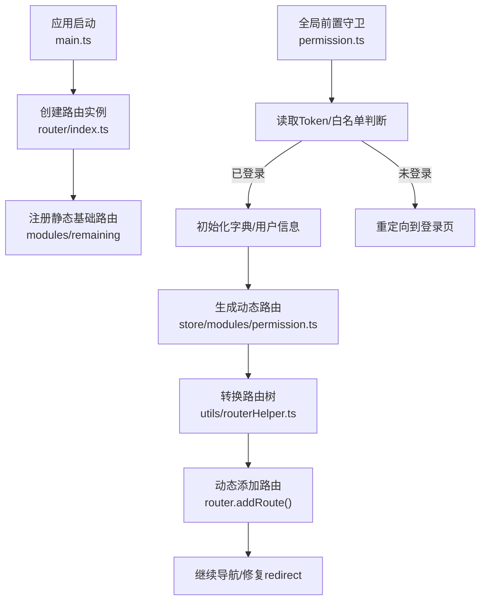
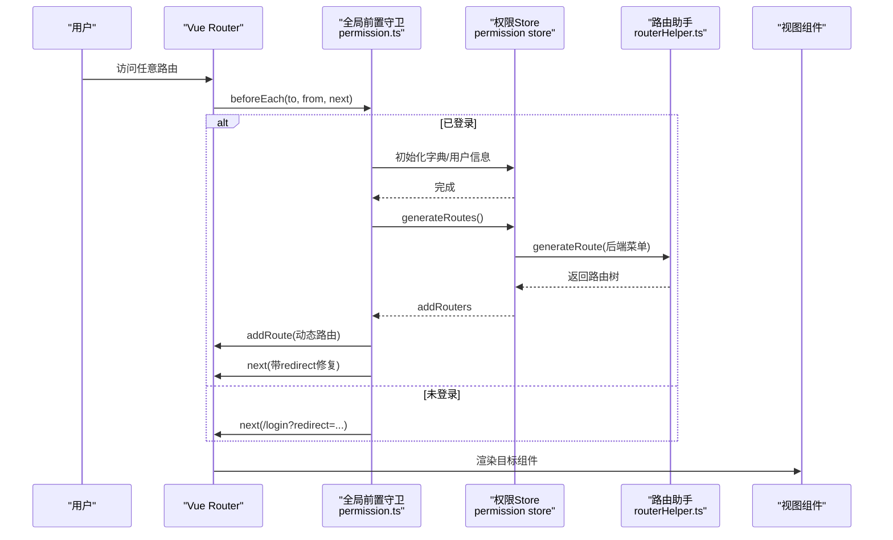
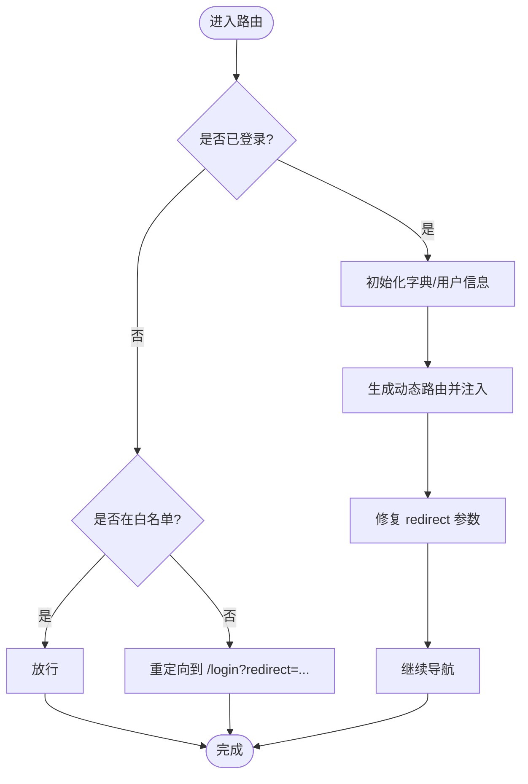
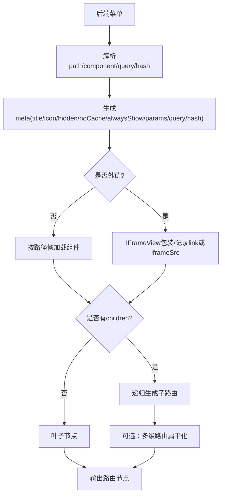
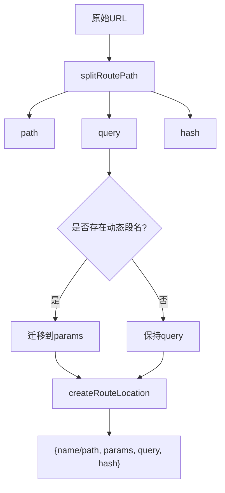
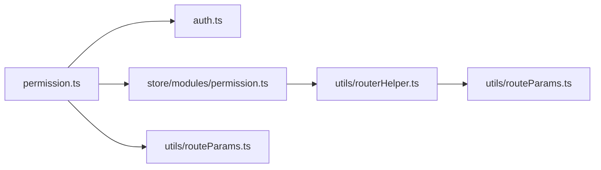

# 路由与导航

<cite>
**本文引用的文件**
- [nexai-ui/src/router/index.ts](file://nexai-ui/src/router/index.ts)
- [nexai-ui/src/permission.ts](file://nexai-ui/src/permission.ts)
- [nexai-ui/src/utils/routeParams.ts](file://nexai-ui/src/utils/routeParams.ts)
- [nexai-ui/src/utils/routerHelper.ts](file://nexai-ui/src/utils/routerHelper.ts)
- [nexai-ui/src/store/modules/permission.ts](file://nexai-ui/src/store/modules/permission.ts)
- [nexai-ui/src/utils/auth.ts](file://nexai-ui/src/utils/auth.ts)
- [nexai-ui/src/layout/components/Breadcrumb/src/Breadcrumb.vue](file://nexai-ui/src/layout/components/Breadcrumb/src/Breadcrumb.vue)
</cite>

## 目录
1. [简介](#简介)
2. [项目结构](#项目结构)
3. [核心组件](#核心组件)
4. [架构总览](#架构总览)
5. [详细组件分析](#详细组件分析)
6. [依赖关系分析](#依赖关系分析)
7. [性能考虑](#性能考虑)
8. [故障排查指南](#故障排查指南)
9. [结论](#结论)
10. [附录](#附录)

## 简介
本文件面向 NexAI 平台前端（Vue 3 + Vue Router）的路由与导航体系，系统性说明：
- 基于 Vue Router 的路由配置与组织方式（静态基础路由、动态路由、嵌套路由）
- 路由守卫与权限控制（登录态校验、菜单动态生成、页面访问控制）
- 路由懒加载与性能优化策略
- 面包屑导航的实现逻辑与交互设计
- 路由参数传递、查询字符串处理、路由状态管理
- 最佳实践与常见问题解决方案，并给出可落地的配置示例与权限控制流程

## 项目结构
NexAI 前端采用“静态基础路由 + 后端驱动动态路由”的组织方式：
- 静态基础路由：用于登录、重定向、404 等全局能力
- 动态路由：登录后从后端获取菜单数据，转换为路由表并注入到 Vue Router
- 路由工具：提供路径解析、动态参数拆分、外链/内嵌 iframe 支持、多级路由扁平化等
- 权限控制：通过全局前置守卫完成鉴权、字典与用户信息初始化、动态路由注入与跳转修复
- 面包屑：基于当前匹配路由的 meta 信息渲染

图表来源
- [nexai-ui/src/router/index.ts:7-20](file://nexai-ui/src/router/index.ts#L7-L20)
- [nexai-ui/src/permission.ts:28-72](file://nexai-ui/src/permission.ts#L28-L72)
- [nexai-ui/src/store/modules/permission.ts:39-65](file://nexai-ui/src/store/modules/permission.ts#L39-L65)
- [nexai-ui/src/utils/routerHelper.ts:74-220](file://nexai-ui/src/utils/routerHelper.ts#L74-L220)

章节来源
- [nexai-ui/src/router/index.ts:1-47](file://nexai-ui/src/router/index.ts#L1-L47)
- [nexai-ui/src/permission.ts:1-79](file://nexai-ui/src/permission.ts#L1-L79)
- [nexai-ui/src/store/modules/permission.ts:1-80](file://nexai-ui/src/store/modules/permission.ts#L1-L80)
- [nexai-ui/src/utils/routerHelper.ts:1-373](file://nexai-ui/src/utils/routerHelper.ts#L1-L373)

## 核心组件
- 路由实例与滚动行为：统一创建 router 实例，设置 history 模式与滚动行为，并提供 resetRouter 以在登出时清理动态路由
- 全局路由守卫：负责登录态校验、白名单放行、用户信息与字典初始化、动态路由生成与注入、redirect 参数修复
- 动态路由生成器：将后端菜单数据转换为前端路由树，处理外链、iframe、meta、命名、重定向、多级折叠等
- 路由参数工具：解析 query/hash、拆分动态参数、构造路由位置对象、外部链接识别
- 权限存储：维护 routers/addRouters/menuTabRouters 等状态，并提供扁平化后的路由供视图使用
- 面包屑组件：根据当前路由元信息渲染层级导航

章节来源
- [nexai-ui/src/router/index.ts:7-47](file://nexai-ui/src/router/index.ts#L7-L47)
- [nexai-ui/src/permission.ts:28-79](file://nexai-ui/src/permission.ts#L28-L79)
- [nexai-ui/src/utils/routerHelper.ts:74-220](file://nexai-ui/src/utils/routerHelper.ts#L74-L220)
- [nexai-ui/src/utils/routeParams.ts:22-161](file://nexai-ui/src/utils/routeParams.ts#L22-L161)
- [nexai-ui/src/store/modules/permission.ts:17-75](file://nexai-ui/src/store/modules/permission.ts#L17-L75)
- [nexai-ui/src/layout/components/Breadcrumb/src/Breadcrumb.vue](file://nexai-ui/src/layout/components/Breadcrumb/src/Breadcrumb.vue)

## 架构总览
下图展示从导航触发到页面渲染的完整链路，包括鉴权、动态路由注入与跳转修复。

图表来源
- [nexai-ui/src/permission.ts:28-72](file://nexai-ui/src/permission.ts#L28-L72)
- [nexai-ui/src/store/modules/permission.ts:39-65](file://nexai-ui/src/store/modules/permission.ts#L39-L65)
- [nexai-ui/src/utils/routerHelper.ts:74-220](file://nexai-ui/src/utils/routerHelper.ts#L74-L220)

## 详细组件分析

### 路由实例与滚动行为
- 使用 createWebHistory 并支持 BASE_PATH
- 滚动行为：切换路由时将内容区滚动条置顶，避免跨标签残留滚动位置
- 错误处理：当动态导入失败（如构建后 chunk 哈希变化），自动刷新到目标地址
- 路由重置：提供 resetRouter，仅保留白名单路由，便于登出或切换租户时清理动态路由

章节来源
- [nexai-ui/src/router/index.ts:7-47](file://nexai-ui/src/router/index.ts#L7-L47)

### 全局路由守卫与权限控制
- 白名单：登录、社交登录、授权回调、绑定、注册、OAuth 登录等路径直接放行
- 已登录流程：
  - 初始化字典与用户信息
  - 调用权限 Store 生成动态路由并注入到 Router
  - 修复 redirect 参数，确保携带查询/哈希等跳转信息
- 未登录流程：重定向到登录页并附带原始路径
- 后置钩子：设置页面标题、结束进度条与页面加载指示

图表来源
- [nexai-ui/src/permission.ts:28-79](file://nexai-ui/src/permission.ts#L28-L79)
- [nexai-ui/src/utils/routeParams.ts:51-53](file://nexai-ui/src/utils/routeParams.ts#L51-L53)

章节来源
- [nexai-ui/src/permission.ts:17-79](file://nexai-ui/src/permission.ts#L17-L79)
- [nexai-ui/src/utils/auth.ts:11-32](file://nexai-ui/src/utils/auth.ts#L11-L32)

### 动态路由生成与嵌套路由
- 输入：后端菜单数据（包含 path、component、visible、keepAlive、children、meta 等）
- 输出：前端路由树（AppRouteRecordRaw[]），包含：
  - meta：title、icon、hidden、noCache、alwaysShow、query、params、hash
  - component：按路径懒加载模块；外链使用 IFrameView 包裹
  - name：驼峰化，保证唯一性；必要时追加 Parent 后缀
  - redirect：目录默认跳转
  - children：递归生成，支持外链、嵌套目录、多级折叠
- 特殊处理：
  - 外链：通过 getExternalRoutePath 映射为内部路由，支持 ?_iframe 标记内嵌
  - 多级路由扁平化：flatMultiLevelRoutes 将深层嵌套转为二级路由，提升菜单渲染稳定性
  - 同名折叠：父目录与默认子页同名时，仅在单一默认页情况下折叠

图表来源
- [nexai-ui/src/utils/routerHelper.ts:74-220](file://nexai-ui/src/utils/routerHelper.ts#L74-L220)
- [nexai-ui/src/utils/routerHelper.ts:294-359](file://nexai-ui/src/utils/routerHelper.ts#L294-L359)
- [nexai-ui/src/utils/routeParams.ts:55-73](file://nexai-ui/src/utils/routeParams.ts#L55-L73)

章节来源
- [nexai-ui/src/utils/routerHelper.ts:74-220](file://nexai-ui/src/utils/routerHelper.ts#L74-L220)
- [nexai-ui/src/store/modules/permission.ts:39-65](file://nexai-ui/src/store/modules/permission.ts#L39-L65)

### 路由参数与查询字符串处理
- 解析 URL：splitRoutePath/parseRouteLocation 提取 path、query、hash
- 外链识别：parseExternalRouteLocation 识别 _iframe 标记，区分外链与内嵌
- 动态参数拆分：splitDynamicRouteParams 将 query 中匹配动态段名的值迁移至 params
- 动态路径解析：resolveDynamicPath 将 params 填充到 :param 占位符
- 路由位置构造：createRouteLocation 统一生成 {name,params,query,hash} 或 {path,query,hash}

图表来源
- [nexai-ui/src/utils/routeParams.ts:22-161](file://nexai-ui/src/utils/routeParams.ts#L22-L161)

章节来源
- [nexai-ui/src/utils/routeParams.ts:22-161](file://nexai-ui/src/utils/routeParams.ts#L22-L161)

### 面包屑导航实现与交互
- 数据来源：当前匹配路由的 matched 链路与 meta.title
- 渲染逻辑：Breadcrumb 组件根据路由层级生成可点击的层级项，支持隐藏根级或特定节点
- 交互：点击跳转到对应路由，支持外链与 iframe 场景下的差异化处理

章节来源
- [nexai-ui/src/layout/components/Breadcrumb/src/Breadcrumb.vue](file://nexai-ui/src/layout/components/Breadcrumb/src/Breadcrumb.vue)

### 路由懒加载与性能优化
- 组件懒加载：通过 import.meta.glob 与 defineAsyncComponent 按需加载视图组件
- 路由懒加载：动态路由的 component 字段指向异步模块，减少首屏体积
- 多级路由扁平化：flatMultiLevelRoutes 将深层嵌套转为二级路由，降低菜单渲染复杂度
- 错误恢复：onError 捕获动态导入失败并刷新页面，提升健壮性
- 滚动行为：切换路由时滚动条复位，改善用户体验

章节来源
- [nexai-ui/src/utils/routerHelper.ts:13-28](file://nexai-ui/src/utils/routerHelper.ts#L13-L28)
- [nexai-ui/src/utils/routerHelper.ts:294-359](file://nexai-ui/src/utils/routerHelper.ts#L294-L359)
- [nexai-ui/src/router/index.ts:22-30](file://nexai-ui/src/router/index.ts#L22-L30)
- [nexai-ui/src/router/index.ts:11-19](file://nexai-ui/src/router/index.ts#L11-L19)

## 依赖关系分析
- permission.ts 依赖：
  - auth.ts：读取 ACCESS_TOKEN
  - store/modules/permission.ts：生成并缓存动态路由
  - utils/routeParams.ts：解析 redirect 参数
  - hooks/useTitle、useNProgress、usePageLoading：UI 反馈
- store/modules/permission.ts 依赖：
  - utils/routerHelper.ts：generateRoute、flatMultiLevelRoutes
  - router/modules/remaining：静态基础路由
- utils/routerHelper.ts 依赖：
  - utils/routeParams.ts：路径解析与外链处理
  - lodash-es：深拷贝与对象操作
  - vue-router：定义组件、RouterView、路由类型

图表来源
- [nexai-ui/src/permission.ts:1-12](file://nexai-ui/src/permission.ts#L1-L12)
- [nexai-ui/src/store/modules/permission.ts:1-7](file://nexai-ui/src/store/modules/permission.ts#L1-L7)
- [nexai-ui/src/utils/routerHelper.ts:1-11](file://nexai-ui/src/utils/routerHelper.ts#L1-L11)

章节来源
- [nexai-ui/src/permission.ts:1-12](file://nexai-ui/src/permission.ts#L1-L12)
- [nexai-ui/src/store/modules/permission.ts:1-7](file://nexai-ui/src/store/modules/permission.ts#L1-L7)
- [nexai-ui/src/utils/routerHelper.ts:1-11](file://nexai-ui/src/utils/routerHelper.ts#L1-L11)

## 性能考虑
- 首屏优化：
  - 仅注册静态基础路由，动态路由按需注入
  - 组件与路由均使用懒加载，减小初始包体
- 运行时优化：
  - 多级路由扁平化，降低菜单渲染成本
  - 滚动行为优化，避免不必要的重排
- 健壮性：
  - 动态导入失败自动刷新，避免白屏
  - 路由名称唯一性处理，防止冲突导致的渲染异常

[本节为通用性能建议，不直接引用具体代码]

## 故障排查指南
- 动态导入失败导致白屏：检查 onerror 处理与网络环境，必要时手动刷新
- 登录后无法跳转：确认 redirect 参数是否正确编码与解析，检查 parseRouteLocation 的使用
- 菜单不显示：检查后端返回的 visible、parentId、component/path 字段，以及 generateRoute 的映射逻辑
- 外链/内嵌异常：确认是否携带 _iframe 标记，或 link/iframeSrc 是否正确设置
- 路由重复或冲突：检查 name 的唯一性，必要时启用 Parent 后缀与折叠逻辑

章节来源
- [nexai-ui/src/router/index.ts:22-30](file://nexai-ui/src/router/index.ts#L22-L30)
- [nexai-ui/src/permission.ts:52-60](file://nexai-ui/src/permission.ts#L52-L60)
- [nexai-ui/src/utils/routerHelper.ts:161-182](file://nexai-ui/src/utils/routerHelper.ts#L161-L182)
- [nexai-ui/src/utils/routerHelper.ts:193-214](file://nexai-ui/src/utils/routerHelper.ts#L193-L214)

## 结论
NexAI 前端路由系统以“静态基础路由 + 后端驱动动态路由”为核心，结合全局守卫、权限存储与路由工具，实现了灵活的权限控制、动态菜单与外链/内嵌支持。通过懒加载、多级扁平化与错误恢复机制，兼顾了性能与健壮性。配合面包屑与滚动行为优化，提供了良好的用户体验。

[本节为总结性内容，不直接引用具体代码]

## 附录

### 路由配置最佳实践
- 将静态路由与动态路由分离，便于管理与测试
- 使用统一的 meta 约定（title、icon、hidden、noCache、alwaysShow、query、params、hash）
- 外链统一通过内部路由代理，便于权限与日志追踪
- 对多级菜单进行扁平化处理，避免过深嵌套影响渲染
- 始终保证路由 name 唯一，必要时使用 Parent 后缀

[本节为通用最佳实践，不直接引用具体代码]

### 常见问题与解决方案
- 问题：登录后仍被重定向到登录页
  - 排查：检查白名单与 Token 读取逻辑
- 问题：redirect 参数丢失或解码异常
  - 排查：确认 encode/decode 一致性与 parseRouteLocation 的使用
- 问题：外链无法打开或内嵌异常
  - 排查：检查 _iframe 标记与 IFrameView 的配置
- 问题：多级菜单展开/折叠不符合预期
  - 排查：检查 alwaysShow 与同名折叠逻辑

[本节为通用问题解答，不直接引用具体代码]