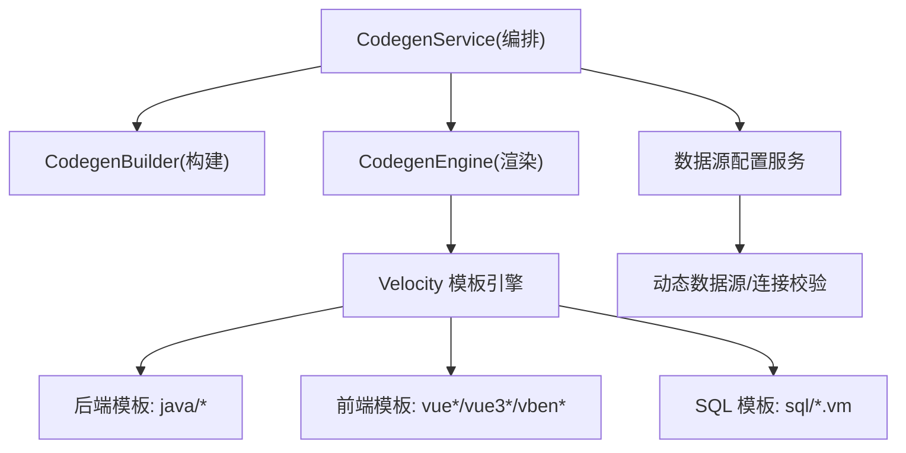
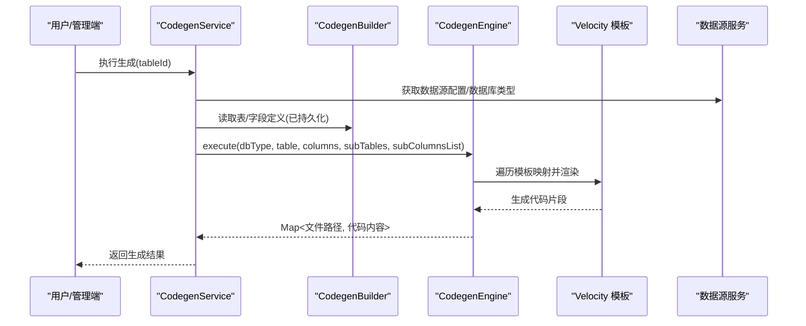
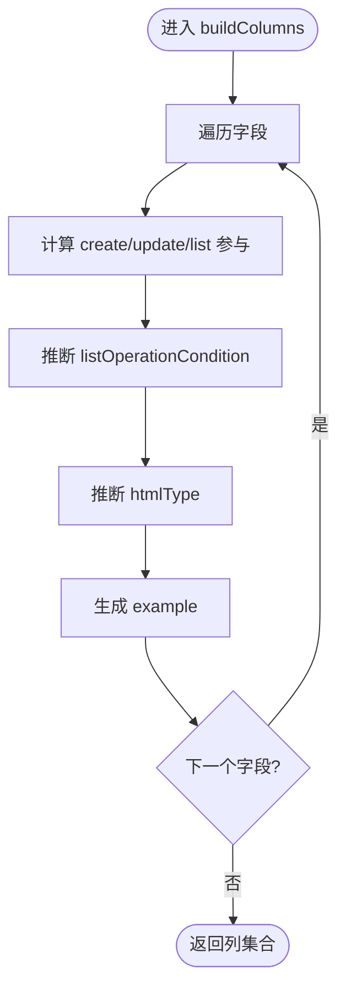
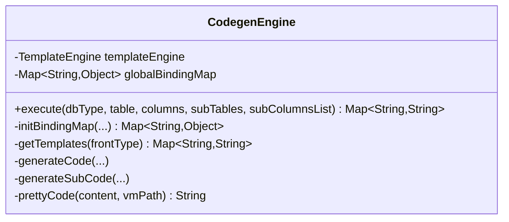
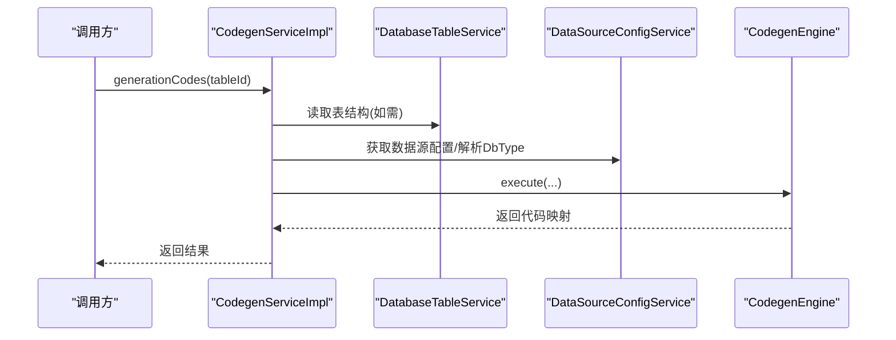
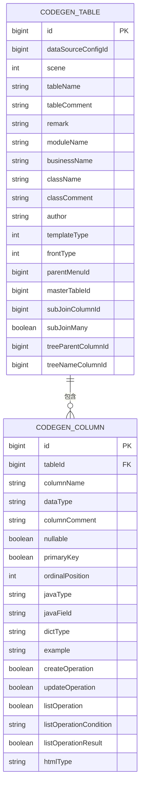
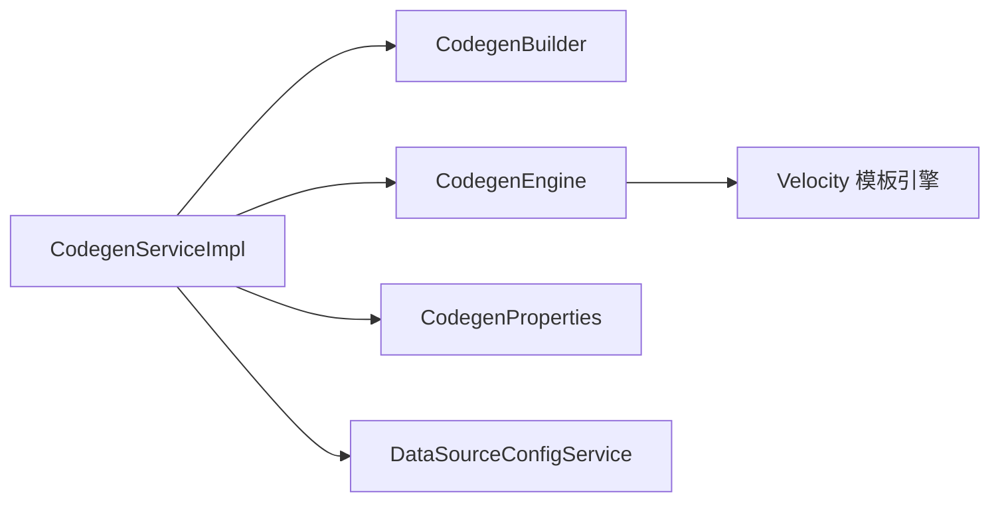

# 代码生成器

<cite>
**本文引用的文件**
- [CodegenBuilder.java](file://nexai-module-infra/src/main/java/com/gkht/ai/nexai/module/infra/service/codegen/inner/CodegenBuilder.java)
- [CodegenEngine.java](file://nexai-module-infra/src/main/java/com/gkht/ai/nexai/module/infra/service/codegen/inner/CodegenEngine.java)
- [CodegenService.java](file://nexai-module-infra/src/main/java/com/gkht/ai/nexai/module/infra/service/codegen/CodegenService.java)
- [CodegenServiceImpl.java](file://nexai-module-infra/src/main/java/com/gkht/ai/nexai/module/infra/service/codegen/CodegenServiceImpl.java)
- [CodegenTableDO.java](file://nexai-module-infra/src/main/java/com/gkht/ai/nexai/module/infra/dal/dataobject/codegen/CodegenTableDO.java)
- [CodegenColumnDO.java](file://nexai-module-infra/src/main/java/com/gkht/ai/nexai/module/infra/dal/dataobject/codegen/CodegenColumnDO.java)
- [CodegenProperties.java](file://nexai-module-infra/src/main/java/com/gkht/ai/nexai/module/infra/framework/codegen/config/CodegenProperties.java)
- [CodegenTemplateTypeEnum.java](file://nexai-module-infra/src/main/java/com/gkht/ai/nexai/module/infra/enums/codegen/CodegenTemplateTypeEnum.java)
- [CodegenFrontTypeEnum.java](file://nexai-module-infra/src/main/java/com/gkht/ai/nexai/module/infra/enums/codegen/CodegenFrontTypeEnum.java)
- [DataSourceConfigService.java](file://nexai-module-infra/src/main/java/com/gkht/ai/nexai/module/infra/service/db/DataSourceConfigService.java)
- [DataSourceConfigServiceImpl.java](file://nexai-module-infra/src/main/java/com/gkht/ai/nexai/module/infra/service/db/DataSourceConfigServiceImpl.java)
- [DataSourceConfigController.java](file://nexai-module-infra/src/main/java/com/gkht/ai/nexai/module/infra/controller/admin/db/DataSourceConfigController.java)
- [模板目录结构](file://nexai-module-infra/src/main/resources/codegen)
</cite>

## 目录
1. [简介](#简介)
2. [项目结构](#项目结构)
3. [核心组件](#核心组件)
4. [架构总览](#架构总览)
5. [详细组件分析](#详细组件分析)
6. [依赖关系分析](#依赖关系分析)
7. [性能考虑](#性能考虑)
8. [故障排查指南](#故障排查指南)
9. [结论](#结论)
10. [附录：配置与使用示例](#附录配置与使用示例)

## 简介
本技术文档面向 NexAI 平台的代码生成器，聚焦其核心架构与扩展机制。重点说明 CodegenBuilder 与 CodegenEngine 的设计模式、数据源配置、模板引擎选择、生成规则定义；详述前端（Vue3、Element Plus）、后端（Controller、Service、Mapper、DO 等）、SQL 脚本、单元测试的生成流程；并提供单表、主从表、树表等模式的完整配置方法与最佳实践。

## 项目结构
代码生成能力位于基础设施模块 infra，采用“服务编排 + 构建器 + 引擎”的分层设计：
- 服务层：CodegenService/Impl 负责编排创建、同步、删除与生成调用
- 构建器：CodegenBuilder 将数据库元信息转换为内部模型并填充默认值
- 引擎：CodegenEngine 基于 Velocity 模板渲染前后端代码与 SQL
- 配置：CodegenProperties 提供全局开关与包路径等
- 枚举：模板类型与前端的类型枚举驱动不同生成策略
- 资源：codegen 目录下包含多套前端与后端模板

图表来源
- [CodegenService.java](file://nexai-module-infra/src/main/java/com/gkht/ai/nexai/module/infra/service/codegen/CodegenService.java)
- [CodegenServiceImpl.java](file://nexai-module-infra/src/main/java/com/gkht/ai/nexai/module/infra/service/codegen/CodegenServiceImpl.java)
- [CodegenBuilder.java](file://nexai-module-infra/src/main/java/com/gkht/ai/nexai/module/infra/service/codegen/inner/CodegenBuilder.java)
- [CodegenEngine.java](file://nexai-module-infra/src/main/java/com/gkht/ai/nexai/module/infra/service/codegen/inner/CodegenEngine.java)
- [DataSourceConfigService.java](file://nexai-module-infra/src/main/java/com/gkht/ai/nexai/module/infra/service/db/DataSourceConfigService.java)
- [DataSourceConfigServiceImpl.java](file://nexai-module-infra/src/main/java/com/gkht/ai/nexai/module/infra/service/db/DataSourceConfigServiceImpl.java)

章节来源
- [CodegenService.java:1-109](file://nexai-module-infra/src/main/java/com/gkht/ai/nexai/module/infra/service/codegen/CodegenService.java#L1-L109)
- [CodegenServiceImpl.java:1-311](file://nexai-module-infra/src/main/java/com/gkht/ai/nexai/module/infra/service/codegen/CodegenServiceImpl.java#L1-L311)
- [CodegenBuilder.java:1-237](file://nexai-module-infra/src/main/java/com/gkht/ai/nexai/module/infra/service/codegen/inner/CodegenBuilder.java#L1-L237)
- [CodegenEngine.java:1-800](file://nexai-module-infra/src/main/java/com/gkht/ai/nexai/module/infra/service/codegen/inner/CodegenEngine.java#L1-L800)
- [DataSourceConfigService.java:1-60](file://nexai-module-infra/src/main/java/com/gkht/ai/nexai/module/infra/service/db/DataSourceConfigService.java#L1-L60)
- [DataSourceConfigServiceImpl.java:1-111](file://nexai-module-infra/src/main/java/com/gkht/ai/nexai/module/infra/service/db/DataSourceConfigServiceImpl.java#L1-L111)

## 核心组件
- CodegenBuilder：将数据库 TableInfo/TableField 映射为 CodegenTableDO/CodegenColumnDO，并自动推断 CRUD/UI/示例等默认值
- CodegenEngine：维护模板映射表，按前端类型与模板类型渲染代码，处理主子表、树表、导入、测试等分支逻辑
- CodegenService/Impl：对外暴露创建、同步、更新、删除、生成接口，协调 Builder 与 Engine，并加载子表与数据源类型
- CodegenProperties：统一配置基础包、数据库 schema、前端类型、是否生成批量删除/导入/单元测试等
- 枚举：模板类型（单表/树表/主子表）与前端类型（Vue2/Vue3/多种 UI 框架）决定生成产物

章节来源
- [CodegenBuilder.java:26-237](file://nexai-module-infra/src/main/java/com/gkht/ai/nexai/module/infra/service/codegen/inner/CodegenBuilder.java#L26-L237)
- [CodegenEngine.java:55-800](file://nexai-module-infra/src/main/java/com/gkht/ai/nexai/module/infra/service/codegen/inner/CodegenEngine.java#L55-L800)
- [CodegenService.java:14-109](file://nexai-module-infra/src/main/java/com/gkht/ai/nexai/module/infra/service/codegen/CodegenService.java#L14-L109)
- [CodegenServiceImpl.java:42-311](file://nexai-module-infra/src/main/java/com/gkht/ai/nexai/module/infra/service/codegen/CodegenServiceImpl.java#L42-L311)
- [CodegenProperties.java:13-65](file://nexai-module-infra/src/main/java/com/gkht/ai/nexai/module/infra/framework/codegen/config/CodegenProperties.java#L13-L65)
- [CodegenTemplateTypeEnum.java:9-54](file://nexai-module-infra/src/main/java/com/gkht/ai/nexai/module/infra/enums/codegen/CodegenTemplateTypeEnum.java#L9-L54)
- [CodegenFrontTypeEnum.java:6-39](file://nexai-module-infra/src/main/java/com/gkht/ai/nexai/module/infra/enums/codegen/CodegenFrontTypeEnum.java#L6-L39)

## 架构总览
代码生成器遵循“配置驱动 + 模板渲染”的架构：
- 配置层：通过 CodegenProperties 控制生成范围与风格
- 数据层：通过 DataSourceConfigService 获取数据源并解析数据库类型
- 构建层：CodegenBuilder 将 DB 元信息转为内部模型，填充默认行为
- 渲染层：CodegenEngine 根据模板映射表与绑定上下文渲染代码
- 输出层：返回键值对（文件路径 -> 内容），供下载或写入工程

图表来源
- [CodegenServiceImpl.java:260-298](file://nexai-module-infra/src/main/java/com/gkht/ai/nexai/module/infra/service/codegen/CodegenServiceImpl.java#L260-L298)
- [CodegenEngine.java:377-427](file://nexai-module-infra/src/main/java/com/gkht/ai/nexai/module/infra/service/codegen/inner/CodegenEngine.java#L377-L427)
- [DataSourceConfigService.java:45-60](file://nexai-module-infra/src/main/java/com/gkht/ai/nexai/module/infra/service/db/DataSourceConfigService.java#L45-L60)

## 详细组件分析

### CodegenBuilder：数据到模型的智能构建
职责
- 将 TableInfo 转换为 CodegenTableDO，并推导 moduleName/businessName/className/classComment
- 将 TableField 转换为 CodegenColumnDO，设置 CRUD 参与、列表条件、UI 控件类型、Swagger 示例
- 内置默认映射：如 name→模糊查询、time/date→区间、status/sex→单选、image/file→上传、content/description→编辑器、LocalDateTime→时间控件

关键逻辑
- 操作字段排除集：BaseDO 字段与租户字段不参与某些操作
- HTML 类型推断：基于字段名后缀与 Java 类型进行匹配
- 示例生成：按字段语义随机生成示例值，便于 API 文档预览

图表来源
- [CodegenBuilder.java:126-220](file://nexai-module-infra/src/main/java/com/gkht/ai/nexai/module/infra/service/codegen/inner/CodegenBuilder.java#L126-L220)

章节来源
- [CodegenBuilder.java:26-237](file://nexai-module-infra/src/main/java/com/gkht/ai/nexai/module/infra/service/codegen/inner/CodegenBuilder.java#L26-L237)

### CodegenEngine：模板映射与代码渲染
职责
- 维护后端模板映射（VO、Controller、Service、Mapper、DO、XML、错误码、测试）
- 维护前端模板映射（Vue2/3、Vben/Antd/EP、Uniapp 等）
- 初始化全局绑定变量（包名、类名、工具类、场景前缀、树表/主子表变量）
- 执行生成：按模板类型过滤、主子表循环、树表特殊处理、导入开关控制

关键特性
- 模板路径格式化：支持 ${basePackage}/${table.*}/${sceneEnum.*} 等占位符替换
- 主子表：按 _normal/_erp/_inner 匹配模式，逐个子表渲染
- 树表：注入父节点与名称字段变量，跳过不必要的 VO
- 单元测试：可关闭时移除测试模板与 H2 SQL

图表来源
- [CodegenEngine.java:55-800](file://nexai-module-infra/src/main/java/com/gkht/ai/nexai/module/infra/service/codegen/inner/CodegenEngine.java#L55-L800)

章节来源
- [CodegenEngine.java:55-800](file://nexai-module-infra/src/main/java/com/gkht/ai/nexai/module/infra/service/codegen/inner/CodegenEngine.java#L55-L800)

### CodegenService/Impl：编排与事务保障
职责
- 创建/同步/更新/删除代码生成配置
- 从数据库读取表结构并校验注释完整性
- 生成阶段：加载子表与关联字段、解析数据库类型、调用 Engine 执行
- 提供数据库表清单（过滤已存在表）

事务与校验
- 创建/同步/更新/删除均使用事务
- 校验表/字段非空、注释缺失、主从表关联字段存在性

图表来源
- [CodegenServiceImpl.java:260-298](file://nexai-module-infra/src/main/java/com/gkht/ai/nexai/module/infra/service/codegen/CodegenServiceImpl.java#L260-L298)
- [DataSourceConfigServiceImpl.java:77-111](file://nexai-module-infra/src/main/java/com/gkht/ai/nexai/module/infra/service/db/DataSourceConfigServiceImpl.java#L77-L111)

章节来源
- [CodegenService.java:14-109](file://nexai-module-infra/src/main/java/com/gkht/ai/nexai/module/infra/service/codegen/CodegenService.java#L14-L109)
- [CodegenServiceImpl.java:68-311](file://nexai-module-infra/src/main/java/com/gkht/ai/nexai/module/infra/service/codegen/CodegenServiceImpl.java#L68-L311)

### 数据模型：表与字段定义
- CodegenTableDO：保存数据源、场景、表名、类名、模板类型、前端类型、菜单、主子表、树表等配置
- CodegenColumnDO：保存字段名、类型、注释、是否主键、Java 类型/字段名、字典、示例、CRUD 参与、UI 类型等

图表来源
- [CodegenTableDO.java:20-157](file://nexai-module-infra/src/main/java/com/gkht/ai/nexai/module/infra/dal/dataobject/codegen/CodegenTableDO.java#L20-L157)
- [CodegenColumnDO.java:18-135](file://nexai-module-infra/src/main/java/com/gkht/ai/nexai/module/infra/dal/dataobject/codegen/CodegenColumnDO.java#L18-L135)

章节来源
- [CodegenTableDO.java:20-157](file://nexai-module-infra/src/main/java/com/gkht/ai/nexai/module/infra/dal/dataobject/codegen/CodegenTableDO.java#L20-L157)
- [CodegenColumnDO.java:18-135](file://nexai-module-infra/src/main/java/com/gkht/ai/nexai/module/infra/dal/dataobject/codegen/CodegenColumnDO.java#L18-L135)

### 模板与前端类型
- 后端模板：controller/vo、dal/do/mapper/xml、service、enums/errorcode、test/serviceTest、sql/sql.vm/h2.vm
- 前端模板：vue/vue3/vue3_admin_uniapp/vue3_vben*/vue3_vben5_* 等多套 UI 方案
- 前端类型枚举：覆盖 Vue2 Element UI、Vue3 Element Plus、Vben(Antd/EP)、Antdv Next、Uniapp 等

章节来源
- [CodegenEngine.java:66-297](file://nexai-module-infra/src/main/java/com/gkht/ai/nexai/module/infra/service/codegen/inner/CodegenEngine.java#L66-L297)
- [CodegenFrontTypeEnum.java:6-39](file://nexai-module-infra/src/main/java/com/gkht/ai/nexai/module/infra/enums/codegen/CodegenFrontTypeEnum.java#L6-L39)
- [模板目录结构](file://nexai-module-infra/src/main/resources/codegen)

## 依赖关系分析
- CodegenServiceImpl 依赖 DatabaseTableService、DataSourceConfigService、CodegenBuilder、CodegenEngine、CodegenProperties
- CodegenEngine 依赖 hutool TemplateEngine(Velocity)，并通过全局绑定变量注入框架类与工具类
- 模板路径由静态方法拼接，支持 Boot/Cloud 差异与单元测试/导入开关

图表来源
- [CodegenServiceImpl.java:47-67](file://nexai-module-infra/src/main/java/com/gkht/ai/nexai/module/infra/service/codegen/CodegenServiceImpl.java#L47-L67)
- [CodegenEngine.java:320-375](file://nexai-module-infra/src/main/java/com/gkht/ai/nexai/module/infra/service/codegen/inner/CodegenEngine.java#L320-L375)

章节来源
- [CodegenServiceImpl.java:47-67](file://nexai-module-infra/src/main/java/com/gkht/ai/nexai/module/infra/service/codegen/CodegenServiceImpl.java#L47-L67)
- [CodegenEngine.java:320-375](file://nexai-module-infra/src/main/java/com/gkht/ai/nexai/module/infra/service/codegen/inner/CodegenEngine.java#L320-L375)

## 性能考虑
- 模板渲染顺序：使用有序 Map 保证稳定输出，便于调试与对比
- 主子表渲染：仅当存在子表时循环渲染，避免无效开销
- 代码格式化：在 prettyCode 中做轻量清理，减少前端格式检查失败
- 单元测试/导入开关：按需移除模板，减少不必要生成
- 建议：大表字段较多时，优先启用最小必要模板；必要时拆分生成任务

## 故障排查指南
常见问题与定位
- 表或字段不存在：检查 CodegenTableDO/CodegenColumnDO 是否已正确创建与同步
- 主从表关联字段缺失：确保子表的关联字段存在于子表字段列表中
- 模板路径重复：Engine 会检测重复输出路径，需调整模板或业务名避免冲突
- 数据源连接失败：通过 DataSourceConfigService 校验连接，确认 URL/用户名/密码
- 单元测试未生成：检查 unitTestEnable 配置
- 导入功能未生成：检查 importEnable 配置

章节来源
- [CodegenServiceImpl.java:111-215](file://nexai-module-infra/src/main/java/com/gkht/ai/nexai/module/infra/service/codegen/CodegenServiceImpl.java#L111-L215)
- [CodegenEngine.java:439-449](file://nexai-module-infra/src/main/java/com/gkht/ai/nexai/module/infra/service/codegen/inner/CodegenEngine.java#L439-L449)
- [DataSourceConfigServiceImpl.java:95-111](file://nexai-module-infra/src/main/java/com/gkht/ai/nexai/module/infra/service/db/DataSourceConfigServiceImpl.java#L95-L111)

## 结论
NexAI 代码生成器以 Builder+Engine 的模式实现了高内聚、低耦合的代码生成体系。通过枚举与配置驱动，灵活适配多种前端与后端模板；借助完善的默认推断与校验，降低人工配置成本。结合主子表与树表支持，可满足常见 CRUD 场景的快速开发需求。

## 附录：配置与使用示例

### 配置项说明（CodegenProperties）
- basePackage：生成的 Java 代码基础包
- dbSchemas：数据库 schema 列表
- frontType：默认前端模板类型
- voType：VO 类型策略（VO 或 DO）
- deleteBatchEnable：是否生成批量删除接口
- unitTestEnable：是否生成单元测试
- importEnable：是否生成 Excel 导入相关代码

章节来源
- [CodegenProperties.java:13-65](file://nexai-module-infra/src/main/java/com/gkht/ai/nexai/module/infra/framework/codegen/config/CodegenProperties.java#L13-L65)

### 数据源配置
- 通过 DataSourceConfigController/Service 管理数据源
- 支持主数据源与自定义数据源，连接成功性校验
- 生成时根据 JDBC URL 解析数据库类型，影响 SQL 与方言

章节来源
- [DataSourceConfigController.java:22-29](file://nexai-module-infra/src/main/java/com/gkht/ai/nexai/module/infra/controller/admin/db/DataSourceConfigController.java#L22-L29)
- [DataSourceConfigService.java:14-60](file://nexai-module-infra/src/main/java/com/gkht/ai/nexai/module/infra/service/db/DataSourceConfigService.java#L14-L60)
- [DataSourceConfigServiceImpl.java:77-111](file://nexai-module-infra/src/main/java/com/gkht/ai/nexai/module/infra/service/db/DataSourceConfigServiceImpl.java#L77-L111)

### 生成流程（单表）
- 步骤：选择数据源 → 选择表 → 自动生成表/字段定义 → 可选修改字段属性 → 执行生成 → 下载代码
- 生成产物：Controller、Service、Mapper、DO、VO、XML、API、前端页面、SQL、单元测试（可按配置开关）

章节来源
- [CodegenServiceImpl.java:68-109](file://nexai-module-infra/src/main/java/com/gkht/ai/nexai/module/infra/service/codegen/CodegenServiceImpl.java#L68-L109)
- [CodegenEngine.java:377-427](file://nexai-module-infra/src/main/java/com/gkht/ai/nexai/module/infra/service/codegen/inner/CodegenEngine.java#L377-L427)

### 主从表生成
- 主表模板类型：MASTER_NORMAL / MASTER_ERP / MASTER_INNER
- 子表模板类型：SUB，需指定关联主表的字段
- 生成时自动校验子表关联字段存在性，并按模式渲染表单/列表组件

章节来源
- [CodegenTemplateTypeEnum.java:16-54](file://nexai-module-infra/src/main/java/com/gkht/ai/nexai/module/infra/enums/codegen/CodegenTemplateTypeEnum.java#L16-L54)
- [CodegenServiceImpl.java:272-291](file://nexai-module-infra/src/main/java/com/gkht/ai/nexai/module/infra/service/codegen/CodegenServiceImpl.java#L272-L291)
- [CodegenEngine.java:451-478](file://nexai-module-infra/src/main/java/com/gkht/ai/nexai/module/infra/service/codegen/inner/CodegenEngine.java#L451-L478)

### 树表生成
- 模板类型：TREE
- 需配置父节点字段与名称字段
- 生成时注入树表变量，跳过不必要的 VO，优化输出

章节来源
- [CodegenEngine.java:550-560](file://nexai-module-infra/src/main/java/com/gkht/ai/nexai/module/infra/service/codegen/inner/CodegenEngine.java#L550-L560)
- [CodegenEngine.java:407-416](file://nexai-module-infra/src/main/java/com/gkht/ai/nexai/module/infra/service/codegen/inner/CodegenEngine.java#L407-L416)

### 前端模板选择（Vue3、Element Plus 等）
- 前端类型枚举涵盖 Vue2/3、Vben(Antd/EP)、Antdv Next、Uniapp
- 通过 frontType 选择默认模板族，Engine 内部按类型加载对应模板映射

章节来源
- [CodegenFrontTypeEnum.java:6-39](file://nexai-module-infra/src/main/java/com/gkht/ai/nexai/module/infra/enums/codegen/CodegenFrontTypeEnum.java#L6-L39)
- [CodegenEngine.java:104-297](file://nexai-module-infra/src/main/java/com/gkht/ai/nexai/module/infra/service/codegen/inner/CodegenEngine.java#L104-L297)

### 自定义模板与扩展机制
- 新增模板：在 resources/codegen 下添加 .vm 文件，并在 CodegenEngine 的模板映射中添加映射
- 路径规则：使用 ${basePackage}/${table.*}/${sceneEnum.*} 等占位符生成目标路径
- 绑定变量：可在 initBindingMap 中扩展变量，供模板使用
- 模板过滤：可通过 getTemplates 增加条件过滤（如按环境/版本）

章节来源
- [CodegenEngine.java:633-656](file://nexai-module-infra/src/main/java/com/gkht/ai/nexai/module/infra/service/codegen/inner/CodegenEngine.java#L633-L656)
- [CodegenEngine.java:526-631](file://nexai-module-infra/src/main/java/com/gkht/ai/nexai/module/infra/service/codegen/inner/CodegenEngine.java#L526-L631)

### 最佳实践
- 表注释与字段注释必须完善，否则无法导入/同步
- 合理设置字段 HTML 类型与列表条件，提升前端交互质量
- 主子表关联字段务必存在且唯一，避免生成后联调问题
- 谨慎开启单元测试与导入功能，减少无关代码
- 模板命名规范，避免路径冲突

### 常见问题解决方案
- 导入失败：检查表/字段注释是否为空
- 生成失败（无子表）：主表生成时必须存在子表定义
- 生成路径重复：调整模板或业务名，避免冲突
- 数据源不可用：校验连接参数，确认网络与权限

章节来源
- [CodegenServiceImpl.java:111-215](file://nexai-module-infra/src/main/java/com/gkht/ai/nexai/module/infra/service/codegen/CodegenServiceImpl.java#L111-L215)
- [CodegenEngine.java:439-449](file://nexai-module-infra/src/main/java/com/gkht/ai/nexai/module/infra/service/codegen/inner/CodegenEngine.java#L439-L449)
- [DataSourceConfigServiceImpl.java:95-111](file://nexai-module-infra/src/main/java/com/gkht/ai/nexai/module/infra/service/db/DataSourceConfigServiceImpl.java#L95-L111)