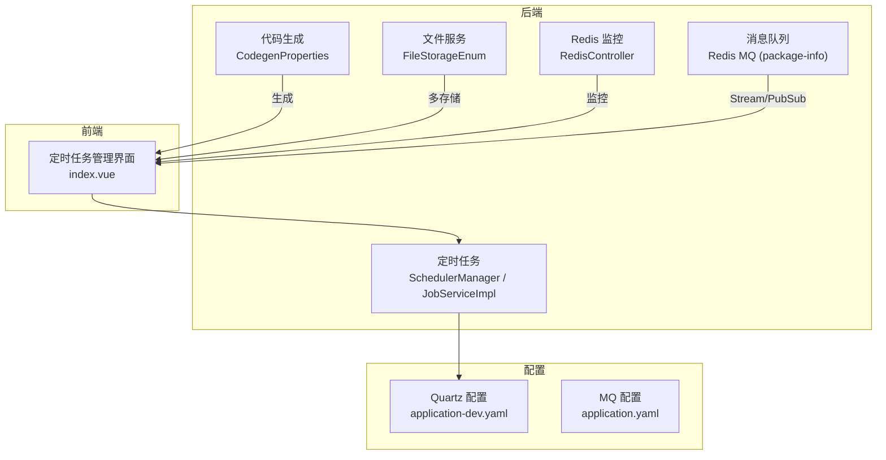
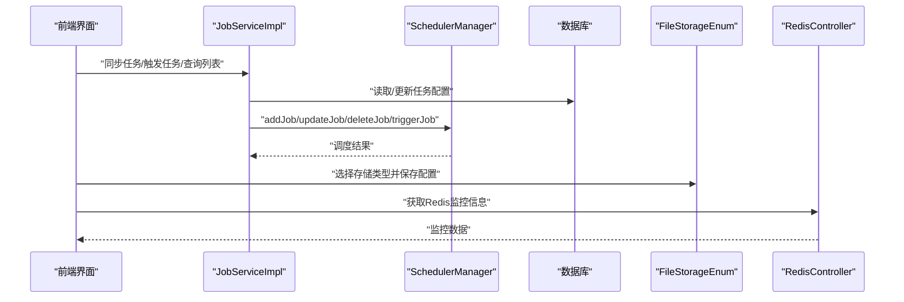
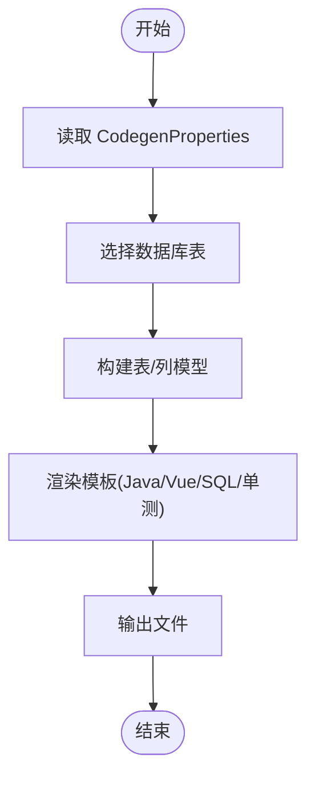
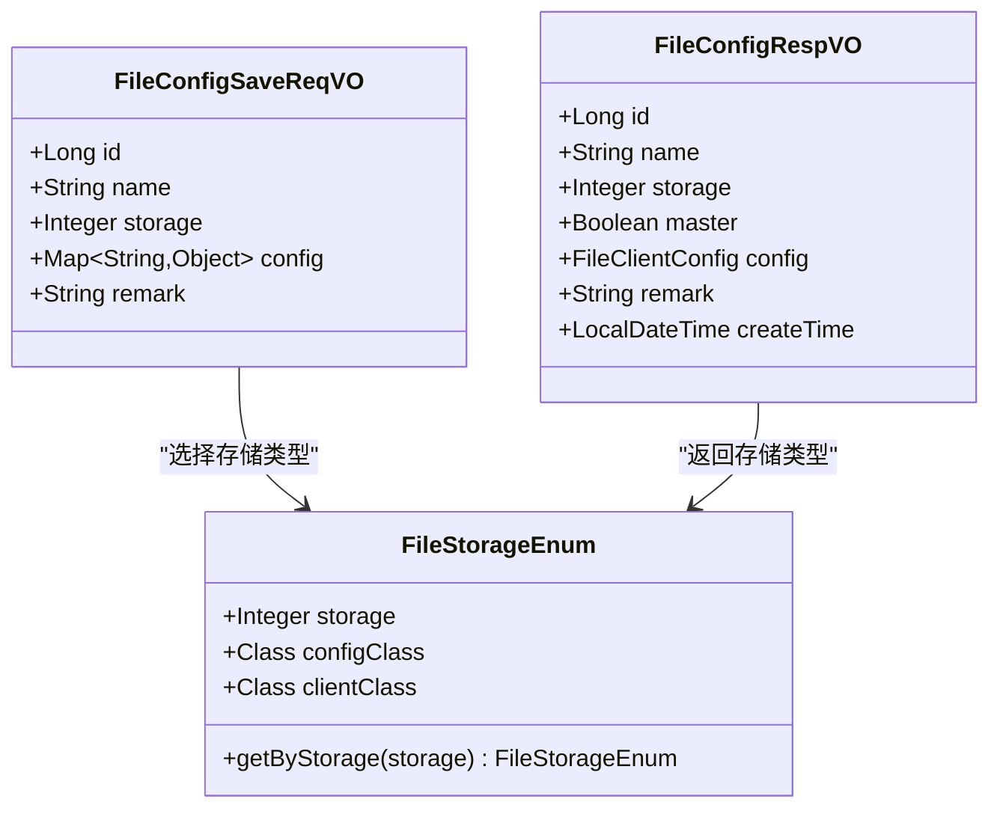
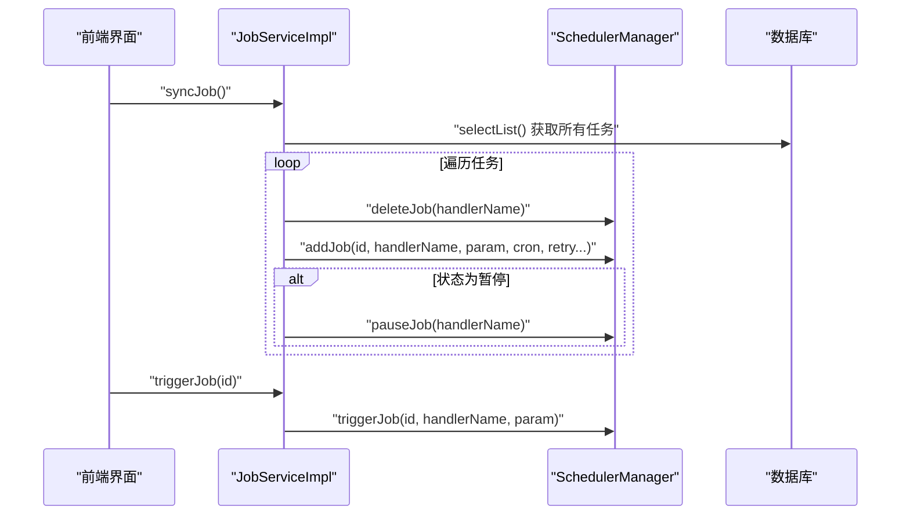
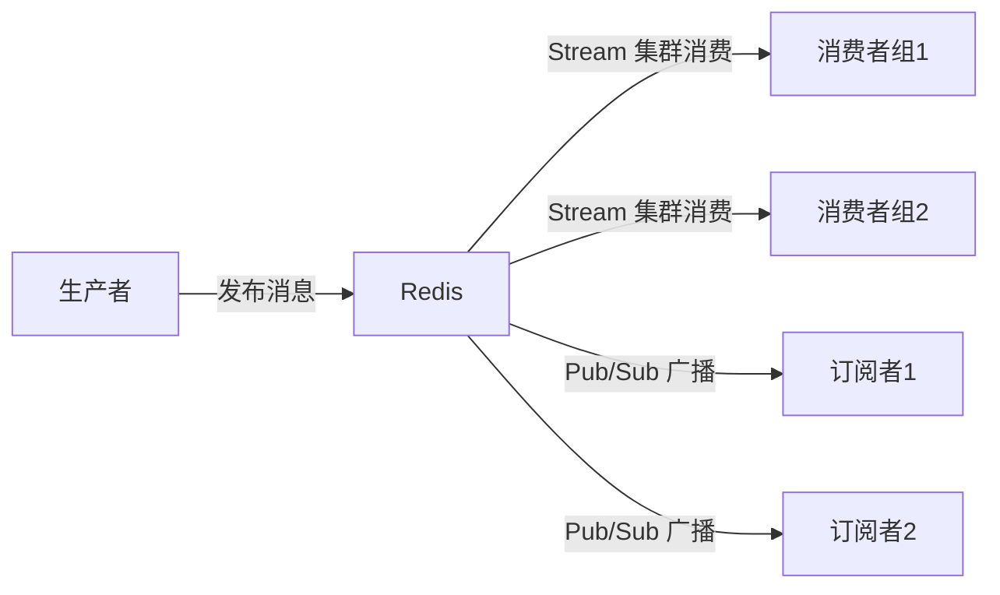
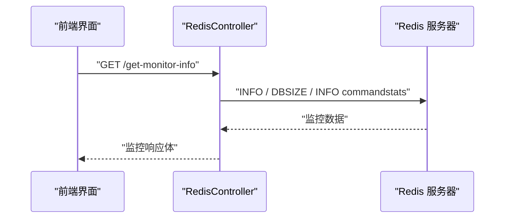
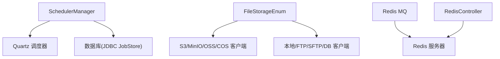

# 基础设施模块

<cite>
**本文引用的文件**
- [CodegenProperties.java](file://nexai-module-infra/src/main/java/com/gkht/ai/nexai/module/infra/framework/codegen/config/CodegenProperties.java)
- [SchedulerManager.java](file://nexai-framework/nexai-spring-boot-starter-job/src/main/java/com/gkht/ai/nexai/framework/quartz/core/scheduler/SchedulerManager.java)
- [JobServiceImpl.java](file://nexai-module-infra/src/main/java/com/gkht/ai/nexai/module/infra/service/job/JobServiceImpl.java)
- [JobLogService.java](file://nexai-module-infra/src/main/java/com/gkht/ai/nexai/module/infra/service/job/JobLogService.java)
- [application-dev.yaml](file://nexai-server/src/main/resources/application-dev.yaml)
- [index.vue](file://nexai-ui/src/views/infra/job/index.vue)
- [FileStorageEnum.java](file://nexai-module-infra/src/main/java/com/gkht/ai/nexai/module/infra/framework/file/core/enums/FileStorageEnum.java)
- [FileConfigRespVO.java](file://nexai-module-infra/src/main/java/com/gkht/ai/nexai/module/infra/controller/admin/file/vo/config/FileConfigRespVO.java)
- [FileConfigSaveReqVO.java](file://nexai-module-infra/src/main/java/com/gkht/ai/nexai/module/infra/controller/admin/file/vo/config/FileConfigSaveReqVO.java)
- [RedisController.java](file://nexai-module-infra/src/main/java/com/gkht/ai/nexai/module/infra/controller/admin/redis/RedisController.java)
- [RedisMonitorRespVO.java](file://nexai-module-infra/src/main/java/com/gkht/ai/nexai/module/infra/controller/admin/redis/vo/RedisMonitorRespVO.java)
- [application.yaml](file://nexai-server/src/main/resources/application.yaml)
- [package-info.java](file://nexai-framework/nexai-spring-boot-starter-mq/src/main/java/com/gkht/ai/nexai/framework/mq/redis/package-info.java)
- [README.md](file://README.md)
</cite>

## 目录
1. [简介](#简介)
2. [项目结构](#项目结构)
3. [核心组件](#核心组件)
4. [架构总览](#架构总览)
5. [详细组件分析](#详细组件分析)
6. [依赖关系分析](#依赖关系分析)
7. [性能考虑](#性能考虑)
8. [故障排查指南](#故障排查指南)
9. [结论](#结论)
10. [附录](#附录)

## 简介
本技术文档聚焦 NexAI 平台的基础设施模块，围绕以下能力展开：
- 代码生成器：支持前后端代码、SQL 脚本与单元测试的自动生成。
- 文件服务：多存储后端（本地、S3 兼容如 MinIO、阿里云 OSS、腾讯云 COS 等）。
- 定时任务：基于 Quartz 的任务管理界面、调度机制、执行监控与日志查看。
- 消息队列：基于 Redis Stream 的集群消费与 Pub/Sub 广播消费。
- 运维工具：API 日志、数据库监控、Redis 监控等。
并提供配置示例与最佳实践建议，帮助快速落地与稳定运行。

## 项目结构
基础设施能力主要分布在以下模块：
- nexai-module-infra：代码生成、文件服务、定时任务、Redis 监控等。
- nexai-framework/nexai-spring-boot-starter-job：Quartz 调度封装。
- nexai-framework/nexai-spring-boot-starter-mq：基于 Redis 的消息队列抽象（Stream/PubSub）。
- nexai-ui：前端管理界面（含定时任务管理页面）。
- nexai-server：应用配置入口（包含 Quartz、MQ 等配置）。

图表来源
- [CodegenProperties.java:1-65](file://nexai-module-infra/src/main/java/com/gkht/ai/nexai/module/infra/framework/codegen/config/CodegenProperties.java#L1-L65)
- [FileStorageEnum.java:1-56](file://nexai-module-infra/src/main/java/com/gkht/ai/nexai/module/infra/framework/file/core/enums/FileStorageEnum.java#L1-L56)
- [SchedulerManager.java:1-151](file://nexai-framework/nexai-spring-boot-starter-job/src/main/java/com/gkht/ai/nexai/framework/quartz/core/scheduler/SchedulerManager.java#L1-L151)
- [JobServiceImpl.java:131-215](file://nexai-module-infra/src/main/java/com/gkht/ai/nexai/module/infra/service/job/JobServiceImpl.java#L131-L215)
- [RedisController.java:26-43](file://nexai-module-infra/src/main/java/com/gkht/ai/nexai/module/infra/controller/admin/redis/RedisController.java#L26-L43)
- [package-info.java:1-7](file://nexai-framework/nexai-spring-boot-starter-mq/src/main/java/com/gkht/ai/nexai/framework/mq/redis/package-info.java#L1-L7)
- [application-dev.yaml:72-105](file://nexai-server/src/main/resources/application-dev.yaml#L72-L105)
- [application.yaml:109-135](file://nexai-server/src/main/resources/application.yaml#L109-L135)

章节来源
- [README.md:58-74](file://README.md#L58-L74)

## 核心组件
- 代码生成器：通过配置项控制生成的 Java/Vue/SQL/单元测试等产物，结合模板引擎输出。
- 文件服务：以枚举驱动不同存储客户端，统一上传/下载/删除接口。
- 定时任务：使用 Quartz 作为调度内核，提供任务的增删改查、同步到调度器、触发执行、暂停/恢复等操作。
- 消息队列：基于 Redis 实现 Stream 集群消费与 Pub/Sub 广播消费两种模式。
- 运维监控：提供 Redis 监控信息获取接口，便于在管理后台展示。

章节来源
- [CodegenProperties.java:1-65](file://nexai-module-infra/src/main/java/com/gkht/ai/nexai/module/infra/framework/codegen/config/CodegenProperties.java#L1-L65)
- [FileStorageEnum.java:1-56](file://nexai-module-infra/src/main/java/com/gkht/ai/nexai/module/infra/framework/file/core/enums/FileStorageEnum.java#L1-L56)
- [SchedulerManager.java:1-151](file://nexai-framework/nexai-spring-boot-starter-job/src/main/java/com/gkht/ai/nexai/framework/quartz/core/scheduler/SchedulerManager.java#L1-L151)
- [JobServiceImpl.java:131-215](file://nexai-module-infra/src/main/java/com/gkht/ai/nexai/module/infra/service/job/JobServiceImpl.java#L131-L215)
- [package-info.java:1-7](file://nexai-framework/nexai-spring-boot-starter-mq/src/main/java/com/gkht/ai/nexai/framework/mq/redis/package-info.java#L1-L7)
- [RedisController.java:26-43](file://nexai-module-infra/src/main/java/com/gkht/ai/nexai/module/infra/controller/admin/redis/RedisController.java#L26-L43)

## 架构总览
下图展示了基础设施模块的关键交互：前端管理界面调用后端服务，服务层协调调度器、文件客户端、Redis 监控与消息队列等子系统。

图表来源
- [JobServiceImpl.java:131-215](file://nexai-module-infra/src/main/java/com/gkht/ai/nexai/module/infra/service/job/JobServiceImpl.java#L131-L215)
- [SchedulerManager.java:1-151](file://nexai-framework/nexai-spring-boot-starter-job/src/main/java/com/gkht/ai/nexai/framework/quartz/core/scheduler/SchedulerManager.java#L1-L151)
- [FileStorageEnum.java:1-56](file://nexai-module-infra/src/main/java/com/gkht/ai/nexai/module/infra/framework/file/core/enums/FileStorageEnum.java#L1-L56)
- [RedisController.java:26-43](file://nexai-module-infra/src/main/java/com/gkht/ai/nexai/module/infra/controller/admin/redis/RedisController.java#L26-L43)

## 详细组件分析

### 代码生成器
- 配置项集中管理：基础包、数据库 Schema、前端类型、VO 类型、是否生成批量删除、单元测试、Excel 导入等。
- 典型流程：选择表 -> 解析元数据 -> 构建模型 -> 渲染模板 -> 输出 Java/Vue/SQL/单测等文件。
- 扩展点：可通过新增模板与配置项扩展生成规则。

图表来源
- [CodegenProperties.java:1-65](file://nexai-module-infra/src/main/java/com/gkht/ai/nexai/module/infra/framework/codegen/config/CodegenProperties.java#L1-L65)

章节来源
- [CodegenProperties.java:1-65](file://nexai-module-infra/src/main/java/com/gkht/ai/nexai/module/infra/framework/codegen/config/CodegenProperties.java#L1-L65)

### 文件服务（多存储后端）
- 存储类型由枚举统一管理，包括本地、FTP/SFTP、S3（兼容 MinIO、阿里云 OSS、腾讯云 COS 等）、数据库存储。
- 配置对象采用动态 Map 接收，便于不同存储后端的差异化参数。
- 管理界面可创建/修改存储配置，并设置主存储。

图表来源
- [FileStorageEnum.java:1-56](file://nexai-module-infra/src/main/java/com/gkht/ai/nexai/module/infra/framework/file/core/enums/FileStorageEnum.java#L1-L56)
- [FileConfigSaveReqVO.java:1-31](file://nexai-module-infra/src/main/java/com/gkht/ai/nexai/module/infra/controller/admin/file/vo/config/FileConfigSaveReqVO.java#L1-L31)
- [FileConfigRespVO.java:1-34](file://nexai-module-infra/src/main/java/com/gkht/ai/nexai/module/infra/controller/admin/file/vo/config/FileConfigRespVO.java#L1-L34)

章节来源
- [FileStorageEnum.java:1-56](file://nexai-module-infra/src/main/java/com/gkht/ai/nexai/module/infra/framework/file/core/enums/FileStorageEnum.java#L1-L56)
- [FileConfigSaveReqVO.java:1-31](file://nexai-module-infra/src/main/java/com/gkht/ai/nexai/module/infra/controller/admin/file/vo/config/FileConfigSaveReqVO.java#L1-L31)
- [FileConfigRespVO.java:1-34](file://nexai-module-infra/src/main/java/com/gkht/ai/nexai/module/infra/controller/admin/file/vo/config/FileConfigRespVO.java#L1-L34)

### 定时任务（Quartz）
- 调度器管理：提供添加、更新、删除、暂停、恢复、立即触发任务的能力；任务唯一标识为处理器名称。
- 业务服务：负责从数据库加载任务配置，同步到调度器，处理状态（暂停/启动），以及校验 Cron 表达式。
- 前端界面：提供任务列表、导出、同步到调度器、打开表单等操作。

图表来源
- [JobServiceImpl.java:131-215](file://nexai-module-infra/src/main/java/com/gkht/ai/nexai/module/infra/service/job/JobServiceImpl.java#L131-L215)
- [SchedulerManager.java:1-151](file://nexai-framework/nexai-spring-boot-starter-job/src/main/java/com/gkht/ai/nexai/framework/quartz/core/scheduler/SchedulerManager.java#L1-L151)
- [index.vue:210-255](file://nexai-ui/src/views/infra/job/index.vue#L210-L255)

章节来源
- [JobServiceImpl.java:131-215](file://nexai-module-infra/src/main/java/com/gkht/ai/nexai/module/infra/service/job/JobServiceImpl.java#L131-L215)
- [SchedulerManager.java:1-151](file://nexai-framework/nexai-spring-boot-starter-job/src/main/java/com/gkht/ai/nexai/framework/quartz/core/scheduler/SchedulerManager.java#L1-L151)
- [index.vue:210-255](file://nexai-ui/src/views/infra/job/index.vue#L210-L255)
- [JobLogService.java:1-39](file://nexai-module-infra/src/main/java/com/gkht/ai/nexai/module/infra/service/job/JobLogService.java#L1-L39)

### 消息队列（Redis Stream 与 Pub/Sub）
- 设计目标：提供两种消费模式
  - 集群消费：基于 Redis Stream，适合水平扩展与可靠投递。
  - 广播消费：基于 Redis Pub/Sub，适合事件广播场景。
- 通过统一的 MQ Starter 暴露抽象，便于在不同场景下选用合适模式。

图表来源
- [package-info.java:1-7](file://nexai-framework/nexai-spring-boot-starter-mq/src/main/java/com/gkht/ai/nexai/framework/mq/redis/package-info.java#L1-L7)

章节来源
- [package-info.java:1-7](file://nexai-framework/nexai-spring-boot-starter-mq/src/main/java/com/gkht/ai/nexai/framework/mq/redis/package-info.java#L1-L7)

### 运维监控（Redis）
- 提供获取 Redis 监控信息的接口，包括 info、dbSize、commandstats 等指标，便于在前端可视化。
- 前端可在管理后台展示 Redis 使用情况与命令统计，辅助定位性能问题。

图表来源
- [RedisController.java:26-43](file://nexai-module-infra/src/main/java/com/gkht/ai/nexai/module/infra/controller/admin/redis/RedisController.java#L26-L43)
- [RedisMonitorRespVO.java:1-43](file://nexai-module-infra/src/main/java/com/gkht/ai/nexai/module/infra/controller/admin/redis/vo/RedisMonitorRespVO.java#L1-L43)

章节来源
- [RedisController.java:26-43](file://nexai-module-infra/src/main/java/com/gkht/ai/nexai/module/infra/controller/admin/redis/RedisController.java#L26-L43)
- [RedisMonitorRespVO.java:1-43](file://nexai-module-infra/src/main/java/com/gkht/ai/nexai/module/infra/controller/admin/redis/vo/RedisMonitorRespVO.java#L1-L43)

## 依赖关系分析
- 定时任务依赖 Quartz 调度器与数据库持久化（JDBC JobStore），并通过 SchedulerManager 进行统一封装。
- 文件服务通过枚举映射到具体存储客户端，解耦上层业务与底层存储实现。
- 消息队列基于 Redis，提供 Stream 与 Pub/Sub 两种模式，满足不同业务需求。
- 监控能力通过 Redis 命令直接获取指标，减少额外依赖。

图表来源
- [SchedulerManager.java:1-151](file://nexai-framework/nexai-spring-boot-starter-job/src/main/java/com/gkht/ai/nexai/framework/quartz/core/scheduler/SchedulerManager.java#L1-L151)
- [FileStorageEnum.java:1-56](file://nexai-module-infra/src/main/java/com/gkht/ai/nexai/module/infra/framework/file/core/enums/FileStorageEnum.java#L1-L56)
- [package-info.java:1-7](file://nexai-framework/nexai-spring-boot-starter-mq/src/main/java/com/gkht/ai/nexai/framework/mq/redis/package-info.java#L1-L7)
- [RedisController.java:26-43](file://nexai-module-infra/src/main/java/com/gkht/ai/nexai/module/infra/controller/admin/redis/RedisController.java#L26-L43)

章节来源
- [application-dev.yaml:72-105](file://nexai-server/src/main/resources/application-dev.yaml#L72-L105)
- [application.yaml:109-135](file://nexai-server/src/main/resources/application.yaml#L109-L135)

## 性能考虑
- 定时任务线程池：根据任务并发量调整 Quartz 线程池大小，避免阻塞或资源争用。
- 文件上传：大文件建议使用分片与断点续传，合理设置存储后端超时与重试策略。
- Redis 监控：定期采集关键指标（内存、连接数、慢查询），结合告警机制提前发现瓶颈。
- 消息队列：Stream 模式下合理设置消费者组与最大长度，避免积压；Pub/Sub 注意广播风暴对 Redis 的压力。

[本节为通用指导，不直接分析具体文件]

## 故障排查指南
- 定时任务无法执行：检查 Quartz 是否启用、JobStore 类型是否为 JDBC、集群配置是否正确；确认任务已同步到调度器且未被暂停。
- 文件上传失败：核对存储类型与配置参数（如 S3 的 endpoint、bucket、密钥等），验证网络连通性与权限。
- Redis 监控无数据：确认 Redis 地址、端口、密码与数据库索引配置正确；检查是否有权限执行 INFO 与 COMMANDSTATS。
- 消息消费异常：区分 Stream 与 Pub/Sub 的使用场景；检查消费者组是否存在、消息是否被重复消费或丢失。

章节来源
- [application-dev.yaml:72-105](file://nexai-server/src/main/resources/application-dev.yaml#L72-L105)
- [RedisController.java:26-43](file://nexai-module-infra/src/main/java/com/gkht/ai/nexai/module/infra/controller/admin/redis/RedisController.java#L26-L43)
- [package-info.java:1-7](file://nexai-framework/nexai-spring-boot-starter-mq/src/main/java/com/gkht/ai/nexai/framework/mq/redis/package-info.java#L1-L7)

## 结论
NexAI 基础设施模块提供了完善的开发提效与运维保障能力：代码生成器提升交付效率，文件服务屏蔽多存储差异，定时任务提供可视化的调度管理，消息队列满足多种异步通信场景，监控接口助力系统健康度观测。通过合理的配置与最佳实践，可在生产环境获得稳定、可扩展的基础支撑。

[本节为总结性内容，不直接分析具体文件]

## 附录
- 配置要点
  - 定时任务：开启 Quartz、设置 JobStore 为 JDBC、配置集群与线程池大小。
  - 文件服务：按存储类型填写对应参数，设置主存储用于默认读写。
  - 消息队列：根据场景选择 Stream 或 Pub/Sub，合理配置消费者组与重试策略。
  - 监控：确保 Redis 可访问且具备必要权限，以便获取监控指标。

章节来源
- [application-dev.yaml:72-105](file://nexai-server/src/main/resources/application-dev.yaml#L72-L105)
- [application.yaml:109-135](file://nexai-server/src/main/resources/application.yaml#L109-L135)
- [FileStorageEnum.java:1-56](file://nexai-module-infra/src/main/java/com/gkht/ai/nexai/module/infra/framework/file/core/enums/FileStorageEnum.java#L1-L56)
- [package-info.java:1-7](file://nexai-framework/nexai-spring-boot-starter-mq/src/main/java/com/gkht/ai/nexai/framework/mq/redis/package-info.java#L1-L7)
- [RedisController.java:26-43](file://nexai-module-infra/src/main/java/com/gkht/ai/nexai/module/infra/controller/admin/redis/RedisController.java#L26-L43)