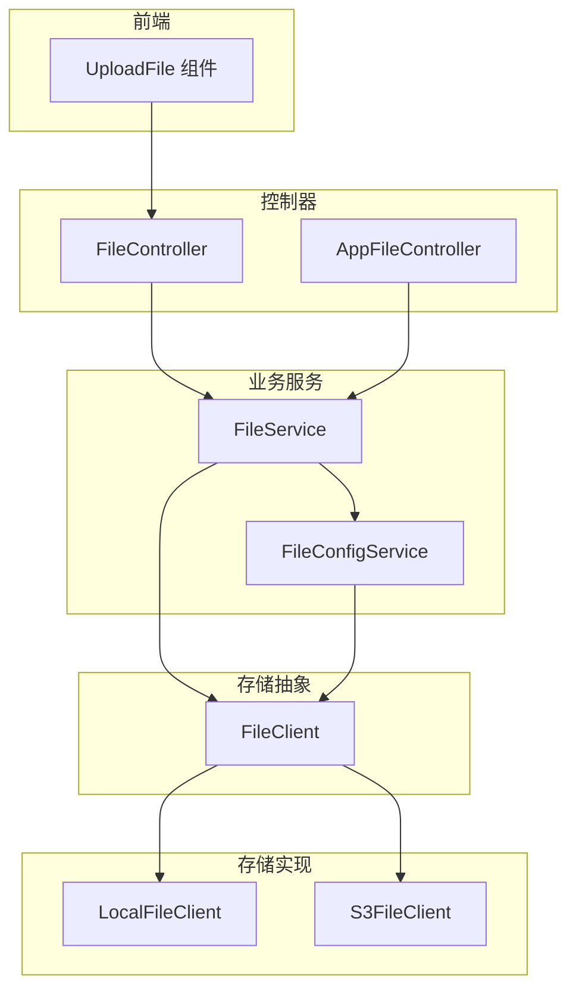
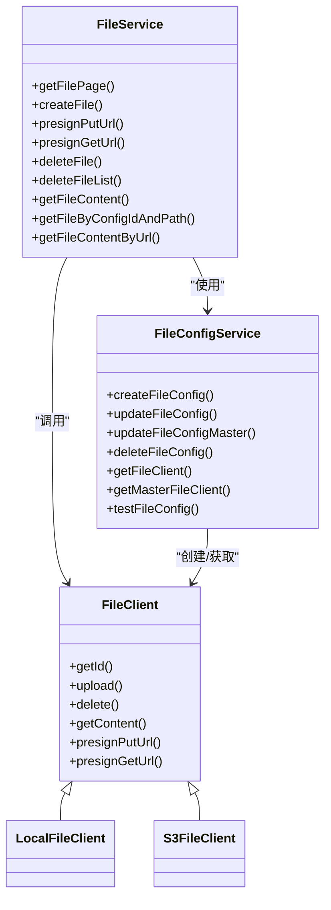
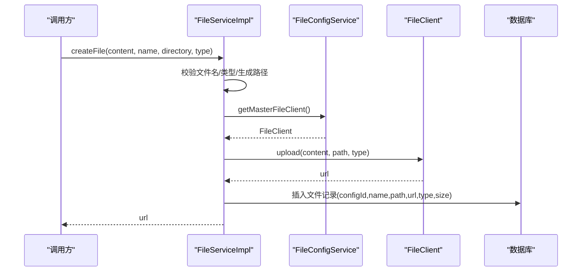
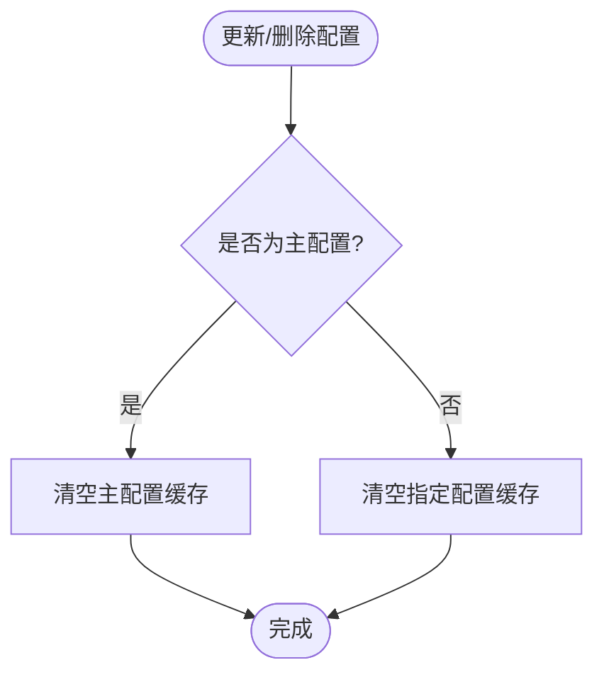
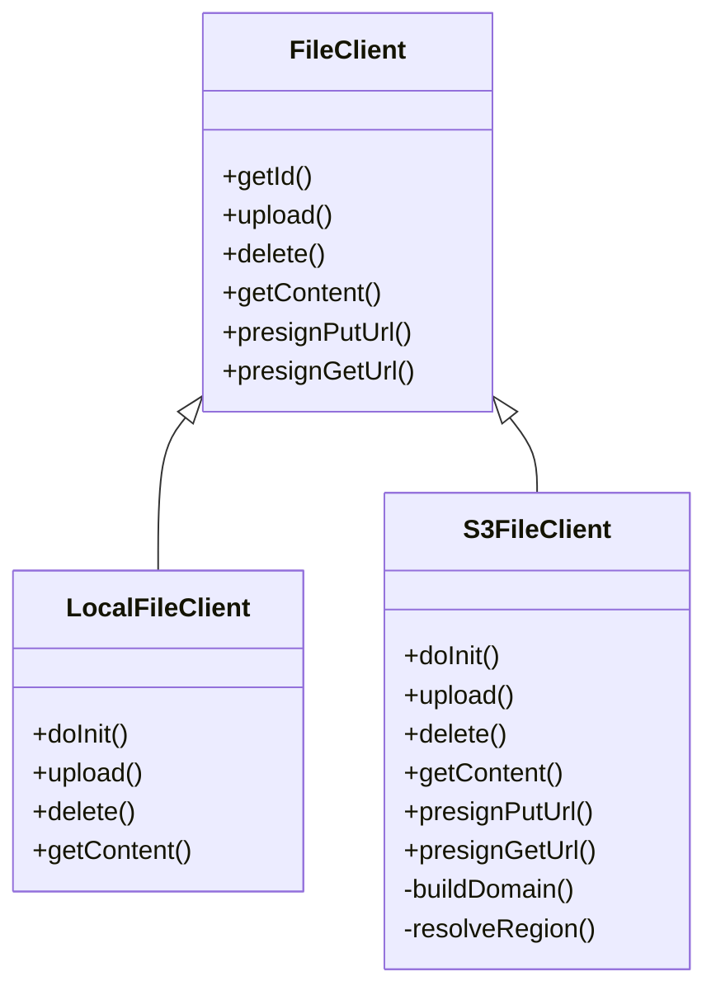
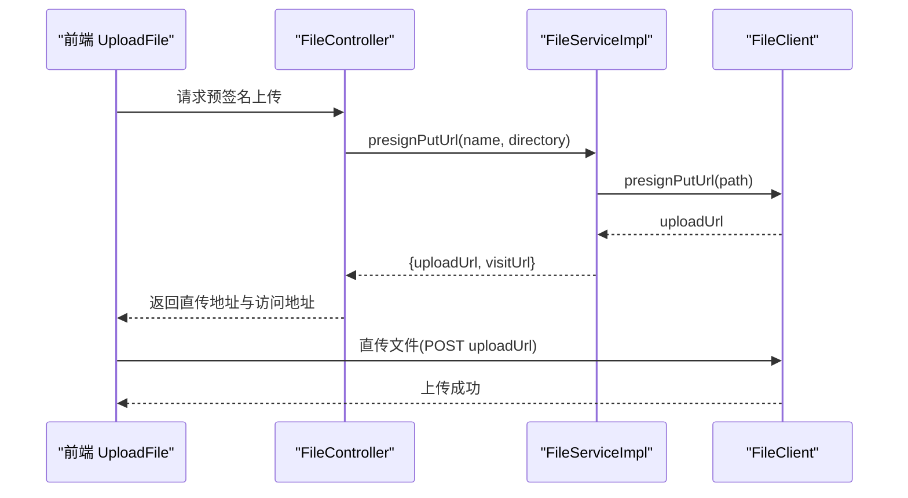
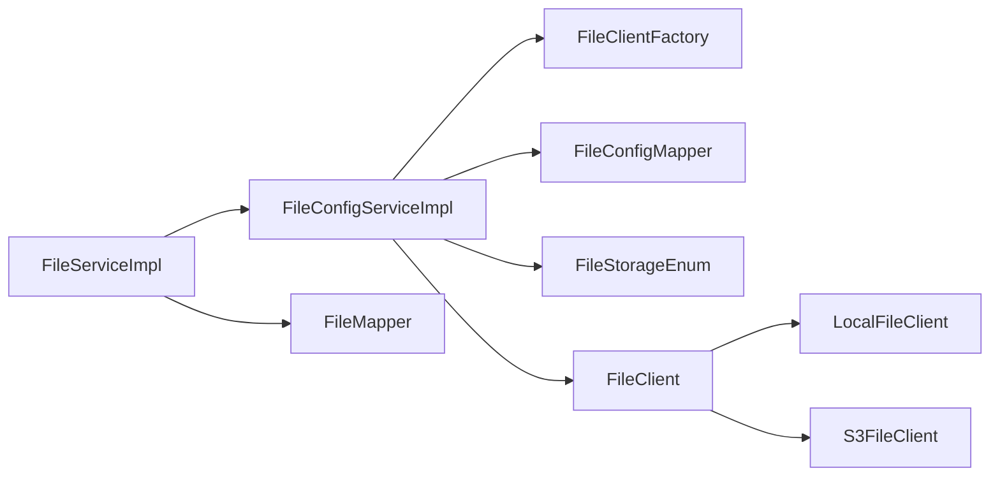

# 文件服务

<cite>
**本文引用的文件**
- [FileService.java](file://nexai-module-infra/src/main/java/com/gkht/ai/nexai/module/infra/service/file/FileService.java)
- [FileServiceImpl.java](file://nexai-module-infra/src/main/java/com/gkht/ai/nexai/module/infra/service/file/FileServiceImpl.java)
- [FileConfigService.java](file://nexai-module-infra/src/main/java/com/gkht/ai/nexai/module/infra/service/file/FileConfigService.java)
- [FileConfigServiceImpl.java](file://nexai-module-infra/src/main/java/com/gkht/ai/nexai/module/infra/service/file/FileConfigServiceImpl.java)
- [FileClient.java](file://nexai-module-infra/src/main/java/com/gkht/ai/nexai/module/infra/framework/file/core/client/FileClient.java)
- [S3FileClient.java](file://nexai-module-infra/src/main/java/com/gkht/ai/nexai/module/infra/framework/file/core/client/s3/S3FileClient.java)
- [LocalFileClient.java](file://nexai-module-infra/src/main/java/com/gkht/ai/nexai/module/infra/framework/file/core/client/local/LocalFileClient.java)
- [FileStorageEnum.java](file://nexai-module-infra/src/main/java/com/gkht/ai/nexai/module/infra/framework/file/core/enums/FileStorageEnum.java)
- [FileController.java](file://nexai-module-infra/src/main/java/com/gkht/ai/nexai/module/infra/controller/admin/file/FileController.java)
- [AppFileController.java](file://nexai-module-infra/src/main/java/com/gkht/ai/nexai/module/infra/controller/app/file/AppFileController.java)
- [UploadFile/index.ts](file://nexai-ui/src/components/UploadFile/index.ts)
- [UploadFile/src/index.vue](file://nexai-ui/src/components/UploadFile/src/index.vue)
</cite>

## 目录
1. [简介](#简介)
2. [项目结构](#项目结构)
3. [核心组件](#核心组件)
4. [架构总览](#架构总览)
5. [详细组件分析](#详细组件分析)
6. [依赖关系分析](#依赖关系分析)
7. [性能考虑](#性能考虑)
8. [故障排查指南](#故障排查指南)
9. [结论](#结论)
10. [附录](#附录)

## 简介
本技术文档聚焦 NexAI 平台的“文件服务”，围绕统一抽象与多存储后端实现展开，覆盖本地文件系统、MinIO、阿里云 OSS、腾讯云 COS、华为云 OBS 等。文档重点说明 FileService 接口的上传、下载、删除、批量操作、预签名能力；阐述 FileConfigService 的配置管理与动态切换；解释分片上传、断点续传、并发上传等高级能力的现状与建议；提供各后端的配置要点与优化建议；并给出安全策略、访问控制、缓存机制以及与前端组件的集成方式与最佳实践。

## 项目结构
文件服务位于基础设施模块 infra，采用“接口 + 实现 + 客户端工厂 + 多存储客户端”的分层设计：
- 业务服务层：FileService / FileConfigService 及其实现类，负责业务流程编排、数据持久化、配置管理。
- 存储抽象层：FileClient 接口定义统一的上传、下载、删除、预签名能力。
- 存储实现层：LocalFileClient（本地）、S3FileClient（兼容 S3 协议的 MinIO、OSS、COS、OBS 等）。
- 枚举与工具：FileStorageEnum 映射存储类型到配置与客户端类；路径与类型工具辅助校验与处理。
- 控制器层：Admin 与 App 端控制器暴露文件与配置的 REST API。
- 前端集成：UploadFile 组件封装上传交互，配合预签名直传提升体验。

图表来源
- [FileService.java:17-106](file://nexai-module-infra/src/main/java/com/gkht/ai/nexai/module/infra/service/file/FileService.java#L17-L106)
- [FileConfigService.java:17-95](file://nexai-module-infra/src/main/java/com/gkht/ai/nexai/module/infra/service/file/FileConfigService.java#L17-L95)
- [FileClient.java:8-67](file://nexai-module-infra/src/main/java/com/gkht/ai/nexai/module/infra/framework/file/core/client/FileClient.java#L8-L67)
- [LocalFileClient.java:19-68](file://nexai-module-infra/src/main/java/com/gkht/ai/nexai/module/infra/framework/file/core/client/local/LocalFileClient.java#L19-L68)
- [S3FileClient.java:32-257](file://nexai-module-infra/src/main/java/com/gkht/ai/nexai/module/infra/framework/file/core/client/s3/S3FileClient.java#L32-L257)
- [FileController.java](file://nexai-module-infra/src/main/java/com/gkht/ai/nexai/module/infra/controller/admin/file/FileController.java)
- [AppFileController.java](file://nexai-module-infra/src/main/java/com/gkht/ai/nexai/module/infra/controller/app/file/AppFileController.java)
- [UploadFile/index.ts](file://nexai-ui/src/components/UploadFile/index.ts)

章节来源
- [FileService.java:17-106](file://nexai-module-infra/src/main/java/com/gkht/ai/nexai/module/infra/service/file/FileService.java#L17-L106)
- [FileConfigService.java:17-95](file://nexai-module-infra/src/main/java/com/gkht/ai/nexai/module/infra/service/file/FileConfigService.java#L17-L95)
- [FileClient.java:8-67](file://nexai-module-infra/src/main/java/com/gkht/ai/nexai/module/infra/framework/file/core/client/FileClient.java#L8-L67)
- [LocalFileClient.java:19-68](file://nexai-module-infra/src/main/java/com/gkht/ai/nexai/module/infra/framework/file/core/client/local/LocalFileClient.java#L19-L68)
- [S3FileClient.java:32-257](file://nexai-module-infra/src/main/java/com/gkht/ai/nexai/module/infra/framework/file/core/client/s3/S3FileClient.java#L32-L257)

## 核心组件
- FileService：文件业务入口，提供分页查询、创建文件、生成上传/读取预签名地址、删除、批量删除、按配置ID+路径获取内容、按URL反查内容等能力。
- FileConfigService：文件存储配置管理，支持增删改查、设置主存储、测试连通性、按ID或主存储获取 FileClient。
- FileClient：存储客户端抽象，定义 upload/delete/getContent/presignPutUrl/presignGetUrl 等通用方法。
- LocalFileClient：本地磁盘存储实现，包含路径安全校验与读写。
- S3FileClient：基于 S3 SDK 的统一实现，适配 MinIO、阿里云 OSS、腾讯云 COS、华为云 OBS 等，支持公开/私有访问与预签名。

章节来源
- [FileService.java:17-106](file://nexai-module-infra/src/main/java/com/gkht/ai/nexai/module/infra/service/file/FileService.java#L17-L106)
- [FileConfigService.java:17-95](file://nexai-module-infra/src/main/java/com/gkht/ai/nexai/module/infra/service/file/FileConfigService.java#L17-L95)
- [FileClient.java:8-67](file://nexai-module-infra/src/main/java/com/gkht/ai/nexai/module/infra/framework/file/core/client/FileClient.java#L8-L67)
- [LocalFileClient.java:19-68](file://nexai-module-infra/src/main/java/com/gkht/ai/nexai/module/infra/framework/file/core/client/local/LocalFileClient.java#L19-L68)
- [S3FileClient.java:32-257](file://nexai-module-infra/src/main/java/com/gkht/ai/nexai/module/infra/framework/file/core/client/s3/S3FileClient.java#L32-L257)

## 架构总览
文件服务通过“配置驱动 + 客户端工厂 + 多后端实现”的方式，将上层业务与底层存储解耦。业务侧仅依赖 FileService，内部根据配置选择具体 FileClient。S3 协议后端统一了不同云厂商的差异，简化接入与维护。

图表来源
- [FileService.java:17-106](file://nexai-module-infra/src/main/java/com/gkht/ai/nexai/module/infra/service/file/FileService.java#L17-L106)
- [FileConfigService.java:17-95](file://nexai-module-infra/src/main/java/com/gkht/ai/nexai/module/infra/service/file/FileConfigService.java#L17-L95)
- [FileClient.java:8-67](file://nexai-module-infra/src/main/java/com/gkht/ai/nexai/module/infra/framework/file/core/client/FileClient.java#L8-L67)
- [LocalFileClient.java:19-68](file://nexai-module-infra/src/main/java/com/gkht/ai/nexai/module/infra/framework/file/core/client/local/LocalFileClient.java#L19-L68)
- [S3FileClient.java:32-257](file://nexai-module-infra/src/main/java/com/gkht/ai/nexai/module/infra/framework/file/core/client/s3/S3FileClient.java#L32-L257)

## 详细组件分析

### FileService 与 FileServiceImpl
- 上传流程：参数校验与类型推断 -> 生成唯一路径（可带日期前缀、可选时间戳后缀）-> 通过主存储客户端上传 -> 落库记录（configId/name/path/url/type/size）。
- 预签名上传：生成 path 后，由主存储客户端返回上传 URL 与访问 URL。
- 预签名下载：对传入 URL 进行解码与路径还原，按是否开启公开访问决定直接返回或生成 GET 预签名 URL。
- 删除与批量删除：先校验路径合法性，再调用对应存储客户端删除，最后删除数据库记录。
- 读取内容：支持按 configId+path 读取，或按 URL 反查记录后读取。

图表来源
- [FileServiceImpl.java:71-105](file://nexai-module-infra/src/main/java/com/gkht/ai/nexai/module/infra/service/file/FileServiceImpl.java#L71-L105)
- [FileConfigService.java:87-92](file://nexai-module-infra/src/main/java/com/gkht/ai/nexai/module/infra/service/file/FileConfigService.java#L87-L92)
- [FileClient.java:17-25](file://nexai-module-infra/src/main/java/com/gkht/ai/nexai/module/infra/framework/file/core/client/FileClient.java#L17-L25)

章节来源
- [FileServiceImpl.java:71-105](file://nexai-module-infra/src/main/java/com/gkht/ai/nexai/module/infra/service/file/FileServiceImpl.java#L71-L105)
- [FileServiceImpl.java:148-166](file://nexai-module-infra/src/main/java/com/gkht/ai/nexai/module/infra/service/file/FileServiceImpl.java#L148-L166)
- [FileServiceImpl.java:188-219](file://nexai-module-infra/src/main/java/com/gkht/ai/nexai/module/infra/service/file/FileServiceImpl.java#L188-L219)
- [FileServiceImpl.java:229-255](file://nexai-module-infra/src/main/java/com/gkht/ai/nexai/module/infra/service/file/FileServiceImpl.java#L229-L255)

### FileConfigService 与配置管理
- 配置生命周期：创建/更新/删除/批量删除，支持设置主存储。
- 客户端缓存：使用异步刷新缓存，避免频繁重建客户端；更新或删除时主动清理相关缓存。
- 动态切换：通过 updateFileConfigMaster 切换主存储，后续上传默认走新主存储。
- 测试连通性：内置测试用例上传小图验证配置正确性。

图表来源
- [FileConfigServiceImpl.java:87-112](file://nexai-module-infra/src/main/java/com/gkht/ai/nexai/module/infra/service/file/FileConfigServiceImpl.java#L87-L112)
- [FileConfigServiceImpl.java:125-169](file://nexai-module-infra/src/main/java/com/gkht/ai/nexai/module/infra/service/file/FileConfigServiceImpl.java#L125-L169)

章节来源
- [FileConfigService.java:17-95](file://nexai-module-infra/src/main/java/com/gkht/ai/nexai/module/infra/service/file/FileConfigService.java#L17-L95)
- [FileConfigServiceImpl.java:78-112](file://nexai-module-infra/src/main/java/com/gkht/ai/nexai/module/infra/service/file/FileConfigServiceImpl.java#L78-L112)
- [FileConfigServiceImpl.java:125-169](file://nexai-module-infra/src/main/java/com/gkht/ai/nexai/module/infra/service/file/FileConfigServiceImpl.java#L125-L169)
- [FileConfigServiceImpl.java:189-206](file://nexai-module-infra/src/main/java/com/gkht/ai/nexai/module/infra/service/file/FileConfigServiceImpl.java#L189-L206)

### 存储客户端与多后端实现
- FileClient：统一接口，定义上传、删除、读取、预签名（上传/下载）。
- LocalFileClient：本地磁盘写入/读取，路径安全校验防止越权访问。
- S3FileClient：基于 S3 SDK，自动补全 domain/endpoint，解析 region，支持 Path-style 访问，支持公开/私有访问与预签名。

图表来源
- [FileClient.java:8-67](file://nexai-module-infra/src/main/java/com/gkht/ai/nexai/module/infra/framework/file/core/client/FileClient.java#L8-L67)
- [LocalFileClient.java:19-68](file://nexai-module-infra/src/main/java/com/gkht/ai/nexai/module/infra/framework/file/core/client/local/LocalFileClient.java#L19-L68)
- [S3FileClient.java:32-257](file://nexai-module-infra/src/main/java/com/gkht/ai/nexai/module/infra/framework/file/core/client/s3/S3FileClient.java#L32-L257)

章节来源
- [FileClient.java:8-67](file://nexai-module-infra/src/main/java/com/gkht/ai/nexai/module/infra/framework/file/core/client/FileClient.java#L8-L67)
- [LocalFileClient.java:19-68](file://nexai-module-infra/src/main/java/com/gkht/ai/nexai/module/infra/framework/file/core/client/local/LocalFileClient.java#L19-L68)
- [S3FileClient.java:32-257](file://nexai-module-infra/src/main/java/com/gkht/ai/nexai/module/infra/framework/file/core/client/s3/S3FileClient.java#L32-L257)

### 预签名上传与下载流程
- 预签名上传：服务端生成 path 并调用存储客户端的 presignPutUrl，返回直传地址给前端；前端直传到对象存储，成功后回调或轮询状态。
- 预签名下载：服务端根据 URL 判断是否公开访问；若私有则生成 GET 预签名 URL，有效期可配置。

图表来源
- [FileServiceImpl.java:148-166](file://nexai-module-infra/src/main/java/com/gkht/ai/nexai/module/infra/service/file/FileServiceImpl.java#L148-L166)
- [FileClient.java:43-64](file://nexai-module-infra/src/main/java/com/gkht/ai/nexai/module/infra/framework/file/core/client/FileClient.java#L43-L64)
- [S3FileClient.java:108-141](file://nexai-module-infra/src/main/java/com/gkht/ai/nexai/module/infra/framework/file/core/client/s3/S3FileClient.java#L108-L141)

章节来源
- [FileServiceImpl.java:148-166](file://nexai-module-infra/src/main/java/com/gkht/ai/nexai/module/infra/service/file/FileServiceImpl.java#L148-L166)
- [S3FileClient.java:108-141](file://nexai-module-infra/src/main/java/com/gkht/ai/nexai/module/infra/framework/file/core/client/s3/S3FileClient.java#L108-L141)

### 高级功能：分片上传、断点续传、并发上传
- 当前实现现状：
  - 上传：FileServiceImpl.createFile 以整块字节上传；S3FileClient.upload 使用 PutObjectRequest 一次性上传。
  - 预签名：支持 presignPutUrl/presignGetUrl，便于前端直传与临时访问。
  - 未实现：分片上传、断点续传、并发分片在现有代码中未见实现。
- 建议与扩展方向：
  - 分片上传：在服务端新增分片接口，结合对象存储的分片 API（如 S3 Multipart Upload），维护分片元数据（Redis/DB）。
  - 断点续传：为每次上传分配任务 ID，记录已上传分片；失败后可从断点恢复。
  - 并发上传：前端并行上传分片，服务端聚合完成后触发合并；注意幂等与冲突处理。
  - 安全与限流：对直传地址增加白名单、IP/域名限制、速率限制与大小限制。

章节来源
- [FileServiceImpl.java:71-105](file://nexai-module-infra/src/main/java/com/gkht/ai/nexai/module/infra/service/file/FileServiceImpl.java#L71-L105)
- [S3FileClient.java:75-88](file://nexai-module-infra/src/main/java/com/gkht/ai/nexai/module/infra/framework/file/core/client/s3/S3FileClient.java#L75-L88)

### 存储后端配置与示例
- 本地存储（Local）：
  - 关键配置项：baseDir/basePath、domain（访问域名）。
  - 适用场景：开发调试、小规模部署。
  - 注意事项：确保 baseDir 可写，domain 指向服务器静态资源地址。
- S3 协议存储（MinIO/OSS/COS/OBS）：
  - 关键配置项：endpoint、bucket、accessKey、accessSecret、region、enablePublicAccess、enablePathStyleAccess、domain。
  - 区域解析：优先使用配置的 region，否则尝试从 endpoint 解析，最后回退默认值。
  - 访问模式：公开桶可直接访问；私有桶需通过预签名 URL 访问。
  - 路径风格：部分对象存储需启用 Path-style 访问。
  - 参考：S3FileClient 的 buildDomain/buildEndpoint/buildPresignerEndpoint/resolveRegion 逻辑。

章节来源
- [FileStorageEnum.java:26-56](file://nexai-module-infra/src/main/java/com/gkht/ai/nexai/module/infra/framework/file/core/enums/FileStorageEnum.java#L26-L56)
- [S3FileClient.java:43-73](file://nexai-module-infra/src/main/java/com/gkht/ai/nexai/module/infra/framework/file/core/client/s3/S3FileClient.java#L43-L73)
- [S3FileClient.java:143-185](file://nexai-module-infra/src/main/java/com/gkht/ai/nexai/module/infra/framework/file/core/client/s3/S3FileClient.java#L143-L185)
- [S3FileClient.java:187-254](file://nexai-module-infra/src/main/java/com/gkht/ai/nexai/module/infra/framework/file/core/client/s3/S3FileClient.java#L187-L254)

### 安全策略与访问控制
- 路径安全：
  - 上传路径与文件名均经过严格校验，禁止目录穿越与非法字符。
  - 本地存储读取前进行规范化与边界检查，防止越权访问。
- 访问控制：
  - 公开访问：当 enablePublicAccess 为真时，直接返回原始访问地址。
  - 私有访问：通过预签名 URL 控制访问时效与权限。
- 配置安全：
  - 主存储不可删除，避免影响全局上传。
  - 配置更新/删除后及时清理客户端缓存，保证一致性。
- 传输安全：
  - 建议使用 HTTPS 访问 endpoint/domain。
  - 预签名 URL 设置合理过期时间，降低泄露风险。

章节来源
- [LocalFileClient.java:57-65](file://nexai-module-infra/src/main/java/com/gkht/ai/nexai/module/infra/framework/file/core/client/local/LocalFileClient.java#L57-L65)
- [S3FileClient.java:116-141](file://nexai-module-infra/src/main/java/com/gkht/ai/nexai/module/infra/framework/file/core/client/s3/S3FileClient.java#L116-L141)
- [FileConfigServiceImpl.java:100-112](file://nexai-module-infra/src/main/java/com/gkht/ai/nexai/module/infra/service/file/FileConfigServiceImpl.java#L100-L112)

### 与前端组件的集成与最佳实践
- 集成方式：
  - 前端 UploadFile 组件调用后端接口获取预签名上传地址，然后直传到对象存储，减少后端带宽压力。
  - 上传成功后，前端可调用后端接口保存文件元信息或直接使用返回的访问 URL。
- 最佳实践：
  - 使用预签名上传大文件，提升用户体验与系统吞吐。
  - 对直传地址设置合理的过期时间与访问范围。
  - 前端展示进度条与错误提示，增强交互体验。
  - 对重复上传进行去重（例如基于文件名或哈希）。

章节来源
- [UploadFile/index.ts](file://nexai-ui/src/components/UploadFile/index.ts)
- [UploadFile/src/index.vue](file://nexai-ui/src/components/UploadFile/src/index.vue)
- [FileServiceImpl.java:148-166](file://nexai-module-infra/src/main/java/com/gkht/ai/nexai/module/infra/service/file/FileServiceImpl.java#L148-L166)

## 依赖关系分析
- 服务层依赖：
  - FileServiceImpl 依赖 FileConfigService 获取客户端，依赖 FileMapper 持久化文件记录。
  - FileConfigServiceImpl 依赖 FileClientFactory 创建/更新客户端，依赖 FileConfigMapper 管理配置。
- 存储层依赖：
  - LocalFileClient 依赖本地文件系统工具进行读写。
  - S3FileClient 依赖 AWS S3 SDK 进行对象存储操作。
- 枚举与工具：
  - FileStorageEnum 将存储类型映射到配置与客户端类，便于扩展新存储。

图表来源
- [FileServiceImpl.java:60-65](file://nexai-module-infra/src/main/java/com/gkht/ai/nexai/module/infra/service/file/FileServiceImpl.java#L60-L65)
- [FileConfigServiceImpl.java:69-76](file://nexai-module-infra/src/main/java/com/gkht/ai/nexai/module/infra/service/file/FileConfigServiceImpl.java#L69-L76)
- [FileStorageEnum.java:26-56](file://nexai-module-infra/src/main/java/com/gkht/ai/nexai/module/infra/framework/file/core/enums/FileStorageEnum.java#L26-L56)

章节来源
- [FileServiceImpl.java:60-65](file://nexai-module-infra/src/main/java/com/gkht/ai/nexai/module/infra/service/file/FileServiceImpl.java#L60-L65)
- [FileConfigServiceImpl.java:69-76](file://nexai-module-infra/src/main/java/com/gkht/ai/nexai/module/infra/service/file/FileConfigServiceImpl.java#L69-L76)
- [FileStorageEnum.java:26-56](file://nexai-module-infra/src/main/java/com/gkht/ai/nexai/module/infra/framework/file/core/enums/FileStorageEnum.java#L26-L56)

## 性能考虑
- 上传性能：
  - 大文件建议使用预签名直传，减轻后端压力。
  - 针对 S3 协议存储，合理设置 region 与 endpoint，减少网络延迟。
  - 对于高并发场景，考虑在前端进行分片并发上传（需服务端扩展支持）。
- 读取性能：
  - 公开桶可直接访问，减少鉴权开销。
  - 私有桶使用预签名 URL，合理设置过期时间，避免频繁生成。
- 缓存策略：
  - 客户端缓存异步刷新，降低初始化成本。
  - 配置变更时及时清理缓存，保证一致性。
- I/O 与路径：
  - 本地存储避免跨盘路径与过长路径，定期归档历史文件。
  - 对象存储使用合理的 bucket 与 key 命名规范，利于 CDN 与检索。

[本节为通用指导，不直接分析具体文件]

## 故障排查指南
- 上传失败：
  - 检查存储配置是否正确（endpoint、bucket、密钥、region）。
  - 确认直传地址有效且未过期。
  - 查看对象存储控制台是否有权限或配额问题。
- 下载失败：
  - 公开桶：确认域名与路径正确。
  - 私有桶：确认预签名 URL 未过期，且访问路径未被篡改。
- 删除异常：
  - 确认路径合法，避免误删。
  - 检查存储客户端是否存在（配置是否被删除或失效）。
- 配置变更：
  - 更新或删除配置后，确认缓存已清理。
  - 主存储不可删除，如需更换请通过设置新的主存储。

章节来源
- [FileConfigServiceImpl.java:125-169](file://nexai-module-infra/src/main/java/com/gkht/ai/nexai/module/infra/service/file/FileConfigServiceImpl.java#L125-L169)
- [LocalFileClient.java:44-55](file://nexai-module-infra/src/main/java/com/gkht/ai/nexai/module/infra/framework/file/core/client/local/LocalFileClient.java#L44-L55)
- [S3FileClient.java:116-141](file://nexai-module-infra/src/main/java/com/gkht/ai/nexai/module/infra/framework/file/core/client/s3/S3FileClient.java#L116-L141)

## 结论
NexAI 文件服务通过统一的 FileClient 抽象与多后端实现，提供了灵活、可扩展的文件管理能力。当前版本已具备完整的上传、下载、删除、批量操作与预签名能力，并通过配置管理实现动态切换主存储。未来可在分片上传、断点续传、并发上传等方面进一步增强，以满足更大规模与更复杂场景的需求。同时，应持续关注安全策略与性能优化，确保系统的稳定性与高效性。

[本节为总结性内容，不直接分析具体文件]

## 附录
- 控制器入口：
  - Admin 端：FileController 提供文件与配置的 CRUD 接口。
  - App 端：AppFileController 提供面向应用侧的文件上传接口。
- 前端组件：
  - UploadFile 组件封装上传交互，配合预签名直传提升体验。

章节来源
- [FileController.java](file://nexai-module-infra/src/main/java/com/gkht/ai/nexai/module/infra/controller/admin/file/FileController.java)
- [AppFileController.java](file://nexai-module-infra/src/main/java/com/gkht/ai/nexai/module/infra/controller/app/file/AppFileController.java)
- [UploadFile/index.ts](file://nexai-ui/src/components/UploadFile/index.ts)
- [UploadFile/src/index.vue](file://nexai-ui/src/components/UploadFile/src/index.vue)