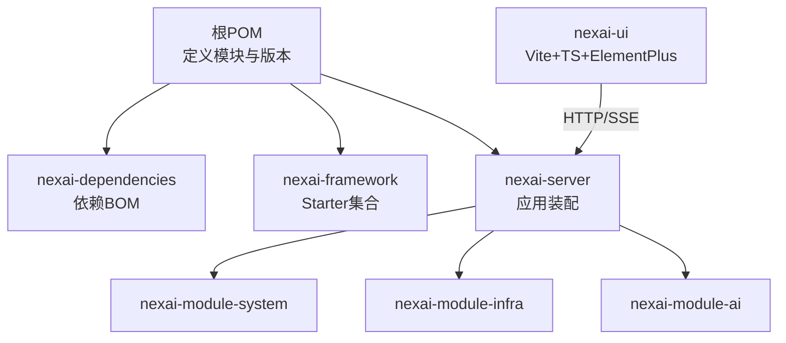
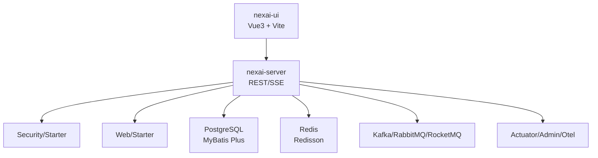
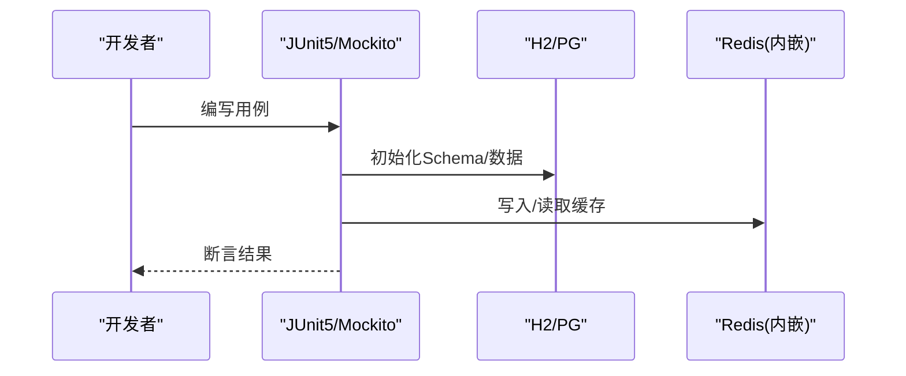
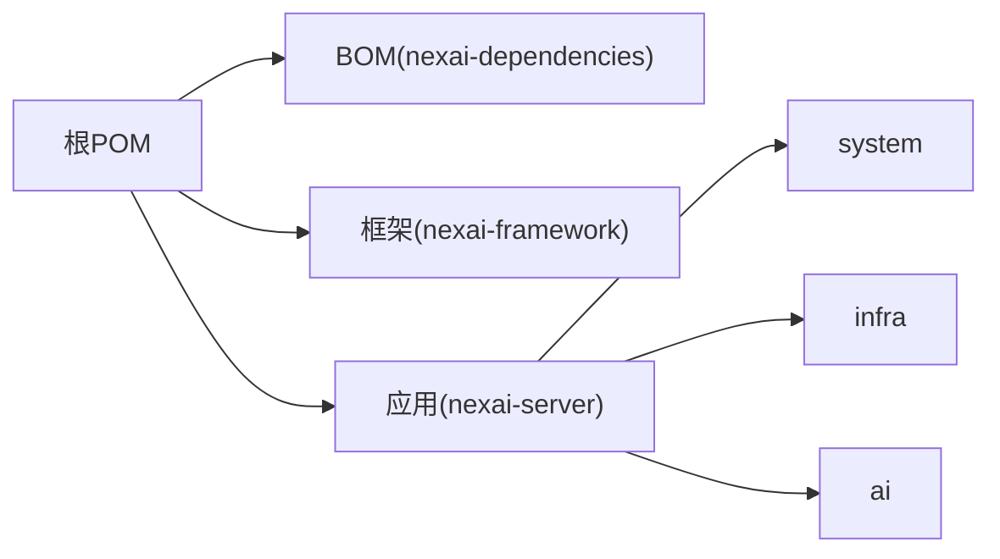

# 开发指南

<cite>
**本文引用的文件**
- [README.md](file://README.md)
- [pom.xml](file://pom.xml)
- [application.yaml](file://nexai-server/src/main/resources/application.yaml)
- [application-local-example.yaml](file://nexai-server/src/main/resources/application-local-example.yaml)
- [nexai-server/pom.xml](file://nexai-server/pom.xml)
- [package.json](file://nexai-ui/package.json)
- [vite.config.ts](file://nexai-ui/vite.config.ts)
- [.eslintrc-auto-import.json](file://nexai-ui/.eslintrc-auto-import.json)
- [lint-staged.config.mjs](file://nexai-ui/lint-staged.config.mjs)
- [Dockerfile](file://Dockerfile)
- [docker-compose.yml](file://script/docker/docker-compose.yml)
- [Jenkinsfile](file://script/jenkins/Jenkinsfile)
- [BaseDbAndRedisUnitTest.java](file://nexai-framework/nexai-spring-boot-starter-test/src/main/java/com/gkht/ai/nexai/framework/test/core/ut/BaseDbAndRedisUnitTest.java)
- [BaseDbUnitTest.java](file://nexai-framework/nexai-spring-boot-starter-test/src/main/java/com/gkht/ai/nexai/framework/test/core/ut/BaseDbUnitTest.java)
- [BaseMockitoUnitTest.java](file://nexai-framework/nexai-spring-boot-starter-test/src/main/java/com/gkht/ai/nexai/framework/test/core/ut/BaseMockitoUnitTest.java)
- [BaseRedisUnitTest.java](file://nexai-framework/nexai-spring-boot-starter-test/src/main/java/com/gkht/ai/nexai/framework/test/core/ut/BaseRedisUnitTest.java)
- [H2SmokeTest.java](file://nexai-module-ai/src/test/java/com/gkht/ai/nexai/module/ai/smoke/H2SmokeTest.java)
- [PgSmokeTest.java](file://nexai-module-ai/src/test/java/com/gkht/ai/nexai/module/ai/smoke/PgSmokeTest.java)
- [OpenAiCompatContractTest.java](file://nexai-module-ai/src/test/java/com/gkht/ai/nexai/module/ai/session/interfaces/controller/app/openai/OpenAiCompatContractTest.java)
</cite>

## 目录
1. [简介](#简介)
2. [项目结构](#项目结构)
3. [核心组件](#核心组件)
4. [架构总览](#架构总览)
5. [详细组件分析](#详细组件分析)
6. [依赖关系分析](#依赖关系分析)
7. [性能与压测](#性能与压测)
8. [故障排查](#故障排查)
9. [结论](#结论)
10. [附录](#附录)

## 简介
NexAI 是基于 Spring Boot 4.1 + Java 25 的多模块后端工程，搭配 Vue 3 + Vite + TypeScript 的前端管理后台。当前精简版包含系统功能、基础设施与 AI 智能体平台能力（agentscope-java v2 运行时依赖收拢在 AI 模块）。默认数据库为 PostgreSQL，缓存使用 Redis，支持多租户、消息队列、监控与可观测性配置等。

- 后端：Java 25 + Spring Boot 4.1 + MyBatis Plus + Redis + Redisson
- 前端：Vue 3 + Vite + TypeScript + Element Plus + UnoCSS，pnpm workspace
- 启动入口：com.gkht.ai.nexai.server.NexaiServerApplication
- 默认端口：后端 48080，前端 5173

**章节来源**
- [README.md:10-28](file://README.md#L10-L28)
- [README.md:126-142](file://README.md#L126-L142)

## 项目结构
仓库采用 Maven 多模块组织，前后端分离：
- nexai-dependencies：统一依赖版本（BOM）
- nexai-framework：自研 Spring Boot Starter 集合（安全、Web、MyBatis、Redis、MQ、Job、保护、测试等）
- nexai-server：应用装配主模块（聚合 system、infra、ai 模块）
- nexai-module-system：系统功能模块
- nexai-module-infra：基础设施模块
- nexai-module-ai：AI 智能体平台业务模块（AgentSpec、Channel、Skill、Session、MCP Server 等）
- nexai-ui：Vue 3 管理后台前端
- script：部署脚本（Docker Compose、Jenkins、Shell）
- sql：数据库初始化脚本（PostgreSQL / MySQL / 达梦）

**图表来源**
- [pom.xml:10-32](file://pom.xml#L10-L32)
- [nexai-server/pom.xml:23-112](file://nexai-server/pom.xml#L23-L112)

**章节来源**
- [pom.xml:10-32](file://pom.xml#L10-L32)
- [nexai-server/pom.xml:15-20](file://nexai-server/pom.xml#L15-L20)

## 核心组件
- 应用装配层（nexai-server）：通过依赖引入 system、infra、ai 模块，打包为可执行 jar，提供 RESTful API。
- 框架层（nexai-framework）：提供 Web、Security、MyBatis、Redis、MQ、Job、Protection、Test 等 Starter，屏蔽底层差异。
- 业务模块：
  - system：用户、角色、菜单、租户、字典、短信、邮件、操作日志等
  - infra：代码生成、文件服务、配置管理、定时任务、API 日志、消息总线等
  - ai：AgentSpec、Channel、Skill、Session、MCP Server、Usage、Audit 等

**章节来源**
- [nexai-server/pom.xml:23-112](file://nexai-server/pom.xml#L23-L112)
- [README.md:78-90](file://README.md#L78-L90)

## 架构总览
后端以 Spring Boot 应用为中心，暴露 REST 接口；前端通过 HTTP/SSE 调用；数据持久化到 PostgreSQL，缓存与分布式锁基于 Redis；可选接入 MQ（Kafka/RabbitMQ/RocketMQ）；监控与可观测性通过 Actuator、Spring Boot Admin、OpenTelemetry 等实现。

**图表来源**
- [application.yaml:28-53](file://nexai-server/src/main/resources/application.yaml#L28-L53)
- [application.yaml:79-84](file://nexai-server/src/main/resources/application.yaml#L79-L84)
- [application.yaml:109-134](file://nexai-server/src/main/resources/application.yaml#L109-L134)
- [application.yaml:262-337](file://nexai-server/src/main/resources/application.yaml#L262-L337)

## 详细组件分析

### 开发环境搭建（后端）
- 环境要求
  - JDK 25、Maven 3.9+
  - PostgreSQL 实例（默认库名 nex-ai）
  - Redis 实例（默认 127.0.0.1:6379）
- 本地配置
  - 复制 application-local-example.yaml 为 application-local.yaml，填写数据库、Redis、第三方密钥等
  - 默认 profile 为 local，端口 48080
- 构建与运行
  - 构建指定模块：mvn -pl nexai-module-system -am package
  - 启动类：com.gkht.ai.nexai.server.NexaiServerApplication
- 数据库与缓存
  - 使用 Druid 连接池，开启慢 SQL 记录
  - Redis 用于缓存、分布式锁、消息总线等
- 可选中间件
  - Kafka/RabbitMQ/RocketMQ：按需启用并配置地址、账号密码
  - 向量存储：Redis/Qdrant/Milvus（AI 模块）

**章节来源**
- [application-local-example.yaml:5-84](file://nexai-server/src/main/resources/application-local-example.yaml#L5-L84)
- [application-local-example.yaml:88-132](file://nexai-server/src/main/resources/application-local-example.yaml#L88-L132)
- [application.yaml:135-199](file://nexai-server/src/main/resources/application.yaml#L135-L199)
- [README.md:126-142](file://README.md#L126-L142)

### 开发环境搭建（前端）
- 环境要求
  - Node.js >= 20.19.0，pnpm >= 8.6.0
- 安装与启动
  - pnpm i
  - pnpm dev（默认端口 5173，mode env.local）
- 构建与预览
  - pnpm build:local / build:prod
  - pnpm preview
- 代码质量
  - ESLint + Prettier + Stylelint，提交前自动格式化（lint-staged）
  - 全局自动导入配置见 .eslintrc-auto-import.json

**章节来源**
- [package.json:7-29](file://nexai-ui/package.json#L7-L29)
- [package.json:151-154](file://nexai-ui/package.json#L151-L154)
- [vite.config.ts:21-49](file://nexai-ui/vite.config.ts#L21-L49)
- [.eslintrc-auto-import.json:1-260](file://nexai-ui/.eslintrc-auto-import.json#L1-L260)
- [lint-staged.config.mjs:1-13](file://nexai-ui/lint-staged.config.mjs#L1-L13)

### IDE 与插件建议
- 后端（IDEA）
  - Lombok、MapStruct 注解处理器已配置于根 POM
  - 建议启用参数名发现（-parameters），避免反射问题
- 前端（VS Code）
  - ESLint、Prettier、Stylelint、TypeScript 语言服务
  - 使用 lint-staged 在提交时自动修复格式问题

**章节来源**
- [pom.xml:76-112](file://pom.xml#L76-L112)
- [lint-staged.config.mjs:1-13](file://nexai-ui/lint-staged.config.mjs#L1-L13)

### 编码规范与包命名
- 包命名
  - 基础包 com.gkht.ai.nexai，模块按领域划分（system、infra、ai）
- 分层约定
  - 控制器（interfaces/controller）、应用服务（application/service）、领域模型（domain/model/valueobject）、基础设施（infrastructure/repository/gateway）
- 注释标准
  - 公共 API 使用 Springdoc/Knife4j 文档注解
  - 关键方法添加 Javadoc 说明输入输出与异常
- 校验与安全
  - 使用 Hibernate Validator 进行参数校验
  - 敏感信息通过环境变量注入，避免硬编码

**章节来源**
- [application.yaml:262-337](file://nexai-server/src/main/resources/application.yaml#L262-L337)
- [README.md:78-90](file://README.md#L78-L90)

### 测试策略
- 单元测试
  - 基于 JUnit 5 + Mockito，使用 BaseMockitoUnitTest 基类
  - 工具类与 Starter 均提供单测覆盖
- 集成测试
  - 使用 BaseDbUnitTest / BaseDbAndRedisUnitTest 快速装配 DB/Redis
  - 内存数据库 H2 用于轻量级集成测试
- 端到端/契约测试
  - OpenAiCompatContractTest 验证兼容接口契约
  - Smoke 测试（H2SmokeTest、PgSmokeTest）验证基本链路
- 前端测试
  - 可通过 Vitest/Cypress 扩展（当前仓库未内置，可按需添加）

**图表来源**
- [BaseDbAndRedisUnitTest.java](file://nexai-framework/nexai-spring-boot-starter-test/src/main/java/com/gkht/ai/nexai/framework/test/core/ut/BaseDbAndRedisUnitTest.java)
- [BaseDbUnitTest.java](file://nexai-framework/nexai-spring-boot-starter-test/src/main/java/com/gkht/ai/nexai/framework/test/core/ut/BaseDbUnitTest.java)
- [BaseMockitoUnitTest.java](file://nexai-framework/nexai-spring-boot-starter-test/src/main/java/com/gkht/ai/nexai/framework/test/core/ut/BaseMockitoUnitTest.java)
- [BaseRedisUnitTest.java](file://nexai-framework/nexai-spring-boot-starter-test/src/main/java/com/gkht/ai/nexai/framework/test/core/ut/BaseRedisUnitTest.java)
- [H2SmokeTest.java](file://nexai-module-ai/src/test/java/com/gkht/ai/nexai/module/ai/smoke/H2SmokeTest.java)
- [PgSmokeTest.java](file://nexai-module-ai/src/test/java/com/gkht/ai/nexai/module/ai/smoke/PgSmokeTest.java)
- [OpenAiCompatContractTest.java](file://nexai-module-ai/src/test/java/com/gkht/ai/nexai/module/ai/session/interfaces/controller/app/openai/OpenAiCompatContractTest.java)

**章节来源**
- [nexai-framework/nexai-spring-boot-starter-test/pom.xml:18-59](file://nexai-framework/nexai-spring-boot-starter-test/pom.xml#L18-L59)
- [H2SmokeTest.java](file://nexai-module-ai/src/test/java/com/gkht/ai/nexai/module/ai/smoke/H2SmokeTest.java)
- [PgSmokeTest.java](file://nexai-module-ai/src/test/java/com/gkht/ai/nexai/module/ai/smoke/PgSmokeTest.java)
- [OpenAiCompatContractTest.java](file://nexai-module-ai/src/test/java/com/gkht/ai/nexai/module/ai/session/interfaces/controller/app/openai/OpenAiCompatContractTest.java)

### 代码审查流程与 Git 工作流
- 分支策略
  - main：稳定发布分支
  - develop：集成开发分支
  - feature/*：功能分支
  - hotfix/*：紧急修复分支
- 提交流程
  - 提交前执行前端 lint-staged 自动格式化
  - 提交信息遵循 Conventional Commits（commitlint）
  - 推送后创建 PR，至少一名 Reviewer 批准
- CI/CD
  - Jenkinsfile 定义流水线阶段（构建、测试、打包、镜像）
  - 失败阻断合并，通过后自动构建镜像

**章节来源**
- [package.json:95-100](file://nexai-ui/package.json#L95-L100)
- [lint-staged.config.mjs:1-13](file://nexai-ui/lint-staged.config.mjs#L1-L13)
- [Jenkinsfile](file://script/jenkins/Jenkinsfile)

### 扩展现有功能
- 新增模块
  - 在根 POM 注册新模块，并在 nexai-server 中声明依赖
  - 遵循 domain/application/infrastructure/interfaces 分层
- 接口扩展
  - 在 interfaces/controller 下新增 Controller，使用 Springdoc 注解生成文档
  - 通过 application/service 编排业务逻辑
- 配置定制
  - 使用 application-{profile}.yaml 区分环境
  - 通过环境变量注入敏感配置（如 AI 提供商 Key）

**章节来源**
- [pom.xml:10-32](file://pom.xml#L10-L32)
- [nexai-server/pom.xml:23-112](file://nexai-server/pom.xml#L23-L112)
- [application.yaml:135-199](file://nexai-server/src/main/resources/application.yaml#L135-L199)

### 调试技巧与常见问题
- 启动问题
  - 检查 application-local.yaml 的数据库、Redis 连接
  - 确认端口未被占用（后端 48080，前端 5173）
- 日志定位
  - 调整 logging.level 至 debug，关注 Mapper 与异常栈
  - 使用 Actuator 端点查看健康与指标
- 常见错误
  - 循环依赖：允许循环依赖（allow-circular-references=true）
  - 字符编码：强制 UTF-8，避免 SSE 乱码
  - 验证码：本地开发可关闭 captcha 提升效率

**章节来源**
- [application-local-example.yaml:166-180](file://nexai-server/src/main/resources/application-local-example.yaml#L166-L180)
- [application.yaml:8-9](file://nexai-server/src/main/resources/application.yaml#L8-L9)
- [application.yaml:11-20](file://nexai-server/src/main/resources/application.yaml#L11-L20)
- [application-local-example.yaml:203-214](file://nexai-server/src/main/resources/application-local-example.yaml#L203-L214)

### 性能与压力测试
- 后端
  - 使用 JMeter/Gatling 对关键接口进行压测
  - 结合 Actuator 与 Admin 观察 CPU、内存、线程、GC 指标
  - 优化 SQL：利用 Druid 慢 SQL 日志与 Explain 分析
- 前端
  - 使用 Lighthouse/WebPageTest 评估首屏与资源体积
  - 通过 Vite 构建报告分析分包与依赖大小
- 全链路
  - 结合 OpenTelemetry 采集 Trace，定位瓶颈节点

[本节为通用指导，不直接分析具体文件]

### 贡献代码
- Fork 本仓库，创建 feature 分支
- 提交前确保本地测试通过，前端格式检查通过
- 提交 PR，描述变更内容与影响范围
- 等待 CI 通过与代码评审，合并至目标分支

[本节为通用指导，不直接分析具体文件]

## 依赖关系分析
- 根 POM 统一管理版本，并通过 BOM 导入依赖
- nexai-server 聚合 system、infra、ai 模块，作为应用入口
- 各模块通过 Starter 解耦，便于独立开发与测试

**图表来源**
- [pom.xml:10-32](file://pom.xml#L10-L32)
- [nexai-server/pom.xml:23-112](file://nexai-server/pom.xml#L23-L112)

**章节来源**
- [pom.xml:54-64](file://pom.xml#L54-L64)
- [nexai-server/pom.xml:23-112](file://nexai-server/pom.xml#L23-L112)

## 性能与压测
- 后端压测
  - 使用 JMeter/Gatling 模拟并发请求，关注响应时间与吞吐
  - 通过 Actuator 暴露 /actuator/** 端点，观察健康与指标
- 前端性能
  - 使用 Lighthouse 评估性能评分与可访问性
  - 通过 Vite 构建产物分析包体积与加载时间
- 数据库与缓存
  - 使用 Druid 监控 SQL 性能，优化慢查询
  - 合理设置 Redis 过期策略与缓存命中率

[本节为通用指导，不直接分析具体文件]

## 故障排查
- 启动失败
  - 检查 application-local.yaml 中的数据库、Redis、MQ 配置
  - 查看日志文件路径与级别，定位异常堆栈
- 接口异常
  - 使用 Swagger/Knife4j 验证接口契约
  - 通过 Actuator 与健康检查确认服务状态
- 前端问题
  - 检查 vite.config.ts 的代理与端口配置
  - 使用浏览器开发者工具查看网络与控制台错误

**章节来源**
- [application-local-example.yaml:166-180](file://nexai-server/src/main/resources/application-local-example.yaml#L166-L180)
- [application.yaml:28-53](file://nexai-server/src/main/resources/application.yaml#L28-L53)
- [vite.config.ts:31-49](file://nexai-ui/vite.config.ts#L31-L49)

## 结论
NexAI 提供了完整的企业级开发脚手架，涵盖后端多模块架构、前端现代化工程体系、完善的测试与可观测性能力。通过清晰的模块划分、统一的依赖管理与规范的编码实践，团队可以快速构建可扩展的智能体平台。建议在新功能开发中严格遵循分层约定、测试驱动与持续集成流程，保障代码质量与交付效率。

[本节为总结性内容，不直接分析具体文件]

## 附录
- Docker 部署
  - 使用 Dockerfile 与 docker-compose.yml 快速拉起服务
  - 通过 docker.env 管理环境变量
- 常用命令
  - 后端：mvn -pl nexai-module-system -am package
  - 前端：pnpm dev / pnpm build:prod

**章节来源**
- [Dockerfile](file://Dockerfile)
- [docker-compose.yml](file://script/docker/docker-compose.yml)
- [README.md:126-142](file://README.md#L126-L142)