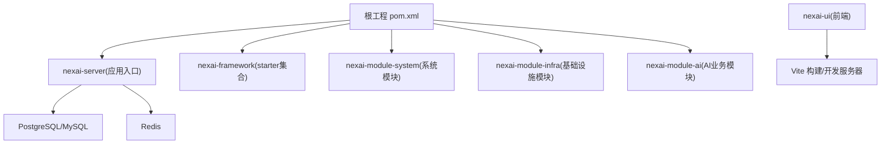
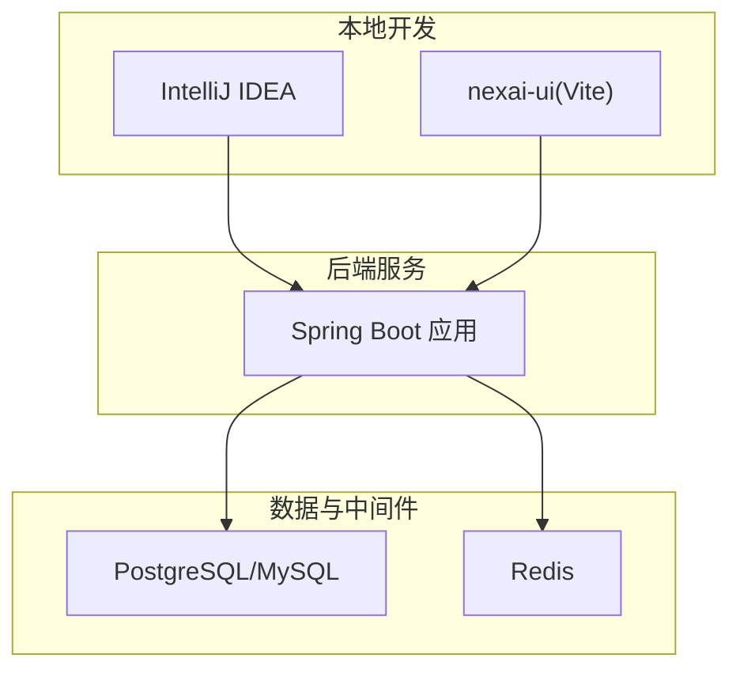
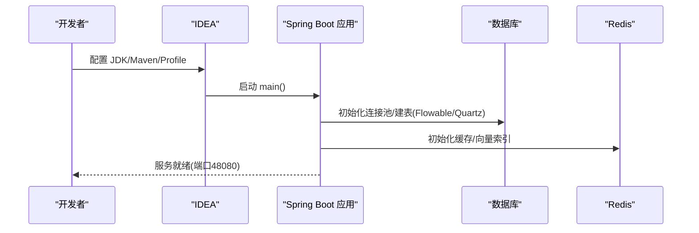
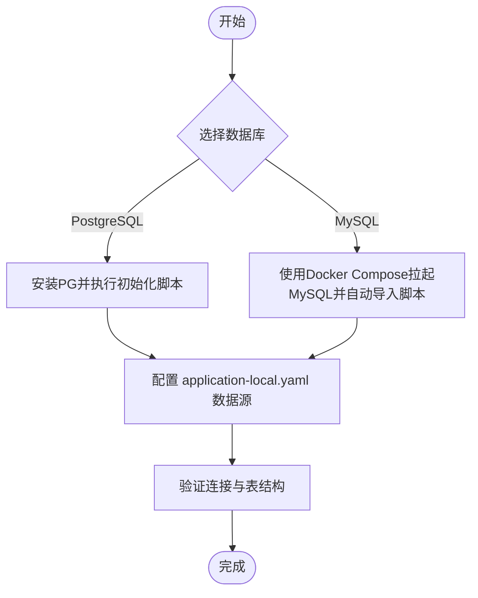
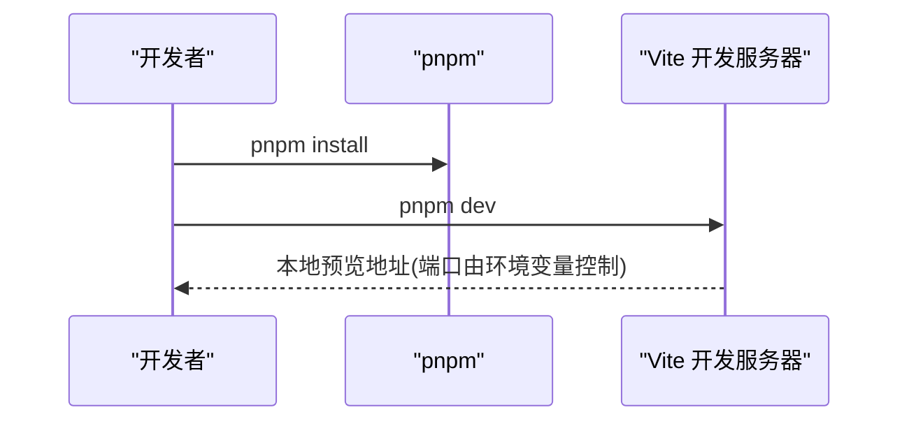
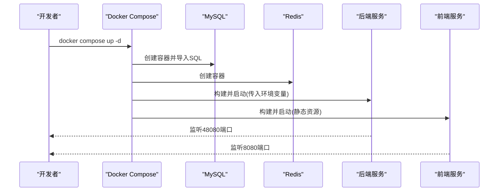
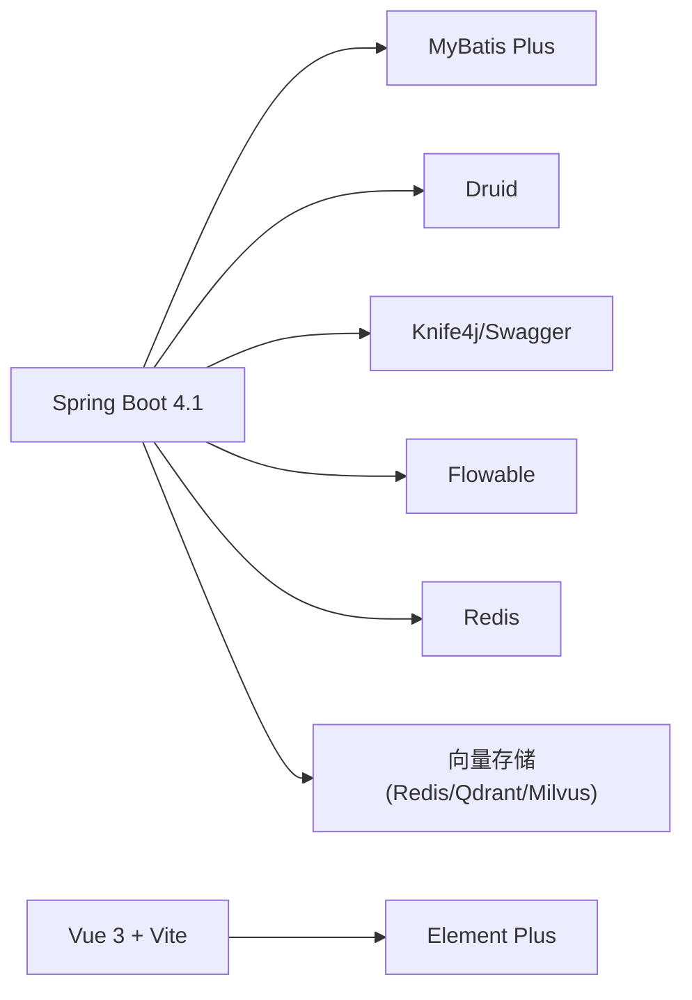

# 开发环境搭建

<cite>
**本文引用的文件**
- [pom.xml](file://pom.xml)
- [nexai-server/pom.xml](file://nexai-server/pom.xml)
- [application.yaml](file://nexai-server/src/main/resources/application.yaml)
- [application-local-example.yaml](file://nexai-server/src/main/resources/application-local-example.yaml)
- [package.json](file://nexai-ui/package.json)
- [vite.config.ts](file://nexai-ui/vite.config.ts)
- [docker-compose.yml](file://script/docker/docker-compose.yml)
- [docker.env](file://script/docker/docker.env)
- [lombok.config](file://lombok.config)
- [http-client.env.json](file://script/idea/http-client.env.json)
</cite>

## 目录
1. [简介](#简介)
2. [项目结构](#项目结构)
3. [核心组件](#核心组件)
4. [架构总览](#架构总览)
5. [详细组件分析](#详细组件分析)
6. [依赖分析](#依赖分析)
7. [性能考虑](#性能考虑)
8. [故障排查指南](#故障排查指南)
9. [结论](#结论)
10. [附录](#附录)

## 简介
本指南面向首次参与 NexAI 平台开发的工程师，目标是帮助你在本地快速搭建可运行的开发环境。内容覆盖：
- JDK、Maven、Node.js、pnpm 等工具的安装与版本要求
- IntelliJ IDEA 插件、代码格式化、Lombok 支持配置
- 数据库初始化（PostgreSQL/MySQL）
- 前端环境搭建与开发服务器启动
- Docker 一键拉起后端、数据库、缓存与前端镜像
- 常见问题定位与解决

## 项目结构
NexAI 采用多模块 Maven 工程 + Vue 3 前端分离的架构：
- 后端主入口位于 nexai-server，聚合 system、infra、ai 等业务模块
- 框架能力以 starter 形式提供在 nexai-framework
- 前端位于 nexai-ui，使用 Vite 构建，默认通过 pnpm 管理依赖
- 脚本与容器编排位于 script/docker

图表来源
- [pom.xml:10-32](file://pom.xml#L10-L32)
- [nexai-server/pom.xml:23-112](file://nexai-server/pom.xml#L23-L112)

章节来源
- [pom.xml:10-32](file://pom.xml#L10-L32)
- [nexai-server/pom.xml:23-112](file://nexai-server/pom.xml#L23-L112)

## 核心组件
- 后端运行栈
  - Spring Boot 4.1 与 Java 25 编译目标
  - MyBatis Plus + Druid 连接池
  - Redis 缓存与向量存储（可选 Qdrant/Milvus）
  - Knife4j/Swagger 文档
  - Flowable 工作流（可选）
- 前端运行栈
  - Vue 3 + TypeScript + Vite
  - Element Plus UI
  - pnpm 包管理器

章节来源
- [pom.xml:38-52](file://pom.xml#L38-L52)
- [application.yaml:28-78](file://nexai-server/src/main/resources/application.yaml#L28-L78)
- [package.json:151-154](file://nexai-ui/package.json#L151-L154)

## 架构总览
下图展示了本地开发时各组件的交互关系：IDEA 启动后端服务，访问 PostgreSQL/MySQL 与 Redis；前端通过 Vite 启动开发服务器并调用后端 API；Docker Compose 可将所有依赖容器化。

图表来源
- [application.yaml:28-78](file://nexai-server/src/main/resources/application.yaml#L28-L78)
- [application-local-example.yaml:29-83](file://nexai-server/src/main/resources/application-local-example.yaml#L29-L83)

## 详细组件分析

### 后端环境与启动
- 运行时与构建
  - Java 版本：25
  - Maven：建议使用 3.9+（兼容注解处理器与 Surefire 3.x）
  - 构建插件：maven-compiler-plugin、maven-surefire-plugin、flatten-maven-plugin
- 应用配置
  - 默认激活 profile：local
  - 端口：48080（可通过 local 配置覆盖）
  - 文档：/swagger-ui
  - 缓存：Redis
  - 数据库驱动：PostgreSQL（默认），亦支持 MySQL
- 本地配置文件
  - 复制 application-local-example.yaml 为 application-local.yaml，填写数据库与 Redis 连接信息
  - 如需启用 Quartz 定时任务，参考 local 示例中的 quartz 配置

图表来源
- [application.yaml:1-10](file://nexai-server/src/main/resources/application.yaml#L1-L10)
- [application-local-example.yaml:5-83](file://nexai-server/src/main/resources/application-local-example.yaml#L5-L83)

章节来源
- [pom.xml:38-52](file://pom.xml#L38-L52)
- [application.yaml:1-10](file://nexai-server/src/main/resources/application.yaml#L1-L10)
- [application-local-example.yaml:5-83](file://nexai-server/src/main/resources/application-local-example.yaml#L5-L83)

### 数据库环境准备
- 推荐数据库
  - PostgreSQL：默认使用，需执行对应 SQL 初始化脚本
  - MySQL：可在 Docker Compose 中一键拉起，并自动导入脚本
- 初始化脚本位置
  - PostgreSQL：sql/postgresql/quartz.sql（以及项目内其他初始化脚本）
  - MySQL：sql/mysql/quartz.sql（Docker Compose 挂载到 /docker-entrypoint-initdb.d）
- 本地配置要点
  - 在 application-local.yaml 中设置 master/slave 数据源地址、用户名、密码
  - Flowable 默认开启数据库更新策略，可按需关闭并手动维护表结构

图表来源
- [application-local-example.yaml:29-75](file://nexai-server/src/main/resources/application-local-example.yaml#L29-L75)
- [docker-compose.yml:6-18](file://script/docker/docker-compose.yml#L6-L18)

章节来源
- [application-local-example.yaml:29-75](file://nexai-server/src/main/resources/application-local-example.yaml#L29-L75)
- [docker-compose.yml:6-18](file://script/docker/docker-compose.yml#L6-L18)

### 前端环境搭建
- 工具链
  - Node.js：>= 20.19.0
  - pnpm：>= 8.6.0
- 安装与启动
  - 进入 nexai-ui 目录
  - 安装依赖：pnpm install
  - 启动开发服务器：pnpm dev（读取 .env.local 或 env.local 模式）
  - 构建产物输出目录由 Vite 配置决定
- 代理与跨域
  - 当前未启用 Vite 代理，建议直接让后端处理跨域或在浏览器端允许跨域

图表来源
- [package.json:7-16](file://nexai-ui/package.json#L7-L16)
- [vite.config.ts:21-47](file://nexai-ui/vite.config.ts#L21-L47)

章节来源
- [package.json:151-154](file://nexai-ui/package.json#L151-L154)
- [package.json:7-16](file://nexai-ui/package.json#L7-L16)
- [vite.config.ts:21-47](file://nexai-ui/vite.config.ts#L21-L47)

### 常见环境问题与解决方案
- 编译阶段
  - Lombok 注解不生效：确保 IDEA 已启用注解处理，并在项目中启用 Lombok 插件；检查 lombok.config 是否被正确加载
  - MapStruct 与 Lombok 冲突：确认 maven-compiler-plugin 的 annotationProcessorPaths 顺序正确（已在根 POM 配置）
- 运行阶段
  - 数据库连接失败：核对 application-local.yaml 中的 URL、用户名、密码；确认数据库服务已启动且网络可达
  - Redis 连接失败：检查 host/port/password；若使用 Docker Compose，注意服务名解析
  - Swagger/Knife4j 无法访问：确认 springdoc/knife4j 已启用且未被安全策略拦截
- 前端问题
  - 依赖安装失败：切换 pnpm 镜像源或使用国内镜像；清理 node_modules 后重试
  - 开发服务器端口占用：修改环境变量或 vite.config.ts 中的端口配置

章节来源
- [lombok.config:1-5](file://lombok.config#L1-L5)
- [pom.xml:76-113](file://pom.xml#L76-L113)
- [application-local-example.yaml:29-83](file://nexai-server/src/main/resources/application-local-example.yaml#L29-L83)
- [application.yaml:28-78](file://nexai-server/src/main/resources/application.yaml#L28-L78)

### Docker 快速启动
- 使用 Docker Compose 一键拉起 MySQL、Redis、后端服务与前端静态资源
- 环境变量
  - 数据库凭据与服务地址通过 docker.env 注入
  - 后端 JVM 参数通过 JAVA_OPTS 注入
- 启动步骤
  - 进入 script/docker 目录
  - 执行 docker compose up -d
  - 访问后端接口与前端页面

图表来源
- [docker-compose.yml:5-84](file://script/docker/docker-compose.yml#L5-L84)
- [docker.env:1-26](file://script/docker/docker.env#L1-L26)

章节来源
- [docker-compose.yml:5-84](file://script/docker/docker-compose.yml#L5-L84)
- [docker.env:1-26](file://script/docker/docker.env#L1-L26)

## 依赖分析
- 后端依赖
  - Spring Boot 4.1 与相关生态
  - MyBatis Plus、Druid、Knife4j、Flowable
  - Redis 与多种向量存储（Redis/Qdrant/Milvus）
  - 数据库驱动：PostgreSQL（默认），亦支持 MySQL
- 前端依赖
  - Vue 3、TypeScript、Vite、Element Plus
  - 构建优化：分包、压缩、SourceMap 可控

图表来源
- [pom.xml:38-52](file://pom.xml#L38-L52)
- [application.yaml:28-78](file://nexai-server/src/main/resources/application.yaml#L28-L78)
- [package.json:31-139](file://nexai-ui/package.json#L31-L139)

章节来源
- [pom.xml:38-52](file://pom.xml#L38-L52)
- [application.yaml:28-78](file://nexai-server/src/main/resources/application.yaml#L28-L78)
- [package.json:31-139](file://nexai-ui/package.json#L31-L139)

## 性能考虑
- 数据库连接池
  - 调整 Druid 初始/最小/最大连接数与超时时间，避免连接耗尽
- 缓存
  - 合理设置 Redis 过期时间与容量，减少热点数据压力
- 构建与打包
  - 前端按需分包（如 echarts/form-create），减少首屏体积
  - 生产构建关闭 SourceMap，提升打包速度
- 日志
  - 本地调试适当提高 Mapper 日志级别，生产降低日志量

[本节为通用指导，无需特定文件引用]

## 故障排查指南
- 启动失败
  - 检查 JDK 版本是否为 25，Maven 版本是否满足要求
  - 检查 application-local.yaml 是否正确覆盖默认配置
- 数据库问题
  - 确认数据库服务状态、账号权限、时区设置
  - Flowable/Quartz 表缺失时，检查自动建表开关或手动执行脚本
- Redis 问题
  - 校验 host/port/password，必要时在 Docker Compose 中暴露端口便于调试
- 前端问题
  - 清理缓存与依赖后重装
  - 检查环境变量与 Vite 端口配置
- 接口测试
  - 使用 script/idea/http-client.env.json 配置本地/网关环境，便于接口联调

章节来源
- [application-local-example.yaml:29-83](file://nexai-server/src/main/resources/application-local-example.yaml#L29-L83)
- [http-client.env.json:1-21](file://script/idea/http-client.env.json#L1-L21)

## 结论
按照本指南完成 JDK、Maven、Node.js、pnpm 安装与 IDEA 配置后，即可通过本地或 Docker 方式快速启动 NexAI 平台。建议在本地优先使用 PostgreSQL 进行开发，配合 Redis 缓存；在需要快速体验时可使用 Docker Compose 一键拉起全部依赖。遇到问题时，优先检查配置文件与依赖服务连通性。

## 附录

### 工具与版本要求清单
- JDK：25
- Maven：3.9+
- Node.js：>= 20.19.0
- pnpm：>= 8.6.0
- 数据库：PostgreSQL（默认）、MySQL（可选）
- 缓存：Redis

章节来源
- [pom.xml:38-52](file://pom.xml#L38-L52)
- [package.json:151-154](file://nexai-ui/package.json#L151-L154)

### IDEA 配置要点
- 启用注解处理与 Lombok 插件
- 配置 JDK 25 与 Maven 3.9+
- 运行配置中指定 active profile 为 local
- 如需 HTTP 客户端测试，可导入 http-client.env.json 的环境变量

章节来源
- [lombok.config:1-5](file://lombok.config#L1-L5)
- [http-client.env.json:1-21](file://script/idea/http-client.env.json#L1-L21)

### 数据库初始化脚本路径
- PostgreSQL：sql/postgresql/quartz.sql
- MySQL：sql/mysql/quartz.sql（Docker Compose 自动导入）

章节来源
- [docker-compose.yml:6-18](file://script/docker/docker-compose.yml#L6-L18)