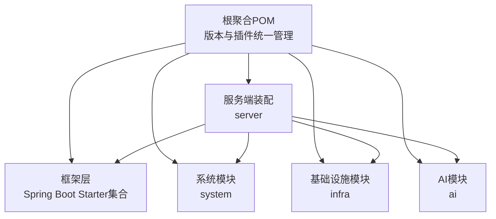
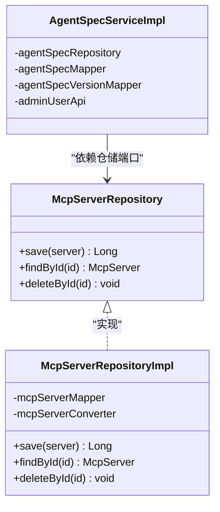
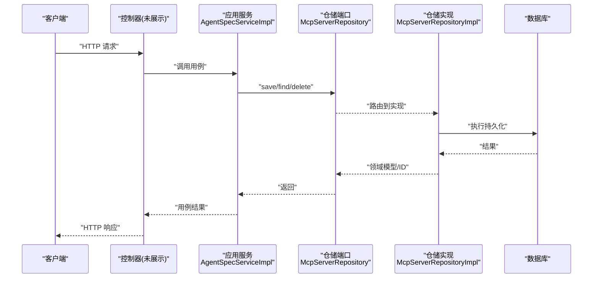
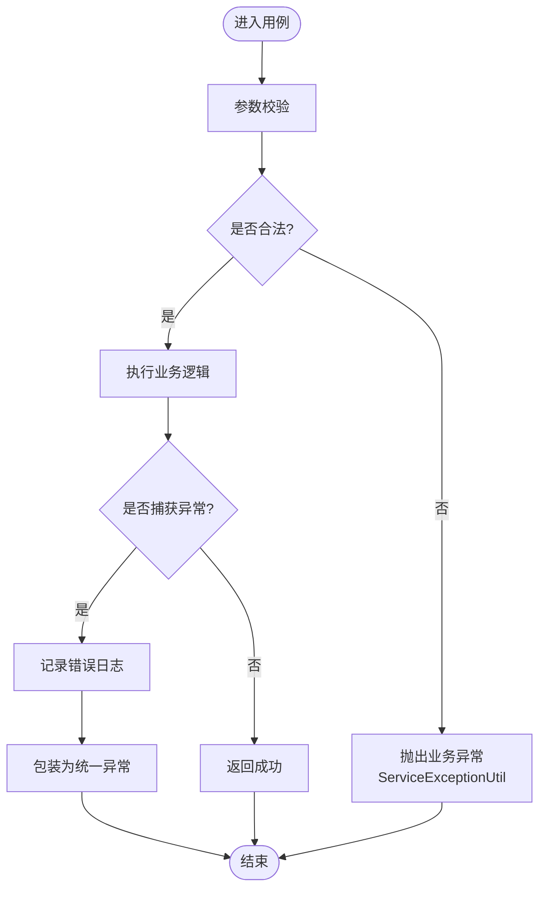
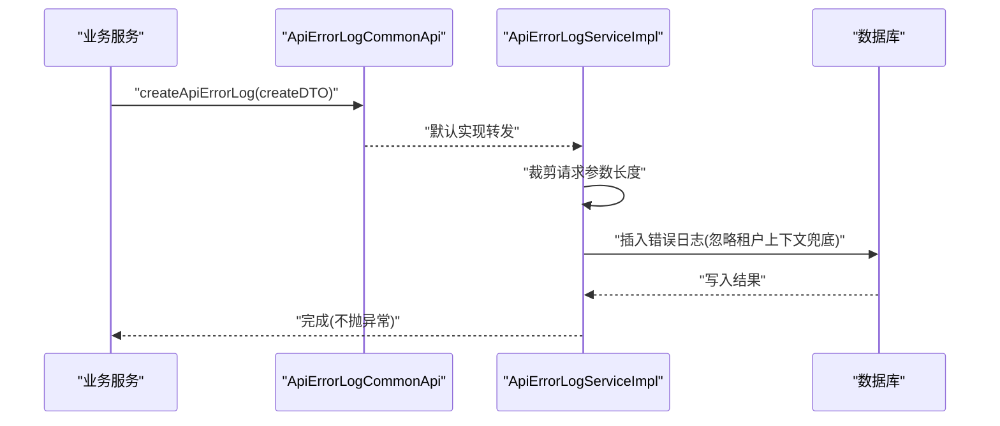
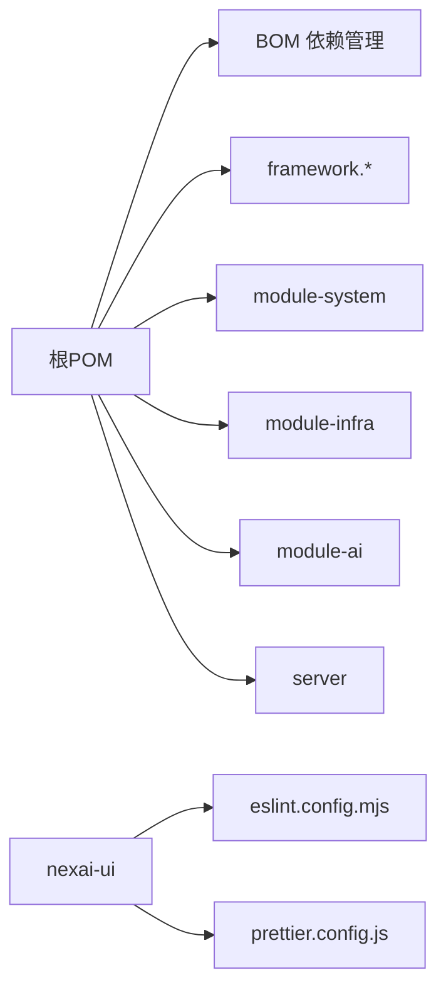

# 编码规范

<cite>
**本文引用的文件**
- [README.md](file://README.md)
- [pom.xml](file://pom.xml)
- [nexai-framework/nexai-common/src/main/java/com/gkht/ai/nexai/framework/common/package-info.java](file://nexai-framework/nexai-common/src/main/java/com/gkht/ai/nexai/framework/common/package-info.java)
- [nexai-module-infra/src/main/java/com/gkht/ai/nexai/module/infra/package-info.java](file://nexai-module-infra/src/main/java/com/gkht/ai/nexai/module/infra/package-info.java)
- [nexai-module-ai/src/main/java/com/gkht/ai/nexai/module/ai/mcpserver/interfaces/package-info.java](file://nexai-module-ai/src/main/java/com/gkht/ai/nexai/module/ai/mcpserver/interfaces/package-info.java)
- [nexai-module-ai/src/main/java/com/gkht/ai/nexai/module/ai/mcpserver/domain/repository/McpServerRepository.java](file://nexai-module-ai/src/main/java/com/gkht/ai/nexai/module/ai/mcpserver/domain/repository/McpServerRepository.java)
- [nexai-module-ai/src/main/java/com/gkht/ai/nexai/module/ai/mcpserver/infrastructure/repository/McpServerRepositoryImpl.java](file://nexai-module-ai/src/main/java/com/gkht/ai/nexai/module/ai/mcpserver/infrastructure/repository/McpServerRepositoryImpl.java)
- [nexai-module-ai/src/main/java/com/gkht/ai/nexai/module/ai/agentspec/application/service/AgentSpecServiceImpl.java](file://nexai-module-ai/src/main/java/com/gkht/ai/nexai/module/ai/agentspec/application/service/AgentSpecServiceImpl.java)
- [nexai-framework/nexai-common/src/main/java/com/gkht/ai/nexai/framework/common/exception/ErrorCode.java](file://nexai-framework/nexai-common/src/main/java/com/gkht/ai/nexai/framework/common/exception/ErrorCode.java)
- [nexai-framework/nexai-common/src/main/java/com/gkht/ai/nexai/framework/common/exception/util/ServiceExceptionUtil.java](file://nexai-framework/nexai-common/src/main/java/com/gkht/ai/nexai/framework/common/exception/util/ServiceExceptionUtil.java)
- [nexai-framework/nexai-common/src/main/java/com/gkht/ai/nexai/framework/common/biz/infra/logger/ApiErrorLogCommonApi.java](file://nexai-framework/nexai-common/src/main/java/com/gkht/ai/nexai/framework/common/biz/infra/logger/ApiErrorLogCommonApi.java)
- [nexai-module-infra/src/main/java/com/gkht/ai/nexai/module/infra/service/logger/ApiErrorLogService.java](file://nexai-module-infra/src/main/java/com/gkht/ai/nexai/module/infra/service/logger/ApiErrorLogService.java)
- [nexai-module-infra/src/main/java/com/gkht/ai/nexai/module/infra/service/logger/ApiErrorLogServiceImpl.java](file://nexai-module-infra/src/main/java/com/gkht/ai/nexai/module/infra/service/logger/ApiErrorLogServiceImpl.java)
- [nexai-server/src/main/resources/logback-spring.xml](file://nexai-server/src/main/resources/logback-spring.xml)
- [nexai-ui/eslint.config.mjs](file://nexai-ui/eslint.config.mjs)
- [nexai-ui/prettier.config.js](file://nexai-ui/prettier.config.js)
- [nexai-ui/src/components/DiyEditor/components/mobile/index.ts](file://nexai-ui/src/components/DiyEditor/components/mobile/index.ts)
</cite>

## 目录
1. [简介](#简介)
2. [项目结构](#项目结构)
3. [核心组件](#核心组件)
4. [架构总览](#架构总览)
5. [详细组件分析](#详细组件分析)
6. [依赖关系分析](#依赖关系分析)
7. [性能考量](#性能考量)
8. [故障排查指南](#故障排查指南)
9. [结论](#结论)
10. [附录](#附录)

## 简介
本规范面向 NexAI 平台（Java 后端 + Vue 3 + TypeScript 前端），统一包命名、类设计、接口设计、代码风格与质量工具使用，覆盖异常处理、日志记录、前端组件与状态管理、API 调用等实践，并提供重构建议、性能优化技巧与常见反模式规避方法。

## 项目结构
NexAI 采用多模块 Maven 工程：
- 根聚合 POM 定义模块与统一版本管理
- nexai-framework：自研 Spring Boot Starter 集合（通用能力）
- nexai-module-system / nexai-module-infra / nexai-module-ai：业务与领域模块
- nexai-server：装配启动应用
- nexai-ui：Vue 3 + TypeScript 管理后台

**图表来源**
- [pom.xml:10-32](file://pom.xml#L10-L32)

**章节来源**
- [pom.xml:1-166](file://pom.xml#L1-L166)
- [README.md:76-90](file://README.md#L76-L90)

## 核心组件
- 错误码与异常体系：统一 ErrorCode、ServiceException、ServerException，配合 ServiceExceptionUtil 构造异常信息
- API 错误日志：通过 ApiErrorLogCommonApi 异步创建，Service 层落库并做租户上下文兜底
- 日志框架：logback-spring.xml 配置控制台与滚动文件输出，异步 Appender 提升吞吐
- 前端质量工具：ESLint 基于 tseslint + vue-eslint-parser + unocss；Prettier 统一格式化

**章节来源**
- [ErrorCode.java:1-32](file://nexai-framework/nexai-common/src/main/java/com/gkht/ai/nexai/framework/common/exception/ErrorCode.java#L1-L32)
- [ServiceExceptionUtil.java:1-36](file://nexai-framework/nexai-common/src/main/java/com/gkht/ai/nexai/framework/common/exception/util/ServiceExceptionUtil.java#L1-L36)
- [ApiErrorLogCommonApi.java:1-32](file://nexai-framework/nexai-common/src/main/java/com/gkht/ai/nexai/framework/common/biz/infra/logger/ApiErrorLogCommonApi.java#L1-L32)
- [ApiErrorLogService.java:1-55](file://nexai-module-infra/src/main/java/com/gkht/ai/nexai/module/infra/service/logger/ApiErrorLogService.java#L1-L55)
- [ApiErrorLogServiceImpl.java:25-59](file://nexai-module-infra/src/main/java/com/gkht/ai/nexai/module/infra/service/logger/ApiErrorLogServiceImpl.java#L25-L59)
- [logback-spring.xml:1-57](file://nexai-server/src/main/resources/logback-spring.xml#L1-L57)
- [eslint.config.mjs:1-118](file://nexai-ui/eslint.config.mjs#L1-L118)
- [prettier.config.js:1-23](file://nexai-ui/prettier.config.js#L1-L23)

## 架构总览
后端遵循分层与领域驱动思想：interfaces（控制器）→ application（应用服务）→ domain（领域模型/仓储端口）→ infrastructure（仓储实现/数据访问）。以 MCP Server 为例展示 Repository 抽象与实现解耦。

**图表来源**
- [McpServerRepository.java:1-29](file://nexai-module-ai/src/main/java/com/gkht/ai/nexai/module/ai/mcpserver/domain/repository/McpServerRepository.java#L1-L29)
- [McpServerRepositoryImpl.java:1-24](file://nexai-module-ai/src/main/java/com/gkht/ai/nexai/module/ai/mcpserver/infrastructure/repository/McpServerRepositoryImpl.java#L1-L24)
- [AgentSpecServiceImpl.java:58-85](file://nexai-module-ai/src/main/java/com/gkht/ai/nexai/module/ai/agentspec/application/service/AgentSpecServiceImpl.java#L58-L85)

**章节来源**
- [McpServerRepository.java:1-29](file://nexai-module-ai/src/main/java/com/gkht/ai/nexai/module/ai/mcpserver/domain/repository/McpServerRepository.java#L1-L29)
- [McpServerRepositoryImpl.java:1-24](file://nexai-module-ai/src/main/java/com/gkht/ai/nexai/module/ai/mcpserver/infrastructure/repository/McpServerRepositoryImpl.java#L1-L24)
- [AgentSpecServiceImpl.java:58-85](file://nexai-module-ai/src/main/java/com/gkht/ai/nexai/module/ai/agentspec/application/service/AgentSpecServiceImpl.java#L58-L85)

## 详细组件分析

### 包命名约定
- 基础包名：com.gkht.ai.nexai
- 框架公共包：framework.common（与框架无关的通用类）
- 模块边界：module.system / module.infra / module.ai
- infra 模块约定：Controller URL 以 /infra/ 开头；DataObject 表名前缀 infra_
- AI 模块入口层：interfaces 包须包含 controller/admin 或 controller/app 以挂载到 /admin-api 或 /app-api

**章节来源**
- [package-info.java:1-7](file://nexai-framework/nexai-common/src/main/java/com/gkht/ai/nexai/framework/common/package-info.java#L1-L7)
- [package-info.java:1-9](file://nexai-module-infra/src/main/java/com/gkht/ai/nexai/module/infra/package-info.java#L1-L9)
- [package-info.java:1-4](file://nexai-module-ai/src/main/java/com/gkht/ai/nexai/module/ai/mcpserver/interfaces/package-info.java#L1-L4)

### 类设计与接口设计规范
- 分层职责清晰：interfaces 仅负责请求解析与响应封装；application 编排用例；domain 承载领域规则；infrastructure 实现持久化与外部适配
- 仓储端口化：领域通过 Repository 接口与具体实现解耦，便于替换与测试
- 应用服务组合：AgentSpecServiceImpl 组合仓储、Mapper、转换器与跨模块 API，体现用例编排职责

**图表来源**
- [AgentSpecServiceImpl.java:58-85](file://nexai-module-ai/src/main/java/com/gkht/ai/nexai/module/ai/agentspec/application/service/AgentSpecServiceImpl.java#L58-L85)
- [McpServerRepository.java:1-29](file://nexai-module-ai/src/main/java/com/gkht/ai/nexai/module/ai/mcpserver/domain/repository/McpServerRepository.java#L1-L29)
- [McpServerRepositoryImpl.java:1-24](file://nexai-module-ai/src/main/java/com/gkht/ai/nexai/module/ai/mcpserver/infrastructure/repository/McpServerRepositoryImpl.java#L1-L24)

**章节来源**
- [AgentSpecServiceImpl.java:58-85](file://nexai-module-ai/src/main/java/com/gkht/ai/nexai/module/ai/agentspec/application/service/AgentSpecServiceImpl.java#L58-L85)
- [McpServerRepository.java:1-29](file://nexai-module-ai/src/main/java/com/gkht/ai/nexai/module/ai/mcpserver/domain/repository/McpServerRepository.java#L1-L29)
- [McpServerRepositoryImpl.java:1-24](file://nexai-module-ai/src/main/java/com/gkht/ai/nexai/module/ai/mcpserver/infrastructure/repository/McpServerRepositoryImpl.java#L1-L24)

### Java 代码风格与注释标准
- 统一使用 Lombok 注解减少样板代码
- 类与方法需具备清晰的 Javadoc 说明，字段注释明确语义
- 参数校验优先使用 Bean Validation 注解，结合全局错误码
- 常量集中管理，避免魔法值

**章节来源**
- [ErrorCode.java:1-32](file://nexai-framework/nexai-common/src/main/java/com/gkht/ai/nexai/framework/common/exception/ErrorCode.java#L1-L32)
- [ServiceExceptionUtil.java:1-36](file://nexai-framework/nexai-common/src/main/java/com/gkht/ai/nexai/framework/common/exception/util/ServiceExceptionUtil.java#L1-L36)

### 异常处理规范
- 业务异常：通过 ServiceExceptionUtil.exception(ErrorCode, params) 构造，统一错误码与消息
- 服务器异常：ServerException 用于非业务侧的系统级异常
- 异常链与根因提取：在网关/探测场景下，提取根因消息并截断长度，避免过长响应体影响性能

**图表来源**
- [ServiceExceptionUtil.java:1-36](file://nexai-framework/nexai-common/src/main/java/com/gkht/ai/nexai/framework/common/exception/util/ServiceExceptionUtil.java#L1-L36)

**章节来源**
- [ServiceExceptionUtil.java:1-36](file://nexai-framework/nexai-common/src/main/java/com/gkht/ai/nexai/framework/common/exception/util/ServiceExceptionUtil.java#L1-L36)
- [ErrorCode.java:1-32](file://nexai-framework/nexai-common/src/main/java/com/gkht/ai/nexai/framework/common/exception/ErrorCode.java#L1-L32)

### 日志记录规范
- 使用 @Slf4j 注入日志器，关键路径打点，敏感信息脱敏
- 统一日志格式：时间、线程、级别、类名、行号、消息
- 异步写入：AsyncAppender 队列满时丢弃低优先级日志，避免阻塞业务线程
- 错误日志持久化：ApiErrorLogCommonApi 提供异步接口，Service 层落库并做租户上下文兜底

**图表来源**
- [ApiErrorLogCommonApi.java:1-32](file://nexai-framework/nexai-common/src/main/java/com/gkht/ai/nexai/framework/common/biz/infra/logger/ApiErrorLogCommonApi.java#L1-L32)
- [ApiErrorLogServiceImpl.java:25-59](file://nexai-module-infra/src/main/java/com/gkht/ai/nexai/module/infra/service/logger/ApiErrorLogServiceImpl.java#L25-L59)

**章节来源**
- [logback-spring.xml:1-57](file://nexai-server/src/main/resources/logback-spring.xml#L1-L57)
- [ApiErrorLogCommonApi.java:1-32](file://nexai-framework/nexai-common/src/main/java/com/gkht/ai/nexai/framework/common/biz/infra/logger/ApiErrorLogCommonApi.java#L1-L32)
- [ApiErrorLogServiceImpl.java:25-59](file://nexai-module-infra/src/main/java/com/gkht/ai/nexai/module/infra/service/logger/ApiErrorLogServiceImpl.java#L25-L59)

### 前端 Vue 3 + TypeScript 编码规范
- 组件组织：每个子目录为一个独立组件，包含 config.ts（属性配置）、index.vue（渲染视图）、property.vue（属性表单）
- ESLint：启用 TypeScript 推荐规则与 Vue 推荐规则，关闭与 Prettier 冲突的规则，保持 HTML 缩进由 Prettier 处理
- Prettier：单引号、无分号、箭头函数括号始终保留、行宽 100、对象字面量空格等统一风格
- 类型与 Prop：使用 vue-types 扩展 propTypes，增强样式类型支持

**章节来源**
- [index.ts:1-45](file://nexai-ui/src/components/DiyEditor/components/mobile/index.ts#L1-L45)
- [eslint.config.mjs:1-118](file://nexai-ui/eslint.config.mjs#L1-L118)
- [prettier.config.js:1-23](file://nexai-ui/prettier.config.js#L1-L23)
- [propTypes.ts:1-24](file://nexai-ui/src/utils/propTypes.ts#L1-L24)

### 状态管理与 API 调用
- 状态管理：按模块划分 store/modules，单一数据源，避免分散状态
- API 调用：统一封装 axios 拦截器与错误码映射，集中处理鉴权与重试策略
- 组件通信：优先使用 props/emits，复杂场景使用 provide/inject 或事件总线

[本节为概念性指导，无需源码引用]

### 代码质量检查工具
- Checkstyle：建议在 CI 中集成，统一 Java 风格（缩进、命名、注释）
- Prettier：统一 JS/TS/Vue 格式化，提交前自动修复
- ESLint：TypeScript + Vue 规则集，关闭与 Prettier 冲突项，聚焦可维护性与安全性
- 提交钩子：使用 lint-staged 对暂存文件进行快速检查

**章节来源**
- [eslint.config.mjs:1-118](file://nexai-ui/eslint.config.mjs#L1-L118)
- [prettier.config.js:1-23](file://nexai-ui/prettier.config.js#L1-L23)

### 重构建议
- 领域建模：将跨模块共享逻辑下沉至 framework.common，减少重复
- 仓储抽象：继续推广 Repository 端口化，屏蔽底层存储差异
- 配置外置：将硬编码阈值（如日志队列大小、参数长度上限）迁移至配置文件
- 模块化拆分：大模块按功能域拆分子模块，降低耦合度

[本节为概念性指导，无需源码引用]

### 性能优化技巧
- 日志异步化：使用 AsyncAppender，队列满时丢弃低优先级日志，避免阻塞
- 数据库访问：列表查询走轻量读写分离，写操作经 Repository 聚合重建
- 缓存与限流：利用 Redis 实现热点数据缓存与接口限流
- 前端资源：按需加载组件，减少首屏体积

**章节来源**
- [logback-spring.xml:1-57](file://nexai-server/src/main/resources/logback-spring.xml#L1-L57)
- [AgentSpecServiceImpl.java:58-85](file://nexai-module-ai/src/main/java/com/gkht/ai/nexai/module/ai/agentspec/application/service/AgentSpecServiceImpl.java#L58-L85)

### 常见反模式与避免方法
- 反模式：在 Service 中直接操作数据库绕过领域规则
  - 避免：通过 Repository 端口与领域模型约束一致性
- 反模式：异常吞掉导致问题不可见
  - 避免：统一异常体系，关键路径记录日志并向上抛出
- 反模式：前后端格式不一致导致联调成本上升
  - 避免：统一 ESLint/Prettier 规则，CI 强制检查
- 反模式：日志风暴拖垮服务
  - 避免：异步日志、控制日志级别、限制高频日志

[本节为概念性指导，无需源码引用]

## 依赖关系分析
- 根 POM 通过 dependencyManagement 引入 BOM，统一版本
- 各模块依赖 framework.common 与 starter 集合，形成稳定基座
- 前端依赖 ESLint、Prettier、Vue 生态工具链

**图表来源**
- [pom.xml:54-64](file://pom.xml#L54-L64)
- [eslint.config.mjs:1-118](file://nexai-ui/eslint.config.mjs#L1-L118)
- [prettier.config.js:1-23](file://nexai-ui/prettier.config.js#L1-L23)

**章节来源**
- [pom.xml:1-166](file://pom.xml#L1-L166)

## 性能考量
- 日志：异步写入、合理队列大小、丢弃阈值配置
- 数据库：读写分离、索引优化、分页查询
- 缓存：热点数据缓存、过期策略
- 前端：组件懒加载、静态资源压缩

[本节为概念性指导，无需源码引用]

## 故障排查指南
- 定位异常：查看 ApiErrorLog 记录，关注请求参数与堆栈
- 日志分析：依据 logback 格式快速定位时间与线程
- 前端问题：通过 ESLint 提示与浏览器控制台错误快速定位
- 权限与租户：确认租户上下文是否正确设置，必要时忽略上下文兜底

**章节来源**
- [ApiErrorLogServiceImpl.java:25-59](file://nexai-module-infra/src/main/java/com/gkht/ai/nexai/module/infra/service/logger/ApiErrorLogServiceImpl.java#L25-L59)
- [logback-spring.xml:1-57](file://nexai-server/src/main/resources/logback-spring.xml#L1-L57)

## 结论
本规范明确了 NexAI 平台的包命名、分层设计、异常与日志体系、前端质量工具与代码风格，提供了重构与性能优化建议及常见反模式规避方法。遵循本规范有助于提升代码可维护性、一致性与交付质量。

## 附录
- 构建与运行命令参考 README
- 更多技术栈与版本信息参见 README

**章节来源**
- [README.md:126-142](file://README.md#L126-L142)