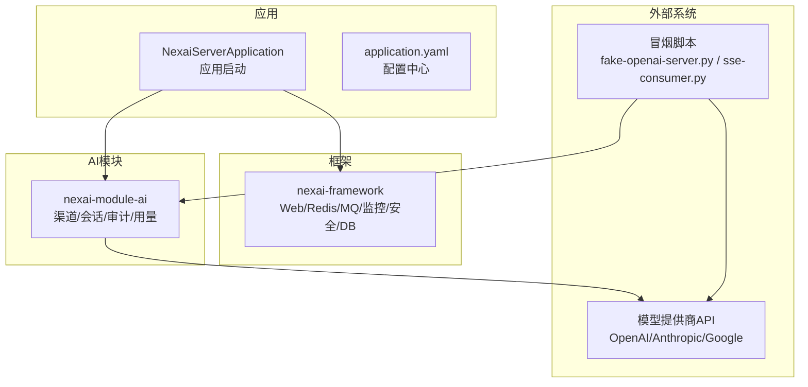
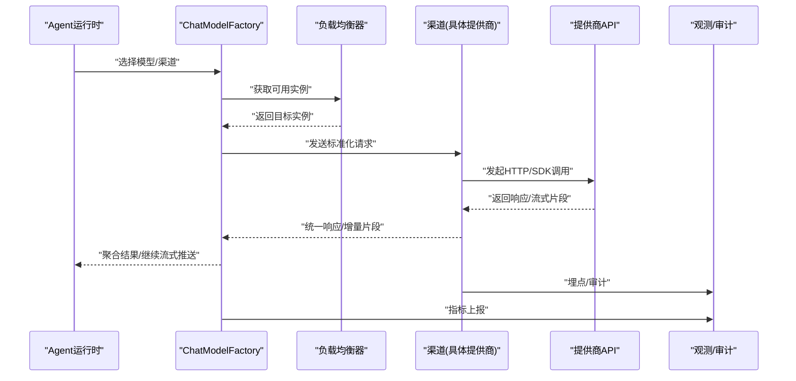
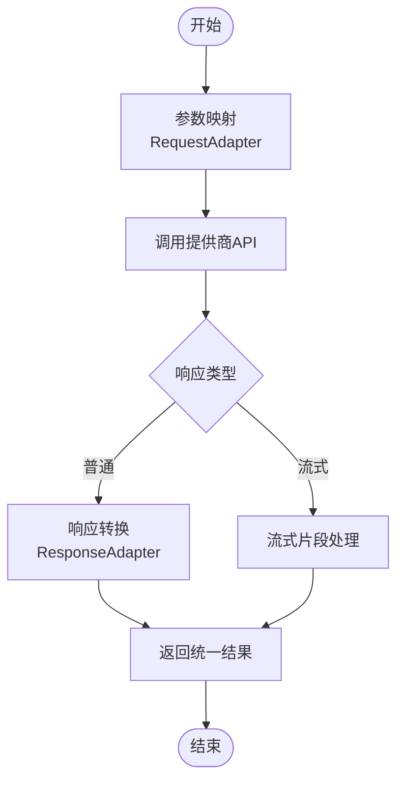
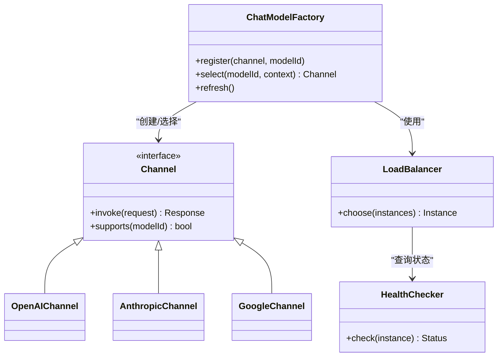
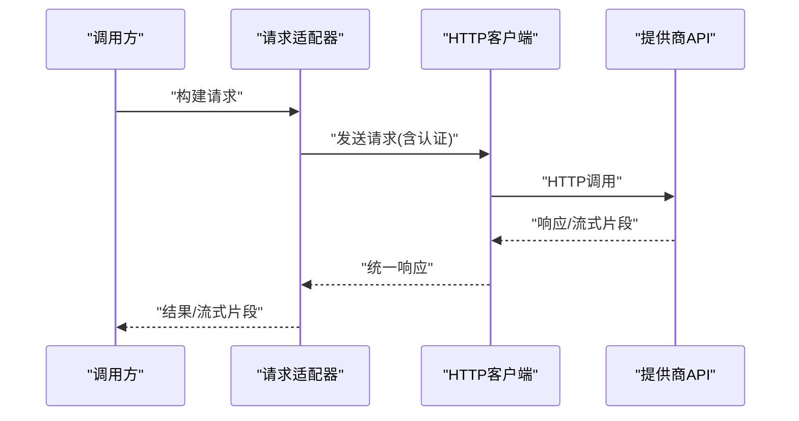
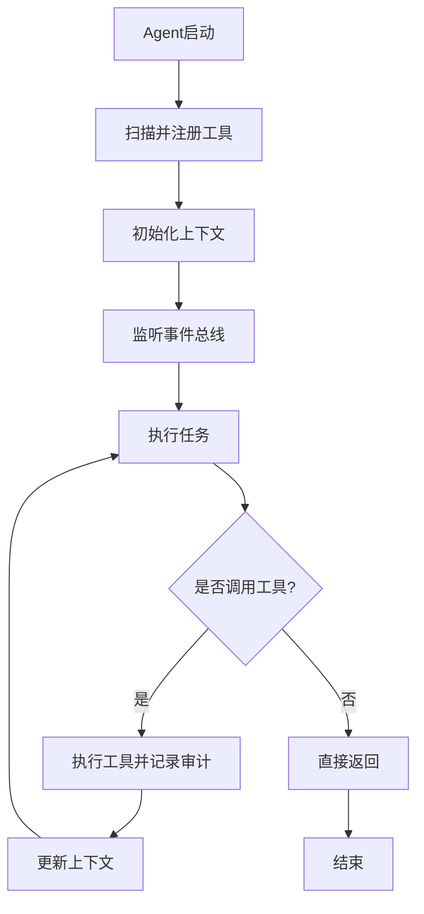
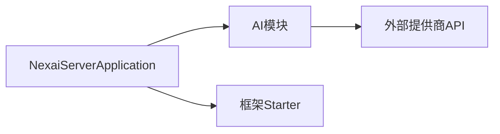

# AI能力扩展

<cite>
**本文引用的文件**
- [nexai-module-ai/pom.xml](file://nexai-module-ai/pom.xml)
- [nexai-framework/nexai-common/pom.xml](file://nexai-framework/nexai-common/pom.xml)
- [nexai-server/src/main/java/com/gkht/ai/nexai/server/NexaiServerApplication.java](file://nexai-server/src/main/java/com/gkht/ai/nexai/server/NexaiServerApplication.java)
- [nexai-server/src/main/resources/application.yaml](file://nexai-server/src/main/resources/application.yaml)
- [script/smoke/fake-openai-server.py](file://script/smoke/fake-openai-server.py)
- [script/smoke/sse-consumer.py](file://script/smoke/sse-consumer.py)
</cite>

## 目录
1. [简介](#简介)
2. [项目结构](#项目结构)
3. [核心组件](#核心组件)
4. [架构总览](#架构总览)
5. [详细组件分析](#详细组件分析)
6. [依赖关系分析](#依赖关系分析)
7. [性能考量](#性能考量)
8. [故障排查指南](#故障排查指南)
9. [结论](#结论)
10. [附录](#附录)

## 简介
本指南面向希望在NexAI平台中扩展AI能力的开发者，聚焦以下目标：
- 新增模型提供商支持（如OpenAI、Anthropic、Google等）的适配实现路径
- 渠道管理系统的扩展机制：工厂模式、负载均衡策略、健康检查
- 第三方AI服务集成：认证、请求封装、错误处理与重试
- 具体示例：参数映射、响应转换、流式输出处理
- Agent运行时扩展点：工具注册、事件监听、上下文管理
- 性能优化建议与常见故障排查方法

说明：当前仓库未包含具体的AI通道实现代码。本文基于模块结构与通用工程实践给出可落地的扩展方案，并标注了可在实际代码中对应的位置与参考文件。

## 项目结构
- nexai-module-ai：AI业务域模块，按领域分层组织（应用层、领域层、基础设施层、接口层），适合承载“渠道/模型适配”“会话/审计/用量”等能力
- nexai-framework：通用框架Starter（Web、Redis、MQ、监控、安全、MyBatis等），为AI模块提供基础能力
- nexai-server：应用启动入口与配置，负责装配各模块与外部依赖
- script/smoke：冒烟测试脚本，可用于验证SSE流式消费与模拟服务端行为

图表来源
- [nexai-server/src/main/java/com/gkht/ai/nexai/server/NexaiServerApplication.java](file://nexai-server/src/main/java/com/gkht/ai/nexai/server/NexaiServerApplication.java)
- [nexai-server/src/main/resources/application.yaml](file://nexai-server/src/main/resources/application.yaml)
- [nexai-module-ai/pom.xml](file://nexai-module-ai/pom.xml)
- [script/smoke/fake-openai-server.py](file://script/smoke/fake-openai-server.py)
- [script/smoke/sse-consumer.py](file://script/smoke/sse-consumer.py)

章节来源
- [nexai-module-ai/pom.xml](file://nexai-module-ai/pom.xml)
- [nexai-framework/nexai-common/pom.xml](file://nexai-framework/nexai-common/pom.xml)
- [nexai-server/src/main/java/com/gkht/ai/nexai/server/NexaiServerApplication.java](file://nexai-server/src/main/java/com/gkht/ai/nexai/server/NexaiServerApplication.java)
- [nexai-server/src/main/resources/application.yaml](file://nexai-server/src/main/resources/application.yaml)

## 核心组件
围绕“AI能力扩展”，建议抽象出以下核心组件与职责：
- 渠道抽象与工厂
  - Channel：统一抽象不同模型提供商的能力边界（文本生成、图像生成、函数调用、流式输出等）
  - ChatModelFactory：根据配置或路由策略创建具体Channel实例，支持多实例与负载均衡
- 请求与响应适配器
  - RequestAdapter：将平台内部消息格式转换为各提供商的API请求体
  - ResponseAdapter：将提供商响应解析为平台内部统一模型，支持增量片段（流式）
- 认证与安全
  - AuthProvider：统一管理密钥、签名、鉴权头注入（API Key、OAuth、签名校验等）
- 负载均衡与健康检查
  - LoadBalancer：轮询、加权、最少连接、区域亲和等策略
  - HealthChecker：周期性探测可用性与延迟，动态剔除异常节点
- 重试与熔断
  - RetryPolicy：指数退避、幂等键、最大重试次数
  - CircuitBreaker：失败率阈值触发熔断与降级
- 观测与审计
  - Tracing/Metrics：请求链路追踪、耗时、Token用量统计
  - Audit：关键操作留痕与合规审计

章节来源
- [nexai-module-ai/pom.xml](file://nexai-module-ai/pom.xml)
- [nexai-framework/nexai-common/pom.xml](file://nexai-framework/nexai-common/pom.xml)

## 架构总览
下图展示从上层Agent到下游模型提供商的整体数据流与扩展点：

图表来源
- [nexai-module-ai/pom.xml](file://nexai-module-ai/pom.xml)
- [nexai-framework/nexai-common/pom.xml](file://nexai-framework/nexai-common/pom.xml)

## 详细组件分析

### 新增模型提供商适配（以OpenAI/Anthropic/Google为例）
- 步骤概览
  - 定义渠道实现类：实现统一的Channel接口，封装该提供商的客户端与协议细节
  - 实现请求/响应适配器：完成字段映射、枚举对齐、错误码归一化
  - 注册到工厂：在ChatModelFactory中按模型标识或命名空间注册新渠道
  - 配置负载均衡与健康检查：为新渠道添加实例、权重、探针
  - 接入观测与审计：埋点、日志脱敏、用量统计
- 关键点
  - 流式输出：使用SSE或SDK流式回调，逐块转发给上游
  - 错误处理：区分网络错误、限流、鉴权失败、业务错误，分别走重试/熔断/告警
  - 幂等与重试：对可重试错误采用指数退避；对非幂等操作避免重复提交
  - 安全：密钥加密存储、最小权限原则、敏感信息不落盘

图表来源
- [script/smoke/sse-consumer.py](file://script/smoke/sse-consumer.py)
- [script/smoke/fake-openai-server.py](file://script/smoke/fake-openai-server.py)

章节来源
- [script/smoke/fake-openai-server.py](file://script/smoke/fake-openai-server.py)
- [script/smoke/sse-consumer.py](file://script/smoke/sse-consumer.py)

### 渠道管理系统扩展机制
- ChatModelFactory自定义实现
  - 通过SPI或Spring自动发现注册渠道实现
  - 支持按模型名、租户、标签路由
  - 支持热更新：动态增删渠道实例
- 负载均衡策略
  - 轮询/加权轮询/最少连接/区域亲和/延迟优先
  - 策略可配置化，支持运行时切换
- 健康检查机制
  - 定时探针：可用性、延迟、错误率
  - 快速失败：剔除连续失败的实例
  - 自愈恢复：健康恢复后自动回切

图表来源
- [nexai-module-ai/pom.xml](file://nexai-module-ai/pom.xml)
- [nexai-framework/nexai-common/pom.xml](file://nexai-framework/nexai-common/pom.xml)

章节来源
- [nexai-module-ai/pom.xml](file://nexai-module-ai/pom.xml)
- [nexai-framework/nexai-common/pom.xml](file://nexai-framework/nexai-common/pom.xml)

### 第三方AI服务集成（认证、请求封装、错误处理、重试）
- 认证
  - API Key/Secret：加密存储，请求时注入Header/Body
  - OAuth2/JWT：刷新令牌、缓存、并发安全
  - 签名：HMAC/时间戳防重放
- 请求封装
  - 统一HTTP客户端：连接池、超时、压缩、重试
  - 序列化：JSON/XML，兼容不同版本API
- 错误处理
  - 分类：网络、鉴权、限流、业务
  - 重试：指数退避、抖动、最大次数
  - 熔断：失败率阈值、半开探测
- 流式输出
  - SSE/Server-Sent Events或SDK流式回调
  - 增量拼接、去噪、截断、超时保护

图表来源
- [script/smoke/sse-consumer.py](file://script/smoke/sse-consumer.py)
- [script/smoke/fake-openai-server.py](file://script/smoke/fake-openai-server.py)

章节来源
- [script/smoke/sse-consumer.py](file://script/smoke/sse-consumer.py)
- [script/smoke/fake-openai-server.py](file://script/smoke/fake-openai-server.py)

### Agent运行时扩展点（工具注册、事件监听、上下文管理）
- 工具注册
  - 声明式注解或SPI注册，支持元数据描述（名称、参数、返回值、权限）
  - 动态加载与卸载，支持版本管理
- 事件监听
  - 生命周期事件：启动、停止、错误、超时
  - 业务事件：工具调用前后、对话阶段切换
- 上下文管理
  - 会话级上下文：历史消息、工具状态、临时变量
  - 跨调用共享：线程/协程隔离，避免污染

图表来源
- [nexai-module-ai/pom.xml](file://nexai-module-ai/pom.xml)
- [nexai-framework/nexai-common/pom.xml](file://nexai-framework/nexai-common/pom.xml)

章节来源
- [nexai-module-ai/pom.xml](file://nexai-module-ai/pom.xml)
- [nexai-framework/nexai-common/pom.xml](file://nexai-framework/nexai-common/pom.xml)

## 依赖关系分析
- 模块内聚与耦合
  - AI模块依赖框架提供的Web、Redis、MQ、监控、安全等能力，保持低耦合
  - 渠道实现仅依赖统一抽象，便于替换与扩展
- 外部依赖
  - 模型提供商SDK或HTTP接口
  - 配置中心/密钥管理服务
- 潜在循环依赖
  - 通过接口抽象与工厂解耦，避免AI模块与具体渠道实现之间的循环引用

图表来源
- [nexai-server/src/main/java/com/gkht/ai/nexai/server/NexaiServerApplication.java](file://nexai-server/src/main/java/com/gkht/ai/nexai/server/NexaiServerApplication.java)
- [nexai-module-ai/pom.xml](file://nexai-module-ai/pom.xml)
- [nexai-framework/nexai-common/pom.xml](file://nexai-framework/nexai-common/pom.xml)

章节来源
- [nexai-server/src/main/java/com/gkht/ai/nexai/server/NexaiServerApplication.java](file://nexai-server/src/main/java/com/gkht/ai/nexai/server/NexaiServerApplication.java)
- [nexai-module-ai/pom.xml](file://nexai-module-ai/pom.xml)
- [nexai-framework/nexai-common/pom.xml](file://nexai-framework/nexai-common/pom.xml)

## 性能考量
- 连接与并发
  - 合理设置HTTP连接池大小、读写超时、空闲回收
  - 使用异步/非阻塞I/O处理高并发流式场景
- 缓存与复用
  - 模型能力元数据、路由规则、健康状态缓存
  - 令牌/会话上下文局部缓存，注意过期与一致性
- 资源控制
  - 限流：令牌桶/漏桶，防止雪崩
  - 熔断：快速失败，保护下游
  - 背压：流控与缓冲上限
- 观测与调优
  - 指标：QPS、延迟分布、错误率、重试率、熔断次数
  - 链路追踪：定位慢调用与瓶颈
  - 日志：结构化、脱敏、采样

[本节为通用指导，不直接分析具体文件]

## 故障排查指南
- 常见问题定位
  - 鉴权失败：检查密钥、签名、有效期、IP白名单
  - 限流/配额：查看速率限制、配额使用量，调整重试策略
  - 网络异常：DNS、代理、TLS握手、证书问题
  - 流式中断：超时、缓冲区溢出、消费者反压不足
- 诊断手段
  - 启用调试日志与链路追踪，捕获请求/响应摘要
  - 使用冒烟脚本验证端到端流程
  - 健康检查与熔断指标观察
- 修复建议
  - 增加重试与退避、调整超时与缓冲
  - 修正参数映射与错误码处理
  - 扩容与限流配合，避免过载

章节来源
- [script/smoke/fake-openai-server.py](file://script/smoke/fake-openai-server.py)
- [script/smoke/sse-consumer.py](file://script/smoke/sse-consumer.py)

## 结论
通过在NexAI平台中引入统一的渠道抽象、工厂与负载均衡、健壮的错误处理与重试、完善的观测与审计，可以高效地扩展新的模型提供商支持，并在保证稳定性的前提下提升吞吐与用户体验。建议在实施过程中遵循“先抽象、再实现、后治理”的原则，逐步完善能力与运维体系。

[本节为总结性内容，不直接分析具体文件]

## 附录
- 配置建议
  - 在application.yaml中集中管理模型路由、负载均衡策略、健康检查间隔与阈值
  - 将密钥与敏感配置纳入安全存储与访问控制
- 测试与演练
  - 使用冒烟脚本构造模拟流量，验证流式消费与错误分支
  - 编写单元与集成测试覆盖参数映射、错误处理与重试逻辑

章节来源
- [nexai-server/src/main/resources/application.yaml](file://nexai-server/src/main/resources/application.yaml)
- [script/smoke/fake-openai-server.py](file://script/smoke/fake-openai-server.py)
- [script/smoke/sse-consumer.py](file://script/smoke/sse-consumer.py)