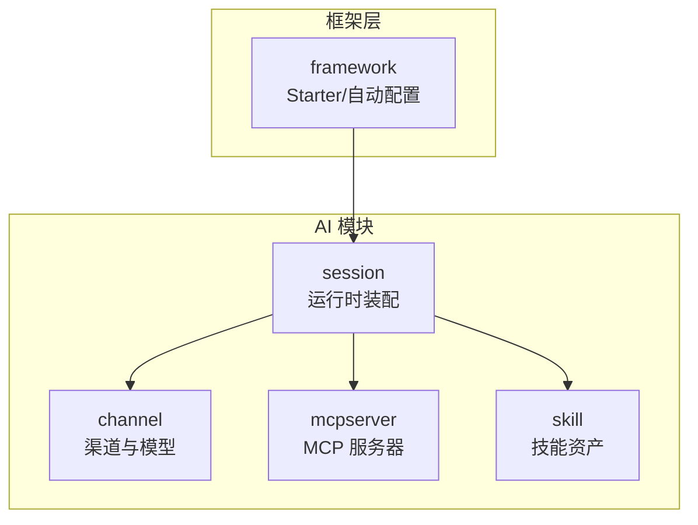
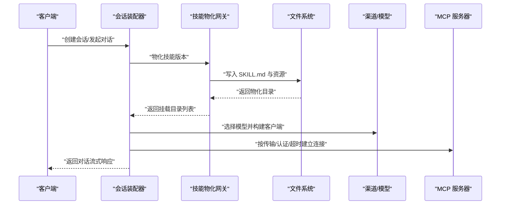
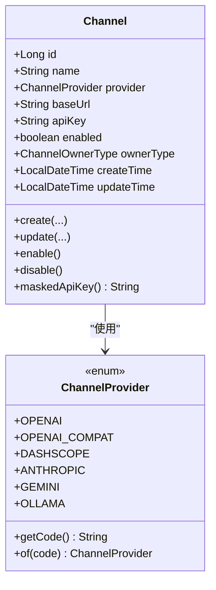
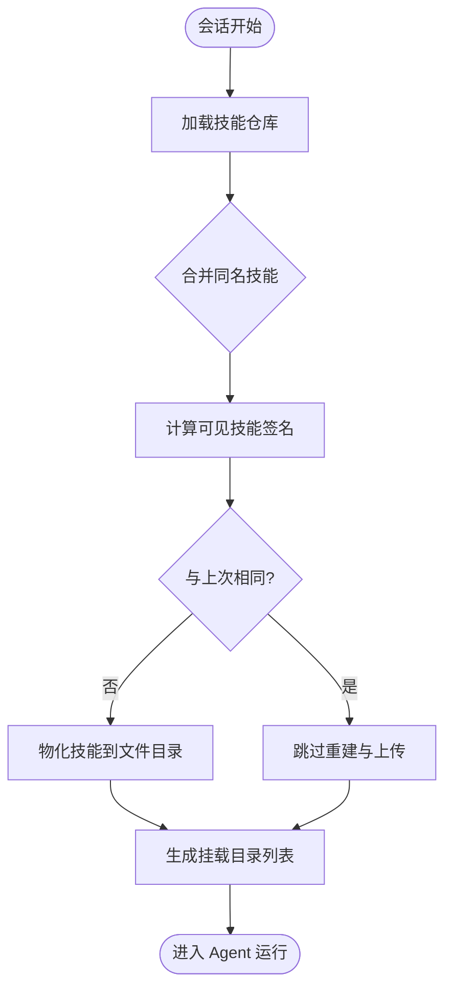
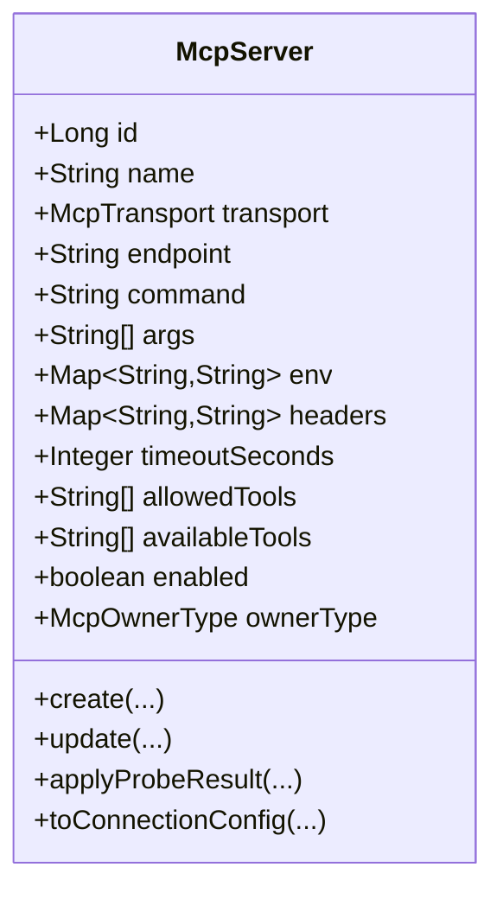
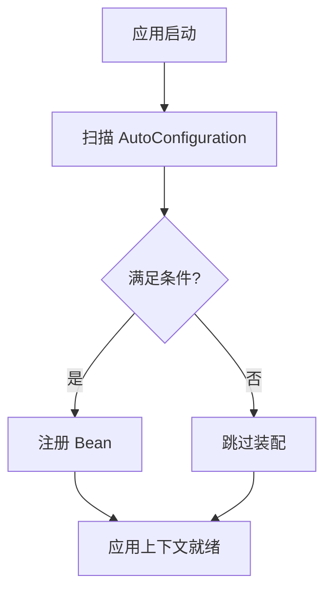
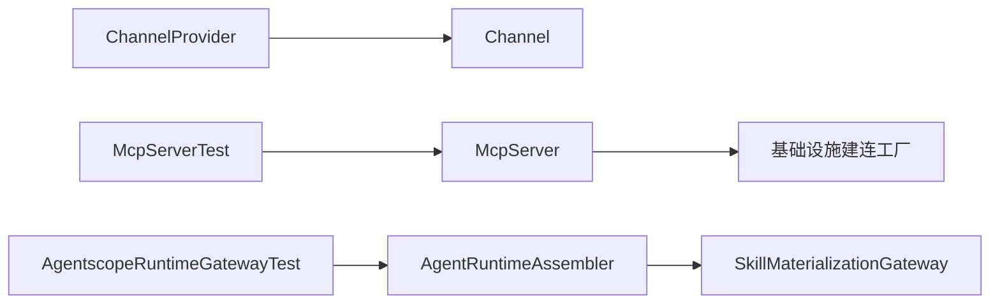

# 扩展开发

<cite>
**本文引用的文件**
- [ChannelProvider.java](file://nexai-module-ai/src/main/java/com/gkht/ai/nexai/module/ai/channel/domain/valueobject/ChannelProvider.java)
- [Channel.java](file://nexai-module-ai/src/main/java/com/gkht/ai/nexai/module/ai/channel/domain/model/Channel.java)
- [McpServer.java](file://nexai-module-ai/src/main/java/com/gkht/ai/nexai/module/ai/mcpserver/domain/model/McpServer.java)
- [SkillMaterializationGateway.java](file://nexai-module-ai/src/main/java/com/gkht/ai/nexai/module/ai/skill/domain/gateway/SkillMaterializationGateway.java)
- [AgentRuntimeAssembler.java](file://nexai-module-ai/src/main/java/com/gkht/ai/nexai/module/ai/session/application/service/AgentRuntimeAssembler.java)
- [AgentscopeAutoConfiguration.java](file://nexai-framework/nexai-common/pom.xml)
- [SpringUtils.java](file://nexai-framework/nexai-common/src/main/java/com/gkht/ai/nexai/framework/common/util/spring/SpringUtils.java)
- [2026-08-25-agentscope-harness-skill-加载链路.md](file://docs/research/2026-08-25-agentscope-harness-skill-加载链路.md)
- [2026-08-25-agentscope-skill-管理三种存储与同步机制.md](file://docs/research/2026-08-25-agentscope-skill-管理三种存储与同步机制.md)
- [0005-skill统一资产双来源与发布固化.md](file://docs/adr/0005-skill统一资产双来源与发布固化.md)
- [McpServerTest.java](file://nexai-module-ai/src/test/java/com/gkht/ai/nexai/module/ai/mcpserver/domain/model/McpServerTest.java)
- [AgentscopeRuntimeGatewayTest.java](file://nexai-module-ai/src/test/java/com/gkht/ai/nexai/module/ai/session/infrastructure/gateway/AgentscopeRuntimeGatewayTest.java)
</cite>

## 目录
1. [简介](#简介)
2. [项目结构](#项目结构)
3. [核心组件](#核心组件)
4. [架构总览](#架构总览)
5. [详细组件分析](#详细组件分析)
6. [依赖关系分析](#依赖关系分析)
7. [性能考虑](#性能考虑)
8. [故障排查指南](#故障排查指南)
9. [结论](#结论)
10. [附录](#附录)

## 简介
本指南面向需要在 NexAI 平台进行扩展开发的工程师，聚焦以下目标：
- 如何接入自定义模型提供商与第三方 AI 服务
- 如何开发 Agent 插件（技能）并理解其物化、加载与同步机制
- 如何新增渠道支持（OpenAI、Anthropic、Google 等）
- 如何扩展 MCP 服务器（传输协议、认证、超时）
- 如何使用框架扩展点（Spring Boot Starter、自动配置、条件装配）
- 提供可操作的示例路径、最佳实践、测试方法与部署建议

## 项目结构
NexAI 采用模块化分层设计，AI 能力集中在 nexai-module-ai，通用能力在 nexai-framework，业务模块在 system/infra，应用入口在 server。与扩展相关的关键目录：
- channel：渠道与模型接入（提供商枚举、渠道聚合根）
- mcpserver：MCP 服务器接入（传输、端点、认证、白名单）
- skill：技能资产与物化（接口定义、版本内容、仓库同步）
- session：会话运行时装配（将技能物化目录挂载到 Agent 运行环境）
- framework：Spring Boot Starter 与自动配置基础设施

**图示来源**
- [Channel.java:10-43](file://nexai-module-ai/src/main/java/com/gkht/ai/nexai/module/ai/channel/domain/model/Channel.java#L10-L43)
- [McpServer.java:12-65](file://nexai-module-ai/src/main/java/com/gkht/ai/nexai/module/ai/mcpserver/domain/model/McpServer.java#L12-L65)
- [SkillMaterializationGateway.java:6-22](file://nexai-module-ai/src/main/java/com/gkht/ai/nexai/module/ai/skill/domain/gateway/SkillMaterializationGateway.java#L6-L22)
- [AgentRuntimeAssembler.java:125-139](file://nexai-module-ai/src/main/java/com/gkht/ai/nexai/module/ai/session/application/service/AgentRuntimeAssembler.java#L125-L139)

**章节来源**
- [Channel.java:10-43](file://nexai-module-ai/src/main/java/com/gkht/ai/nexai/module/ai/channel/domain/model/Channel.java#L10-L43)
- [McpServer.java:12-65](file://nexai-module-ai/src/main/java/com/gkht/ai/nexai/module/ai/mcpserver/domain/model/McpServer.java#L12-L65)
- [SkillMaterializationGateway.java:6-22](file://nexai-module-ai/src/main/java/com/gkht/ai/nexai/module/ai/skill/domain/gateway/SkillMaterializationGateway.java#L6-L22)
- [AgentRuntimeAssembler.java:125-139](file://nexai-module-ai/src/main/java/com/gkht/ai/nexai/module/ai/session/application/service/AgentRuntimeAssembler.java#L125-L139)

## 核心组件
- 渠道与模型接入：通过 ChannelProvider 枚举扩展新模型提供商；Channel 聚合根承载端点、密钥、启用状态与归属维度。
- MCP 服务器：McpServer 聚合根封装传输类型（stdio/SSE/Streamable HTTP）、端点或命令、环境变量与认证头、请求超时、工具白名单与探测结果缓存。
- 技能系统：SkillMaterializationGateway 定义“物化”出端口，将 DB 中的技能版本内容落盘为 agentscope 可读取的文件目录；AgentRuntimeAssembler 在会话启动时调用该网关完成挂载。
- 运行时装配：AgentRuntimeAssembler 将物化后的技能目录组织为 SkillMountDirectory，供 Agent 运行时使用。

**章节来源**
- [ChannelProvider.java:9-47](file://nexai-module-ai/src/main/java/com/gkht/ai/nexai/module/ai/channel/domain/valueobject/ChannelProvider.java#L9-L47)
- [Channel.java:10-43](file://nexai-module-ai/src/main/java/com/gkht/ai/nexai/module/ai/channel/domain/model/Channel.java#L10-L43)
- [McpServer.java:12-65](file://nexai-module-ai/src/main/java/com/gkht/ai/nexai/module/ai/mcpserver/domain/model/McpServer.java#L12-L65)
- [SkillMaterializationGateway.java:6-22](file://nexai-module-ai/src/main/java/com/gkht/ai/nexai/module/ai/skill/domain/gateway/SkillMaterializationGateway.java#L6-L22)
- [AgentRuntimeAssembler.java:125-139](file://nexai-module-ai/src/main/java/com/gkht/ai/nexai/module/ai/session/application/service/AgentRuntimeAssembler.java#L125-L139)

## 架构总览
NexAI 的扩展架构围绕“可插拔的模型渠道 + 可编排的技能 + 可接入的外部工具（MCP）”展开。会话启动时，运行时装配器根据规格与配置，完成技能物化与挂载，同时选择对应渠道的模型实例，并可连接 MCP 服务器暴露的工具。

**图示来源**
- [AgentRuntimeAssembler.java:125-139](file://nexai-module-ai/src/main/java/com/gkht/ai/nexai/module/ai/session/application/service/AgentRuntimeAssembler.java#L125-L139)
- [SkillMaterializationGateway.java:6-22](file://nexai-module-ai/src/main/java/com/gkht/ai/nexai/module/ai/skill/domain/gateway/SkillMaterializationGateway.java#L6-L22)
- [Channel.java:10-43](file://nexai-module-ai/src/main/java/com/gkht/ai/nexai/module/ai/channel/domain/model/Channel.java#L10-L43)
- [McpServer.java:12-65](file://nexai-module-ai/src/main/java/com/gkht/ai/nexai/module/ai/mcpserver/domain/model/McpServer.java#L12-L65)

## 详细组件分析

### 渠道与模型扩展（OpenAI、Anthropic、Google 等）
- 新增提供商：在 ChannelProvider 中增加枚举项，确保与底层 ChatModelFactory 分支一致。
- 渠道实体：Channel 聚合根负责名称、提供商、端点、密钥、启用状态与归属维度；更新时保留未传入的密钥字段。
- 适配要点：
  - 端点校验：baseUrl 必填且为 http/https
  - 密钥处理：明文仅存于聚合内存与加密列，对外脱敏展示
  - 多实例：同一提供商可存在多个渠道（不同端点/密钥）

**图示来源**
- [Channel.java:10-43](file://nexai-module-ai/src/main/java/com/gkht/ai/nexai/module/ai/channel/domain/model/Channel.java#L10-L43)
- [ChannelProvider.java:9-47](file://nexai-module-ai/src/main/java/com/gkht/ai/nexai/module/ai/channel/domain/valueobject/ChannelProvider.java#L9-L47)

**章节来源**
- [ChannelProvider.java:9-47](file://nexai-module-ai/src/main/java/com/gkht/ai/nexai/module/ai/channel/domain/valueobject/ChannelProvider.java#L9-L47)
- [Channel.java:10-43](file://nexai-module-ai/src/main/java/com/gkht/ai/nexai/module/ai/channel/domain/model/Channel.java#L10-L43)

### 技能系统：物化、加载与同步
- 物化接口：SkillMaterializationGateway 将技能版本内容（Markdown 与资源）写为 agentscope 可识别的文件目录，按租户/用户隔离。
- 会话挂载：AgentRuntimeAssembler 在会话启动时调用物化网关，生成 SkillMountDirectory 列表供 Agent 使用。
- 加载与同步机制（agentscope 侧）：
  - 每轮对话会拉取技能仓库（Git/Postgres），合并同名技能（后者覆盖前者）
  - 计算可见技能的签名，若与上次相同则短路跳过重建与上传
  - Git 仓库读前执行轻量远端 HEAD 比对，变化才 pull；本地临时目录注册清理钩子
  - 物化后由 stager 进行文件级去重与投影，避免重复 IO

**图示来源**
- [AgentRuntimeAssembler.java:125-139](file://nexai-module-ai/src/main/java/com/gkht/ai/nexai/module/ai/session/application/service/AgentRuntimeAssembler.java#L125-L139)
- [SkillMaterializationGateway.java:6-22](file://nexai-module-ai/src/main/java/com/gkht/ai/nexai/module/ai/skill/domain/gateway/SkillMaterializationGateway.java#L6-L22)
- [2026-08-25-agentscope-harness-skill-加载链路.md:47-113](file://docs/research/2026-08-25-agentscope-harness-skill-加载链路.md#L47-L113)
- [2026-08-25-agentscope-skill-管理三种存储与同步机制.md:178-192](file://docs/research/2026-08-25-agentscope-skill-管理三种存储与同步机制.md#L178-L192)

**章节来源**
- [SkillMaterializationGateway.java:6-22](file://nexai-module-ai/src/main/java/com/gkht/ai/nexai/module/ai/skill/domain/gateway/SkillMaterializationGateway.java#L6-L22)
- [AgentRuntimeAssembler.java:125-139](file://nexai-module-ai/src/main/java/com/gkht/ai/nexai/module/ai/session/application/service/AgentRuntimeAssembler.java#L125-L139)
- [2026-08-25-agentscope-harness-skill-加载链路.md:47-113](file://docs/research/2026-08-25-agentscope-harness-skill-加载链路.md#L47-L113)
- [2026-08-25-agentscope-skill-管理三种存储与同步机制.md:178-192](file://docs/research/2026-08-25-agentscope-skill-管理三种存储与同步机制.md#L178-L192)
- [0005-skill统一资产双来源与发布固化.md:1-3](file://docs/adr/0005-skill统一资产双来源与发布固化.md#L1-L3)

### MCP 服务器扩展（传输、认证、超时）
- 传输协议：支持 stdio、SSE、Streamable HTTP；不同传输对端点/命令/认证头的要求不同。
- 认证机制：HTTP 系传输使用 headers（如 Authorization），stdio 凭证通过 env 传递。
- 超时配置：timeoutSeconds 用于控制请求超时，小于 1 将被拒绝。
- 白名单与探测：allowedTools 为放行面，availableTools 为最近一次探测到的工具清单，用于拼写校验与候选项。

**图示来源**
- [McpServer.java:12-65](file://nexai-module-ai/src/main/java/com/gkht/ai/nexai/module/ai/mcpserver/domain/model/McpServer.java#L12-L65)
- [McpServer.java:186-232](file://nexai-module-ai/src/main/java/com/gkht/ai/nexai/module/ai/mcpserver/domain/model/McpServer.java#L186-L232)
- [McpServer.java:306-315](file://nexai-module-ai/src/main/java/com/gkht/ai/nexai/module/ai/mcpserver/domain/model/McpServer.java#L306-L315)

**章节来源**
- [McpServer.java:12-65](file://nexai-module-ai/src/main/java/com/gkht/ai/nexai/module/ai/mcpserver/domain/model/McpServer.java#L12-L65)
- [McpServer.java:186-232](file://nexai-module-ai/src/main/java/com/gkht/ai/nexai/module/ai/mcpserver/domain/model/McpServer.java#L186-L232)
- [McpServer.java:306-315](file://nexai-module-ai/src/main/java/com/gkht/ai/nexai/module/ai/mcpserver/domain/model/McpServer.java#L306-L315)
- [McpServerTest.java:50-142](file://nexai-module-ai/src/test/java/com/gkht/ai/nexai/module/ai/mcpserver/domain/model/McpServerTest.java#L50-L142)

### 框架扩展点（Spring Boot Starter、自动配置、条件装配）
- 自动配置风格：遵循 Spring Boot 3+/4 的 @AutoConfiguration + @EnableConfigurationProperties + @ConditionalOnClass 模式。
- 条件装配：Bean 可通过 @ConditionalOnProperty、@ConditionalOnMissingBean、@ConditionalOnBean 精细控制装配时机。
- 与 NexAI Starter 共存：agentscope 的装配可让位（ConditionalOnMissingBean），NexAI 侧可用 Java Config 手工装配。
- 环境判断：可使用 SpringUtils.isProd() 区分生产环境。

**图示来源**
- [AgentscopeAutoConfiguration.java](file://nexai-framework/nexai-common/pom.xml)
- [SpringUtils.java:1-24](file://nexai-framework/nexai-common/src/main/java/com/gkht/ai/nexai/framework/common/util/spring/SpringUtils.java#L1-L24)

**章节来源**
- [AgentscopeAutoConfiguration.java](file://nexai-framework/nexai-common/pom.xml)
- [SpringUtils.java:1-24](file://nexai-framework/nexai-common/src/main/java/com/gkht/ai/nexai/framework/common/util/spring/SpringUtils.java#L1-L24)

## 依赖关系分析
- 渠道与模型：ChannelProvider 作为枚举被 Channel 使用，决定模型工厂分支。
- 技能物化：AgentRuntimeAssembler 依赖 SkillMaterializationGateway，实现与 agentscope 文件仓库契约对接。
- MCP 服务器：McpServer 聚合根封装传输与认证信息，供基础设施层建连工厂消费。
- 测试验证：McpServerTest 与 AgentscopeRuntimeGatewayTest 覆盖了边界校验与技能版本指纹变更行为。

**图示来源**
- [ChannelProvider.java:9-47](file://nexai-module-ai/src/main/java/com/gkht/ai/nexai/module/ai/channel/domain/valueobject/ChannelProvider.java#L9-L47)
- [Channel.java:10-43](file://nexai-module-ai/src/main/java/com/gkht/ai/nexai/module/ai/channel/domain/model/Channel.java#L10-L43)
- [AgentRuntimeAssembler.java:125-139](file://nexai-module-ai/src/main/java/com/gkht/ai/nexai/module/ai/session/application/service/AgentRuntimeAssembler.java#L125-L139)
- [SkillMaterializationGateway.java:6-22](file://nexai-module-ai/src/main/java/com/gkht/ai/nexai/module/ai/skill/domain/gateway/SkillMaterializationGateway.java#L6-L22)
- [McpServer.java:12-65](file://nexai-module-ai/src/main/java/com/gkht/ai/nexai/module/ai/mcpserver/domain/model/McpServer.java#L12-L65)
- [McpServerTest.java:50-142](file://nexai-module-ai/src/test/java/com/gkht/ai/nexai/module/ai/mcpserver/domain/model/McpServerTest.java#L50-L142)
- [AgentscopeRuntimeGatewayTest.java:548-568](file://nexai-module-ai/src/test/java/com/gkht/ai/nexai/module/ai/session/infrastructure/gateway/AgentscopeRuntimeGatewayTest.java#L548-L568)

**章节来源**
- [ChannelProvider.java:9-47](file://nexai-module-ai/src/main/java/com/gkht/ai/nexai/module/ai/channel/domain/valueobject/ChannelProvider.java#L9-L47)
- [Channel.java:10-43](file://nexai-module-ai/src/main/java/com/gkht/ai/nexai/module/ai/channel/domain/model/Channel.java#L10-L43)
- [AgentRuntimeAssembler.java:125-139](file://nexai-module-ai/src/main/java/com/gkht/ai/nexai/module/ai/session/application/service/AgentRuntimeAssembler.java#L125-L139)
- [SkillMaterializationGateway.java:6-22](file://nexai-module-ai/src/main/java/com/gkht/ai/nexai/module/ai/skill/domain/gateway/SkillMaterializationGateway.java#L6-L22)
- [McpServer.java:12-65](file://nexai-module-ai/src/main/java/com/gkht/ai/nexai/module/ai/mcpserver/domain/model/McpServer.java#L12-L65)
- [McpServerTest.java:50-142](file://nexai-module-ai/src/test/java/com/gkht/ai/nexai/module/ai/mcpserver/domain/model/McpServerTest.java#L50-L142)
- [AgentscopeRuntimeGatewayTest.java:548-568](file://nexai-module-ai/src/test/java/com/gkht/ai/nexai/module/ai/session/infrastructure/gateway/AgentscopeRuntimeGatewayTest.java#L548-L568)

## 性能考虑
- 技能加载短路：当可见技能签名与上次相同时，跳过 SkillBox 重建与文件上传，显著降低 IO 与网络开销。
- Git 仓库增量同步：读前检查远端 HEAD，仅在变化时 pull，减少网络往返。
- 文件级去重：stager 基于 SHA-256 比对，内容不变不写盘，避免冗余 IO。
- 会话级失效：渠道或 MCP 配置变更触发常驻实例重建，保证一致性但需权衡重启成本。

[本节为通用指导，无需特定文件引用]

## 故障排查指南
- MCP 传输与参数校验失败：
  - stdio 不允许设置端点或认证头；HTTP 系必须提供 http/https 端点且不传命令
  - 超时小于 1 秒会被拒绝；白名单为空表示全部工具放行
- 技能版本不一致导致的行为：
  - 技能版本指纹变化会触发会话重建，确保使用最新技能内容
- 常见问题定位：
  - 查看 McpServerTest 中的边界用例，确认配置合法性
  - 参考 AgentscopeRuntimeGatewayTest 的技能版本指纹行为，验证物化与挂载逻辑

**章节来源**
- [McpServerTest.java:50-142](file://nexai-module-ai/src/test/java/com/gkht/ai/nexai/module/ai/mcpserver/domain/model/McpServerTest.java#L50-L142)
- [AgentscopeRuntimeGatewayTest.java:548-568](file://nexai-module-ai/src/test/java/com/gkht/ai/nexai/module/ai/session/infrastructure/gateway/AgentscopeRuntimeGatewayTest.java#L548-L568)

## 结论
NexAI 提供了清晰的扩展点与严格的领域模型约束：
- 渠道扩展通过枚举与聚合根快速落地，支持多实例与 BYOK
- 技能系统以“物化 + 挂载”解耦数据源与运行时，具备短路优化与增量同步
- MCP 服务器以传输/认证/超时的显式建模，保障外部工具的安全接入
- 框架层遵循标准 Spring Boot 自动配置与条件装配，便于与现有生态集成

建议在扩展过程中优先复用既有聚合根与网关接口，并通过单元测试覆盖边界条件与异常路径，确保稳定性与可维护性。

[本节为总结性内容，无需特定文件引用]

## 附录
- 最佳实践
  - 新增模型提供商时，保持 ChannelProvider 与底层模型工厂分支一致
  - 技能物化目录按租户/用户隔离，避免跨租户污染
  - MCP 白名单尽量收敛到最小可用集合，结合探测结果做拼写校验
  - 使用条件装配按需启用扩展，避免不必要的 Bean 注册
- 测试方法
  - 使用 McpServerTest 验证传输与参数的边界条件
  - 使用 AgentscopeRuntimeGatewayTest 验证技能版本指纹变更引发的会话重建
- 部署方式
  - 通过 Spring Boot 应用打包部署，利用自动配置与 Starter 体系简化装配
  - 在生产环境使用 SpringUtils.isProd() 进行差异化配置

[本节为补充说明，无需特定文件引用]