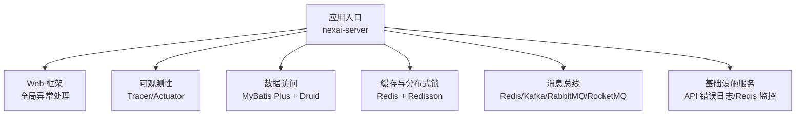
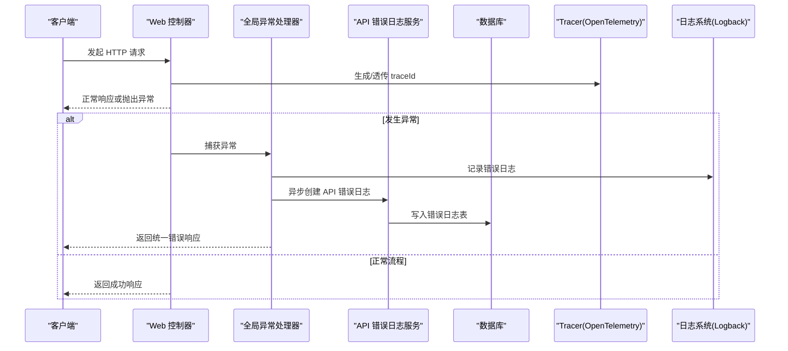
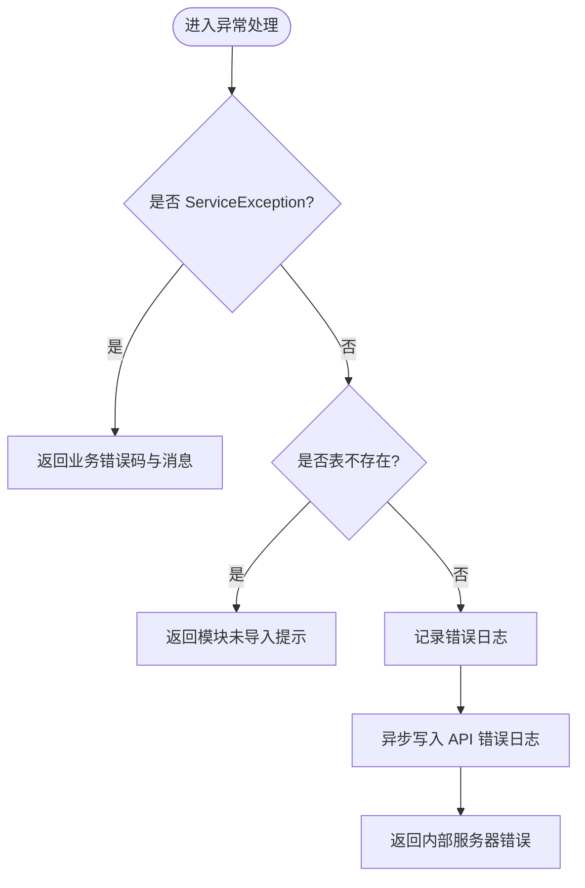
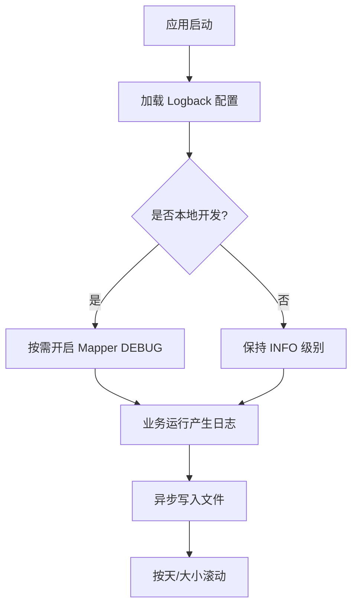
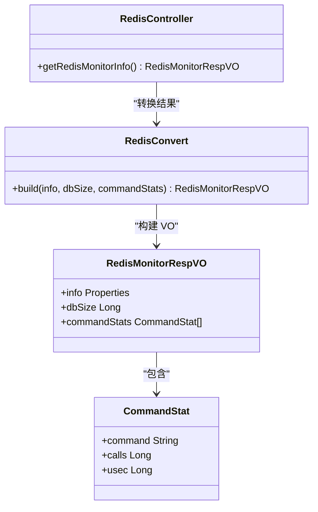
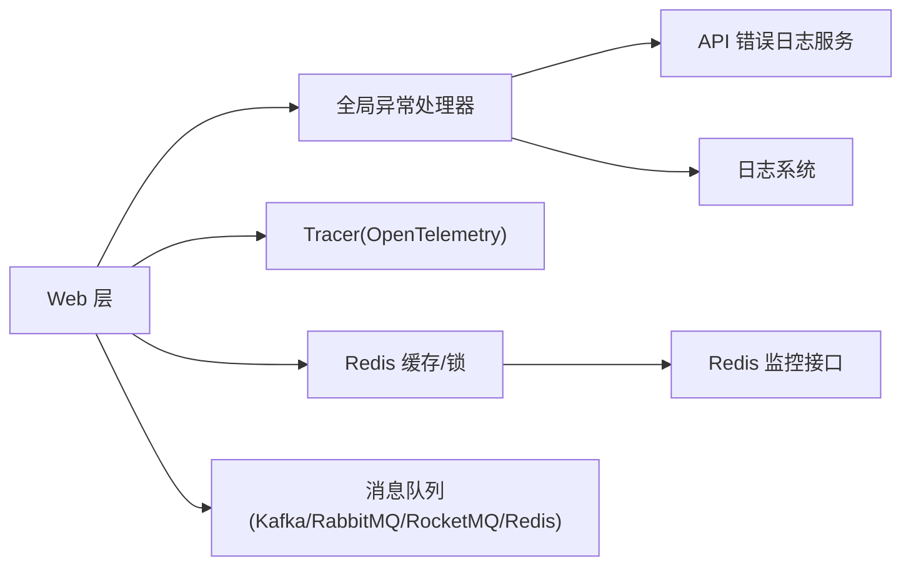

# 故障排查与FAQ

<cite>
**本文引用的文件**
- [README.md](file://README.md)
- [application.yaml](file://nexai-server/src/main/resources/application.yaml)
- [logback-spring.xml](file://nexai-server/src/main/resources/logback-spring.xml)
- [GlobalExceptionHandler.java](file://nexai-framework/nexai-spring-boot-starter-web/src/main/java/com/gkht/ai/nexai/framework/web/core/handler/GlobalExceptionHandler.java)
- [ApiErrorLogService.java](file://nexai-module-infra/src/main/java/com/gkht/ai/nexai/module/infra/service/logger/ApiErrorLogService.java)
- [ApiErrorLogServiceImpl.java](file://nexai-module-infra/src/main/java/com/gkht/ai/nexai/module/infra/service/logger/ApiErrorLogServiceImpl.java)
- [ApiErrorLogApiImpl.java](file://nexai-module-infra/src/main/java/com/gkht/ai/nexai/module/infra/api/logger/ApiErrorLogApiImpl.java)
- [NexaiRedisAutoConfiguration.java](file://nexai-framework/nexai-spring-boot-starter-redis/src/main/java/com/gkht/ai/nexai/framework/redis/config/NexaiRedisAutoConfiguration.java)
- [RedisController.java](file://nexai-module-infra/src/main/java/com/gkht/ai/nexai/module/infra/controller/admin/redis/RedisController.java)
- [RedisMonitorRespVO.java](file://nexai-module-infra/src/main/java/com/gkht/ai/nexai/module/infra/controller/admin/redis/vo/RedisMonitorRespVO.java)
- [NexaiTracerAutoConfiguration.java](file://nexai-framework/nexai-spring-boot-starter-monitor/src/main/java/com/gkht/ai/nexai/framework/tracer/config/NexaiTracerAutoConfiguration.java)
- [RootCauses.java](file://nexai-module-ai/src/main/java/com/gkht/ai/nexai/module/ai/shared/util/RootCauses.java)
- [application-local-example.yaml](file://nexai-server/src/main/resources/application-local-example.yaml)
- [application-dev.yaml](file://nexai-server/src/main/resources/application-dev.yaml)
</cite>

## 目录
1. [简介](#简介)
2. [项目结构](#项目结构)
3. [核心组件](#核心组件)
4. [架构总览](#架构总览)
5. [详细组件分析](#详细组件分析)
6. [依赖关系分析](#依赖关系分析)
7. [性能注意事项](#性能注意事项)
8. [故障排查指南](#故障排查指南)
9. [结论](#结论)
10. [附录](#附录)

## 简介
本文件面向 NexAI 平台开发与运维人员，聚焦“故障排查与常见问题解答”。内容覆盖：
- 环境配置问题、运行时错误、性能问题的定位与修复
- 日志分析方法与调试技巧（日志级别、关键日志定位、性能瓶颈分析）
- 常见错误的诊断步骤与修复方案（数据库连接、Redis 缓存异常、消息队列故障等）
- 系统监控指标含义与告警处理
- 性能优化建议与最佳实践
- 技术支持与社区帮助获取方式、问题反馈模板

## 项目结构
NexAI 采用多模块 Spring Boot 工程，后端以框架 Starter 形式提供通用能力（Web、Redis、MQ、监控、安全等），业务模块按领域划分，统一由 nexai-server 装配启动。前端为 Vue 3 SPA。

**图表来源**
- [application.yaml:1-390](file://nexai-server/src/main/resources/application.yaml#L1-L390)
- [GlobalExceptionHandler.java:1-474](file://nexai-framework/nexai-spring-boot-starter-web/src/main/java/com/gkht/ai/nexai/framework/web/core/handler/GlobalExceptionHandler.java#L1-L474)
- [NexaiTracerAutoConfiguration.java:1-58](file://nexai-framework/nexai-spring-boot-starter-monitor/src/main/java/com/gkht/ai/nexai/framework/tracer/config/NexaiTracerAutoConfiguration.java#L1-L58)
- [NexaiRedisAutoConfiguration.java:1-44](file://nexai-framework/nexai-spring-boot-starter-redis/src/main/java/com/gkht/ai/nexai/framework/redis/config/NexaiRedisAutoConfiguration.java#L1-L44)

**章节来源**
- [README.md:1-149](file://README.md#L1-L149)
- [application.yaml:1-390](file://nexai-server/src/main/resources/application.yaml#L1-L390)

## 核心组件
- 全局异常处理：统一将异常转换为标准返回，并异步记录 API 错误日志，支持表缺失等场景的友好提示。
- 日志体系：Logback 控制台与文件输出，异步写入避免阻塞；本地示例中可按 Mapper 细化日志级别。
- 可观测性：OpenTelemetry Tracer 自动装配，TraceFilter 注入 traceId；Actuator 暴露监控端点。
- 缓存与锁：自定义 RedisTemplate JSON 序列化；Redisson 分布式锁；管理后台提供 Redis 监控接口。
- 消息队列：Kafka/RabbitMQ/RocketMQ/Redis 多种实现，WebSocket 广播可选不同发送通道。
- AI 工具：根因异常提取与超时上限保护，便于快速定位外部调用失败原因。

**章节来源**
- [GlobalExceptionHandler.java:1-474](file://nexai-framework/nexai-spring-boot-starter-web/src/main/java/com/gkht/ai/nexai/framework/web/core/handler/GlobalExceptionHandler.java#L1-L474)
- [logback-spring.xml:1-58](file://nexai-server/src/main/resources/logback-spring.xml#L1-L58)
- [application-local-example.yaml:150-180](file://nexai-server/src/main/resources/application-local-example.yaml#L150-L180)
- [NexaiTracerAutoConfiguration.java:1-58](file://nexai-framework/nexai-spring-boot-starter-monitor/src/main/java/com/gkht/ai/nexai/framework/tracer/config/NexaiTracerAutoConfiguration.java#L1-L58)
- [NexaiRedisAutoConfiguration.java:1-44](file://nexai-framework/nexai-spring-boot-starter-redis/src/main/java/com/gkht/ai/nexai/framework/redis/config/NexaiRedisAutoConfiguration.java#L1-L44)
- [RedisController.java:1-43](file://nexai-module-infra/src/main/java/com/gkht/ai/nexai/module/infra/controller/admin/redis/RedisController.java#L1-L43)
- [application.yaml:109-134](file://nexai-server/src/main/resources/application.yaml#L109-L134)
- [application.yaml:317-329](file://nexai-server/src/main/resources/application.yaml#L317-L329)
- [RootCauses.java:1-40](file://nexai-module-ai/src/main/java/com/gkht/ai/nexai/module/ai/shared/util/RootCauses.java#L1-L40)

## 架构总览
下图展示一次请求从进入 Web 层到异常落库的完整链路，以及可观测性与日志落盘的关键节点。

**图表来源**
- [GlobalExceptionHandler.java:322-385](file://nexai-framework/nexai-spring-boot-starter-web/src/main/java/com/gkht/ai/nexai/framework/web/core/handler/GlobalExceptionHandler.java#L322-L385)
- [ApiErrorLogService.java:13-53](file://nexai-module-infra/src/main/java/com/gkht/ai/nexai/module/infra/service/logger/ApiErrorLogService.java#L13-L53)
- [ApiErrorLogServiceImpl.java:38-59](file://nexai-module-infra/src/main/java/com/gkht/ai/nexai/module/infra/service/logger/ApiErrorLogServiceImpl.java#L38-L59)
- [NexaiTracerAutoConfiguration.java:34-55](file://nexai-framework/nexai-spring-boot-starter-monitor/src/main/java/com/gkht/ai/nexai/framework/tracer/config/NexaiTracerAutoConfiguration.java#L34-L55)
- [logback-spring.xml:17-36](file://nexai-server/src/main/resources/logback-spring.xml#L17-L36)

## 详细组件分析

### 全局异常处理与错误日志
- 统一异常分类：参数校验、权限不足、上传大小、资源不存在、方法不匹配、业务异常等均有专门处理器。
- 兜底策略：未知异常记录堆栈并插入 API 错误日志，返回统一内部错误码。
- 表缺失识别：根据异常信息中的表名前缀给出模块未导入的提示，便于快速定位。
- 错误日志落库：异步写入，包含用户、URL、参数、堆栈、traceId 等上下文。

**图表来源**
- [GlobalExceptionHandler.java:299-342](file://nexai-framework/nexai-spring-boot-starter-web/src/main/java/com/gkht/ai/nexai/framework/web/core/handler/GlobalExceptionHandler.java#L299-L342)
- [GlobalExceptionHandler.java:393-471](file://nexai-framework/nexai-spring-boot-starter-web/src/main/java/com/gkht/ai/nexai/framework/web/core/handler/GlobalExceptionHandler.java#L393-L471)
- [ApiErrorLogServiceImpl.java:38-59](file://nexai-module-infra/src/main/java/com/gkht/ai/nexai/module/infra/service/logger/ApiErrorLogServiceImpl.java#L38-L59)

**章节来源**
- [GlobalExceptionHandler.java:1-474](file://nexai-framework/nexai-spring-boot-starter-web/src/main/java/com/gkht/ai/nexai/framework/web/core/handler/GlobalExceptionHandler.java#L1-L474)
- [ApiErrorLogService.java:13-53](file://nexai-module-infra/src/main/java/com/gkht/ai/nexai/module/infra/service/logger/ApiErrorLogService.java#L13-L53)
- [ApiErrorLogServiceImpl.java:38-59](file://nexai-module-infra/src/main/java/com/gkht/ai/nexai/module/infra/service/logger/ApiErrorLogServiceImpl.java#L38-L59)
- [ApiErrorLogApiImpl.java:16-28](file://nexai-module-infra/src/main/java/com/gkht/ai/nexai/module/infra/api/logger/ApiErrorLogApiImpl.java#L16-L28)

### 日志体系与调试技巧
- 日志格式：控制台高亮、文件滚动策略（按天+大小）、保留天数与单文件大小限制。
- 异步写入：队列满时丢弃日志而非阻塞业务线程，避免“日志风暴”导致服务不可用。
- 级别控制：默认 root 为 INFO；开发环境可按 Mapper 细化至 DEBUG，便于 SQL 级排查。
- 关键日志定位：
  - 全局异常：ERROR 级别，附带堆栈与请求上下文。
  - API 错误日志：通过管理后台查询，包含 traceId、请求 URL、参数、异常根因。
  - 业务警告：WARN 级别用于参数校验、权限拒绝等预期内异常。

**图表来源**
- [logback-spring.xml:1-58](file://nexai-server/src/main/resources/logback-spring.xml#L1-L58)
- [application-local-example.yaml:166-180](file://nexai-server/src/main/resources/application-local-example.yaml#L166-L180)

**章节来源**
- [logback-spring.xml:1-58](file://nexai-server/src/main/resources/logback-spring.xml#L1-L58)
- [application-local-example.yaml:166-180](file://nexai-server/src/main/resources/application-local-example.yaml#L166-L180)

### 可观测性与追踪
- OpenTelemetry Tracer：自动装配，提供业务切面与 Filter 注入 traceId。
- Actuator：暴露 /actuator 端点，默认开放全部端点，便于健康检查与运行时指标查看。
- 建议：生产环境结合集中式链路追踪系统（如 SkyWalking）进行日志关联与可视化。

**章节来源**
- [NexaiTracerAutoConfiguration.java:1-58](file://nexai-framework/nexai-spring-boot-starter-monitor/src/main/java/com/gkht/ai/nexai/framework/tracer/config/NexaiTracerAutoConfiguration.java#L1-L58)
- [application-dev.yaml:135-143](file://nexai-server/src/main/resources/application-dev.yaml#L135-L143)
- [application-local-example.yaml:140-165](file://nexai-server/src/main/resources/application-local-example.yaml#L140-L165)

### 缓存与分布式锁（Redis）
- 自定义 RedisTemplate：Key 使用 String 序列化，Value 使用 JSON 序列化，兼容 Java Time。
- 管理后台监控：提供 Redis info、dbSize、命令统计等指标，便于观察命中率与慢命令。
- 分布式锁：基于 Redisson，可通过 lock4j 配置获取超时与过期时间。

**图表来源**
- [RedisController.java:21-43](file://nexai-module-infra/src/main/java/com/gkht/ai/nexai/module/infra/controller/admin/redis/RedisController.java#L21-L43)
- [RedisConvert.java:11-29](file://nexai-module-infra/src/main/java/com/gkht/ai/nexai/module/infra/convert/redis/RedisConvert.java#L11-L29)
- [RedisMonitorRespVO.java:11-43](file://nexai-module-infra/src/main/java/com/gkht/ai/nexai/module/infra/controller/admin/redis/vo/RedisMonitorRespVO.java#L11-L43)

**章节来源**
- [NexaiRedisAutoConfiguration.java:13-41](file://nexai-framework/nexai-spring-boot-starter-redis/src/main/java/com/gkht/ai/nexai/framework/redis/config/NexaiRedisAutoConfiguration.java#L13-L41)
- [RedisController.java:21-43](file://nexai-module-infra/src/main/java/com/gkht/ai/nexai/module/infra/controller/admin/redis/RedisController.java#L21-L43)
- [application-dev.yaml:128-133](file://nexai-server/src/main/resources/application-dev.yaml#L128-L133)

### 消息队列与 WebSocket 广播
- 支持 Kafka、RabbitMQ、RocketMQ、Redis 四种消息模式。
- WebSocket 广播 sender-type 可切换为 local/redis/rocketmq/kafka/rabbitmq，便于集群部署时的跨节点推送。
- 消费者监听器对缺失主题的配置：missing-topics-fatal=false，避免启动时报错。

**章节来源**
- [application.yaml:109-134](file://nexai-server/src/main/resources/application.yaml#L109-L134)
- [application.yaml:317-329](file://nexai-server/src/main/resources/application.yaml#L317-L329)
- [application-dev.yaml:117-127](file://nexai-server/src/main/resources/application-dev.yaml#L117-L127)

### AI 外部调用异常与超时保护
- 根因提取：逐层解包异常，取最底层原因并截断过长消息，便于快速定位鉴权/超时/连接拒绝等问题。
- 超时上限：对外部探测/装配连接设置最大超时，防止长尾请求拖垮系统。

**章节来源**
- [RootCauses.java:12-38](file://nexai-module-ai/src/main/java/com/gkht/ai/nexai/module/ai/shared/util/RootCauses.java#L12-L38)

## 依赖关系分析
- Web 层依赖全局异常处理器，异常处理器依赖 API 错误日志服务，最终落库持久化。
- 可观测性通过 Tracer 自动装配，贯穿请求生命周期。
- 缓存与锁依赖 Redis 与 Redisson，管理后台通过 Redis 监控接口获取运行态指标。
- 消息队列与 WebSocket 广播共享 MQ 配置，便于统一治理。

**图表来源**
- [GlobalExceptionHandler.java:322-385](file://nexai-framework/nexai-spring-boot-starter-web/src/main/java/com/gkht/ai/nexai/framework/web/core/handler/GlobalExceptionHandler.java#L322-L385)
- [NexaiTracerAutoConfiguration.java:34-55](file://nexai-framework/nexai-spring-boot-starter-monitor/src/main/java/com/gkht/ai/nexai/framework/tracer/config/NexaiTracerAutoConfiguration.java#L34-L55)
- [RedisController.java:21-43](file://nexai-module-infra/src/main/java/com/gkht/ai/nexai/module/infra/controller/admin/redis/RedisController.java#L21-L43)

**章节来源**
- [application.yaml:1-390](file://nexai-server/src/main/resources/application.yaml#L1-L390)

## 性能注意事项
- 日志性能：启用异步 Appender，队列满时丢弃低优先级日志，避免阻塞主流程。
- 缓存命中：通过 Redis 监控关注命令耗时与调用次数，定位热点 Key 与慢命令。
- 数据库连接池：合理配置连接数与等待时间，避免连接耗尽导致请求堆积。
- 消息消费：调整消费者并发与重试策略，避免积压与重复消费。
- 外部调用：利用 RootCauses 与最小超时策略，及时熔断与降级。

[本节为通用指导，无需具体文件引用]

## 故障排查指南

### 环境配置问题
- 端口冲突或服务无法启动
  - 检查 application.yaml 中 server.port 与 profile 激活情况。
  - 确认 Actuator 路径与 Admin 上下文路径无冲突。
- 前后端联调 CORS/代理
  - 检查 Swagger/Admin UI 地址与前端代理配置是否一致。

**章节来源**
- [application.yaml:1-20](file://nexai-server/src/main/resources/application.yaml#L1-L20)
- [application-local-example.yaml:150-165](file://nexai-server/src/main/resources/application-local-example.yaml#L150-L165)

### 运行时错误
- 参数校验失败
  - 全局异常处理器会返回 BAD_REQUEST 并附带字段错误信息。
  - 在本地可将对应 Mapper 日志级别调整为 DEBUG，查看入参与 SQL。
- 权限不足
  - AccessDeniedException 会被统一处理为 FORBIDDEN，检查角色与菜单权限。
- 资源不存在
  - NoHandlerFound/NoResourceFound 会返回 NOT_FOUND，核对路由与静态资源路径。

**章节来源**
- [GlobalExceptionHandler.java:128-270](file://nexai-framework/nexai-spring-boot-starter-web/src/main/java/com/gkht/ai/nexai/framework/web/core/handler/GlobalExceptionHandler.java#L128-L270)
- [application-local-example.yaml:166-180](file://nexai-server/src/main/resources/application-local-example.yaml#L166-L180)

### 数据库连接问题
- 现象：启动报表不存在或连接失败
  - 检查数据库驱动、URL、用户名密码是否正确。
  - 若提示某模块表不存在，根据异常前缀（如 ai_、bpm_、mp_ 等）确认是否已导入对应脚本。
- 建议：
  - 使用管理后台或数据库监控查看连接池状态与慢查询。
  - 必要时开启 MyBatis SQL 日志（DEBUG）辅助定位。

**章节来源**
- [GlobalExceptionHandler.java:393-471](file://nexai-framework/nexai-spring-boot-starter-web/src/main/java/com/gkht/ai/nexai/framework/web/core/handler/GlobalExceptionHandler.java#L393-L471)
- [application-local-example.yaml:166-180](file://nexai-server/src/main/resources/application-local-example.yaml#L166-L180)

### Redis 缓存异常
- 现象：缓存读写失败、键序列化异常、监控接口不可用
  - 检查 Redis 连接配置与网络连通性。
  - 通过管理后台 /infra/redis/get-monitor-info 查看 info、dbSize、命令统计。
  - 确认 RedisTemplate 使用 JSON 序列化，避免类型不匹配。
- 建议：
  - 关注慢命令与高频调用，优化 Key 设计与 TTL。
  - 对关键操作增加重试与降级逻辑。

**章节来源**
- [NexaiRedisAutoConfiguration.java:13-41](file://nexai-framework/nexai-spring-boot-starter-redis/src/main/java/com/gkht/ai/nexai/framework/redis/config/NexaiRedisAutoConfiguration.java#L13-L41)
- [RedisController.java:21-43](file://nexai-module-infra/src/main/java/com/gkht/ai/nexai/module/infra/controller/admin/redis/RedisController.java#L21-L43)
- [RedisMonitorRespVO.java:11-43](file://nexai-module-infra/src/main/java/com/gkht/ai/nexai/module/infra/controller/admin/redis/vo/RedisMonitorRespVO.java#L11-L43)

### 消息队列故障
- 现象：消息发送失败、消费积压、主题不存在报错
  - 检查 Kafka/RabbitMQ/RocketMQ 连接配置与网络连通性。
  - missing-topics-fatal=false 可避免启动时报错，但需确保消费者能正确处理空主题。
  - 调整消费者并发与重试策略，避免积压。
- 建议：
  - 对关键 Topic 增加监控与告警。
  - 使用幂等与去重机制保证消息可靠性。

**章节来源**
- [application.yaml:109-134](file://nexai-server/src/main/resources/application.yaml#L109-L134)
- [application-dev.yaml:117-127](file://nexai-server/src/main/resources/application-dev.yaml#L117-L127)

### 性能瓶颈分析
- 日志分析：
  - 通过 ERROR 日志与 API 错误日志定位异常热点。
  - 使用 traceId 串联请求链路，结合集中式日志系统进行分析。
- 缓存分析：
  - 通过 Redis 监控查看命令耗时与调用次数，识别热点与慢命令。
- 数据库分析：
  - 开启 SQL 日志（DEBUG）并结合数据库监控找出慢查询。
- 外部调用：
  - 使用 RootCauses 提取根因，结合最小超时策略快速止损。

**章节来源**
- [logback-spring.xml:17-36](file://nexai-server/src/main/resources/logback-spring.xml#L17-L36)
- [GlobalExceptionHandler.java:322-385](file://nexai-framework/nexai-spring-boot-starter-web/src/main/java/com/gkht/ai/nexai/framework/web/core/handler/GlobalExceptionHandler.java#L322-L385)
- [RedisController.java:21-43](file://nexai-module-infra/src/main/java/com/gkht/ai/nexai/module/infra/controller/admin/redis/RedisController.java#L21-L43)
- [RootCauses.java:12-38](file://nexai-module-ai/src/main/java/com/gkht/ai/nexai/module/ai/shared/util/RootCauses.java#L12-L38)

### 监控指标与告警处理
- Actuator：/actuator 暴露健康与信息端点，生产环境建议仅暴露必要端点。
- 链路追踪：通过 traceId 关联日志与链路，便于定位跨服务问题。
- 建议告警：
  - 错误率突增、慢请求比例上升、Redis 内存与连接数异常、消息积压等。

**章节来源**
- [application-dev.yaml:135-143](file://nexai-server/src/main/resources/application-dev.yaml#L135-L143)
- [NexaiTracerAutoConfiguration.java:34-55](file://nexai-framework/nexai-spring-boot-starter-monitor/src/main/java/com/gkht/ai/nexai/framework/tracer/config/NexaiTracerAutoConfiguration.java#L34-L55)

### 性能优化建议与最佳实践
- 日志：生产保持 INFO，仅在排查时临时提升特定模块级别；使用异步写入避免阻塞。
- 缓存：合理设计 Key 与 TTL，避免大对象与热点 Key；关注慢命令。
- 数据库：索引优化、分页与批量操作、连接池参数调优。
- 消息：合理分区与并发，消费者幂等与重试策略。
- 外部调用：最小超时与熔断降级，根因快速定位。

[本节为通用指导，无需具体文件引用]

### 技术支持与社区帮助
- 参考 README 中上游原项目链接，获取更广泛的文档与社区支持。
- 通过管理后台的接口文档（Swagger/Knife4j）与监控端点进行自检。

**章节来源**
- [README.md:144-149](file://README.md#L144-L149)
- [application.yaml:28-43](file://nexai-server/src/main/resources/application.yaml#L28-L43)

### 问题反馈与报告模板
- 标题：[模块] 问题简述（例如：[AI] 模型调用超时）
- 环境：JDK/Spring Boot/依赖版本、部署方式（本地/容器/云）
- 复现步骤：
  1. ...
  2. ...
- 期望行为：...
- 实际行为：...
- 日志与追踪：
  - 日志片段（脱敏）
  - traceId
  - 相关配置文件（脱敏）
- 影响范围：接口/租户/功能
- 附件：截图、SQL、配置项

[本节为通用模板，无需具体文件引用]

## 结论
NexAI 提供了完善的全局异常处理、日志体系、可观测性与缓存/消息中间件支撑。通过统一的错误日志、链路追踪与监控接口，能够快速定位环境问题、运行时错误与性能瓶颈。建议在生产环境中结合集中式日志与链路追踪系统，建立完善的告警与复盘机制，持续提升稳定性与可维护性。

## 附录
- 常用排查清单：
  - 检查 application.yaml 与对应 profile 配置
  - 查看全局异常日志与 API 错误日志
  - 通过 Redis 监控接口观察缓存健康度
  - 检查消息队列连接与消费者状态
  - 使用 traceId 串联日志与链路
- 参考文件：
  - 全局异常处理：[GlobalExceptionHandler.java](file://nexai-framework/nexai-spring-boot-starter-web/src/main/java/com/gkht/ai/nexai/framework/web/core/handler/GlobalExceptionHandler.java)
  - 日志配置：[logback-spring.xml](file://nexai-server/src/main/resources/logback-spring.xml)
  - 可观测性：[NexaiTracerAutoConfiguration.java](file://nexai-framework/nexai-spring-boot-starter-monitor/src/main/java/com/gkht/ai/nexai/framework/tracer/config/NexaiTracerAutoConfiguration.java)
  - Redis 监控：[RedisController.java](file://nexai-module-infra/src/main/java/com/gkht/ai/nexai/module/infra/controller/admin/redis/RedisController.java)