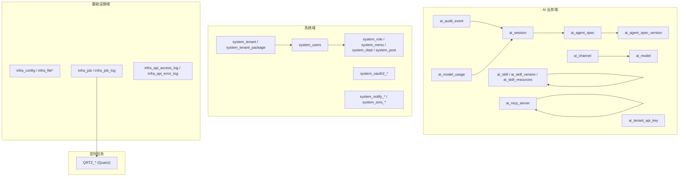
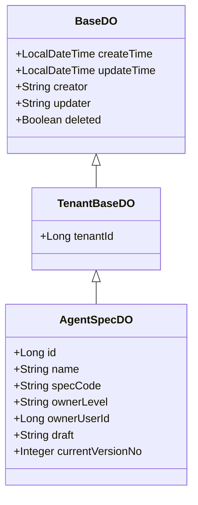
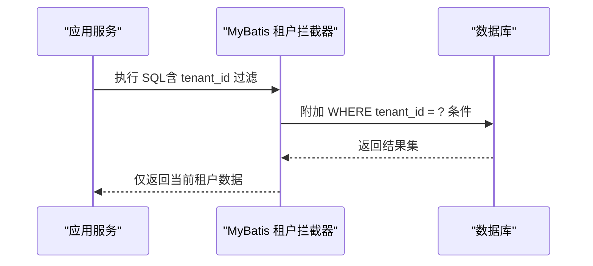
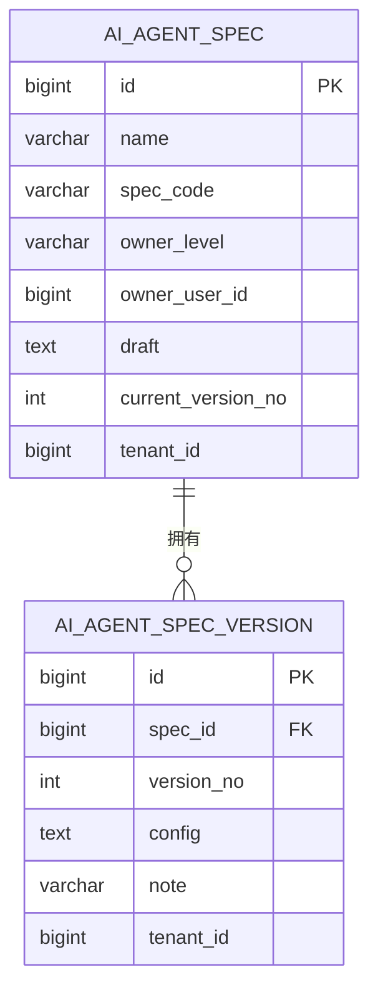
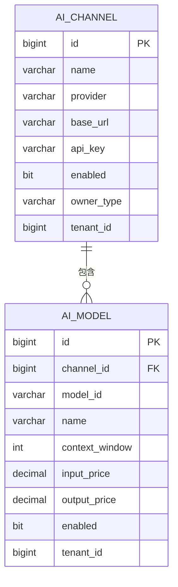
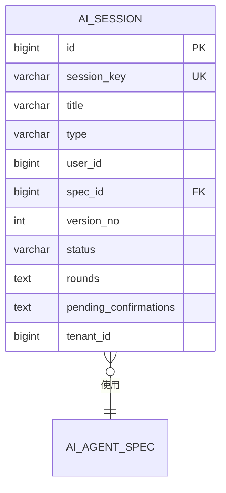
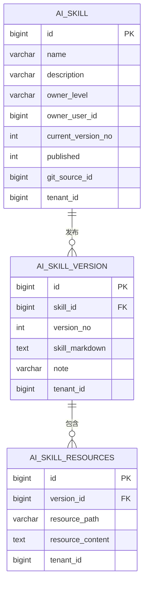
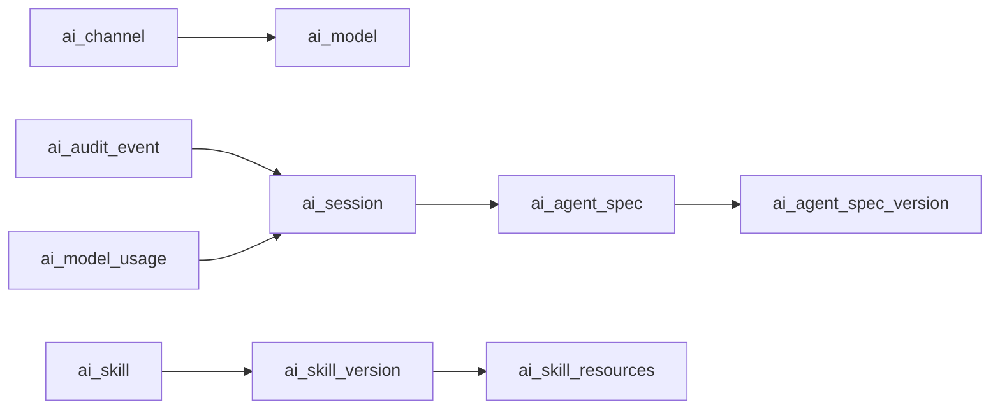
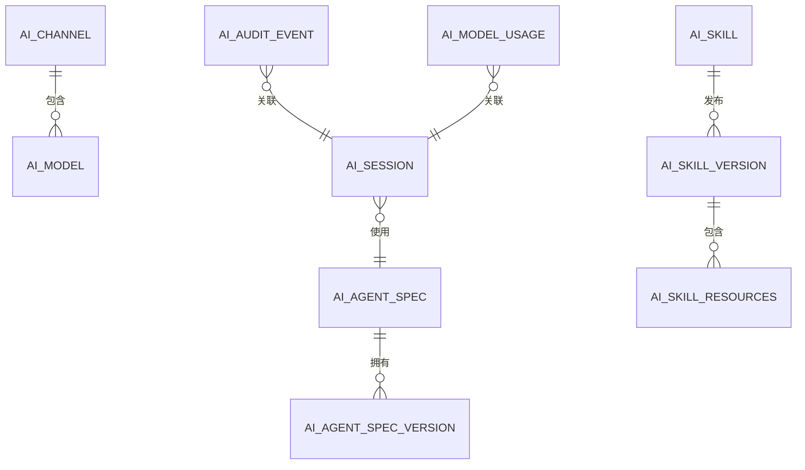

# 数据库设计

<cite>
**本文引用的文件**
- [nexai-module-ai/src/test/resources/sql/create_tables.sql](file://nexai-module-ai/src/test/resources/sql/create_tables.sql)
- [nexai-module-system/src/test/resources/sql/create_tables.sql](file://nexai-module-system/src/test/resources/sql/create_tables.sql)
- [nexai-module-infra/src/test/resources/sql/create_tables.sql](file://nexai-module-infra/src/test/resources/sql/create_tables.sql)
- [sql/postgresql/quartz.sql](file://sql/postgresql/quartz.sql)
- [sql/mysql/quartz.sql](file://sql/mysql/quartz.sql)
- [nexai-framework/nexai-spring-boot-starter-biz-tenant/src/main/java/com/gkht/ai/nexai/framework/tenant/core/db/TenantBaseDO.java](file://nexai-framework/nexai-spring-boot-starter-biz-tenant/src/main/java/com/gkht/ai/nexai/framework/tenant/core/db/TenantBaseDO.java)
- [nexai-framework/nexai-spring-boot-starter-mybatis/src/main/java/com/gkht/ai/nexai/framework/mybatis/core/dataobject/BaseDO.java](file://nexai-framework/nexai-spring-boot-starter-mybatis/src/main/java/com/gkht/ai/nexai/framework/mybatis/core/dataobject/BaseDO.java)
- [nexai-module-ai/src/main/java/com/gkht/ai/nexai/module/ai/agentspec/infrastructure/dataobject/AgentSpecDO.java](file://nexai-module-ai/src/main/java/com/gkht/ai/nexai/module/ai/agentspec/infrastructure/dataobject/AgentSpecDO.java)
- [nexai-module-ai/src/test/java/com/gkht/ai/nexai/module/ai/support/MultiTenantIsolationTest.java](file://nexai-module-ai/src/test/java/com/gkht/ai/nexai/module/ai/support/MultiTenantIsolationTest.java)
- [nexai-module-ai/src/test/java/com/gkht/ai/nexai/module/ai/support/TenantDbTestConfiguration.java](file://nexai-module-ai/src/test/java/com/gkht/ai/nexai/module/ai/support/TenantDbTestConfiguration.java)
- [nexai-module-ai/src/main/java/com/gkht/ai/nexai/module/ai/shared/util/TenantExecution.java](file://nexai-module-ai/src/main/java/com/gkht/ai/nexai/module/ai/shared/util/TenantExecution.java)
</cite>

## 目录
1. [简介](#简介)
2. [项目结构](#项目结构)
3. [核心组件](#核心组件)
4. [架构总览](#架构总览)
5. [详细组件分析](#详细组件分析)
6. [依赖关系分析](#依赖关系分析)
7. [性能考虑](#性能考虑)
8. [故障排查指南](#故障排查指南)
9. [结论](#结论)
10. [附录](#附录)

## 简介
本文件为 NexAI 平台的数据库设计文档，覆盖用户、角色、权限、租户、Agent 规格、会话、技能、渠道等关键实体的表结构设计；阐述主外键约束、索引设计与查询优化策略；说明多租户数据隔离实现（tenant_id 字段与 MyBatis 拦截器）；提供跨数据库（PostgreSQL、MySQL、达梦 DM）的迁移策略与 DDL 脚本位置；给出数据字典、ER 图与查询示例；并说明数据生命周期管理（归档、清理、备份）。

## 项目结构
NexAI 的数据库相关脚本与实体映射分布在多个模块：
- AI 业务域：智能体规格、版本、渠道、模型、会话、技能及版本、MCP Server、审计事件、用量、租户 API Key
- 系统域：用户、角色、菜单、部门、岗位、租户、OAuth2、通知、短信等
- 基础设施域：配置、文件、任务调度日志、代码生成元数据等
- 定时任务：Quartz 各数据库方言脚本

图表来源
- [nexai-module-ai/src/test/resources/sql/create_tables.sql:6-237](file://nexai-module-ai/src/test/resources/sql/create_tables.sql#L6-L237)
- [nexai-module-system/src/test/resources/sql/create_tables.sql:1-618](file://nexai-module-system/src/test/resources/sql/create_tables.sql#L1-L618)
- [nexai-module-infra/src/test/resources/sql/create_tables.sql:1-216](file://nexai-module-infra/src/test/resources/sql/create_tables.sql#L1-L216)
- [sql/postgresql/quartz.sql:19-208](file://sql/postgresql/quartz.sql#L19-L208)
- [sql/mysql/quartz.sql:24-285](file://sql/mysql/quartz.sql#L24-L285)

章节来源
- [nexai-module-ai/src/test/resources/sql/create_tables.sql:6-237](file://nexai-module-ai/src/test/resources/sql/create_tables.sql#L6-L237)
- [nexai-module-system/src/test/resources/sql/create_tables.sql:1-618](file://nexai-module-system/src/test/resources/sql/create_tables.sql#L1-L618)
- [nexai-module-infra/src/test/resources/sql/create_tables.sql:1-216](file://nexai-module-infra/src/test/resources/sql/create_tables.sql#L1-L216)
- [sql/postgresql/quartz.sql:19-208](file://sql/postgresql/quartz.sql#L19-L208)
- [sql/mysql/quartz.sql:24-285](file://sql/mysql/quartz.sql#L24-L285)

## 核心组件
- 基础实体基类
  - BaseDO：统一审计字段（创建时间、更新时间、创建者、更新者、逻辑删除）
  - TenantBaseDO：在 BaseDO 基础上增加 tenantId，作为多租户隔离键
- AI 领域核心表
  - ai_agent_spec / ai_agent_spec_version：智能体规格与不可变版本快照
  - ai_channel / ai_model：模型渠道与模型元数据
  - ai_session：调试会话元数据
  - ai_skill / ai_skill_version / ai_skill_resources：技能资产与版本资源
  - ai_mcp_server：BYO-MCP 服务配置
  - ai_audit_event / ai_model_usage：审计与用量采集
  - ai_tenant_api_key：租户级 API Key（哈希存储）
- 系统领域核心表
  - system_users / system_role / system_menu / system_dept / system_post：用户、角色、菜单、部门、岗位
  - system_tenant / system_tenant_package：租户与套餐
  - system_oauth2_*：OAuth2 令牌与授权
  - system_notify_* / system_sms_*：站内信与短信
- 基础设施域
  - infra_config / infra_file*：配置与文件
  - infra_job / infra_job_log：任务与执行日志
  - infra_api_access_log / infra_api_error_log：API 访问与异常日志
- 定时任务
  - Quartz 各数据库方言脚本（PostgreSQL、MySQL、DM）

章节来源
- [nexai-framework/nexai-spring-boot-starter-mybatis/src/main/java/com/gkht/ai/nexai/framework/mybatis/core/dataobject/BaseDO.java:1-67](file://nexai-framework/nexai-spring-boot-starter-mybatis/src/main/java/com/gkht/ai/nexai/framework/mybatis/core/dataobject/BaseDO.java#L1-L67)
- [nexai-framework/nexai-spring-boot-starter-biz-tenant/src/main/java/com/gkht/ai/nexai/framework/tenant/core/db/TenantBaseDO.java:1-22](file://nexai-framework/nexai-spring-boot-starter-biz-tenant/src/main/java/com/gkht/ai/nexai/framework/tenant/core/db/TenantBaseDO.java#L1-L22)
- [nexai-module-ai/src/test/resources/sql/create_tables.sql:6-237](file://nexai-module-ai/src/test/resources/sql/create_tables.sql#L6-L237)
- [nexai-module-system/src/test/resources/sql/create_tables.sql:1-618](file://nexai-module-system/src/test/resources/sql/create_tables.sql#L1-L618)
- [nexai-module-infra/src/test/resources/sql/create_tables.sql:1-216](file://nexai-module-infra/src/test/resources/sql/create_tables.sql#L1-L216)

## 架构总览
NexAI 采用“按领域分模块 + 通用框架能力”的分层架构。数据库层面通过 MyBatis Plus 与租户拦截器实现自动化的租户过滤；通过 DO 继承体系统一审计与软删除；通过 Quartz 脚本支持多数据库调度。

图表来源
- [nexai-framework/nexai-spring-boot-starter-mybatis/src/main/java/com/gkht/ai/nexai/framework/mybatis/core/dataobject/BaseDO.java:1-67](file://nexai-framework/nexai-spring-boot-starter-mybatis/src/main/java/com/gkht/ai/nexai/framework/mybatis/core/dataobject/BaseDO.java#L1-L67)
- [nexai-framework/nexai-spring-boot-starter-biz-tenant/src/main/java/com/gkht/ai/nexai/framework/tenant/core/db/TenantBaseDO.java:1-22](file://nexai-framework/nexai-spring-boot-starter-biz-tenant/src/main/java/com/gkht/ai/nexai/framework/tenant/core/db/TenantBaseDO.java#L1-L22)
- [nexai-module-ai/src/main/java/com/gkht/ai/nexai/module/ai/agentspec/infrastructure/dataobject/AgentSpecDO.java:1-22](file://nexai-module-ai/src/main/java/com/gkht/ai/nexai/module/ai/agentspec/infrastructure/dataobject/AgentSpecDO.java#L1-L22)

## 详细组件分析

### 多租户数据隔离机制
- 设计要点
  - 所有业务表包含 tenant_id 字段，作为租户隔离键
  - 应用层通过 MyBatis 插件 TenantLineInnerInterceptor 自动注入 WHERE tenant_id = ? 条件
  - 测试与运行期均需在上下文中设置当前租户 ID
- 实现路径
  - 基类 TenantBaseDO 提供 tenantId 字段
  - 测试配置中注册 TenantLineInnerInterceptor，确保 Mapper 直查也受过滤
  - 异步线程恢复租户上下文，避免审计/用量落库时丢失租户信息

图表来源
- [nexai-framework/nexai-spring-boot-starter-biz-tenant/src/main/java/com/gkht/ai/nexai/framework/tenant/core/db/TenantBaseDO.java:1-22](file://nexai-framework/nexai-spring-boot-starter-biz-tenant/src/main/java/com/gkht/ai/nexai/framework/tenant/core/db/TenantBaseDO.java#L1-L22)
- [nexai-module-ai/src/test/java/com/gkht/ai/nexai/module/ai/support/TenantDbTestConfiguration.java:1-34](file://nexai-module-ai/src/test/java/com/gkht/ai/nexai/module/ai/support/TenantDbTestConfiguration.java#L1-L34)
- [nexai-module-ai/src/main/java/com/gkht/ai/nexai/module/ai/shared/util/TenantExecution.java:1-25](file://nexai-module-ai/src/main/java/com/gkht/ai/nexai/module/ai/shared/util/TenantExecution.java#L1-L25)

章节来源
- [nexai-module-ai/src/test/java/com/gkht/ai/nexai/module/ai/support/MultiTenantIsolationTest.java:34-275](file://nexai-module-ai/src/test/java/com/gkht/ai/nexai/module/ai/support/MultiTenantIsolationTest.java#L34-L275)
- [nexai-module-ai/src/test/java/com/gkht/ai/nexai/module/ai/support/TenantDbTestConfiguration.java:1-34](file://nexai-module-ai/src/test/java/com/gkht/ai/nexai/module/ai/support/TenantDbTestConfiguration.java#L1-L34)
- [nexai-module-ai/src/main/java/com/gkht/ai/nexai/module/ai/shared/util/TenantExecution.java:1-25](file://nexai-module-ai/src/main/java/com/gkht/ai/nexai/module/ai/shared/util/TenantExecution.java#L1-L25)

### 智能体规格与版本（ai_agent_spec / ai_agent_spec_version）
- 职责
  - ai_agent_spec：保存规格的管理元数据（名称、标识、归属级别、草稿 JSON、当前版本号）
  - ai_agent_spec_version：不可变版本快照（行为性配置随版本固化）
- 关系
  - 一对多：一个规格对应多个版本
- 约束与索引建议
  - 主键：id
  - 唯一性：spec_code（应用层预校验，生产库可加 PG 方言唯一索引）
  - 版本唯一性：(spec_id, version_no)（应用层 max+1 保证，生产库可加唯一索引）
  - 索引：spec_id、tenant_id、current_version_no

图表来源
- [nexai-module-ai/src/test/resources/sql/create_tables.sql:6-38](file://nexai-module-ai/src/test/resources/sql/create_tables.sql#L6-L38)

章节来源
- [nexai-module-ai/src/test/resources/sql/create_tables.sql:6-38](file://nexai-module-ai/src/test/resources/sql/create_tables.sql#L6-L38)
- [nexai-module-ai/src/main/java/com/gkht/ai/nexai/module/ai/agentspec/infrastructure/dataobject/AgentSpecDO.java:1-22](file://nexai-module-ai/src/main/java/com/gkht/ai/nexai/module/ai/agentspec/infrastructure/dataobject/AgentSpecDO.java#L1-L22)

### 渠道与模型（ai_channel / ai_model）
- 职责
  - ai_channel：模型提供方渠道配置（base_url、api_key 密文）
  - ai_model：模型元数据（model_id、name、窗口大小、价格、启用状态）
- 关系
  - 一对多：一个渠道可包含多个模型
- 约束与索引建议
  - 主键：id
  - 唯一性：(channel_id, model_id)（应用层预校验，生产库可加唯一索引）
  - 索引：channel_id、tenant_id

图表来源
- [nexai-module-ai/src/test/resources/sql/create_tables.sql:40-73](file://nexai-module-ai/src/test/resources/sql/create_tables.sql#L40-L73)

章节来源
- [nexai-module-ai/src/test/resources/sql/create_tables.sql:40-73](file://nexai-module-ai/src/test/resources/sql/create_tables.sql#L40-L73)

### 会话（ai_session）
- 职责
  - 记录平台侧会话元数据（session_key、标题、类型、关联规格、版本、状态、轮次 JSON、挂起确认项）
- 关系
  - 多对一：关联 ai_agent_spec
- 约束与索引建议
  - 主键：id
  - 唯一性：session_key（全局唯一）
  - 索引：spec_id、tenant_id、status

图表来源
- [nexai-module-ai/src/test/resources/sql/create_tables.sql:75-94](file://nexai-module-ai/src/test/resources/sql/create_tables.sql#L75-L94)

章节来源
- [nexai-module-ai/src/test/resources/sql/create_tables.sql:75-94](file://nexai-module-ai/src/test/resources/sql/create_tables.sql#L75-L94)

### 技能资产（ai_skill / ai_skill_version / ai_skill_resources）
- 职责
  - ai_skill：能力包元数据（名称、描述、发布状态、当前版本、Git 源）
  - ai_skill_version：不可变版本（SKILL.md 全文）
  - ai_skill_resources：版本资源清单与内容
- 关系
  - 一对多：skill -> versions -> resources
- 约束与索引建议
  - 主键：id
  - 索引：skill_id、version_no、tenant_id

图表来源
- [nexai-module-ai/src/test/resources/sql/create_tables.sql:96-144](file://nexai-module-ai/src/test/resources/sql/create_tables.sql#L96-L144)

章节来源
- [nexai-module-ai/src/test/resources/sql/create_tables.sql:96-144](file://nexai-module-ai/src/test/resources/sql/create_tables.sql#L96-L144)

### MCP Server（ai_mcp_server）
- 职责
  - BYO-MCP 配置（传输方式、端点/命令、参数、环境变量、请求头、超时、工具白名单）
- 约束与索引建议
  - 主键：id
  - 索引：transport、tenant_id

章节来源
- [nexai-module-ai/src/test/resources/sql/create_tables.sql:146-168](file://nexai-module-ai/src/test/resources/sql/create_tables.sql#L146-L168)

### 审计与用量（ai_audit_event / ai_model_usage）
- 职责
  - ai_audit_event：append-only 审计事件（谁、何时、哪个会话、调用工具、结果摘要）
  - ai_model_usage：append-only 用量采集（token、缓存命中、耗时）
- 约束与索引建议
  - 主键：id
  - 索引：session_key、spec_id、version_no、occurred_at、tenant_id

章节来源
- [nexai-module-ai/src/test/resources/sql/create_tables.sql:171-218](file://nexai-module-ai/src/test/resources/sql/create_tables.sql#L171-L218)

### 租户 API Key（ai_tenant_api_key）
- 职责
  - 存储 OpenAI 兼容出口凭证（key_prefix、key_hash 哈希、状态、可用规格集合）
- 约束与索引建议
  - 主键：id
  - 索引：tenant_id、status

章节来源
- [nexai-module-ai/src/test/resources/sql/create_tables.sql:221-237](file://nexai-module-ai/src/test/resources/sql/create_tables.sql#L221-L237)

### 系统域（用户、角色、权限、租户）
- 用户与角色
  - system_users：用户基本信息
  - system_role：角色定义（名称、编码、数据范围、状态）
  - system_menu：菜单与权限标识
  - system_dept：部门树
  - system_post：岗位
- 租户
  - system_tenant：租户基本信息（联系人、套餐、过期时间）
  - system_tenant_package：套餐（菜单权限集合）
- OAuth2
  - system_oauth2_client / approve / access_token / refresh_token / code：认证与授权

章节来源
- [nexai-module-system/src/test/resources/sql/create_tables.sql:1-618](file://nexai-module-system/src/test/resources/sql/create_tables.sql#L1-L618)

### 基础设施域（配置、文件、任务、日志）
- 配置与文件
  - infra_config：系统参数配置
  - infra_file_config / infra_file：文件存储配置与文件记录
- 任务与日志
  - infra_job / infra_job_log：任务定义与执行日志
  - infra_api_access_log / infra_api_error_log：API 访问与异常日志

章节来源
- [nexai-module-infra/src/test/resources/sql/create_tables.sql:1-216](file://nexai-module-infra/src/test/resources/sql/create_tables.sql#L1-L216)

### 定时任务（Quartz）
- 支持 PostgreSQL、MySQL、达梦 DM
- 提供完整建表与索引脚本，用于分布式调度与任务持久化

章节来源
- [sql/postgresql/quartz.sql:19-208](file://sql/postgresql/quartz.sql#L19-L208)
- [sql/mysql/quartz.sql:24-285](file://sql/mysql/quartz.sql#L24-L285)

## 依赖关系分析
- 实体依赖
  - ai_session 依赖 ai_agent_spec（spec_id）
  - ai_model 依赖 ai_channel（channel_id）
  - ai_agent_spec_version 依赖 ai_agent_spec（spec_id）
  - ai_skill_version 依赖 ai_skill（skill_id）
  - ai_skill_resources 依赖 ai_skill_version（version_id）
- 框架依赖
  - 所有业务表继承 BaseDO/TenantBaseDO，获得统一审计与租户字段
  - 多租户通过 MyBatis 拦截器在 SQL 层注入 tenant_id 过滤
- 外部依赖
  - Quartz 调度表由各自数据库方言脚本维护

图表来源
- [nexai-module-ai/src/test/resources/sql/create_tables.sql:6-237](file://nexai-module-ai/src/test/resources/sql/create_tables.sql#L6-L237)

章节来源
- [nexai-module-ai/src/test/resources/sql/create_tables.sql:6-237](file://nexai-module-ai/src/test/resources/sql/create_tables.sql#L6-L237)

## 性能考虑
- 索引策略
  - 高频查询字段建立索引：tenant_id、spec_id、channel_id、session_key、occurred_at
  - 组合索引：(tenant_id, occurred_at) 用于按租户时间范围统计
  - 唯一索引：spec_code、(channel_id, model_id)、session_key（根据实际业务需求在目标数据库添加）
- 查询优化
  - 使用分页与只取必要列，避免大对象（text/json）全量读取
  - 对 append-only 表（审计、用量）按时间分区或定期归档
- 写入优化
  - 批量插入与事务合并，减少网络往返
  - 对 JSON 字段（draft、rounds、headers）合理拆分或压缩
- 多租户隔离
  - 始终携带 tenant_id 条件，利用拦截器保障一致性
- 缓存与读写分离
  - 读多写少场景引入缓存（如 Redis），配合读写分离提升吞吐

[本节为通用指导，不直接分析具体文件]

## 故障排查指南
- 多租户数据可见性问题
  - 现象：跨租户看到彼此数据或看不到自身数据
  - 排查：检查是否设置了当前租户上下文；确认 MyBatis 拦截器已注册；验证 SQL 是否被注入 tenant_id 条件
- 异步线程租户上下文丢失
  - 现象：审计/用量落库失败或写入错误租户
  - 排查：确认使用 TenantExecution.withTenant 恢复上下文；finally 清理防止串扰
- 定时任务异常
  - 现象：任务未触发或重复执行
  - 排查：检查 Quartz 表结构与索引；核对 cron 表达式与触发器状态；查看任务日志

章节来源
- [nexai-module-ai/src/test/java/com/gkht/ai/nexai/module/ai/support/MultiTenantIsolationTest.java:34-275](file://nexai-module-ai/src/test/java/com/gkht/ai/nexai/module/ai/support/MultiTenantIsolationTest.java#L34-L275)
- [nexai-module-ai/src/test/java/com/gkht/ai/nexai/module/ai/support/TenantDbTestConfiguration.java:1-34](file://nexai-module-ai/src/test/java/com/gkht/ai/nexai/module/ai/support/TenantDbTestConfiguration.java#L1-L34)
- [nexai-module-ai/src/main/java/com/gkht/ai/nexai/module/ai/shared/util/TenantExecution.java:1-25](file://nexai-module-ai/src/main/java/com/gkht/ai/nexai/module/ai/shared/util/TenantExecution.java#L1-L25)
- [sql/postgresql/quartz.sql:19-208](file://sql/postgresql/quartz.sql#L19-L208)
- [sql/mysql/quartz.sql:24-285](file://sql/mysql/quartz.sql#L24-L285)

## 结论
NexAI 数据库设计以多租户为核心，结合统一的审计与软删除基类，形成清晰的数据边界与可追溯性。AI 业务域围绕智能体规格、渠道模型、会话、技能资产、MCP 服务、审计与用量构建完整闭环；系统域提供用户、角色、权限与租户管理能力；基础设施域支撑配置、文件与任务调度。通过多数据库方言脚本与拦截器机制，平台具备跨数据库部署与稳定运行的能力。

[本节为总结，不直接分析具体文件]

## 附录

### 数据字典（核心表）
- ai_agent_spec
  - id：主键
  - name：名称
  - spec_code：规格标识（唯一）
  - owner_level：归属级别（TENANT/USER）
  - owner_user_id：归属用户
  - draft：草稿配置（JSON）
  - current_version_no：当前版本号
  - tenant_id：租户ID
- ai_agent_spec_version
  - id：主键
  - spec_id：规格ID（外键）
  - version_no：版本号
  - config：版本配置（JSON）
  - note：备注
  - tenant_id：租户ID
- ai_channel
  - id：主键
  - name：渠道名
  - provider：提供方
  - base_url：接口地址
  - api_key：密钥（密文）
  - enabled：启用标志
  - owner_type：归属类型
  - tenant_id：租户ID
- ai_model
  - id：主键
  - channel_id：渠道ID（外键）
  - model_id：模型ID
  - name：模型名
  - context_window：上下文窗口
  - input_price/output_price：单价
  - enabled：启用标志
  - tenant_id：租户ID
- ai_session
  - id：主键
  - session_key：会话键（唯一）
  - title：标题
  - type：类型（DEBUG/...）
  - user_id：用户ID
  - spec_id：规格ID（外键）
  - version_no：版本
  - status：状态
  - rounds：轮次（JSON）
  - pending_confirmations：挂起确认（JSON）
  - tenant_id：租户ID
- ai_skill / ai_skill_version / ai_skill_resources
  - 见上文 ER 图与字段说明
- ai_mcp_server
  - 见上文字段说明（传输、端点、命令、参数、环境变量、请求头、超时、工具白名单）
- ai_audit_event / ai_model_usage
  - 见上文字段说明（append-only 审计与用量）
- ai_tenant_api_key
  - 见上文字段说明（哈希存储）

章节来源
- [nexai-module-ai/src/test/resources/sql/create_tables.sql:6-237](file://nexai-module-ai/src/test/resources/sql/create_tables.sql#L6-L237)

### ER 图（核心实体）

图表来源
- [nexai-module-ai/src/test/resources/sql/create_tables.sql:6-237](file://nexai-module-ai/src/test/resources/sql/create_tables.sql#L6-L237)

### 查询示例
- 获取某租户下某规格的最近版本
  - 思路：按 spec_id 分组取最大 version_no，再关联版本表获取配置
- 统计某会话的用量
  - 思路：按 session_key 聚合 input_tokens、output_tokens、total_tokens、duration_seconds
- 列出某渠道下的可用模型
  - 思路：按 channel_id 筛选 enabled=1 的模型
- 审计事件按时间范围检索
  - 思路：按 occurred_at 范围过滤，并按 session_key/spec_id 维度聚合

[本节为概念性示例，不直接引用具体文件]

### 数据迁移策略（PostgreSQL、MySQL、达梦 DM）
- 使用各数据库方言脚本初始化 Quartz 调度表
- 业务表 DDL 位于各模块 test/resources/sql 下，生产环境需转换为对应方言并补充索引与约束
- 达梦 DM 兼容性注意事项
  - 自增列与 Identity 支持差异（参考 DM 适配逻辑）
  - 字符集与排序规则需与 MySQL/PG 对齐
- 迁移流程建议
  - 先执行框架与系统表，再执行 AI 业务表
  - 逐步添加唯一索引与组合索引，评估影响后上线
  - 灰度切换与回滚预案

章节来源
- [sql/postgresql/quartz.sql:19-208](file://sql/postgresql/quartz.sql#L19-L208)
- [sql/mysql/quartz.sql:24-285](file://sql/mysql/quartz.sql#L24-L285)
- [sql/dm/flowable-patch/src/main/java/liquibase/database/core/DmDatabase.java:361-447](file://sql/dm/flowable-patch/src/main/java/liquibase/database/core/DmDatabase.java#L361-L447)

### 数据生命周期管理（归档、清理、备份）
- 归档
  - 审计与用量表按时间分区或按月归档至历史库
  - 会话 rounds/pending_confirmations 等大字段可压缩归档
- 清理
  - 定时任务清理过期日志（infra_api_access_log、infra_api_error_log、infra_job_log）
  - 软删除字段 deleted 控制可见性
- 备份
  - 每日全量备份 + 增量 WAL/Binlog
  - 敏感字段（api_key、headers、password）加密存储，备份文件加密

[本节为通用指导，不直接分析具体文件]