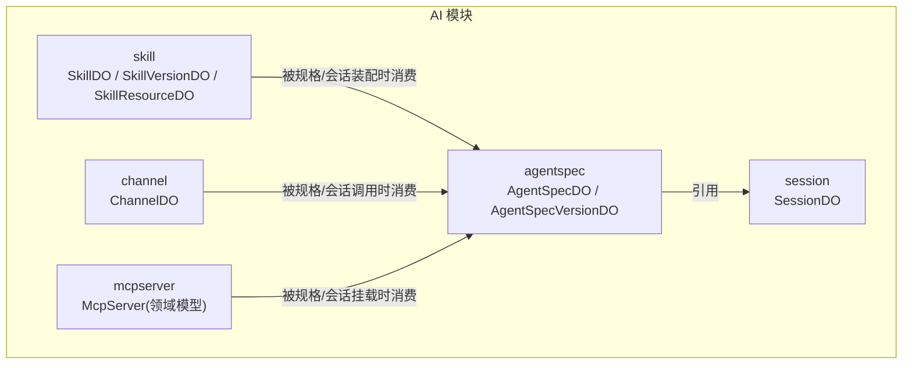
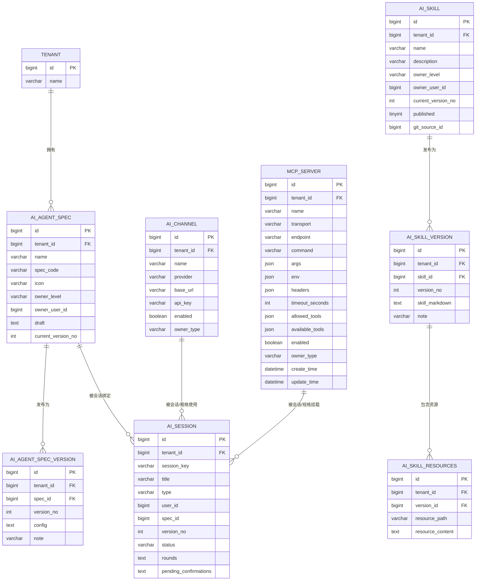
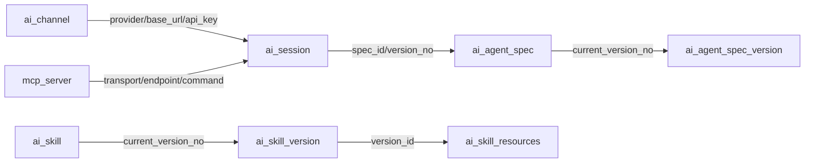

# 核心业务表设计

<cite>
**本文引用的文件**
- [AgentSpecDO.java](file://nexai-module-ai/src/main/java/com/gkht/ai/nexai/module/ai/agentspec/infrastructure/dataobject/AgentSpecDO.java)
- [AgentSpecVersionDO.java](file://nexai-module-ai/src/main/java/com/gkht/ai/nexai/module/ai/agentspec/infrastructure/dataobject/AgentSpecVersionDO.java)
- [SessionDO.java](file://nexai-module-ai/src/main/java/com/gkht/ai/nexai/module/ai/session/infrastructure/dataobject/SessionDO.java)
- [ChannelDO.java](file://nexai-module-ai/src/main/java/com/gkht/ai/nexai/module/ai/channel/infrastructure/dataobject/ChannelDO.java)
- [McpServer.java](file://nexai-module-ai/src/main/java/com/gkht/ai/nexai/module/ai/mcpserver/domain/model/McpServer.java)
- [SkillDO.java](file://nexai-module-ai/src/main/java/com/gkht/ai/nexai/module/ai/skill/infrastructure/dataobject/SkillDO.java)
- [SkillVersionDO.java](file://nexai-module-ai/src/main/java/com/gkht/ai/nexai/module/ai/skill/infrastructure/dataobject/SkillVersionDO.java)
- [SkillResourceDO.java](file://nexai-module-ai/src/main/java/com/gkht/ai/nexai/module/ai/skill/infrastructure/dataobject/SkillResourceDO.java)
</cite>

## 目录
1. [简介](#简介)
2. [项目结构](#项目结构)
3. [核心组件](#核心组件)
4. [架构总览](#架构总览)
5. [详细组件分析](#详细组件分析)
6. [依赖关系分析](#依赖关系分析)
7. [性能考虑](#性能考虑)
8. [故障排查指南](#故障排查指南)
9. [结论](#结论)
10. [附录](#附录)

## 简介
本文件面向 NexAI 平台的核心业务模块，聚焦数据库表设计与数据模型说明。围绕 Agent 规格（agent_spec、agent_spec_version）、会话（session）、技能（skill、skill_version、skill_resources）、渠道（channel）与 MCP 服务器（mcp_server）等关键实体，给出字段定义、数据类型与约束建议、主外键与业务约束、多租户隔离方案、索引优化策略以及查询性能建议。文档同时提供 DDL 脚本示例与数据字典，帮助研发与运维快速理解并落地实施。

## 项目结构
NexAI 采用领域分层与模块化组织：
- 领域层：承载核心业务概念与规则（如 McpServer 聚合根）。
- 基础设施层：以 DO（Data Object）映射数据库表，使用 MyBatis-Plus 注解声明表名、主键序列与字段策略。
- 应用层与服务层：编排领域对象与持久化操作，对外暴露能力。

下图展示与本次文档相关的核心 DO 与领域模型在代码中的位置与职责划分。



图表来源
- [AgentSpecDO.java:18-59](file://nexai-module-ai/src/main/java/com/gkht/ai/nexai/module/ai/agentspec/infrastructure/dataobject/AgentSpecDO.java#L18-L59)
- [AgentSpecVersionDO.java:17-43](file://nexai-module-ai/src/main/java/com/gkht/ai/nexai/module/ai/agentspec/infrastructure/dataobject/AgentSpecVersionDO.java#L17-L43)
- [SessionDO.java:18-64](file://nexai-module-ai/src/main/java/com/gkht/ai/nexai/module/ai/session/infrastructure/dataobject/SessionDO.java#L18-L64)
- [ChannelDO.java:15-50](file://nexai-module-ai/src/main/java/com/gkht/ai/nexai/module/ai/channel/infrastructure/dataobject/ChannelDO.java#L15-L50)
- [McpServer.java:36-65](file://nexai-module-ai/src/main/java/com/gkht/ai/nexai/module/ai/mcpserver/domain/model/McpServer.java#L36-L65)
- [SkillDO.java:14-52](file://nexai-module-ai/src/main/java/com/gkht/ai/nexai/module/ai/skill/infrastructure/dataobject/SkillDO.java#L14-L52)
- [SkillVersionDO.java:15-41](file://nexai-module-ai/src/main/java/com/gkht/ai/nexai/module/ai/skill/infrastructure/dataobject/SkillVersionDO.java#L15-L41)
- [SkillResourceDO.java:14-36](file://nexai-module-ai/src/main/java/com/gkht/ai/nexai/module/ai/skill/infrastructure/dataobject/SkillResourceDO.java#L14-L36)

章节来源
- [AgentSpecDO.java:18-59](file://nexai-module-ai/src/main/java/com/gkht/ai/nexai/module/ai/agentspec/infrastructure/dataobject/AgentSpecDO.java#L18-L59)
- [AgentSpecVersionDO.java:17-43](file://nexai-module-ai/src/main/java/com/gkht/ai/nexai/module/ai/agentspec/infrastructure/dataobject/AgentSpecVersionDO.java#L17-L43)
- [SessionDO.java:18-64](file://nexai-module-ai/src/main/java/com/gkht/ai/nexai/module/ai/session/infrastructure/dataobject/SessionDO.java#L18-L64)
- [ChannelDO.java:15-50](file://nexai-module-ai/src/main/java/com/gkht/ai/nexai/module/ai/channel/infrastructure/dataobject/ChannelDO.java#L15-L50)
- [McpServer.java:36-65](file://nexai-module-ai/src/main/java/com/gkht/ai/nexai/module/ai/mcpserver/domain/model/McpServer.java#L36-L65)
- [SkillDO.java:14-52](file://nexai-module-ai/src/main/java/com/gkht/ai/nexai/module/ai/skill/infrastructure/dataobject/SkillDO.java#L14-L52)
- [SkillVersionDO.java:15-41](file://nexai-module-ai/src/main/java/com/gkht/ai/nexai/module/ai/skill/infrastructure/dataobject/SkillVersionDO.java#L15-L41)
- [SkillResourceDO.java:14-36](file://nexai-module-ai/src/main/java/com/gkht/ai/nexai/module/ai/skill/infrastructure/dataobject/SkillResourceDO.java#L14-L36)

## 核心组件
本节概述各核心表的职责与关键字段：
- agent_spec：智能体规格元数据与草稿配置、当前版本指针。
- agent_spec_version：规格发布后的不可变配置快照。
- session：会话元数据、消息轮次快照、HITL 挂起上下文。
- skill / skill_version / skill_resources：技能资产及其版本与资源文件。
- channel：渠道连接信息（含加密的 API Key）。
- mcp_server：外部工具服务接入点（传输、端点/命令、认证头、白名单等）。

章节来源
- [AgentSpecDO.java:18-59](file://nexai-module-ai/src/main/java/com/gkht/ai/nexai/module/ai/agentspec/infrastructure/dataobject/AgentSpecDO.java#L18-L59)
- [AgentSpecVersionDO.java:17-43](file://nexai-module-ai/src/main/java/com/gkht/ai/nexai/module/ai/agentspec/infrastructure/dataobject/AgentSpecVersionDO.java#L17-L43)
- [SessionDO.java:18-64](file://nexai-module-ai/src/main/java/com/gkht/ai/nexai/module/ai/session/infrastructure/dataobject/SessionDO.java#L18-L64)
- [SkillDO.java:14-52](file://nexai-module-ai/src/main/java/com/gkht/ai/nexai/module/ai/skill/infrastructure/dataobject/SkillDO.java#L14-L52)
- [SkillVersionDO.java:15-41](file://nexai-module-ai/src/main/java/com/gkht/ai/nexai/module/ai/skill/infrastructure/dataobject/SkillVersionDO.java#L15-L41)
- [SkillResourceDO.java:14-36](file://nexai-module-ai/src/main/java/com/gkht/ai/nexai/module/ai/skill/infrastructure/dataobject/SkillResourceDO.java#L14-L36)
- [ChannelDO.java:15-50](file://nexai-module-ai/src/main/java/com/gkht/ai/nexai/module/ai/channel/infrastructure/dataobject/ChannelDO.java#L15-L50)
- [McpServer.java:36-65](file://nexai-module-ai/src/main/java/com/gkht/ai/nexai/module/ai/mcpserver/domain/model/McpServer.java#L36-L65)

## 架构总览
下图展示了核心表之间的关联关系与数据流向，包括规格与版本、会话与规格、技能与版本、渠道与规格/会话、MCP 服务器与规格/会话的装配关系。



图表来源
- [AgentSpecDO.java:18-59](file://nexai-module-ai/src/main/java/com/gkht/ai/nexai/module/ai/agentspec/infrastructure/dataobject/AgentSpecDO.java#L18-L59)
- [AgentSpecVersionDO.java:17-43](file://nexai-module-ai/src/main/java/com/gkht/ai/nexai/module/ai/agentspec/infrastructure/dataobject/AgentSpecVersionDO.java#L17-L43)
- [SessionDO.java:18-64](file://nexai-module-ai/src/main/java/com/gkht/ai/nexai/module/ai/session/infrastructure/dataobject/SessionDO.java#L18-L64)
- [SkillDO.java:14-52](file://nexai-module-ai/src/main/java/com/gkht/ai/nexai/module/ai/skill/infrastructure/dataobject/SkillDO.java#L14-L52)
- [SkillVersionDO.java:15-41](file://nexai-module-ai/src/main/java/com/gkht/ai/nexai/module/ai/skill/infrastructure/dataobject/SkillVersionDO.java#L15-L41)
- [SkillResourceDO.java:14-36](file://nexai-module-ai/src/main/java/com/gkht/ai/nexai/module/ai/skill/infrastructure/dataobject/SkillResourceDO.java#L14-L36)
- [ChannelDO.java:15-50](file://nexai-module-ai/src/main/java/com/gkht/ai/nexai/module/ai/channel/infrastructure/dataobject/ChannelDO.java#L15-L50)
- [McpServer.java:36-65](file://nexai-module-ai/src/main/java/com/gkht/ai/nexai/module/ai/mcpserver/domain/model/McpServer.java#L36-L65)

## 详细组件分析

### Agent 规格表（ai_agent_spec）
- 用途：管理智能体规格的元数据与草稿配置，维护当前生效版本指针。
- 关键字段
  - id：主键，自增。
  - tenant_id：多租户标识（继承基类）。
  - name：规格名称。
  - spec_code：业务编码，创建后不可变；按归属层级唯一。
  - icon：图标标识。
  - owner_level：归属层级（PLATFORM/TENANT/USER），创建后不可变。
  - owner_user_id：归属用户编号（用户级=创建者），非用户级为空。
  - draft：草稿配置 JSON（四层结构：agent/模型调用/挂载/执行环境），更新策略 ALWAYS。
  - current_version_no：当前生效版本号，NULL 表示从未发布。
- 约束与建议
  - 唯一性：spec_code + owner_level + tenant_id 组合唯一。
  - 草稿清理：发布时需将 draft 写回 NULL，避免残留。
  - 版本指针：current_version_no 指向最新已发布版本。

章节来源
- [AgentSpecDO.java:18-59](file://nexai-module-ai/src/main/java/com/gkht/ai/nexai/module/ai/agentspec/infrastructure/dataobject/AgentSpecDO.java#L18-L59)

### Agent 规格版本表（ai_agent_spec_version）
- 用途：存储规格发布后的不可变配置快照，作为运行权威源。
- 关键字段
  - id：主键，自增。
  - tenant_id：多租户标识（继承基类）。
  - spec_id：所属规格编号。
  - version_no：版本号，严格递增，发布后不可变。
  - config：全量四层配置 JSON（与草稿同构）。
  - note：发布备注。
- 约束与建议
  - 唯一性：(spec_id, version_no) 唯一。
  - 不可变性：只插不改不删。
  - 并发保护：通过唯一索引兜底并发发布。

章节来源
- [AgentSpecVersionDO.java:17-43](file://nexai-module-ai/src/main/java/com/gkht/ai/nexai/module/ai/agentspec/infrastructure/dataobject/AgentSpecVersionDO.java#L17-L43)

### 会话表（ai_session）
- 用途：记录会话元数据、消息轮次快照与 HITL 挂起上下文。
- 关键字段
  - id：主键，自增。
  - tenant_id：多租户标识（继承基类）。
  - session_key：平台侧业务键，全局唯一，同时为 agentscope 槽位 sessionId。
  - title：标题。
  - type：会话类型（DEBUG/CHAT）。
  - user_id：发起用户编号（可为空）。
  - spec_id：绑定规格编号。
  - version_no：绑定版本号（NULL 表示当前版本）。
  - status：状态（READY/ACTIVE/ASKING/CLOSED）。
  - rounds：消息轮次 JSON 数组快照。
  - pending_confirmations：HITL 挂起上下文 JSON（无挂起为空）。
- 约束与建议
  - 唯一性：session_key 全局唯一。
  - 状态机：status 需遵循状态转换规则。
  - 大字段：rounds/pending_confirmations 使用文本类型，注意分页与查询裁剪。

章节来源
- [SessionDO.java:18-64](file://nexai-module-ai/src/main/java/com/gkht/ai/nexai/module/ai/session/infrastructure/dataobject/SessionDO.java#L18-L64)

### 技能表族（ai_skill / ai_skill_version / ai_skill_resources）
- 用途：管理技能资产、版本与资源文件。
- 关键字段
  - ai_skill：id、tenant_id、name、description、owner_level、owner_user_id、current_version_no、published、git_source_id。
  - ai_skill_version：id、tenant_id、skill_id、version_no、skill_markdown、note。
  - ai_skill_resources：id、tenant_id、version_id、resource_path、resource_content。
- 约束与建议
  - 版本唯一性：(skill_id, version_no) 唯一。
  - 资源路径唯一性：(version_id, resource_path) 唯一。
  - 内容存储：skill_markdown 与 resource_content 使用文本类型；二进制内容以 base64: 前缀存储。

章节来源
- [SkillDO.java:14-52](file://nexai-module-ai/src/main/java/com/gkht/ai/nexai/module/ai/skill/infrastructure/dataobject/SkillDO.java#L14-L52)
- [SkillVersionDO.java:15-41](file://nexai-module-ai/src/main/java/com/gkht/ai/nexai/module/ai/skill/infrastructure/dataobject/SkillVersionDO.java#L15-L41)
- [SkillResourceDO.java:14-36](file://nexai-module-ai/src/main/java/com/gkht/ai/nexai/module/ai/skill/infrastructure/dataobject/SkillResourceDO.java#L14-L36)

### 渠道表（ai_channel）
- 用途：管理外部模型或服务的渠道连接信息。
- 关键字段
  - id：主键，自增。
  - tenant_id：多租户标识（继承基类）。
  - name：渠道名称。
  - provider：提供商类型编码。
  - base_url：端点地址。
  - api_key：API 密钥，经 AES 加密落库与解密读取。
  - enabled：是否启用。
  - owner_type：归属维度编码（platform/tenant）。
- 约束与建议
  - 安全：api_key 必须加密存储，读取时自动解密。
  - 可用性：enabled 控制是否参与运行时装配。

章节来源
- [ChannelDO.java:15-50](file://nexai-module-ai/src/main/java/com/gkht/ai/nexai/module/ai/channel/infrastructure/dataobject/ChannelDO.java#L15-L50)

### MCP 服务器（mcp_server）
- 用途：BYO-MCP 外部工具服务接入点，支持 stdio/SSE/Streamable HTTP 传输。
- 关键字段（基于领域模型）
  - id：主键。
  - tenant_id：多租户标识。
  - name：名称（同一租户内区分多个 server）。
  - transport：传输类型（stdio/http）。
  - endpoint：HTTP 系传输必填（http/https）。
  - command：stdio 传输必填。
  - args：stdio 启动参数。
  - env：stdio 环境变量（凭证走此处）。
  - headers：HTTP 系传输认证头（如 Authorization）。
  - timeout_seconds：请求超时（秒）。
  - allowed_tools：工具白名单（空=全部工具）。
  - available_tools：最近一次探测拉取的工具清单（信息性缓存）。
  - enabled：是否启用。
  - owner_type：归属维度（MVP 固定 TENANT）。
  - create_time/update_time：时间戳。
- 约束与建议
  - 互斥校验：stdio 与 HTTP 系传输的 endpoint/command 互斥。
  - 白名单校验：allowed_tools 需在 available_tools 子集范围内。
  - 安全：headers/env 可能包含敏感信息，建议加密或受控访问。

章节来源
- [McpServer.java:36-65](file://nexai-module-ai/src/main/java/com/gkht/ai/nexai/module/ai/mcpserver/domain/model/McpServer.java#L36-L65)
- [McpServer.java:186-232](file://nexai-module-ai/src/main/java/com/gkht/ai/nexai/module/ai/mcpserver/domain/model/McpServer.java#L186-L232)

## 依赖关系分析
- 规格与版本：ai_agent_spec 通过 current_version_no 指向 ai_agent_spec_version；版本不可变，用于运行期权威配置。
- 会话与规格：ai_session 通过 spec_id/version_no 绑定具体规格与版本；会话状态流转由运行时驱动。
- 技能与版本：ai_skill 通过 current_version_no 指向 ai_skill_version；资源文件拆分到 ai_skill_resources。
- 渠道与规格/会话：ai_channel 被规格/会话在调用外部模型或服务时使用。
- MCP 服务器与规格/会话：mcp_server 被规格/会话在挂载外部工具时使用。



图表来源
- [AgentSpecDO.java:18-59](file://nexai-module-ai/src/main/java/com/gkht/ai/nexai/module/ai/agentspec/infrastructure/dataobject/AgentSpecDO.java#L18-L59)
- [AgentSpecVersionDO.java:17-43](file://nexai-module-ai/src/main/java/com/gkht/ai/nexai/module/ai/agentspec/infrastructure/dataobject/AgentSpecVersionDO.java#L17-L43)
- [SessionDO.java:18-64](file://nexai-module-ai/src/main/java/com/gkht/ai/nexai/module/ai/session/infrastructure/dataobject/SessionDO.java#L18-L64)
- [SkillDO.java:14-52](file://nexai-module-ai/src/main/java/com/gkht/ai/nexai/module/ai/skill/infrastructure/dataobject/SkillDO.java#L14-L52)
- [SkillVersionDO.java:15-41](file://nexai-module-ai/src/main/java/com/gkht/ai/nexai/module/ai/skill/infrastructure/dataobject/SkillVersionDO.java#L15-L41)
- [SkillResourceDO.java:14-36](file://nexai-module-ai/src/main/java/com/gkht/ai/nexai/module/ai/skill/infrastructure/dataobject/SkillResourceDO.java#L14-L36)
- [ChannelDO.java:15-50](file://nexai-module-ai/src/main/java/com/gkht/ai/nexai/module/ai/channel/infrastructure/dataobject/ChannelDO.java#L15-L50)
- [McpServer.java:36-65](file://nexai-module-ai/src/main/java/com/gkht/ai/nexai/module/ai/mcpserver/domain/model/McpServer.java#L36-L65)

## 性能考虑
- 索引策略
  - ai_agent_spec：(tenant_id, owner_level, spec_code) 唯一索引；(tenant_id, current_version_no) 普通索引。
  - ai_agent_spec_version：(spec_id, version_no) 唯一索引；(tenant_id, spec_id) 普通索引。
  - ai_session：(tenant_id, session_key) 唯一索引；(tenant_id, spec_id)、(tenant_id, status)、(tenant_id, create_time) 普通索引。
  - ai_skill：(tenant_id, name) 唯一索引；(tenant_id, published) 普通索引。
  - ai_skill_version：(skill_id, version_no) 唯一索引；(tenant_id, skill_id) 普通索引。
  - ai_skill_resources：(version_id, resource_path) 唯一索引；(tenant_id, version_id) 普通索引。
  - ai_channel：(tenant_id, name) 唯一索引；(tenant_id, provider) 普通索引。
  - mcp_server：(tenant_id, name) 唯一索引；(tenant_id, owner_type) 普通索引。
- 大字段优化
  - rounds、pending_confirmations、config、draft、skill_markdown、resource_content 使用 TEXT/LONGTEXT，避免在频繁查询中 SELECT *，按需投影。
- 读写分离与缓存
  - 规格/版本读多写少，可引入缓存；会话写入频繁，建议分库分表或归档历史会话。
- 事务与一致性
  - 发布规格/技能版本需保证原子性，结合唯一索引防止重复发布。

[本节为通用性能建议，无需特定文件来源]

## 故障排查指南
- 草稿未清空导致旧配置残留
  - 现象：发布后仍读到旧草稿。
  - 处理：确保更新策略 ALWAYS 将 draft 写回 NULL。
  - 参考：[AgentSpecDO.java:50-55](file://nexai-module-ai/src/main/java/com/gkht/ai/nexai/module/ai/agentspec/infrastructure/dataobject/AgentSpecDO.java#L50-L55)
- 会话 key 冲突
  - 现象：创建会话时报唯一性冲突。
  - 处理：检查 session_key 生成策略，确保全局唯一。
  - 参考：[SessionDO.java:29-32](file://nexai-module-ai/src/main/java/com/gkht/ai/nexai/module/ai/session/infrastructure/dataobject/SessionDO.java#L29-L32)
- 渠道密钥解密失败
  - 现象：读取渠道信息时报错。
  - 处理：确认 EncryptTypeHandler 配置正确，密钥一致。
  - 参考：[ChannelDO.java:39-42](file://nexai-module-ai/src/main/java/com/gkht/ai/nexai/module/ai/channel/infrastructure/dataobject/ChannelDO.java#L39-L42)
- MCP 白名单校验失败
  - 现象：更新白名单时报错。
  - 处理：确保 allowed_tools 是 available_tools 的子集。
  - 参考：[McpServer.java:139-144](file://nexai-module-ai/src/main/java/com/gkht/ai/nexai/module/ai/mcpserver/domain/model/McpServer.java#L139-L144)

章节来源
- [AgentSpecDO.java:50-55](file://nexai-module-ai/src/main/java/com/gkht/ai/nexai/module/ai/agentspec/infrastructure/dataobject/AgentSpecDO.java#L50-L55)
- [SessionDO.java:29-32](file://nexai-module-ai/src/main/java/com/gkht/ai/nexai/module/ai/session/infrastructure/dataobject/SessionDO.java#L29-L32)
- [ChannelDO.java:39-42](file://nexai-module-ai/src/main/java/com/gkht/ai/nexai/module/ai/channel/infrastructure/dataobject/ChannelDO.java#L39-L42)
- [McpServer.java:139-144](file://nexai-module-ai/src/main/java/com/gkht/ai/nexai/module/ai/mcpserver/domain/model/McpServer.java#L139-L144)

## 结论
本设计通过“规格+版本”、“技能+版本+资源”、“会话+消息快照”、“渠道+MCP 服务器”的组合，实现了可追溯、可复用、可扩展的智能体运行基座。多租户通过 tenant_id 贯穿所有核心表，配合唯一索引与业务约束，保障数据隔离与一致性。建议在上线前完成索引完善、大字段查询优化与缓存策略落地，并结合监控告警保障高可用。

[本节为总结性内容，无需特定文件来源]

## 附录

### 数据字典（核心表）
- ai_agent_spec
  - id：bigint，主键
  - tenant_id：bigint，多租户
  - name：varchar(255)，规格名称
  - spec_code：varchar(128)，业务编码（唯一）
  - icon：varchar(255)，图标标识
  - owner_level：varchar(32)，归属层级
  - owner_user_id：bigint，归属用户
  - draft：text，草稿配置 JSON
  - current_version_no：int，当前版本指针
- ai_agent_spec_version
  - id：bigint，主键
  - tenant_id：bigint，多租户
  - spec_id：bigint，规格ID
  - version_no：int，版本号（唯一）
  - config：text，全量配置 JSON
  - note：varchar(512)，发布备注
- ai_session
  - id：bigint，主键
  - tenant_id：bigint，多租户
  - session_key：varchar(128)，全局唯一
  - title：varchar(255)，标题
  - type：varchar(32)，会话类型
  - user_id：bigint，发起用户
  - spec_id：bigint，规格ID
  - version_no：int，绑定版本
  - status：varchar(32)，状态
  - rounds：text，消息轮次 JSON
  - pending_confirmations：text，HITL 上下文 JSON
- ai_skill
  - id：bigint，主键
  - tenant_id：bigint，多租户
  - name：varchar(255)，技能名称（唯一）
  - description：text，描述
  - owner_level：varchar(32)，归属层级
  - owner_user_id：bigint，归属用户
  - current_version_no：int，当前版本
  - published：tinyint，是否上架
  - git_source_id：bigint，Git 源ID
- ai_skill_version
  - id：bigint，主键
  - tenant_id：bigint，多租户
  - skill_id：bigint，技能ID
  - version_no：int，版本号（唯一）
  - skill_markdown：text，SKILL.md 全文
  - note：varchar(512)，版本备注
- ai_skill_resources
  - id：bigint，主键
  - tenant_id：bigint，多租户
  - version_id：bigint，版本ID
  - resource_path：varchar(512)，资源路径（唯一）
  - resource_content：text，资源内容（文本或 base64 二进制）
- ai_channel
  - id：bigint，主键
  - tenant_id：bigint，多租户
  - name：varchar(255)，渠道名称（唯一）
  - provider：varchar(128)，提供商类型
  - base_url：varchar(512)，端点地址
  - api_key：varchar(1024)，API 密钥（加密）
  - enabled：boolean，是否启用
  - owner_type：varchar(32)，归属维度
- mcp_server
  - id：bigint，主键
  - tenant_id：bigint，多租户
  - name：varchar(255)，名称（唯一）
  - transport：varchar(32)，传输类型
  - endpoint：varchar(512)，端点地址
  - command：varchar(255)，启动命令
  - args：json，启动参数
  - env：json，环境变量
  - headers：json，认证头
  - timeout_seconds：int，超时秒数
  - allowed_tools：json，工具白名单
  - available_tools：json，可用工具清单
  - enabled：boolean，是否启用
  - owner_type：varchar(32)，归属维度
  - create_time：datetime，创建时间
  - update_time：datetime，更新时间

[本节为数据字典汇总，无需特定文件来源]

### DDL 脚本示例（MySQL 风格）
以下为基于上述数据字典的 DDL 示例，供参考与落地。实际部署请根据数据库方言调整。

```sql
CREATE TABLE ai_agent_spec (
  id BIGINT AUTO_INCREMENT PRIMARY KEY,
  tenant_id BIGINT NOT NULL,
  name VARCHAR(255) NOT NULL,
  spec_code VARCHAR(128) NOT NULL,
  icon VARCHAR(255),
  owner_level VARCHAR(32) NOT NULL,
  owner_user_id BIGINT,
  draft TEXT,
  current_version_no INT,
  INDEX idx_tenant_owner_code (tenant_id, owner_level, spec_code),
  UNIQUE uk_tenant_owner_code (tenant_id, owner_level, spec_code),
  INDEX idx_tenant_current_ver (tenant_id, current_version_no)
);

CREATE TABLE ai_agent_spec_version (
  id BIGINT AUTO_INCREMENT PRIMARY KEY,
  tenant_id BIGINT NOT NULL,
  spec_id BIGINT NOT NULL,
  version_no INT NOT NULL,
  config TEXT NOT NULL,
  note VARCHAR(512),
  INDEX idx_tenant_spec (tenant_id, spec_id),
  UNIQUE uk_spec_version (spec_id, version_no)
);

CREATE TABLE ai_session (
  id BIGINT AUTO_INCREMENT PRIMARY KEY,
  tenant_id BIGINT NOT NULL,
  session_key VARCHAR(128) NOT NULL,
  title VARCHAR(255),
  type VARCHAR(32),
  user_id BIGINT,
  spec_id BIGINT,
  version_no INT,
  status VARCHAR(32),
  rounds TEXT,
  pending_confirmations TEXT,
  UNIQUE uk_session_key (session_key),
  INDEX idx_tenant_spec (tenant_id, spec_id),
  INDEX idx_tenant_status (tenant_id, status),
  INDEX idx_tenant_create_time (tenant_id, create_time)
);

CREATE TABLE ai_skill (
  id BIGINT AUTO_INCREMENT PRIMARY KEY,
  tenant_id BIGINT NOT NULL,
  name VARCHAR(255) NOT NULL,
  description TEXT,
  owner_level VARCHAR(32) NOT NULL,
  owner_user_id BIGINT,
  current_version_no INT,
  published TINYINT DEFAULT 0,
  git_source_id BIGINT,
  UNIQUE uk_tenant_name (tenant_id, name),
  INDEX idx_tenant_published (tenant_id, published)
);

CREATE TABLE ai_skill_version (
  id BIGINT AUTO_INCREMENT PRIMARY KEY,
  tenant_id BIGINT NOT NULL,
  skill_id BIGINT NOT NULL,
  version_no INT NOT NULL,
  skill_markdown TEXT,
  note VARCHAR(512),
  INDEX idx_tenant_skill (tenant_id, skill_id),
  UNIQUE uk_skill_version (skill_id, version_no)
);

CREATE TABLE ai_skill_resources (
  id BIGINT AUTO_INCREMENT PRIMARY KEY,
  tenant_id BIGINT NOT NULL,
  version_id BIGINT NOT NULL,
  resource_path VARCHAR(512) NOT NULL,
  resource_content TEXT,
  INDEX idx_tenant_version (tenant_id, version_id),
  UNIQUE uk_version_path (version_id, resource_path)
);

CREATE TABLE ai_channel (
  id BIGINT AUTO_INCREMENT PRIMARY KEY,
  tenant_id BIGINT NOT NULL,
  name VARCHAR(255) NOT NULL,
  provider VARCHAR(128),
  base_url VARCHAR(512),
  api_key VARCHAR(1024),
  enabled BOOLEAN DEFAULT TRUE,
  owner_type VARCHAR(32),
  UNIQUE uk_tenant_name (tenant_id, name),
  INDEX idx_tenant_provider (tenant_id, provider)
);

CREATE TABLE mcp_server (
  id BIGINT AUTO_INCREMENT PRIMARY KEY,
  tenant_id BIGINT NOT NULL,
  name VARCHAR(255) NOT NULL,
  transport VARCHAR(32) NOT NULL,
  endpoint VARCHAR(512),
  command VARCHAR(255),
  args JSON,
  env JSON,
  headers JSON,
  timeout_seconds INT,
  allowed_tools JSON,
  available_tools JSON,
  enabled BOOLEAN DEFAULT TRUE,
  owner_type VARCHAR(32),
  create_time DATETIME,
  update_time DATETIME,
  UNIQUE uk_tenant_name (tenant_id, name),
  INDEX idx_tenant_owner_type (tenant_id, owner_type)
);
```

[本节为示例 DDL，无需特定文件来源]

### 多租户数据隔离说明
- 所有核心表均包含 tenant_id 字段，作为租户隔离键。
- 查询与写入需强制携带 tenant_id 条件，避免跨租户数据泄露。
- 唯一索引设计以 tenant_id 为前缀，确保同一租户内的业务键唯一性。
- 权限与数据权限框架应在应用层拦截并注入 tenant_id 过滤条件。

[本节为通用设计说明，无需特定文件来源]

### 查询性能优化建议
- 优先使用覆盖索引减少回表：如 (tenant_id, spec_code)、(tenant_id, session_key)。
- 对大字段列进行选择性查询，避免 SELECT *。
- 对高频查询建立复合索引：如 (tenant_id, status)、(tenant_id, create_time)。
- 对版本链查询使用 (spec_id, version_no) 或 (skill_id, version_no) 唯一索引加速定位。
- 对 JSON 列（args/env/headers/allowed_tools/available_tools）仅在必要时检索，必要时拆分为独立表或物化视图。

[本节为通用优化建议，无需特定文件来源]