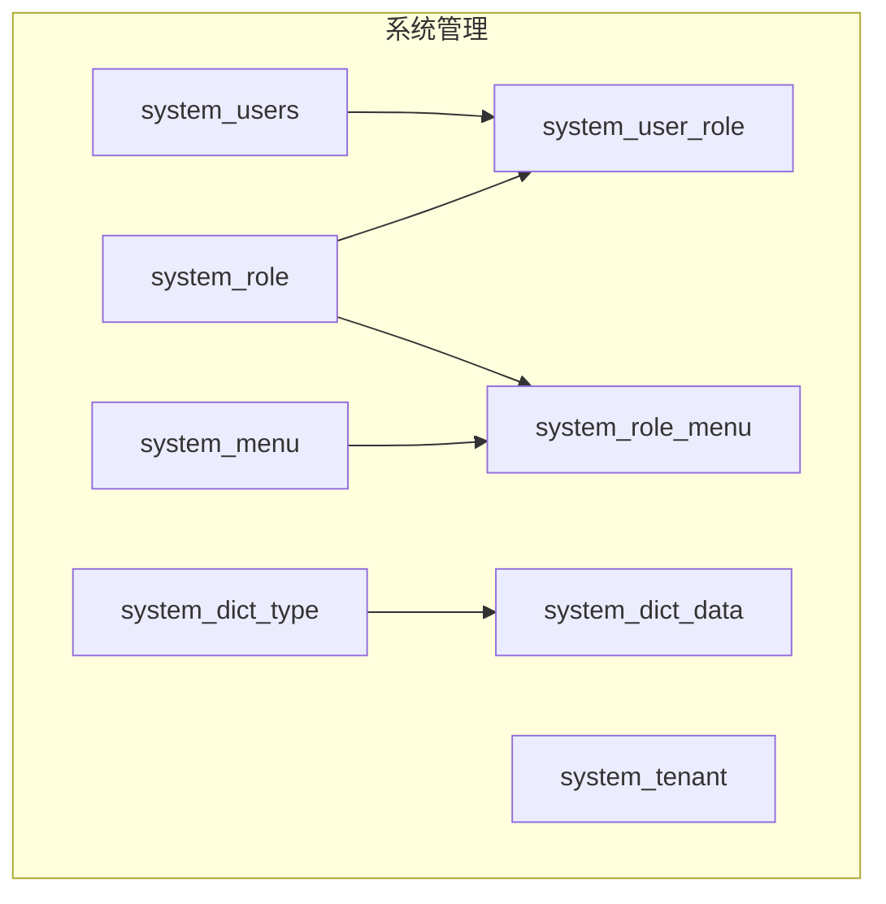
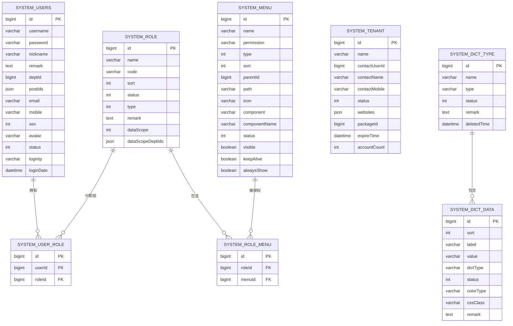
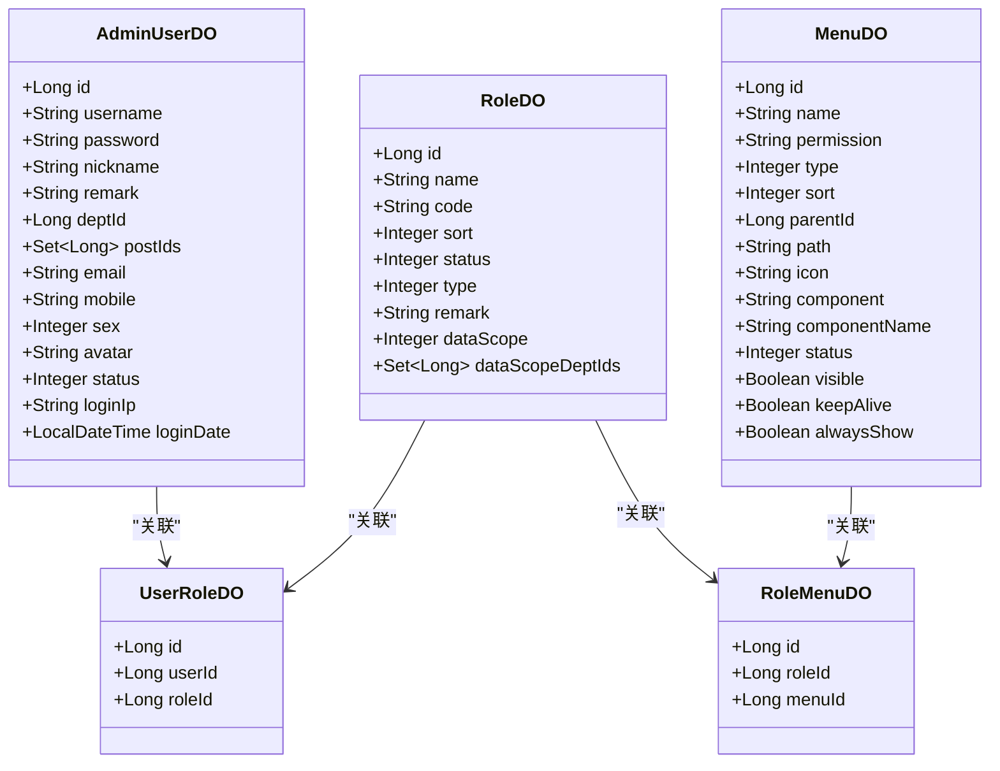
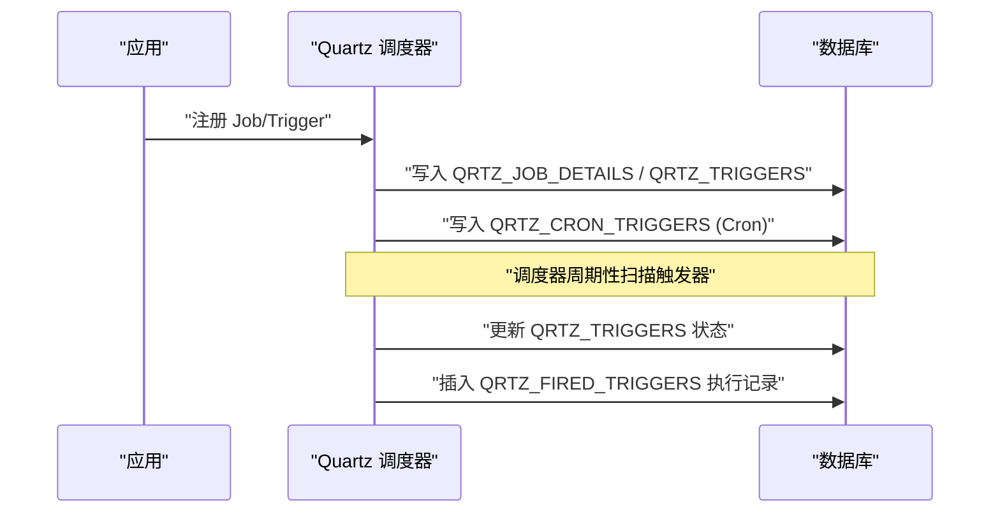
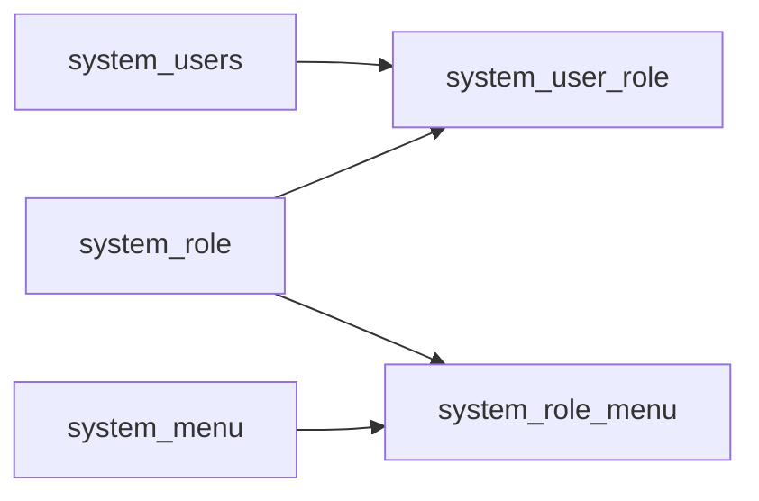

# 系统管理表设计

<cite>
**本文引用的文件**
- [AdminUserDO.java](file://nexai-module-system/src/main/java/com/gkht/ai/nexai/module/system/dal/dataobject/user/AdminUserDO.java)
- [RoleDO.java](file://nexai-module-system/src/main/java/com/gkht/ai/nexai/module/system/dal/dataobject/permission/RoleDO.java)
- [MenuDO.java](file://nexai-module-system/src/main/java/com/gkht/ai/nexai/module/system/dal/dataobject/permission/MenuDO.java)
- [UserRoleDO.java](file://nexai-module-system/src/main/java/com/gkht/ai/nexai/module/system/dal/dataobject/permission/UserRoleDO.java)
- [RoleMenuDO.java](file://nexai-module-system/src/main/java/com/gkht/ai/nexai/module/system/dal/dataobject/permission/RoleMenuDO.java)
- [TenantDO.java](file://nexai-module-system/src/main/java/com/gkht/ai/nexai/module/system/dal/dataobject/tenant/TenantDO.java)
- [DictTypeDO.java](file://nexai-module-system/src/main/java/com/gkht/ai/nexai/module/system/dal/dataobject/dict/DictTypeDO.java)
- [DictDataDO.java](file://nexai-module-system/src/main/java/com/gkht/ai/nexai/module/system/dal/dataobject/dict/DictDataDO.java)
- [quartz_mysql.sql](file://sql/mysql/quartz.sql)
- [quartz_postgresql.sql](file://sql/postgresql/quartz.sql)
- [quartz_dm.sql](file://sql/dm/quartz.sql)
</cite>

## 目录
1. [简介](#简介)
2. [项目结构](#项目结构)
3. [核心组件](#核心组件)
4. [架构总览](#架构总览)
5. [详细组件分析](#详细组件分析)
6. [依赖关系分析](#依赖关系分析)
7. [性能考虑](#性能考虑)
8. [故障排查指南](#故障排查指南)
9. [结论](#结论)
10. [附录](#附录)

## 简介
本文件为 NexAI 平台系统管理模块的数据库表设计文档，覆盖用户、角色、权限、租户、字典、菜单等核心实体，以及 Quartz 定时任务调度表的跨数据库 DDL。文档基于代码中的实体定义与 SQL 脚本进行梳理，提供字段说明、约束建议、数据模型图、权限模型说明、多数据库兼容策略及版本迁移建议，帮助读者快速理解并落地实施。

## 项目结构
系统管理相关的数据对象（DO）集中在 system 模块的 dal/dataobject 下，按功能域划分：
- 用户：system_users
- 角色与权限：system_role、system_menu、system_user_role、system_role_menu
- 租户：system_tenant
- 字典：system_dict_type、system_dict_data
- 定时任务：Quartz 标准表（MySQL/PostgreSQL/达梦 DM 三套脚本）

图表来源
- [AdminUserDO.java:22-23](file://nexai-module-system/src/main/java/com/gkht/ai/nexai/module/system/dal/dataobject/user/AdminUserDO.java#L22-L23)
- [RoleDO.java:22-23](file://nexai-module-system/src/main/java/com/gkht/ai/nexai/module/system/dal/dataobject/permission/RoleDO.java#L22-L23)
- [MenuDO.java:18-19](file://nexai-module-system/src/main/java/com/gkht/ai/nexai/module/system/dal/dataobject/permission/MenuDO.java#L18-L19)
- [UserRoleDO.java:15-16](file://nexai-module-system/src/main/java/com/gkht/ai/nexai/module/system/dal/dataobject/permission/UserRoleDO.java#L15-L16)
- [RoleMenuDO.java:15-16](file://nexai-module-system/src/main/java/com/gkht/ai/nexai/module/system/dal/dataobject/permission/RoleMenuDO.java#L15-L16)
- [TenantDO.java:21-22](file://nexai-module-system/src/main/java/com/gkht/ai/nexai/module/system/dal/dataobject/tenant/TenantDO.java#L21-L22)
- [DictTypeDO.java:18-19](file://nexai-module-system/src/main/java/com/gkht/ai/nexai/module/system/dal/dataobject/dict/DictTypeDO.java#L18-L19)
- [DictDataDO.java:15-16](file://nexai-module-system/src/main/java/com/gkht/ai/nexai/module/system/dal/dataobject/dict/DictDataDO.java#L15-L16)

章节来源
- [AdminUserDO.java:17-96](file://nexai-module-system/src/main/java/com/gkht/ai/nexai/module/system/dal/dataobject/user/AdminUserDO.java#L17-L96)
- [RoleDO.java:17-78](file://nexai-module-system/src/main/java/com/gkht/ai/nexai/module/system/dal/dataobject/permission/RoleDO.java#L17-L78)
- [MenuDO.java:13-109](file://nexai-module-system/src/main/java/com/gkht/ai/nexai/module/system/dal/dataobject/permission/MenuDO.java#L13-L109)
- [UserRoleDO.java:10-35](file://nexai-module-system/src/main/java/com/gkht/ai/nexai/module/system/dal/dataobject/permission/UserRoleDO.java#L10-L35)
- [RoleMenuDO.java:10-35](file://nexai-module-system/src/main/java/com/gkht/ai/nexai/module/system/dal/dataobject/permission/RoleMenuDO.java#L10-L35)
- [TenantDO.java:16-89](file://nexai-module-system/src/main/java/com/gkht/ai/nexai/module/system/dal/dataobject/tenant/TenantDO.java#L16-L89)
- [DictTypeDO.java:13-58](file://nexai-module-system/src/main/java/com/gkht/ai/nexai/module/system/dal/dataobject/dict/DictTypeDO.java#L13-L58)
- [DictDataDO.java:10-67](file://nexai-module-system/src/main/java/com/gkht/ai/nexai/module/system/dal/dataobject/dict/DictDataDO.java#L10-L67)

## 核心组件
本节概述各核心表的职责与关键字段，便于快速定位与理解。

- 用户表 system_users
  - 主键：id
  - 账号：username
  - 密码：password（加密存储）
  - 昵称：nickname
  - 备注：remark
  - 部门：deptId
  - 岗位集合：postIds（JSON/数组类型）
  - 邮箱：email
  - 手机：mobile
  - 性别：sex
  - 头像：avatar
  - 状态：status
  - 登录信息：loginIp、loginDate
  - 审计字段：由基类提供（如创建/更新时间等）

- 角色表 system_role
  - 主键：id
  - 名称：name
  - 编码：code
  - 排序：sort
  - 状态：status
  - 类型：type
  - 备注：remark
  - 数据范围：dataScope
  - 数据范围部门集合：dataScopeDeptIds（JSON/数组类型）
  - 审计字段：由基类提供

- 菜单表 system_menu
  - 主键：id
  - 名称：name
  - 权限标识：permission（格式示例：system:admin:add）
  - 类型：type
  - 排序：sort
  - 父节点：parentId
  - 路由：path
  - 图标：icon
  - 组件：component、componentName
  - 状态：status
  - 可见性：visible
  - 缓存：keepAlive
  - 总是显示：alwaysShow
  - 审计字段：由基类提供

- 用户-角色关联表 system_user_role
  - 主键：id
  - 用户ID：userId
  - 角色ID：roleId

- 角色-菜单关联表 system_role_menu
  - 主键：id
  - 角色ID：roleId
  - 菜单ID：menuId

- 租户表 system_tenant
  - 主键：id
  - 名称：name
  - 联系人用户ID：contactUserId
  - 联系人：contactName
  - 联系手机：contactMobile
  - 状态：status
  - 绑定域名列表：websites（数组类型）
  - 套餐ID：packageId
  - 过期时间：expireTime
  - 账号数量：accountCount
  - 审计字段：由基类提供

- 字典类型表 system_dict_type
  - 主键：id
  - 名称：name
  - 类型：type
  - 状态：status
  - 备注：remark
  - 删除时间：deletedTime
  - 审计字段：由基类提供

- 字典数据表 system_dict_data
  - 主键：id
  - 排序：sort
  - 标签：label
  - 值：value
  - 类型：dictType（冗余）
  - 状态：status
  - 颜色：colorType
  - CSS样式：cssClass
  - 备注：remark
  - 审计字段：由基类提供

章节来源
- [AdminUserDO.java:31-94](file://nexai-module-system/src/main/java/com/gkht/ai/nexai/module/system/dal/dataobject/user/AdminUserDO.java#L31-L94)
- [RoleDO.java:28-76](file://nexai-module-system/src/main/java/com/gkht/ai/nexai/module/system/dal/dataobject/permission/RoleDO.java#L28-L76)
- [MenuDO.java:33-107](file://nexai-module-system/src/main/java/com/gkht/ai/nexai/module/system/dal/dataobject/permission/MenuDO.java#L33-L107)
- [UserRoleDO.java:21-33](file://nexai-module-system/src/main/java/com/gkht/ai/nexai/module/system/dal/dataobject/permission/UserRoleDO.java#L21-L33)
- [RoleMenuDO.java:21-33](file://nexai-module-system/src/main/java/com/gkht/ai/nexai/module/system/dal/dataobject/permission/RoleMenuDO.java#L21-L33)
- [TenantDO.java:32-87](file://nexai-module-system/src/main/java/com/gkht/ai/nexai/module/system/dal/dataobject/tenant/TenantDO.java#L32-L87)
- [DictTypeDO.java:29-56](file://nexai-module-system/src/main/java/com/gkht/ai/nexai/module/system/dal/dataobject/dict/DictTypeDO.java#L29-L56)
- [DictDataDO.java:22-65](file://nexai-module-system/src/main/java/com/gkht/ai/nexai/module/system/dal/dataobject/dict/DictDataDO.java#L22-L65)

## 架构总览
下图展示系统管理模块的核心数据模型与关系，包括 RBAC 权限控制的基本路径：用户通过角色获得菜单权限，菜单携带权限标识用于接口与前端按钮控制。

图表来源
- [AdminUserDO.java:22-23](file://nexai-module-system/src/main/java/com/gkht/ai/nexai/module/system/dal/dataobject/user/AdminUserDO.java#L22-L23)
- [RoleDO.java:22-23](file://nexai-module-system/src/main/java/com/gkht/ai/nexai/module/system/dal/dataobject/permission/RoleDO.java#L22-L23)
- [MenuDO.java:18-19](file://nexai-module-system/src/main/java/com/gkht/ai/nexai/module/system/dal/dataobject/permission/MenuDO.java#L18-L19)
- [UserRoleDO.java:15-16](file://nexai-module-system/src/main/java/com/gkht/ai/nexai/module/system/dal/dataobject/permission/UserRoleDO.java#L15-L16)
- [RoleMenuDO.java:15-16](file://nexai-module-system/src/main/java/com/gkht/ai/nexai/module/system/dal/dataobject/permission/RoleMenuDO.java#L15-L16)
- [TenantDO.java:21-22](file://nexai-module-system/src/main/java/com/gkht/ai/nexai/module/system/dal/dataobject/tenant/TenantDO.java#L21-L22)
- [DictTypeDO.java:18-19](file://nexai-module-system/src/main/java/com/gkht/ai/nexai/module/system/dal/dataobject/dict/DictTypeDO.java#L18-L19)
- [DictDataDO.java:15-16](file://nexai-module-system/src/main/java/com/gkht/ai/nexai/module/system/dal/dataobject/dict/DictDataDO.java#L15-L16)

## 详细组件分析

### 用户与角色权限（RBAC）数据模型
- 用户与角色：多对多，通过 system_user_role 关联
- 角色与菜单：多对多，通过 system_role_menu 关联
- 菜单权限标识：permission 字段作为后端接口鉴权与前端按钮显隐的依据
- 数据范围：role.dataScope 与 role.dataScopeDeptIds 支持行级数据权限控制

图表来源
- [AdminUserDO.java:31-94](file://nexai-module-system/src/main/java/com/gkht/ai/nexai/module/system/dal/dataobject/user/AdminUserDO.java#L31-L94)
- [RoleDO.java:28-76](file://nexai-module-system/src/main/java/com/gkht/ai/nexai/module/system/dal/dataobject/permission/RoleDO.java#L28-L76)
- [MenuDO.java:33-107](file://nexai-module-system/src/main/java/com/gkht/ai/nexai/module/system/dal/dataobject/permission/MenuDO.java#L33-L107)
- [UserRoleDO.java:21-33](file://nexai-module-system/src/main/java/com/gkht/ai/nexai/module/system/dal/dataobject/permission/UserRoleDO.java#L21-L33)
- [RoleMenuDO.java:21-33](file://nexai-module-system/src/main/java/com/gkht/ai/nexai/module/system/dal/dataobject/permission/RoleMenuDO.java#L21-L33)

章节来源
- [MenuDO.java:40-49](file://nexai-module-system/src/main/java/com/gkht/ai/nexai/module/system/dal/dataobject/permission/MenuDO.java#L40-L49)
- [RoleDO.java:64-76](file://nexai-module-system/src/main/java/com/gkht/ai/nexai/module/system/dal/dataobject/permission/RoleDO.java#L64-L76)

### 租户管理
- 租户表用于隔离业务数据与资源配额
- 关键字段：name、contactUserId、contactName、contactMobile、status、websites、packageId、expireTime、accountCount
- 建议约束：name 唯一；contactUserId 可外键关联用户；expireTime 用于到期控制；websites 使用 JSON 或数组类型存储

章节来源
- [TenantDO.java:32-87](file://nexai-module-system/src/main/java/com/gkht/ai/nexai/module/system/dal/dataobject/tenant/TenantDO.java#L32-L87)

### 字典管理
- 字典类型与字典数据分离，便于统一维护枚举与展示
- 关键字段：
  - 类型：name、type、status、remark、deletedTime
  - 数据：sort、label、value、dictType、status、colorType、cssClass、remark
- 建议索引：dict_type 上建立索引以加速查询

章节来源
- [DictTypeDO.java:29-56](file://nexai-module-system/src/main/java/com/gkht/ai/nexai/module/system/dal/dataobject/dict/DictTypeDO.java#L29-L56)
- [DictDataDO.java:22-65](file://nexai-module-system/src/main/java/com/gkht/ai/nexai/module/system/dal/dataobject/dict/DictDataDO.java#L22-L65)

### 定时任务调度（Quartz）
- 提供 MySQL、PostgreSQL、达梦 DM 三套标准脚本
- 核心表：
  - QRTZ_JOB_DETAILS：作业详情
  - QRTZ_TRIGGERS：触发器
  - QRTZ_CRON_TRIGGERS：Cron 表达式
  - QRTZ_SIMPLE_TRIGGERS：简单触发器
  - QRTZ_SIMPROP_TRIGGERS：复杂属性触发器
  - QRTZ_BLOB_TRIGGERS：二进制触发器
  - QRTZ_CALENDARS：日历
  - QRTZ_FIRED_TRIGGERS：已触发记录
  - QRTZ_PAUSED_TRIGGER_GRPS：暂停组
  - QRTZ_SCHEDULER_STATE：调度器状态
  - QRTZ_LOCKS：分布式锁
- 建议：
  - 合理设置 SCHED_NAME 区分不同调度实例
  - 根据业务量在 QRTZ_TRIGGERS 与 QRTZ_FIRED_TRIGGERS 上建立复合索引
  - 定期清理 QRTZ_FIRED_TRIGGERS 历史数据

图表来源
- [quartz_mysql.sql:115-136](file://sql/mysql/quartz.sql#L115-L136)
- [quartz_mysql.sql:241-281](file://sql/mysql/quartz.sql#L241-L281)
- [quartz_postgresql.sql:19-55](file://sql/postgresql/quartz.sql#L19-L55)
- [quartz_dm.sql:23-58](file://sql/dm/quartz.sql#L23-L58)

章节来源
- [quartz_mysql.sql:20-285](file://sql/mysql/quartz.sql#L20-L285)
- [quartz_postgresql.sql:1-208](file://sql/postgresql/quartz.sql#L1-L208)
- [quartz_dm.sql:1-179](file://sql/dm/quartz.sql#L1-L179)

## 依赖关系分析
- 强耦合点：
  - user_role 与 role_menu 是 RBAC 的核心枢纽，任何变更需保证一致性
  - 菜单 permission 与后端 @PreAuthorize 注解、前端权限指令需保持一致
- 外部依赖：
  - Quartz 调度器与数据库交互频繁，需关注事务与锁竞争
- 潜在循环依赖：
  - 菜单树形结构通过 parentId 自引用，注意层级深度与查询性能

图表来源
- [UserRoleDO.java:15-16](file://nexai-module-system/src/main/java/com/gkht/ai/nexai/module/system/dal/dataobject/permission/UserRoleDO.java#L15-L16)
- [RoleMenuDO.java:15-16](file://nexai-module-system/src/main/java/com/gkht/ai/nexai/module/system/dal/dataobject/permission/RoleMenuDO.java#L15-L16)

章节来源
- [UserRoleDO.java:10-35](file://nexai-module-system/src/main/java/com/gkht/ai/nexai/module/system/dal/dataobject/permission/UserRoleDO.java#L10-L35)
- [RoleMenuDO.java:10-35](file://nexai-module-system/src/main/java/com/gkht/ai/nexai/module/system/dal/dataobject/permission/RoleMenuDO.java#L10-L35)

## 性能考虑
- 索引建议：
  - system_user_role(userId)、system_user_role(roleId)
  - system_role_menu(roleId)、system_role_menu(menuId)
  - system_menu(parentId)、system_menu(type)
  - system_dict_data(dictType)
  - Quartz 相关索引已在脚本中提供，可按需补充
- 大字段处理：
  - postIds、dataScopeDeptIds、websites 使用 JSON/数组类型时，确保数据库支持并建立合适索引或生成列
- 并发与锁：
  - Quartz 在高并发场景下注意锁争用，合理配置线程池与批处理大小
- 分页与查询：
  - 菜单树构建避免 N+1 查询，采用批量加载与内存组装

[本节为通用性能建议，不直接分析具体文件]

## 故障排查指南
- 权限问题：
  - 检查用户是否分配了正确角色，角色是否包含所需菜单
  - 核对菜单 permission 与后端注解、前端指令一致
- 租户隔离异常：
  - 确认当前上下文租户是否正确注入
  - 检查租户状态与过期时间
- 字典显示异常：
  - 检查字典类型与数据的状态、排序
  - 确认前端使用的 dictType 与后端一致
- Quartz 任务未执行：
  - 检查 QRTZ_TRIGGERS 状态是否为 WAITING/ACQUIRED
  - 查看 QRTZ_FIRED_TRIGGERS 是否有执行记录
  - 检查 Cron 表达式与时区配置

章节来源
- [MenuDO.java:40-49](file://nexai-module-system/src/main/java/com/gkht/ai/nexai/module/system/dal/dataobject/permission/MenuDO.java#L40-L49)
- [TenantDO.java:60-83](file://nexai-module-system/src/main/java/com/gkht/ai/nexai/module/system/dal/dataobject/tenant/TenantDO.java#L60-L83)
- [DictTypeDO.java:43-56](file://nexai-module-system/src/main/java/com/gkht/ai/nexai/module/system/dal/dataobject/dict/DictTypeDO.java#L43-L56)
- [DictDataDO.java:29-50](file://nexai-module-system/src/main/java/com/gkht/ai/nexai/module/system/dal/dataobject/dict/DictDataDO.java#L29-L50)
- [quartz_mysql.sql:241-281](file://sql/mysql/quartz.sql#L241-L281)

## 结论
本设计以 RBAC 为核心，结合租户、字典与菜单体系，构建了可扩展的系统管理数据模型。通过多数据库兼容的 Quartz 脚本，满足定时任务的稳定运行。建议在实施过程中完善索引、约束与监控，确保系统在多租户、高并发场景下的稳定性与可维护性。

[本节为总结性内容，不直接分析具体文件]

## 附录

### 多数据库 DDL 与初始化策略
- 多数据库兼容：
  - MySQL：使用 utf8mb4 字符集，InnoDB 引擎
  - PostgreSQL：使用布尔类型与 BYTEA 二进制
  - 达梦 DM：使用 NUMBER/BLOB 类型与相应约束
- 初始化建议：
  - 先执行 Quartz 脚本，再执行系统管理表脚本
  - 预置基础字典与菜单数据，确保系统可用
  - 使用版本化脚本管理演进，避免重复执行

章节来源
- [quartz_mysql.sql:20-285](file://sql/mysql/quartz.sql#L20-L285)
- [quartz_postgresql.sql:1-208](file://sql/postgresql/quartz.sql#L1-L208)
- [quartz_dm.sql:1-179](file://sql/dm/quartz.sql#L1-L179)