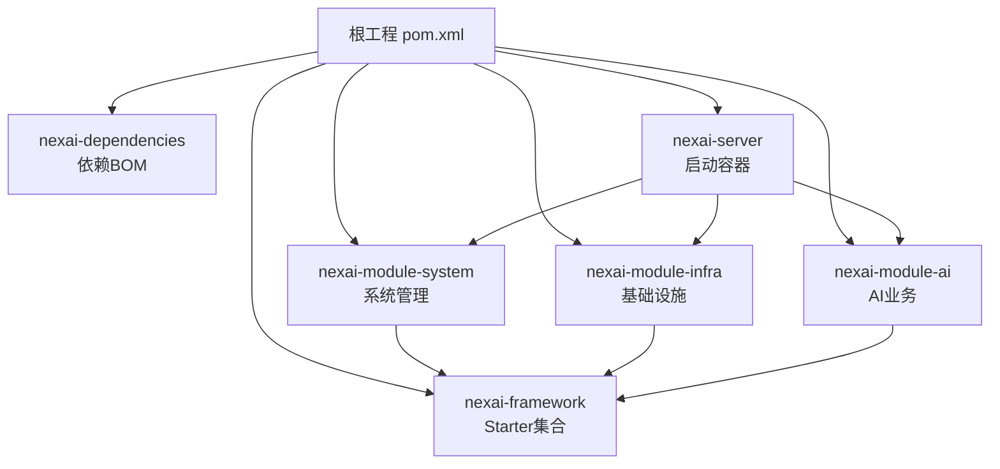
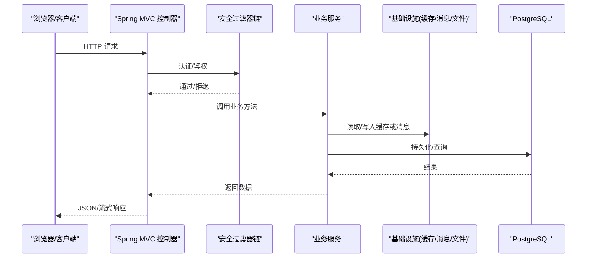
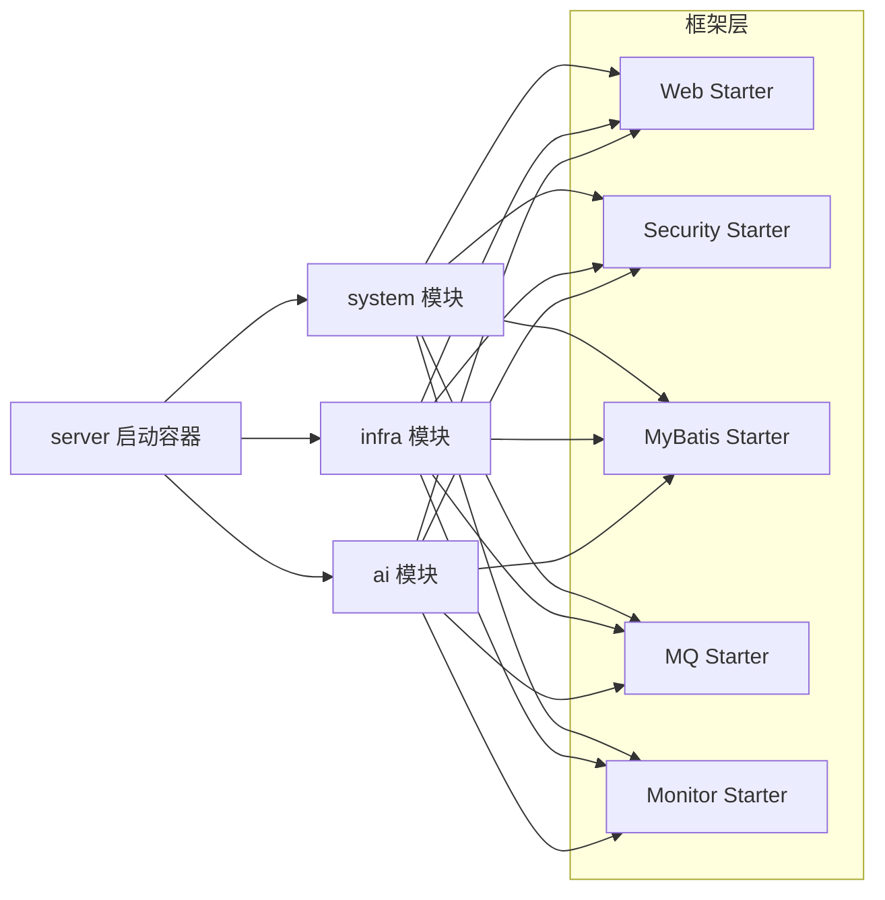

# 整体架构概览

<cite>
**本文引用的文件**
- [pom.xml](file://pom.xml)
- [README.md](file://README.md)
- [NexaiServerApplication.java](file://nexai-server/src/main/java/com/gkht/ai/nexai/server/NexaiServerApplication.java)
- [application.yaml](file://nexai-server/src/main/resources/application.yaml)
- [nexai-server/pom.xml](file://nexai-server/pom.xml)
- [nexai-framework/pom.xml](file://nexai-framework/pom.xml)
- [nexai-module-system/pom.xml](file://nexai-module-system/pom.xml)
- [nexai-module-infra/pom.xml](file://nexai-module-infra/pom.xml)
- [nexai-module-ai/pom.xml](file://nexai-module-ai/pom.xml)
- [nexai-spring-boot-starter-web/pom.xml](file://nexai-framework/nexai-spring-boot-starter-web/pom.xml)
- [nexai-spring-boot-starter-security/pom.xml](file://nexai-framework/nexai-spring-boot-starter-security/pom.xml)
- [nexai-spring-boot-starter-mybatis/pom.xml](file://nexai-framework/nexai-spring-boot-starter-mybatis/pom.xml)
</cite>

## 目录
1. [简介](#简介)
2. [项目结构](#项目结构)
3. [核心组件](#核心组件)
4. [架构总览](#架构总览)
5. [详细组件分析](#详细组件分析)
6. [依赖关系分析](#依赖关系分析)
7. [性能与可观测性](#性能与可观测性)
8. [横切关注点](#横切关注点)
9. [故障排查指南](#故障排查指南)
10. [结论](#结论)

## 简介
NexAI 是基于企业级快速开发平台演进而来的 AI 智能体平台，采用 Java 25 + Spring Boot 4.1 的多模块单体应用架构，前端为 Vue 3。系统以“框架扩展层 + 业务模块 + 启动容器”的分层组织方式实现领域解耦与服务边界清晰，同时通过 Starter 机制将安全、Web、数据库、缓存、消息、监控等横切能力沉淀到框架层，供各业务模块按需装配。

## 项目结构
根工程通过 Maven 聚合多个子模块：dependencies（版本管理）、framework（Starter 集合）、server（启动容器）、system（系统管理）、infra（基础设施）、ai（AI 业务）。启动类扫描 base-package 下的 server 与 module 包，自动装配各模块的控制器、服务与配置。

图表来源
- [pom.xml:10-32](file://pom.xml#L10-L32)
- [nexai-server/pom.xml:23-112](file://nexai-server/pom.xml#L23-L112)

章节来源
- [pom.xml:10-32](file://pom.xml#L10-L32)
- [README.md:76-90](file://README.md#L76-L90)

## 核心组件
- 表现层（Controller/接口）：由各模块 interfaces/controller 暴露 REST/WebSocket 接口，统一由 Web Starter 处理异常、日志、文档与参数校验。
- 业务层（Service/Application）：封装跨实体的业务流程编排，调用领域模型与基础设施能力。
- 领域层（Domain）：按 DDD 约定组织聚合、实体、值对象与领域服务，承载核心规则。
- 基础设施层（Infrastructure）：提供数据访问、缓存、消息、文件存储、任务调度、监控等通用能力，通过 Starter 对外暴露。

章节来源
- [nexai-framework/pom.xml:33-43](file://nexai-framework/pom.xml#L33-L43)
- [nexai-module-ai/pom.xml:15-18](file://nexai-module-ai/pom.xml#L15-L18)

## 架构总览
下图展示从请求进入、安全校验、业务编排到数据存储与外部集成的完整链路，体现“微服务原则在单体中的体现”：模块即服务、接口抽象、边界清晰、横切能力下沉。

图表来源
- [application.yaml:28-37](file://application.yaml#L28-L37)
- [application.yaml:55-78](file://application.yaml#L55-L78)
- [application.yaml:79-88](file://application.yaml#L79-L88)
- [application.yaml:135-199](file://application.yaml#L135-L199)
- [application.yaml:260-339](file://application.yaml#L260-L339)

章节来源
- [application.yaml:1-390](file://application.yaml#L1-L390)

## 详细组件分析

### 启动容器 nexai-server
- 职责：作为 Spring Boot 应用入口，装配并运行 system、infra、ai 等业务模块；引入 PostgreSQL 驱动与保护 Starter；打包为可执行 jar。
- 关键点：扫描 base-package 下的 server 与 module 包；默认启用 local profile；支持 devtools 热部署。

章节来源
- [NexaiServerApplication.java:15-24](file://nexai-server/src/main/java/com/gkht/ai/nexai/server/NexaiServerApplication.java#L15-L24)
- [nexai-server/pom.xml:15-20](file://nexai-server/pom.xml#L15-L20)
- [nexai-server/pom.xml:23-112](file://nexai-server/pom.xml#L23-L112)
- [nexai-server/pom.xml:165-169](file://nexai-server/pom.xml#L165-L169)

### 框架扩展层 nexai-framework
- 职责：沉淀 Web、Security、MyBatis、Redis、MQ、Job、Monitor、Protection、Excel、Test 以及租户、数据权限、IP 等业务 Starter，形成可复用的技术底座。
- 设计要点：每个 Starter 包含 core 与 config；业务 Starter 命名含 biz；通过 Spring Boot 自动装配机制按需启用。

章节来源
- [nexai-framework/pom.xml:12-31](file://nexai-framework/pom.xml#L12-L31)
- [nexai-framework/pom.xml:33-43](file://nexai-framework/pom.xml#L33-L43)

#### Web Starter
- 职责：全局异常、API 日志、脱敏、错误码、Swagger/Knife4j 文档、REST 客户端等。
- 依赖：common、spring-web、Jackson、security（provided）、工具库。

章节来源
- [nexai-spring-boot-starter-web/pom.xml:14-16](file://nexai-framework/nexai-spring-boot-starter-web/pom.xml#L14-L16)
- [nexai-spring-boot-starter-web/pom.xml:18-87](file://nexai-framework/nexai-spring-boot-starter-web/pom.xml#L18-L87)

#### Security Starter
- 职责：用户认证、权限校验、操作日志；基于 AspectJ 与注解实现。
- 依赖：web starter、spring-security、bizlog-sdk。

章节来源
- [nexai-spring-boot-starter-security/pom.xml:14-19](file://nexai-framework/nexai-spring-boot-starter-security/pom.xml#L14-L19)
- [nexai-spring-boot-starter-security/pom.xml:21-62](file://nexai-framework/nexai-spring-boot-starter-security/pom.xml#L21-L62)

#### MyBatis Starter
- 职责：连接池、多数据源、事务、MyBatis Plus 增强、联表查询、VO 翻译。
- 依赖：Druid、MyBatis Plus、Dynamic Datasource、MyBatis-Plus-Join、EasyTrans。

章节来源
- [nexai-spring-boot-starter-mybatis/pom.xml:14-16](file://nexai-framework/nexai-spring-boot-starter-mybatis/pom.xml#L14-L16)
- [nexai-spring-boot-starter-mybatis/pom.xml:31-109](file://nexai-framework/nexai-spring-boot-starter-mybatis/pom.xml#L31-L109)

### 系统管理层 nexai-module-system
- 职责：用户、角色、菜单、部门、岗位、字典、短信、邮件、站内信、操作/登录日志、错误码、通知、地区、应用管理等通用业务能力。
- 依赖：infra、租户、数据权限、IP、Web、Security、MyBatis、Redis、Job、MQ、Excel、第三方登录与验证码等。

章节来源
- [nexai-module-system/pom.xml:14-18](file://nexai-module-system/pom.xml#L14-L18)
- [nexai-module-system/pom.xml:20-122](file://nexai-module-system/pom.xml#L20-L122)

### 基础设施层 nexai-module-infra
- 职责：运维与管理（定时任务、服务器信息）、研发工具（代码生成、接口文档）、文件服务、消息队列、监控、配置管理等。
- 依赖：租户、Web、WebSocket、MyBatis、Redis、Job、MQ、Excel、Admin Server、S3/FTP/SFTP、Tika 等。

章节来源
- [nexai-module-infra/pom.xml:14-19](file://nexai-module-infra/pom.xml#L14-L19)
- [nexai-module-infra/pom.xml:21-118](file://nexai-module-infra/pom.xml#L21-L118)

### AI 业务层 nexai-module-ai
- 职责：面向智能体的产品化能力，基于 agentscope-java v2 嵌入，按七聚合垂直切分（agentspec、channel、skill、mcpserver、session、audit、usage），遵循 DDD 约定 B。
- 依赖：infra API、system API、agentscope-core/harness/多种模型扩展、PostgreSQL 状态存储、OpenTelemetry、Web/Security/MyBatis/Redis 等。

章节来源
- [nexai-module-ai/pom.xml:14-18](file://nexai-module-ai/pom.xml#L14-L18)
- [nexai-module-ai/pom.xml:20-142](file://nexai-module-ai/pom.xml#L20-L142)

## 依赖关系分析
- 启动容器仅装配必要模块，降低编译与启动成本；AI 模块通过 infra/system 的 API 面进行跨模块协作，避免直接耦合实现。
- 框架 Starter 被 system、infra、ai 共同复用，保证横切能力一致性与可替换性。

图表来源
- [nexai-server/pom.xml:23-112](file://nexai-server/pom.xml#L23-L112)
- [nexai-module-system/pom.xml:20-122](file://nexai-module-system/pom.xml#L20-L122)
- [nexai-module-infra/pom.xml:21-118](file://nexai-module-infra/pom.xml#L21-L118)
- [nexai-module-ai/pom.xml:20-142](file://nexai-module-ai/pom.xml#L20-L142)

章节来源
- [nexai-server/pom.xml:23-112](file://nexai-server/pom.xml#L23-L112)
- [nexai-module-system/pom.xml:20-122](file://nexai-module-system/pom.xml#L20-L122)
- [nexai-module-infra/pom.xml:21-118](file://nexai-module-infra/pom.xml#L21-L118)
- [nexai-module-ai/pom.xml:20-142](file://nexai-module-ai/pom.xml#L20-L142)

## 性能与可观测性
- 缓存：默认使用 Redis 作为缓存后端，设置 TTL，提升热点数据访问性能。
- 数据库：MyBatis Plus + Druid 连接池，开启逻辑删除、驼峰映射、多数据源与联表查询优化。
- 消息：支持 Kafka/RocketMQ/RabbitMQ/Redis 等多种 MQ 实现，便于异步解耦与削峰填谷。
- 可观测：集成 OpenTelemetry（可选开关），审计与用量采集可配置保留期与截断长度；支持 Admin 监控与 Actuator 端点。

章节来源
- [application.yaml:22-27](file://application.yaml#L22-L27)
- [application.yaml:55-78](file://application.yaml#L55-L78)
- [application.yaml:109-134](file://application.yaml#L109-L134)
- [application.yaml:260-339](file://application.yaml#L260-L339)

## 横切关注点
- 安全与权限：Security Starter 提供认证鉴权与操作日志；支持多终端、SSO、动态菜单与按钮级权限。
- 日志与文档：Web Starter 统一异常、API 日志与 Swagger/Knife4j 文档；支持中文界面。
- 多租户：Tenant Starter 提供透明化的租户隔离与忽略策略。
- 事务与数据一致性：MyBatis Starter 提供声明式事务与多数据源切换；结合业务 Service 控制事务边界。
- 限流与保护：Protection Starter 提供签名、限流等保障能力。

章节来源
- [nexai-spring-boot-starter-security/pom.xml:14-19](file://nexai-framework/nexai-spring-boot-starter-security/pom.xml#L14-L19)
- [nexai-spring-boot-starter-web/pom.xml:14-16](file://nexai-framework/nexai-spring-boot-starter-web/pom.xml#L14-L16)
- [application.yaml:28-37](file://application.yaml#L28-L37)
- [application.yaml:346-358](file://application.yaml#L346-L358)

## 故障排查指南
- 启动问题：确认 base-package 扫描路径正确、依赖模块已引入、数据库与 Redis 可用。
- 接口文档：检查 springdoc/knife4j 是否启用与路径配置。
- 数据库：核对 MyBatis Plus 配置、ID 策略、逻辑删除值、加密器密钥。
- 缓存：确认 Redis 连接与仓库禁用配置是否符合预期。
- AI 能力：核对 openai/dashscope/anthropic/gemini/ollama 等模型配置与密钥；向量存储初始化开关。

章节来源
- [NexaiServerApplication.java:15-24](file://nexai-server/src/main/java/com/gkht/ai/nexai/server/NexaiServerApplication.java#L15-L24)
- [application.yaml:28-37](file://application.yaml#L28-L37)
- [application.yaml:55-78](file://application.yaml#L55-L78)
- [application.yaml:135-199](file://application.yaml#L135-L199)

## 结论
NexAI 通过“框架 Starter + 业务模块 + 启动容器”的分层与模块化设计，在单体应用中实现了清晰的领域边界与横切能力下沉。借助 Spring Boot 自动装配与多模块聚合，系统具备良好的可扩展性与可维护性；配合 Redis、MyBatis Plus、消息与可观测体系，满足高并发与可运维需求。未来可按需扩展更多业务模块，保持对基础设施与框架层的稳定依赖。