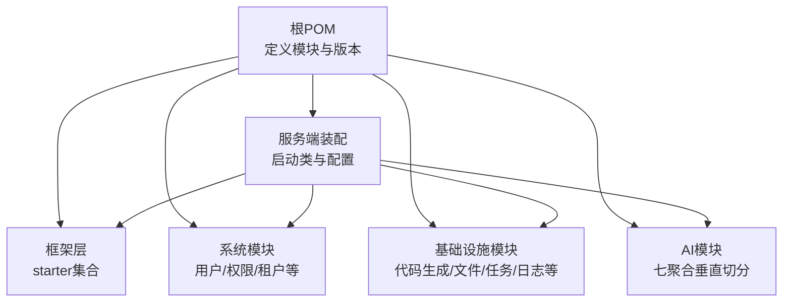
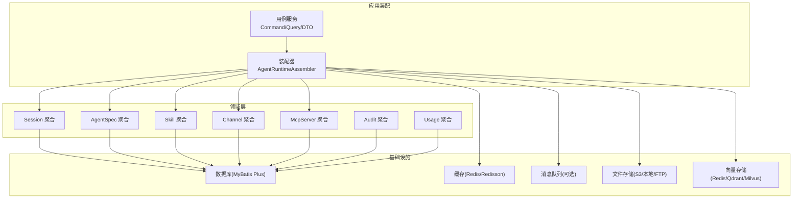
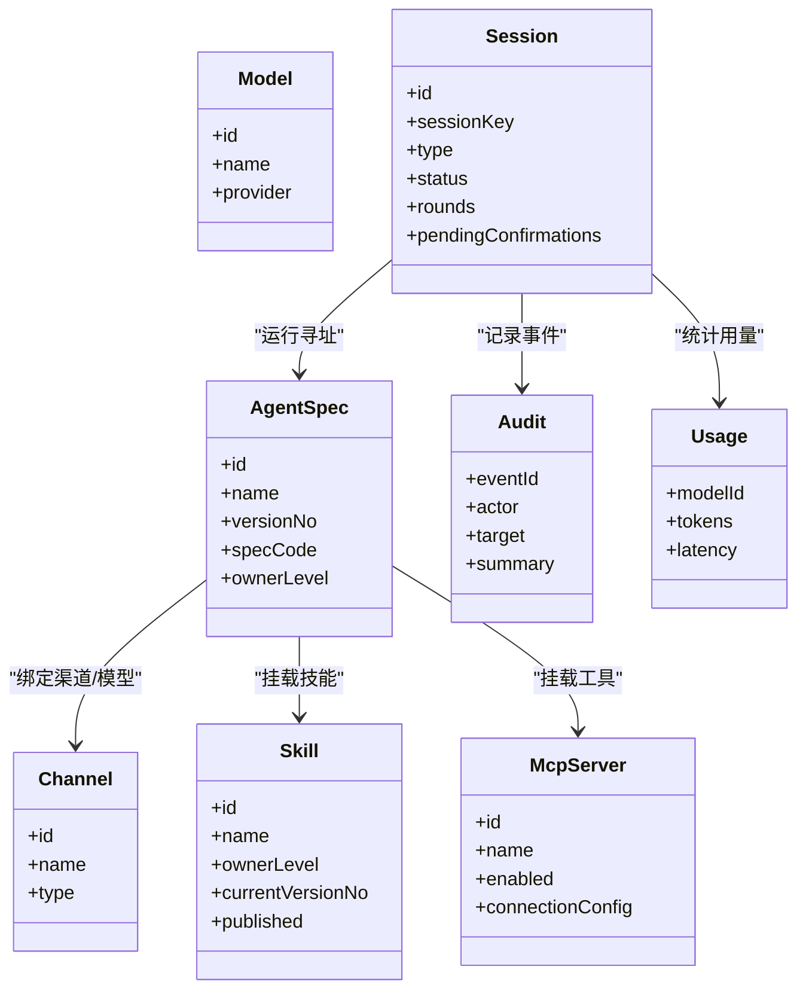
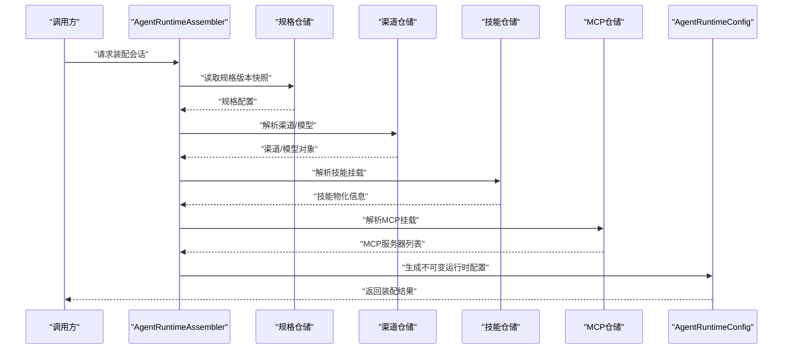
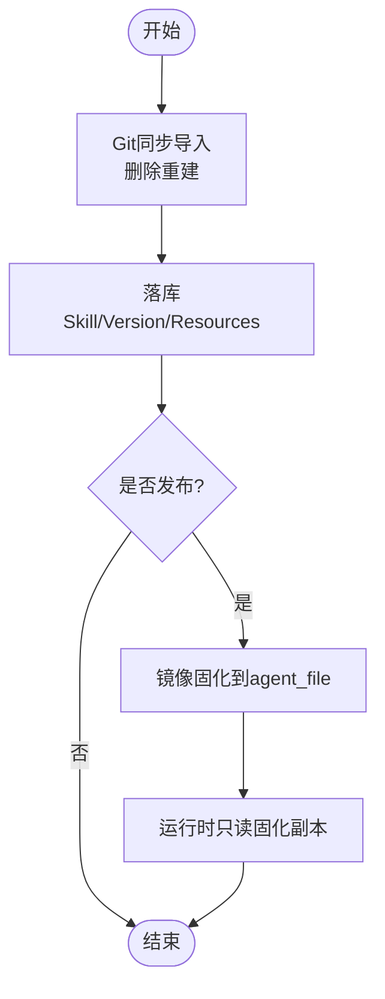
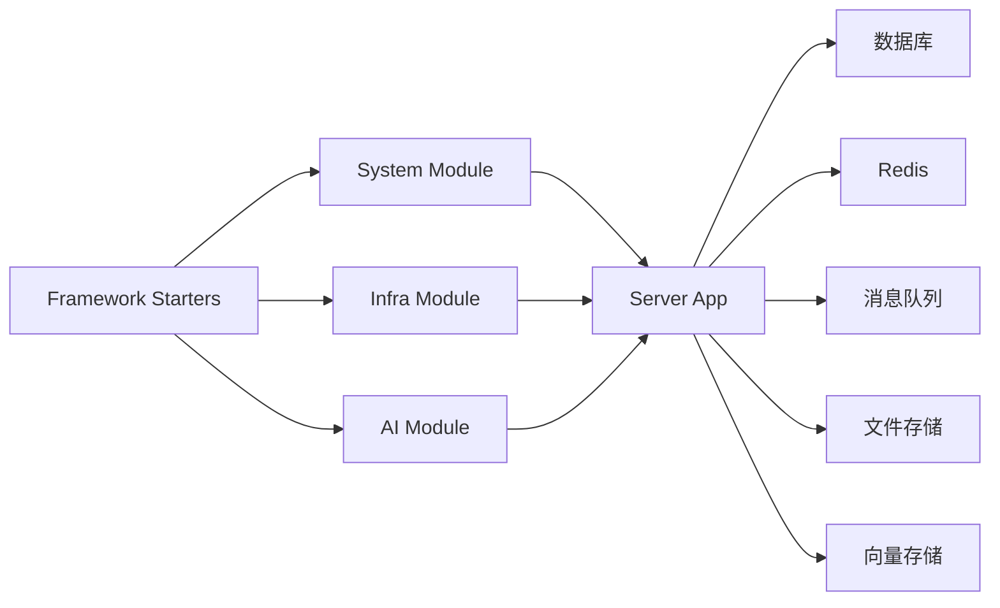

# 架构设计

<cite>
**本文引用的文件**
- [README.md](file://README.md)
- [pom.xml](file://pom.xml)
- [NexaiServerApplication.java](file://nexai-server/src/main/java/com/gkht/ai/nexai/server/NexaiServerApplication.java)
- [application.yaml](file://nexai-server/src/main/resources/application.yaml)
- [framework pom.xml](file://nexai-framework/pom.xml)
- [package-info.java（AI模块）](file://nexai-module-ai/src/main/java/com/gkht/ai/nexai/module/ai/package-info.java)
- [AgentRuntimeConfig.java](file://nexai-module-ai/src/main/java/com/gkht/ai/nexai/module/ai/session/domain/valueobject/AgentRuntimeConfig.java)
- [AgentRuntimeAssembler.java](file://nexai-module-ai/src/main/java/com/gkht/ai/nexai/module/ai/session/application/service/AgentRuntimeAssembler.java)
- [Session.java](file://nexai-module-ai/src/main/java/com/gkht/ai/nexai/module/ai/session/domain/model/Session.java)
- [Skill.java](file://nexai-module-ai/src/main/java/com/gkht/ai/nexai/module/ai/skill/domain/model/Skill.java)
- [0002-工作流策略-子智能体编排先行.md](file://docs/adr/0002-工作流策略-子智能体编排先行.md)
- [0005-skill统一资产双来源与发布固化.md](file://docs/adr/0005-skill统一资产双来源与发布固化.md)
- [TenantCommonApi.java](file://nexai-framework/nexai-common/src/main/java/com/gkht/ai/nexai/framework/common/biz/system/tenant/TenantCommonApi.java)
</cite>

## 目录
1. [简介](#简介)
2. [项目结构](#项目结构)
3. [核心组件](#核心组件)
4. [架构总览](#架构总览)
5. [详细组件分析](#详细组件分析)
6. [依赖关系分析](#依赖关系分析)
7. [性能考量](#性能考量)
8. [故障排查指南](#故障排查指南)
9. [结论](#结论)
10. [附录](#附录)

## 简介
本架构设计文档面向 NexAI 平台，围绕多模块分层架构、领域驱动设计（DDD）与微服务化原则，系统阐述框架扩展层、系统管理层、基础设施层与 AI 业务层的职责边界、交互模式与数据流向。重点说明“七聚合垂直切分”的设计思想与实现方式，并给出横切关注点（安全、监控、日志）的处理方案与权衡。

## 项目结构
NexAI 采用 Maven 多模块工程组织，后端以 Spring Boot 4.1 + Java 25 构建，前端为 Vue 3 SPA。根 POM 声明了 dependencies、framework、server、system、infra、ai 等模块；启动入口位于 server 模块，扫描 base-package 下的 server 与 module 包。

**图表来源**
- [pom.xml:10-32](file://pom.xml#L10-L32)
- [NexaiServerApplication.java:16-17](file://nexai-server/src/main/java/com/gkht/ai/nexai/server/NexaiServerApplication.java#L16-L17)

**章节来源**
- [README.md:76-90](file://README.md#L76-L90)
- [pom.xml:10-32](file://pom.xml#L10-L32)
- [NexaiServerApplication.java:16-17](file://nexai-server/src/main/java/com/gkht/ai/nexai/server/NexaiServerApplication.java#L16-L17)

## 核心组件
- 框架扩展层（nexai-framework）：提供 Web、Security、Redis、MyBatis、MQ、Job、Monitor、Protection、Excel、WebSocket、Tenant、DataPermission、IP 等 Starter，按“core+config”组织，支撑上层模块能力复用。
- 系统管理层（nexai-module-system）：承载用户、角色、菜单、部门、租户、字典、短信、邮件、通知、操作日志、登录日志等通用管理能力，并通过 API 暴露给其他模块。
- 基础设施层（nexai-module-infra）：提供代码生成、配置管理、文件服务、定时任务、API 日志、数据库监控、消息队列、WebSocket 等通用基础设施能力。
- AI 业务层（nexai-module-ai）：基于 DDD Convention B 布局，按“agentspec/channel/skill/mcpserver/session/audit/usage”七个聚合进行垂直切分，运行时嵌入 agentscope-java v2，实现智能体规格、渠道模型、技能资产、MCP Server、会话、审计与用量采集。

**章节来源**
- [framework pom.xml:12-31](file://nexai-framework/pom.xml#L12-L31)
- [package-info.java（AI模块）:1-5](file://nexai-module-ai/src/main/java/com/gkht/ai/nexai/module/ai/package-info.java#L1-L5)

## 架构总览
NexAI 采用“应用装配 + 领域聚合 + 基础设施”的分层与边界划分：
- 应用装配层：负责用例编排、参数校验、上下文组装与跨聚合协调。
- 领域层：以聚合根为核心，封装不变量与行为，通过 Repository 接口屏蔽持久化细节。
- 基础设施层：实现仓储、网关、外部集成（数据库、缓存、消息、文件、向量库等）。

**图表来源**
- [AgentRuntimeAssembler.java:34-41](file://nexai-module-ai/src/main/java/com/gkht/ai/nexai/module/ai/session/application/service/AgentRuntimeAssembler.java#L34-L41)
- [Session.java:17-19](file://nexai-module-ai/src/main/java/com/gkht/ai/nexai/module/ai/session/domain/model/Session.java#L17-L19)
- [Skill.java:7-14](file://nexai-module-ai/src/main/java/com/gkht/ai/nexai/module/ai/skill/domain/model/Skill.java#L7-L14)
- [application.yaml:137-155](file://nexai-server/src/main/resources/application.yaml#L137-L155)

## 详细组件分析

### 七聚合垂直切分（agentspec/channel/skill/mcpserver/session/audit/usage）
- 设计目标：每个聚合聚焦一个业务能力边界，内聚领域模型与仓储接口，避免跨域耦合扩散；通过应用层编排组合出完整用例。
- 实现要点：
  - 聚合根包含不变量与关键行为（如 Session 的状态推进、Skill 的版本链与发布）。
  - 应用层通过装配器将规格、渠道、技能、MCP Server 等挂载解析为运行时可执行指令。
  - 基础设施层实现仓储与网关，屏蔽具体存储与外部协议差异。

**图表来源**
- [Session.java:17-41](file://nexai-module-ai/src/main/java/com/gkht/ai/nexai/module/ai/session/domain/model/Session.java#L17-L41)
- [Skill.java:22-39](file://nexai-module-ai/src/main/java/com/gkht/ai/nexai/module/ai/skill/domain/model/Skill.java#L22-L39)
- [AgentRuntimeAssembler.java:141-181](file://nexai-module-ai/src/main/java/com/gkht/ai/nexai/module/ai/session/application/service/AgentRuntimeAssembler.java#L141-L181)

**章节来源**
- [package-info.java（AI模块）:1-5](file://nexai-module-ai/src/main/java/com/gkht/ai/nexai/module/ai/package-info.java#L1-L5)
- [Session.java:17-41](file://nexai-module-ai/src/main/java/com/gkht/ai/nexai/module/ai/session/domain/model/Session.java#L17-L41)
- [Skill.java:7-14](file://nexai-module-ai/src/main/java/com/gkht/ai/nexai/module/ai/skill/domain/model/Skill.java#L7-L14)

### 会话装配与运行时配置（AgentRuntimeAssembler / AgentRuntimeConfig）
- 装配流程：从规格版本快照出发，解析渠道/模型、技能挂载与 MCP Server 挂载，生成不可变的 AgentRuntimeConfig，供基础设施层消费。
- 快路径/回退分流：常驻实例按 specReference 缓存，版本戳由渠道/模型/MCP 更新时间与技能指纹组成，任一变化即失效重建。
- 错误处理：缺失或停用的挂载在装配期显式报错，连接不可达在网关装配期降级跳过。

**图表来源**
- [AgentRuntimeAssembler.java:34-41](file://nexai-module-ai/src/main/java/com/gkht/ai/nexai/module/ai/session/application/service/AgentRuntimeAssembler.java#L34-L41)
- [AgentRuntimeConfig.java:13-30](file://nexai-module-ai/src/main/java/com/gkht/ai/nexai/module/ai/session/domain/valueobject/AgentRuntimeConfig.java#L13-L30)

**章节来源**
- [AgentRuntimeAssembler.java:141-181](file://nexai-module-ai/src/main/java/com/gkht/ai/nexai/module/ai/session/application/service/AgentRuntimeAssembler.java#L141-L181)
- [AgentRuntimeConfig.java:13-30](file://nexai-module-ai/src/main/java/com/gkht/ai/nexai/module/ai/session/domain/valueobject/AgentRuntimeConfig.java#L13-L30)

### 技能资产与发布固化（Skill 聚合与 ADR-0005）
- 资产统一：所有 skill 落库到 ai_skill / ai_skill_version / ai_skill_resources，name 归属内唯一，支持多租户各自命名。
- Git 导入源：Git 仅作为管理侧同步导入源，导入后只读，删除重建策略简化一致性。
- 发布固化：规格发布时将挂载技能的全量内容镜像到 agent_file 表，运行时只读固化副本，不受技能变更影响。
- 镜像导出：当前生效内容异步镜像进 agentscope 官方 PostgresSkillRepository 表，冲突通过映射表消解。

**图表来源**
- [0005-skill统一资产双来源与发布固化.md:5-10](file://docs/adr/0005-skill统一资产双来源与发布固化.md#L5-L10)
- [Skill.java:102-139](file://nexai-module-ai/src/main/java/com/gkht/ai/nexai/module/ai/skill/domain/model/Skill.java#L102-L139)

**章节来源**
- [0005-skill统一资产双来源与发布固化.md:5-10](file://docs/adr/0005-skill统一资产双来源与发布固化.md#L5-L10)
- [Skill.java:102-139](file://nexai-module-ai/src/main/java/com/gkht/ai/nexai/module/ai/skill/domain/model/Skill.java#L102-L139)

### 工作流策略（子智能体编排先行）
- 决策：现阶段不自建 DAG 工作流引擎，多智能体协作一律通过子智能体编排实现（主 agent systemPrompt 分工 + SubAgentTool 路由派发）。
- 后果：无确定性流转保障、无人工审批节点流、无可视化编排；需求未至不预建。

**章节来源**
- [0002-工作流策略-子智能体编排先行.md:1-9](file://docs/adr/0002-工作流策略-子智能体编排先行.md#L1-L9)

### 多租户与横切能力
- 多租户：通过 TenantCommonApi 提供租户列表与合法性校验；框架 starter 提供租户上下文与数据隔离能力。
- 安全：Spring Security + Token + Redis，支持多终端认证与 SSO；XSS、API 加密等开关可配置。
- 监控与日志：内置 Actuator、Admin、链路追踪（OpenTelemetry 可插拔）、API 日志、操作日志；审计与用量采集可开启。
- 消息与缓存：Redis 缓存与分布式锁；消息总线支持 Redis/Kafka/RocketMQ/RabbitMQ。

**章节来源**
- [TenantCommonApi.java:10-24](file://nexai-framework/nexai-common/src/main/java/com/gkht/ai/nexai/framework/common/biz/system/tenant/TenantCommonApi.java#L10-L24)
- [application.yaml:262-333](file://nexai-server/src/main/resources/application.yaml#L262-L333)

## 依赖关系分析
- 模块依赖方向：server 装配 framework、system、infra、ai；ai 依赖 framework 的 web/security/redis/mybatis 等 starter；system/infra 同样依赖 framework。
- 外部依赖：PostgreSQL/MySQL/PG 兼容库、Redis、消息中间件、向量存储（Redis/Qdrant/Milvus）、文件存储（S3/本地/FTP）。

**图表来源**
- [pom.xml:10-32](file://pom.xml#L10-L32)
- [application.yaml:137-155](file://nexai-server/src/main/resources/application.yaml#L137-L155)

**章节来源**
- [pom.xml:10-32](file://pom.xml#L10-L32)
- [application.yaml:137-155](file://nexai-server/src/main/resources/application.yaml#L137-L155)

## 性能考量
- 缓存与常驻实例：AgentRuntimeConfig 按规格版本快照缓存常驻实例，减少装配开销；版本戳变化触发重建，保证一致性。
- 资源物化：技能挂载经幂等物化后形成目录与名单，降低运行时 IO 与网络往返。
- 向量检索：向量索引前缀与集合名可配置，便于分区与扩容。
- 并发与限流：基于 Redis 的分布式锁与限流能力，适配高并发场景。
- 序列化与编码：UTF-8 强制启用，避免流式返回乱码问题。

**章节来源**
- [AgentRuntimeConfig.java:13-30](file://nexai-module-ai/src/main/java/com/gkht/ai/nexai/module/ai/session/domain/valueobject/AgentRuntimeConfig.java#L13-L30)
- [application.yaml:17-20](file://nexai-server/src/main/resources/application.yaml#L17-L20)
- [application.yaml:137-155](file://nexai-server/src/main/resources/application.yaml#L137-L155)

## 故障排查指南
- 装配失败：检查渠道/模型是否存在且启用，MCP Server 是否可用；装配期会抛出明确错误提示。
- 会话状态异常：查看 Session 状态推进逻辑（READY/ACTIVE/ASKING/CLOSED），确认 HITL 挂起上下文是否正确清理。
- 多租户隔离：确保租户上下文设置正确，验证各聚合查询是否按租户过滤。
- 监控与日志：开启审计与用量采集，结合 OpenTelemetry 与 Admin 面板定位慢调用与异常。

**章节来源**
- [AgentRuntimeAssembler.java:141-181](file://nexai-module-ai/src/main/java/com/gkht/ai/nexai/module/ai/session/application/service/AgentRuntimeAssembler.java#L141-L181)
- [Session.java:91-114](file://nexai-module-ai/src/main/java/com/gkht/ai/nexai/module/ai/session/domain/model/Session.java#L91-L114)
- [application.yaml:276-293](file://nexai-server/src/main/resources/application.yaml#L276-L293)

## 结论
NexAI 通过清晰的多模块分层与 DDD 七聚合垂直切分，实现了 AI 业务能力的模块化与可扩展性。框架层提供稳定通用的技术底座，系统层与基础设施层提供企业级治理能力，AI 层聚焦智能体规格、渠道、技能、会话与观测。配合缓存、物化、向量检索与可观测性配置，系统在性能、可扩展性与可维护性之间取得平衡。后续可根据真实需求逐步引入更复杂的编排与治理机制。

## 附录
- 快速开始：参考 README 中的构建与启动命令。
- 配置项：详见 application.yaml 中 AI、Web、安全、消息、缓存等配置段。
- 前端：Vue 3 SPA，API 调用与页面组织遵循模块化约定。

**章节来源**
- [README.md:126-142](file://README.md#L126-L142)
- [application.yaml:262-333](file://nexai-server/src/main/resources/application.yaml#L262-L333)