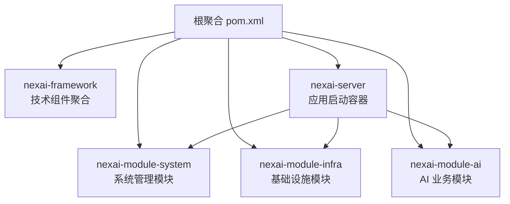
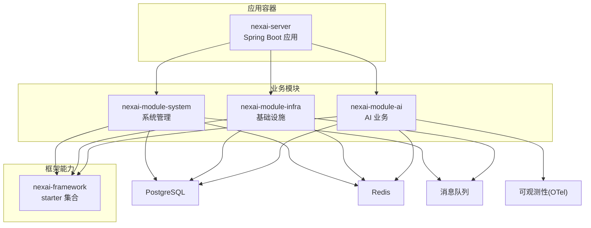
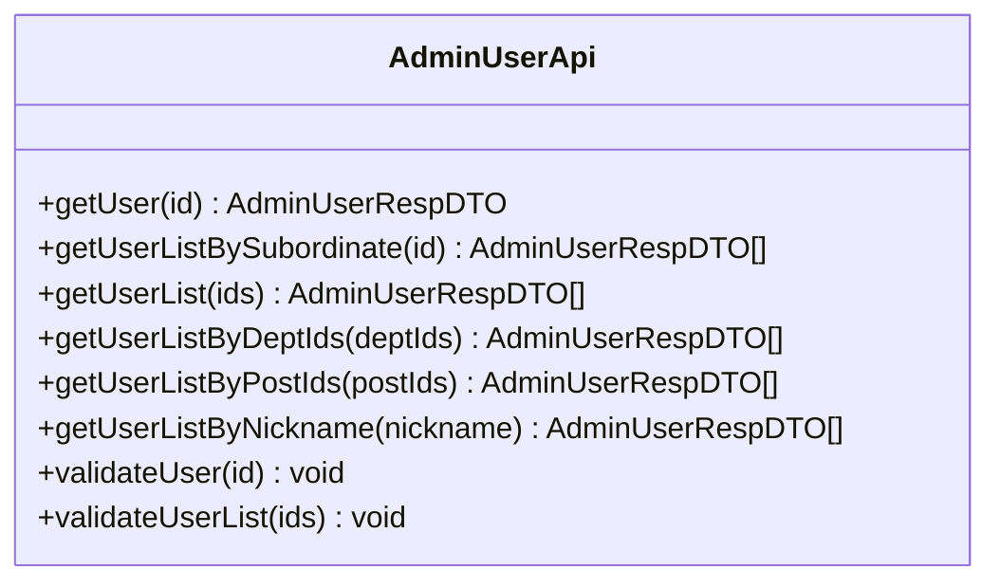
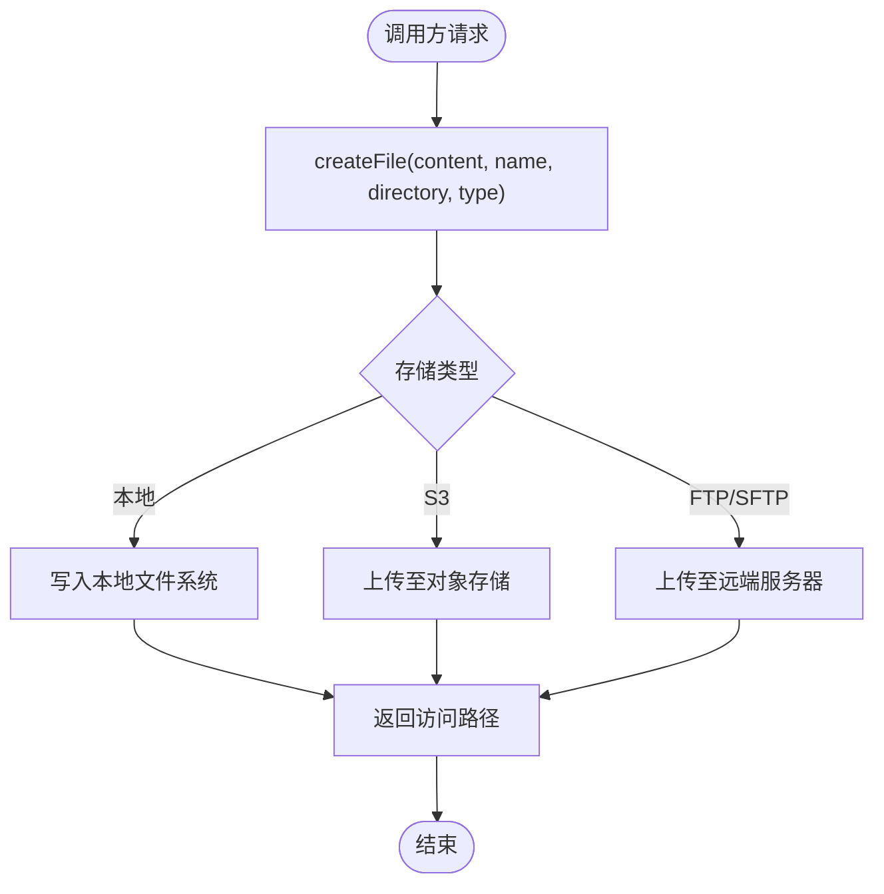
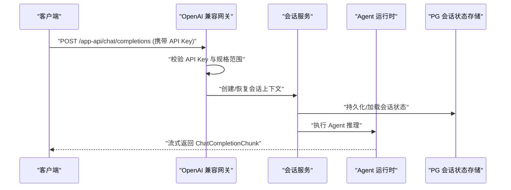
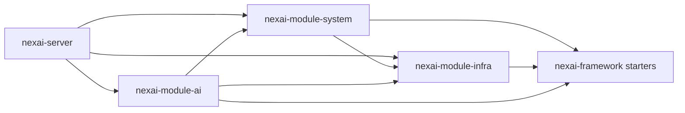

# 模块设计

<cite>
**本文引用的文件**
- [pom.xml](file://pom.xml)
- [nexai-framework/pom.xml](file://nexai-framework/pom.xml)
- [nexai-module-system/pom.xml](file://nexai-module-system/pom.xml)
- [nexai-module-infra/pom.xml](file://nexai-module-infra/pom.xml)
- [nexai-module-ai/pom.xml](file://nexai-module-ai/pom.xml)
- [nexai-server/pom.xml](file://nexai-server/pom.xml)
- [NexaiServerApplication.java](file://nexai-server/src/main/java/com/gkht/ai/nexai/server/NexaiServerApplication.java)
- [AdminUserApi.java](file://nexai-module-system/src/main/java/com/gkht/ai/nexai/module/system/api/user/AdminUserApi.java)
- [FileApi.java](file://nexai-module-infra/src/main/java/com/gkht/ai/nexai/module/infra/api/file/FileApi.java)
- [TenantApiKey.java](file://nexai-module-ai/src/main/java/com/gkht/ai/nexai/module/ai/apikey/domain/model/TenantApiKey.java)
- [OpenAiCompatContractTest.java](file://nexai-module-ai/src/test/java/com/gkht/ai/nexai/module/ai/session/interfaces/controller/app/openai/OpenAiCompatContractTest.java)
</cite>

## 目录
1. [简介](#简介)
2. [项目结构](#项目结构)
3. [核心组件](#核心组件)
4. [架构总览](#架构总览)
5. [详细组件分析](#详细组件分析)
6. [依赖关系分析](#依赖关系分析)
7. [性能与可观测性](#性能与可观测性)
8. [故障排查指南](#故障排查指南)
9. [结论](#结论)
10. [附录：接口契约与数据交换格式](#附录接口契约与数据交换格式)

## 简介
本设计文档面向 NexAI 平台的模块化架构，围绕以下目标展开：
- 明确各核心模块的职责边界与设计原则：nexai-framework（通用框架能力）、nexai-module-system（系统管理）、nexai-module-infra（基础设施服务）、nexai-module-ai（AI 业务逻辑）。
- 说明模块间依赖关系与通信机制，包括 API 接口设计与数据交换格式。
- 阐述模块化优势：独立开发、测试、部署与扩展。
- 给出版本管理与兼容性策略，以及模块拆分与合并的考量因素。
- 提供模块依赖图与关键接口契约定义。

## 项目结构
NexAI 采用多模块 Maven 工程，顶层聚合多个子模块，统一版本与构建插件；应用启动入口为 nexai-server，按需装配功能模块。

**图表来源**
- [pom.xml:10-32](file://pom.xml#L10-L32)
- [nexai-server/pom.xml:23-112](file://nexai-server/pom.xml#L23-L112)

**章节来源**
- [pom.xml:10-32](file://pom.xml#L10-L32)
- [nexai-server/pom.xml:23-112](file://nexai-server/pom.xml#L23-L112)

## 核心组件
- nexai-framework：提供安全、缓存、消息队列、监控、任务调度、Web 栈、MyBatis、Redis、WebSocket 等通用能力，以 Spring Boot Starter 形式组织，分为“框架组件”和“业务组件”。
- nexai-module-system：实现用户、部门、权限、字典、租户、日志、短信、邮件、社交登录等系统管理能力，并通过 api 包暴露跨模块调用契约。
- nexai-module-infra：提供代码生成、配置中心、文件服务、定时任务、日志采集、WebSocket 推送等基础设施运维与研发工具能力。
- nexai-module-ai：基于 agentscope-java v2 的多租户智能体平台，按七聚合垂直切分（agentspec、channel、skill、mcpserver、session、audit、usage），封装 Agent 运行时、会话状态存储、OpenAI 兼容出口、可观测性等。

**章节来源**
- [nexai-framework/pom.xml:12-31](file://nexai-framework/pom.xml#L12-L31)
- [nexai-module-system/pom.xml:14-18](file://nexai-module-system/pom.xml#L14-L18)
- [nexai-module-infra/pom.xml:14-19](file://nexai-module-infra/pom.xml#L14-L19)
- [nexai-module-ai/pom.xml:14-18](file://nexai-module-ai/pom.xml#L14-L18)

## 架构总览
整体分层清晰：前端通过 REST/WebSocket 访问后端；后端由 nexai-server 装配各模块；模块之间通过 API 契约解耦；数据库与缓存由框架层 starter 统一接入；AI 模块在运行时集成 agentscope 并对外暴露 OpenAI 兼容接口。

**图表来源**
- [nexai-server/pom.xml:23-112](file://nexai-server/pom.xml#L23-L112)
- [nexai-module-system/pom.xml:20-73](file://nexai-module-system/pom.xml#L20-L73)
- [nexai-module-infra/pom.xml:21-66](file://nexai-module-infra/pom.xml#L21-L66)
- [nexai-module-ai/pom.xml:20-94](file://nexai-module-ai/pom.xml#L20-L94)

## 详细组件分析

### nexai-framework：通用框架能力
- 职责边界：提供 Web、安全、缓存、MQ、任务、监控、Excel、测试、租户、数据权限、IP 等能力，以 starter 方式自动装配。
- 设计原则：
  - 能力原子化：每个 starter 聚焦单一领域，便于按需引入。
  - 配置外置：通过 Spring Boot 配置项控制行为。
  - 可扩展：通过 SPI/AutoConfiguration 注入默认实现，支持替换。
- 典型能力：
  - 安全：认证授权、操作日志、签名防护。
  - 缓存：Redis 客户端与缓存抽象。
  - 消息队列：事件发布/订阅、多种 MQ 适配。
  - 任务：Quartz 集成与任务编排。
  - 监控：链路追踪、指标收集。

**章节来源**
- [nexai-framework/pom.xml:12-31](file://nexai-framework/pom.xml#L12-L31)

### nexai-module-system：系统管理功能
- 职责边界：用户、角色、权限、部门、岗位、字典、租户、登录日志、操作日志、短信、邮件、社交登录等。
- 设计原则：
  - 以 API 包暴露跨模块契约，避免直接耦合内部实现。
  - 使用数据权限与租户隔离，保障多租户数据安全。
  - 控制器分层（admin/app）区分管理端与客户端。
- 关键契约示例：
  - AdminUserApi：提供用户查询、校验、批量获取等能力，供其他模块复用。

**图表来源**
- [AdminUserApi.java:16-98](file://nexai-module-system/src/main/java/com/gkht/ai/nexai/module/system/api/user/AdminUserApi.java#L16-L98)

**章节来源**
- [nexai-module-system/pom.xml:20-73](file://nexai-module-system/pom.xml#L20-L73)
- [AdminUserApi.java:16-98](file://nexai-module-system/src/main/java/com/gkht/ai/nexai/module/system/api/user/AdminUserApi.java#L16-L98)

### nexai-module-infra：基础设施服务
- 职责边界：代码生成器、配置管理、文件服务、定时任务、日志采集、WebSocket 推送、数据库连接池与监控等。
- 设计原则：
  - 将运维与研发工具收敛到 infra，降低业务模块复杂度。
  - 文件服务抽象出 FileApi，屏蔽底层存储差异（本地/S3/FTP/SFTP）。
  - 通过 Job 与 MQ 支撑异步与批处理场景。
- 关键契约示例：
  - FileApi：提供文件创建、预签名读取、内容读取等能力。

**图表来源**
- [FileApi.java:10-64](file://nexai-module-infra/src/main/java/com/gkht/ai/nexai/module/infra/api/file/FileApi.java#L10-L64)

**章节来源**
- [nexai-module-infra/pom.xml:21-66](file://nexai-module-infra/pom.xml#L21-L66)
- [FileApi.java:10-64](file://nexai-module-infra/src/main/java/com/gkht/ai/nexai/module/infra/api/file/FileApi.java#L10-L64)

### nexai-module-ai：AI 业务逻辑
- 职责边界：Agent 规格管理、通道管理、技能系统、MCP Server、会话控制、审计与用量统计。
- 设计原则：
  - 七聚合垂直切分，DDD 约定 B 组织代码，边界清晰。
  - 运行时集成 agentscope-java v2，封装模型构造、工作空间、记忆、转录等。
  - 对外暴露 OpenAI 兼容接口，便于生态对接。
  - 可观测性：通过 OTel 三段 span 进行全链路追踪。
- 关键契约与流程：
  - API Key 管理：租户级 API Key 的签发、校验与范围限制。
  - OpenAI 兼容流式接口：通过测试用例验证协议一致性。

**图表来源**
- [OpenAiCompatContractTest.java:132-148](file://nexai-module-ai/src/test/java/com/gkht/ai/nexai/module/ai/session/interfaces/controller/app/openai/OpenAiCompatContractTest.java#L132-L148)
- [OpenAiCompatContractTest.java:295-315](file://nexai-module-ai/src/test/java/com/gkht/ai/nexai/module/ai/session/interfaces/controller/app/openai/OpenAiCompatContractTest.java#L295-L315)

**章节来源**
- [nexai-module-ai/pom.xml:20-94](file://nexai-module-ai/pom.xml#L20-L94)
- [TenantApiKey.java:26-118](file://nexai-module-ai/src/main/java/com/gkht/ai/nexai/module/ai/apikey/domain/model/TenantApiKey.java#L26-L118)
- [OpenAiCompatContractTest.java:132-148](file://nexai-module-ai/src/test/java/com/gkht/ai/nexai/module/ai/session/interfaces/controller/app/openai/OpenAiCompatContractTest.java#L132-L148)
- [OpenAiCompatContractTest.java:295-315](file://nexai-module-ai/src/test/java/com/gkht/ai/nexai/module/ai/session/interfaces/controller/app/openai/OpenAiCompatContractTest.java#L295-L315)

## 依赖关系分析
- 模块依赖方向：
  - nexai-server 作为应用容器，依赖 system、infra、ai。
  - system 依赖 infra 与 framework 的业务组件。
  - ai 依赖 infra（文件 API）、system（用户 API）、framework 的 starter。
- 外部依赖：
  - 数据库：PostgreSQL（驱动由 server 引入）。
  - 缓存：Redis（通过 framework starter）。
  - 消息队列：通过 framework mq starter。
  - 可观测性：OTel SDK 与导出器（ai 模块）。

**图表来源**
- [nexai-server/pom.xml:23-112](file://nexai-server/pom.xml#L23-L112)
- [nexai-module-system/pom.xml:20-73](file://nexai-module-system/pom.xml#L20-L73)
- [nexai-module-infra/pom.xml:21-66](file://nexai-module-infra/pom.xml#L21-L66)
- [nexai-module-ai/pom.xml:20-94](file://nexai-module-ai/pom.xml#L20-L94)

**章节来源**
- [nexai-server/pom.xml:23-112](file://nexai-server/pom.xml#L23-L112)
- [nexai-module-system/pom.xml:20-73](file://nexai-module-system/pom.xml#L20-L73)
- [nexai-module-infra/pom.xml:21-66](file://nexai-module-infra/pom.xml#L21-L66)
- [nexai-module-ai/pom.xml:20-94](file://nexai-module-ai/pom.xml#L20-L94)

## 性能与可观测性
- 性能考虑：
  - 缓存：通过 Redis 减少热点数据对数据库的压力。
  - 异步：利用 MQ 与 Job 解耦耗时操作（如日志清理、文件处理）。
  - 连接池：合理配置数据库与 HTTP 客户端连接池参数。
- 可观测性：
  - 链路追踪：AI 模块集成 OTel，按配置开关启用，结合标准属性配置导出器与采样。
  - 指标与日志：通过框架 monitor starter 与日志框架输出关键指标。

**章节来源**
- [nexai-module-ai/pom.xml:84-94](file://nexai-module-ai/pom.xml#L84-L94)

## 故障排查指南
- 启动问题：
  - 检查扫描包路径是否正确（base-package 配置）。
  - 确认依赖模块是否已正确引入。
- 认证与鉴权：
  - API Key 无效或过期会导致 401 错误，需核对 Key 状态与规格范围。
- 文件服务：
  - 文件上传失败时，检查存储类型配置与网络连通性。
- 会话与流式响应：
  - OpenAI 兼容接口需确保流式协议一致，参考契约测试用例定位问题。

**章节来源**
- [NexaiServerApplication.java:15-17](file://nexai-server/src/main/java/com/gkht/ai/nexai/server/NexaiServerApplication.java#L15-L17)
- [OpenAiCompatContractTest.java:295-315](file://nexai-module-ai/src/test/java/com/gkht/ai/nexai/module/ai/session/interfaces/controller/app/openai/OpenAiCompatContractTest.java#L295-L315)

## 结论
NexAI 通过清晰的模块划分与契约化接口，实现了高内聚、低耦合的架构。框架层提供稳定通用的能力，系统模块负责基础治理，基础设施模块承载运维与研发工具，AI 模块专注智能体业务。该设计支持独立开发、测试、部署与扩展，具备良好的可维护性与演进能力。

## 附录：接口契约与数据交换格式
- 跨模块 API 契约：
  - AdminUserApi：用户查询与校验接口，返回统一 DTO，便于其他模块复用。
  - FileApi：文件创建、预签名读取、内容读取接口，屏蔽存储细节。
- 数据交换格式：
  - 统一使用 JSON 序列化，遵循框架 common 中的通用结果包装与分页结构。
  - 流式响应：OpenAI 兼容接口使用 ChatCompletionChunk 流式传输。
- 版本管理与兼容性策略：
  - 通过根聚合与 dependencies BOM 统一管理第三方库版本，降低冲突风险。
  - 模块间仅依赖 API 面，内部实现变更不影响调用方，保证向后兼容。
- 模块拆分与合并考量：
  - 拆分：按业务域与能力边界划分，保持单一职责，便于独立演进。
  - 合并：当两个模块频繁交互且边界模糊时，评估合并收益与成本，避免过度拆分导致协作成本上升。

**章节来源**
- [AdminUserApi.java:16-98](file://nexai-module-system/src/main/java/com/gkht/ai/nexai/module/system/api/user/AdminUserApi.java#L16-L98)
- [FileApi.java:10-64](file://nexai-module-infra/src/main/java/com/gkht/ai/nexai/module/infra/api/file/FileApi.java#L10-L64)
- [pom.xml:54-64](file://pom.xml#L54-L64)
- [nexai-dependencies/pom.xml:93-118](file://nexai-dependencies/pom.xml#L93-L118)