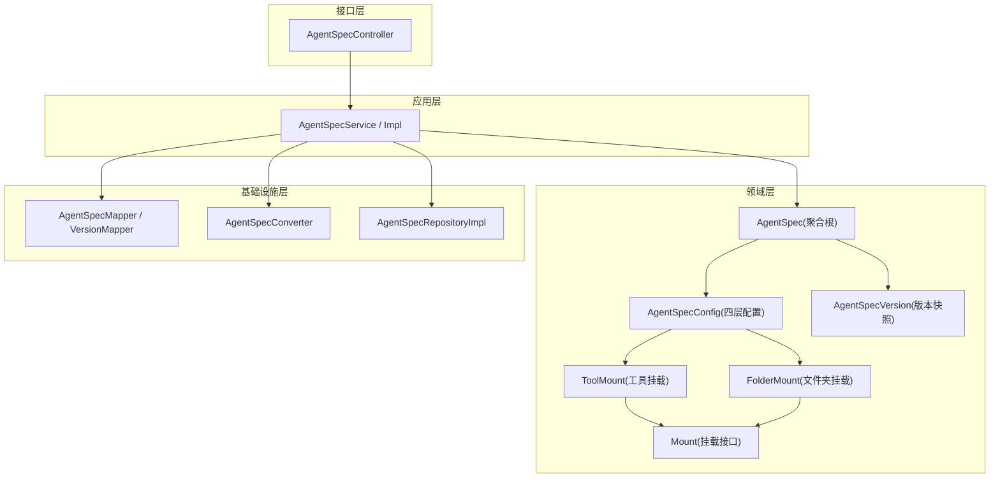
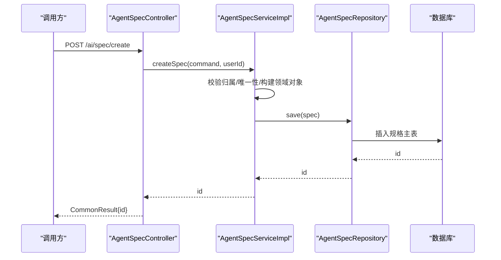
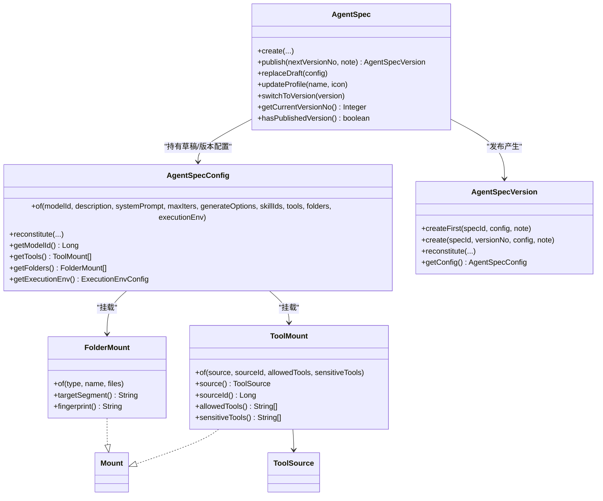
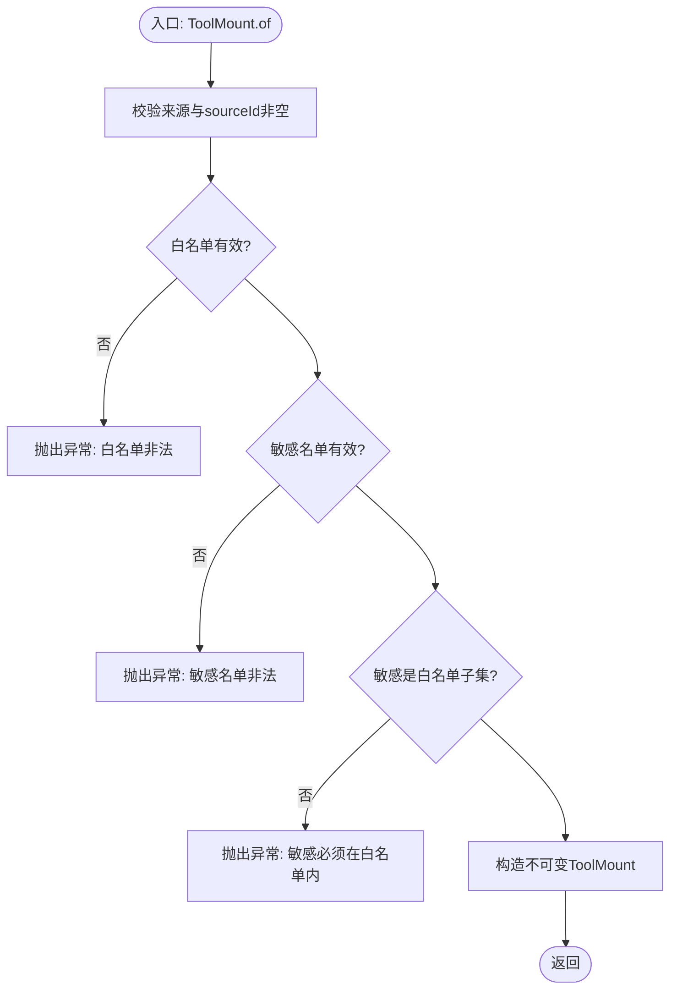
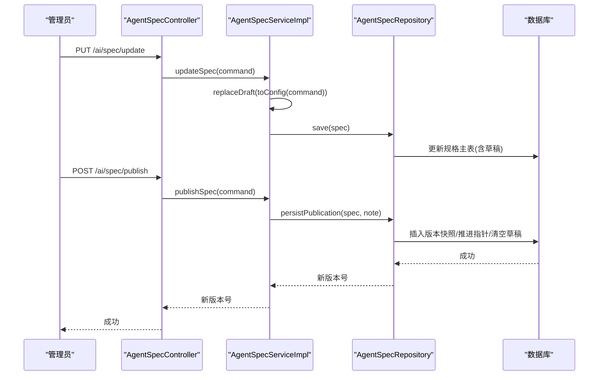
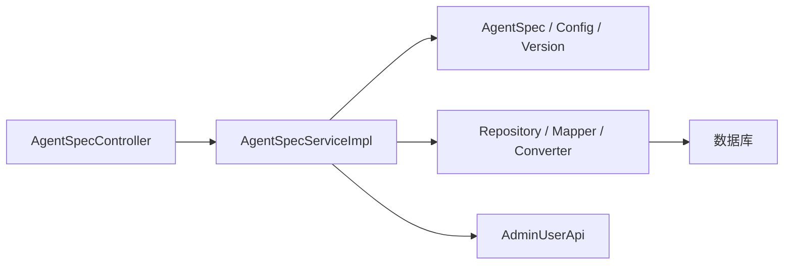

# Agent规格管理

<cite>
**本文引用的文件**
- [AgentSpec.java](file://nexai-module-ai/src/main/java/com/gkht/ai/nexai/module/ai/agentspec/domain/model/AgentSpec.java)
- [AgentSpecConfig.java](file://nexai-module-ai/src/main/java/com/gkht/ai/nexai/module/ai/agentspec/domain/model/AgentSpecConfig.java)
- [AgentSpecVersion.java](file://nexai-module-ai/src/main/java/com/gkht/ai/nexai/module/ai/agentspec/domain/model/AgentSpecVersion.java)
- [ToolMount.java](file://nexai-module-ai/src/main/java/com/gkht/ai/nexai/module/ai/agentspec/domain/model/ToolMount.java)
- [FolderMount.java](file://nexai-module-ai/src/main/java/com/gkht/ai/nexai/module/ai/agentspec/domain/model/FolderMount.java)
- [Mount.java](file://nexai-module-ai/src/main/java/com/gkht/ai/nexai/module/ai/agentspec/domain/model/Mount.java)
- [ToolSource.java](file://nexai-module-ai/src/main/java/com/gkht/ai/nexai/module/ai/agentspec/domain/model/ToolSource.java)
- [AgentSpecService.java](file://nexai-module-ai/src/main/java/com/gkht/ai/nexai/module/ai/agentspec/application/service/AgentSpecService.java)
- [AgentSpecServiceImpl.java](file://nexai-module-ai/src/main/java/com/gkht/ai/nexai/module/ai/agentspec/application/service/AgentSpecServiceImpl.java)
- [AgentSpecController.java](file://nexai-module-ai/src/main/java/com/gkht/ai/nexai/module/ai/agentspec/interfaces/controller/admin/spec/AgentSpecController.java)
- [AgentSpecCreateCommand.java](file://nexai-module-ai/src/main/java/com/gkht/ai/nexai/module/ai/agentspec/application/command/AgentSpecCreateCommand.java)
- [ToolMountCommand.java](file://nexai-module-ai/src/main/java/com/gkht/ai/nexai/module/ai/agentspec/application/command/mount/ToolMountCommand.java)
</cite>

## 目录
1. [简介](#简介)
2. [项目结构](#项目结构)
3. [核心组件](#核心组件)
4. [架构总览](#架构总览)
5. [详细组件分析](#详细组件分析)
6. [依赖关系分析](#依赖关系分析)
7. [性能考虑](#性能考虑)
8. [故障排查指南](#故障排查指南)
9. [结论](#结论)
10. [附录](#附录)

## 简介
本技术文档围绕“Agent规格管理”模块，系统化阐述AgentSpec聚合根的设计理念与领域模型，覆盖规格定义、版本控制与快照机制；深入解析工具挂载（ToolMount）的实现原理，包括来源、白名单与敏感工具策略；完整说明规格生命周期（创建、编辑、发布、版本切换）；给出基于命令与值对象的配置示例路径；解释与渠道、技能系统的集成方式；并提供性能优化与错误处理建议。

## 项目结构
该模块采用分层+DDD组织：
- 接口层：管理后台控制器暴露REST API
- 应用层：服务编排、命令转换、读写分离的查询
- 领域层：聚合根、值对象、仓储端口
- 基础设施层：转换器、数据对象、Mapper、仓储实现

**图示来源**
- [AgentSpecController.java:32-72](file://nexai-module-ai/src/main/java/com/gkht/ai/nexai/module/ai/agentspec/interfaces/controller/admin/spec/AgentSpecController.java#L32-L72)
- [AgentSpecService.java:17-105](file://nexai-module-ai/src/main/java/com/gkht/ai/nexai/module/ai/agentspec/application/service/AgentSpecService.java#L17-L105)
- [AgentSpecServiceImpl.java:64-315](file://nexai-module-ai/src/main/java/com/gkht/ai/nexai/module/ai/agentspec/application/service/AgentSpecServiceImpl.java#L64-L315)
- [AgentSpec.java:20-262](file://nexai-module-ai/src/main/java/com/gkht/ai/nexai/module/ai/agentspec/domain/model/AgentSpec.java#L20-L262)
- [AgentSpecConfig.java:17-199](file://nexai-module-ai/src/main/java/com/gkht/ai/nexai/module/ai/agentspec/domain/model/AgentSpecConfig.java#L17-L199)
- [AgentSpecVersion.java:15-139](file://nexai-module-ai/src/main/java/com/gkht/ai/nexai/module/ai/agentspec/domain/model/AgentSpecVersion.java#L15-L139)
- [ToolMount.java:24-76](file://nexai-module-ai/src/main/java/com/gkht/ai/nexai/module/ai/agentspec/domain/model/ToolMount.java#L24-L76)
- [FolderMount.java:30-86](file://nexai-module-ai/src/main/java/com/gkht/ai/nexai/module/ai/agentspec/domain/model/FolderMount.java#L30-L86)
- [Mount.java:9-11](file://nexai-module-ai/src/main/java/com/gkht/ai/nexai/module/ai/agentspec/domain/model/Mount.java#L9-L11)

**章节来源**
- [AgentSpecController.java:32-72](file://nexai-module-ai/src/main/java/com/gkht/ai/nexai/module/ai/agentspec/interfaces/controller/admin/spec/AgentSpecController.java#L32-L72)
- [AgentSpecService.java:17-105](file://nexai-module-ai/src/main/java/com/gkht/ai/nexai/module/ai/agentspec/application/service/AgentSpecService.java#L17-L105)
- [AgentSpecServiceImpl.java:64-315](file://nexai-module-ai/src/main/java/com/gkht/ai/nexai/module/ai/agentspec/application/service/AgentSpecServiceImpl.java#L64-L315)

## 核心组件
- AgentSpec（聚合根）：承载规格主体元数据（名称、图标、业务编码、归属层级/用户）、草稿与当前版本指针；提供创建、替换草稿、发布、切换版本等核心行为。
- AgentSpecConfig（值对象）：不可变四层配置——agent层（模型引用、自描述、系统提示、迭代上限）、模型调用层（生成参数）、挂载层（技能、工具、文件夹）、执行环境层（workspace/沙箱/能力）。
- AgentSpecVersion（实体）：一次发布固化的全量配置快照，不可变；版本号严格递增，作为运行期寻址依据。
- ToolMount（值对象）：统一挂载模式「来源 + 引用 + 放行面 + 敏感面」，支持MCP与平台工具库；敏感工具在运行时挂起等待人工审批（HITL）。
- FolderMount（值对象）：规格私有文件夹挂载，类型决定落位（knowledge/toolsets），清单随版本固化，物化时按内容哈希校验一致性。
- Mount（密封接口）：挂载家族抽象，便于扩展新挂载通道。

**章节来源**
- [AgentSpec.java:20-262](file://nexai-module-ai/src/main/java/com/gkht/ai/nexai/module/ai/agentspec/domain/model/AgentSpec.java#L20-L262)
- [AgentSpecConfig.java:17-199](file://nexai-module-ai/src/main/java/com/gkht/ai/nexai/module/ai/agentspec/domain/model/AgentSpecConfig.java#L17-L199)
- [AgentSpecVersion.java:15-139](file://nexai-module-ai/src/main/java/com/gkht/ai/nexai/module/ai/agentspec/domain/model/AgentSpecVersion.java#L15-L139)
- [ToolMount.java:24-76](file://nexai-module-ai/src/main/java/com/gkht/ai/nexai/module/ai/agentspec/domain/model/ToolMount.java#L24-L76)
- [FolderMount.java:30-86](file://nexai-module-ai/src/main/java/com/gkht/ai/nexai/module/ai/agentspec/domain/model/FolderMount.java#L30-L86)
- [Mount.java:9-11](file://nexai-module-ai/src/main/java/com/gkht/ai/nexai/module/ai/agentspec/domain/model/Mount.java#L9-L11)

## 架构总览
从请求到持久化的典型流程如下：

**图示来源**
- [AgentSpecController.java:41-46](file://nexai-module-ai/src/main/java/com/gkht/ai/nexai/module/ai/agentspec/interfaces/controller/admin/spec/AgentSpecController.java#L41-L46)
- [AgentSpecServiceImpl.java:87-123](file://nexai-module-ai/src/main/java/com/gkht/ai/nexai/module/ai/agentspec/application/service/AgentSpecServiceImpl.java#L87-L123)

## 详细组件分析

### 领域模型与聚合根设计
- 聚合根AgentSpec将“主体元数据”与“行为性配置”解耦：主体元数据（spec_code、归属层级/用户）创建后不可变，不参与版本快照；行为性配置进入草稿或版本快照。
- 版本语义：草稿与已发布快照分离；发布时固化全量配置为版本快照、推进当前版本指针并清空草稿；切换版本仅回退指针。
- 值对象不可变：AgentSpecConfig、ToolMount、FolderMount均通过工厂方法of()进行写路径校验，读路径使用reconstitute()/信任构造器避免重复校验。

**图示来源**
- [AgentSpec.java:20-262](file://nexai-module-ai/src/main/java/com/gkht/ai/nexai/module/ai/agentspec/domain/model/AgentSpec.java#L20-L262)
- [AgentSpecConfig.java:17-199](file://nexai-module-ai/src/main/java/com/gkht/ai/nexai/module/ai/agentspec/domain/model/AgentSpecConfig.java#L17-L199)
- [AgentSpecVersion.java:15-139](file://nexai-module-ai/src/main/java/com/gkht/ai/nexai/module/ai/agentspec/domain/model/AgentSpecVersion.java#L15-L139)
- [ToolMount.java:24-76](file://nexai-module-ai/src/main/java/com/gkht/ai/nexai/module/ai/agentspec/domain/model/ToolMount.java#L24-L76)
- [FolderMount.java:30-86](file://nexai-module-ai/src/main/java/com/gkht/ai/nexai/module/ai/agentspec/domain/model/FolderMount.java#L30-L86)
- [Mount.java:9-11](file://nexai-module-ai/src/main/java/com/gkht/ai/nexai/module/ai/agentspec/domain/model/Mount.java#L9-L11)
- [ToolSource.java:13-22](file://nexai-module-ai/src/main/java/com/gkht/ai/nexai/module/ai/agentspec/domain/model/ToolSource.java#L13-L22)

**章节来源**
- [AgentSpec.java:20-262](file://nexai-module-ai/src/main/java/com/gkht/ai/nexai/module/ai/agentspec/domain/model/AgentSpec.java#L20-L262)
- [AgentSpecConfig.java:17-199](file://nexai-module-ai/src/main/java/com/gkht/ai/nexai/module/ai/agentspec/domain/model/AgentSpecConfig.java#L17-L199)
- [AgentSpecVersion.java:15-139](file://nexai-module-ai/src/main/java/com/gkht/ai/nexai/module/ai/agentspec/domain/model/AgentSpecVersion.java#L15-L139)

### 工具挂载（ToolMount）实现原理
- 来源与引用：ToolSource枚举限定MCP与PLATFORM；sourceId分别对应MCP Server编号或平台工具库条目编号。
- 放行面与敏感面：allowedTools为空表示放行全部；sensitiveTools内的工具在调用前挂起等待人工审批（HITL），由会话层推送确认事件。
- 规则约束：同一来源条目不可重复挂载；敏感工具必须属于白名单；列表长度限制防止快照膨胀。
- 装配期校验：跨聚合只读引用存在性在装配期校验，发布时补齐缺失的行为性配置。

**图示来源**
- [ToolMount.java:40-73](file://nexai-module-ai/src/main/java/com/gkht/ai/nexai/module/ai/agentspec/domain/model/ToolMount.java#L40-L73)

**章节来源**
- [ToolMount.java:24-76](file://nexai-module-ai/src/main/java/com/gkht/ai/nexai/module/ai/agentspec/domain/model/ToolMount.java#L24-L76)
- [ToolSource.java:13-22](file://nexai-module-ai/src/main/java/com/gkht/ai/nexai/module/ai/agentspec/domain/model/ToolSource.java#L13-L22)

### 规格生命周期管理
- 创建：携带首个草稿，spec_code与归属层级创建后不可变；应用层预校验唯一性，生产库索引兜底并发。
- 编辑：整体替换主体元数据与草稿，不触碰已发布快照；无草稿时点编辑以生效快照为底稿重建草稿。
- 发布：校验草稿存在且包含模型引用；固化全量配置为版本快照，推进当前版本指针并清空草稿。
- 切换：仅回退当前版本指针，不修改任何快照。

**图示来源**
- [AgentSpecController.java:63-69](file://nexai-module-ai/src/main/java/com/gkht/ai/nexai/module/ai/agentspec/interfaces/controller/admin/spec/AgentSpecController.java#L63-L69)
- [AgentSpecServiceImpl.java:131-170](file://nexai-module-ai/src/main/java/com/gkht/ai/nexai/module/ai/agentspec/application/service/AgentSpecServiceImpl.java#L131-L170)

**章节来源**
- [AgentSpecServiceImpl.java:87-170](file://nexai-module-ai/src/main/java/com/gkht/ai/nexai/module/ai/agentspec/application/service/AgentSpecServiceImpl.java#L87-L170)
- [AgentSpec.java:93-157](file://nexai-module-ai/src/main/java/com/gkht/ai/nexai/module/ai/agentspec/domain/model/AgentSpec.java#L93-L157)

### 配置参数、依赖关系与业务规则验证
- 配置参数：
  - agent层：modelId（草稿态可空，发布必填）、description、systemPrompt、maxIters
  - 模型调用层：temperature、topP、maxTokens
  - 挂载层：skillIds、tools（ToolMount）、folders（FolderMount）
  - 执行环境层：workspaceEnabled、sandboxEnabled、capabilities
- 依赖关系：
  - 工具挂载依赖ToolSource（MCP/PLATFORM）与外部聚合（MCP Server/平台工具库）
  - 文件夹挂载依赖Workspace与沙箱能力链
- 业务规则：
  - spec_code格式与归属层级一致性
  - 同一工具来源条目不可重复挂载
  - 敏感工具必须是白名单子集
  - 文件夹名同规格唯一，且需启用workspace
  - 发布前必须配置模型引用

**章节来源**
- [AgentSpecCreateCommand.java:28-108](file://nexai-module-ai/src/main/java/com/gkht/ai/nexai/module/ai/agentspec/application/command/AgentSpecCreateCommand.java#L28-L108)
- [ToolMountCommand.java:18-41](file://nexai-module-ai/src/main/java/com/gkht/ai/nexai/module/ai/agentspec/application/command/mount/ToolMountCommand.java#L18-L41)
- [AgentSpecConfig.java:78-112](file://nexai-module-ai/src/main/java/com/gkht/ai/nexai/module/ai/agentspec/domain/model/AgentSpecConfig.java#L78-L112)
- [AgentSpec.java:172-201](file://nexai-module-ai/src/main/java/com/gkht/ai/nexai/module/ai/agentspec/domain/model/AgentSpec.java#L172-L201)

### 与渠道管理、技能系统的集成方式
- 渠道管理：规格通过“模型引用”与渠道侧的模型资源关联；OpenAI兼容出口可通过specCode路由至生效规格。
- 技能系统：规格配置中包含skillIds列表，装配期按需加载；MVP阶段技能编辑面后置，但领域模型已预留挂载通道。
- 工具系统：ToolMount统一抽象MCP与平台工具库，装配期根据sourceId解析具体工具集合，敏感工具触发HITL流程。

**章节来源**
- [AgentSpecService.java:88-102](file://nexai-module-ai/src/main/java/com/gkht/ai/nexai/module/ai/agentspec/application/service/AgentSpecService.java#L88-L102)
- [AgentSpecConfig.java:38-44](file://nexai-module-ai/src/main/java/com/gkht/ai/nexai/module/ai/agentspec/domain/model/AgentSpecConfig.java#L38-L44)
- [ToolMount.java:11-17](file://nexai-module-ai/src/main/java/com/gkht/ai/nexai/module/ai/agentspec/domain/model/ToolMount.java#L11-L17)

### 代码示例（路径指引）
- 创建规格（携带首个草稿）：[AgentSpecCreateCommand.java:28-108](file://nexai-module-ai/src/main/java/com/gkht/ai/nexai/module/ai/agentspec/application/command/AgentSpecCreateCommand.java#L28-L108)
- 工具挂载命令：[ToolMountCommand.java:18-41](file://nexai-module-ai/src/main/java/com/gkht/ai/nexai/module/ai/agentspec/application/command/mount/ToolMountCommand.java#L18-L41)
- 应用服务创建与发布：[AgentSpecServiceImpl.java:87-170](file://nexai-module-ai/src/main/java/com/gkht/ai/nexai/module/ai/agentspec/application/service/AgentSpecServiceImpl.java#L87-L170)
- 领域模型创建与发布：[AgentSpec.java:71-117](file://nexai-module-ai/src/main/java/com/gkht/ai/nexai/module/ai/agentspec/domain/model/AgentSpec.java#L71-L117)

## 依赖关系分析
- 耦合与内聚：
  - 应用服务对领域聚合高内聚，对基础设施低耦合（通过Repository端口）
  - 值对象之间组合清晰，无循环依赖
- 外部依赖：
  - 系统用户API用于填充发布人昵称
  - 数据库唯一索引兜底并发冲突
- 潜在风险：
  - 跨聚合引用（模型、MCP、平台工具）需在装配期校验存在性，避免悬空指针

**图示来源**
- [AgentSpecController.java:32-72](file://nexai-module-ai/src/main/java/com/gkht/ai/nexai/module/ai/agentspec/interfaces/controller/admin/spec/AgentSpecController.java#L32-L72)
- [AgentSpecServiceImpl.java:64-315](file://nexai-module-ai/src/main/java/com/gkht/ai/nexai/module/ai/agentspec/application/service/AgentSpecServiceImpl.java#L64-L315)

**章节来源**
- [AgentSpecServiceImpl.java:64-315](file://nexai-module-ai/src/main/java/com/gkht/ai/nexai/module/ai/agentspec/application/service/AgentSpecServiceImpl.java#L64-L315)

## 性能考虑
- 读写分离：读路径经Mapper直查转DTO，避免加载大对象（如全量config）；版本详情按需读取。
- 快照不可变：版本快照一经发布即不可变，减少并发保护成本。
- 并发安全：spec_code与版本号唯一索引兜底，避免竞态条件导致的数据不一致。
- 缓存建议：热点规格可按specCode缓存生效快照（含版本指针），注意失效策略与一致性。

[本节为通用指导，无需特定文件来源]

## 故障排查指南
- 常见错误与定位：
  - 规格不存在/跨租户/已删除：检查requireSpec逻辑与权限过滤
  - 未发布版本：resolveCurrentVersion要求已发布且指针指向的版本存在
  - 版本冲突：并发发布导致版本号重复，捕获DuplicateKeyException并转换为业务错误码
  - 配置无效：领域层校验失败（如文本边界、执行环境链、挂载规则）
- 日志与追踪：
  - 建议在应用服务关键分支记录上下文（specId、versionNo、userId）
  - 结合链路追踪标记发布事务范围

**章节来源**
- [AgentSpecServiceImpl.java:157-267](file://nexai-module-ai/src/main/java/com/gkht/ai/nexai/module/ai/agentspec/application/service/AgentSpecServiceImpl.java#L157-L267)

## 结论
Agent规格管理模块以DDD思想构建，通过聚合根与值对象明确职责边界，利用草稿与版本快照分离保障稳定性与可追溯性；工具挂载统一抽象多来源能力，配合敏感工具审批机制满足安全合规需求；应用层读写分离与并发兜底策略提升性能与健壮性。后续可在技能编辑面、渠道适配与缓存策略上持续演进。

[本节为总结性内容，无需特定文件来源]

## 附录
- 术语对照：
  - 规格：AgentSpec，智能体的声明式配置
  - 草稿：待发布的可编辑配置
  - 版本快照：发布后的不可变配置
  - 工具挂载：ToolMount，统一工具接入模式
  - 文件夹挂载：FolderMount，规格私有资产挂载
- 参考路径：
  - 控制器：[AgentSpecController.java:32-72](file://nexai-module-ai/src/main/java/com/gkht/ai/nexai/module/ai/agentspec/interfaces/controller/admin/spec/AgentSpecController.java#L32-L72)
  - 应用服务：[AgentSpecService.java:17-105](file://nexai-module-ai/src/main/java/com/gkht/ai/nexai/module/ai/agentspec/application/service/AgentSpecService.java#L17-L105)
  - 领域模型：[AgentSpec.java:20-262](file://nexai-module-ai/src/main/java/com/gkht/ai/nexai/module/ai/agentspec/domain/model/AgentSpec.java#L20-L262)