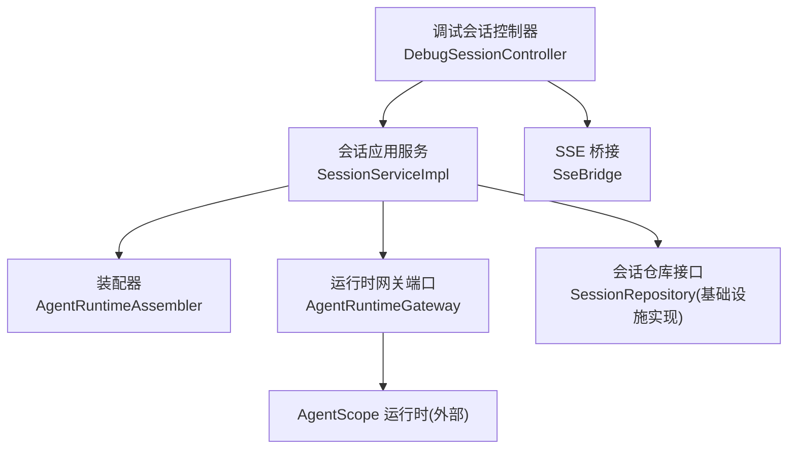
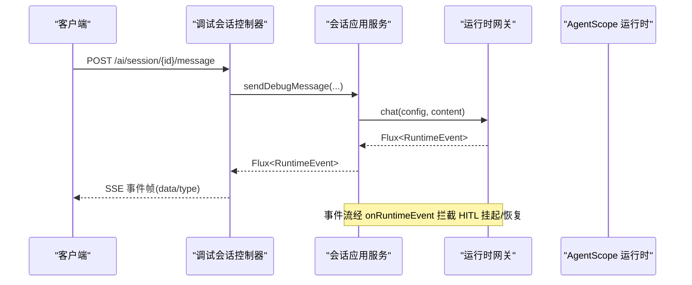
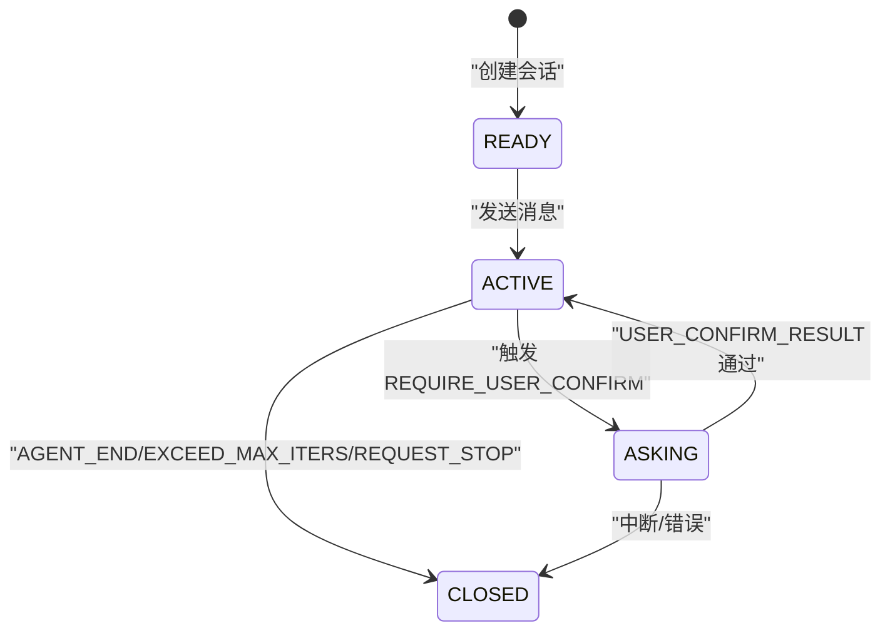
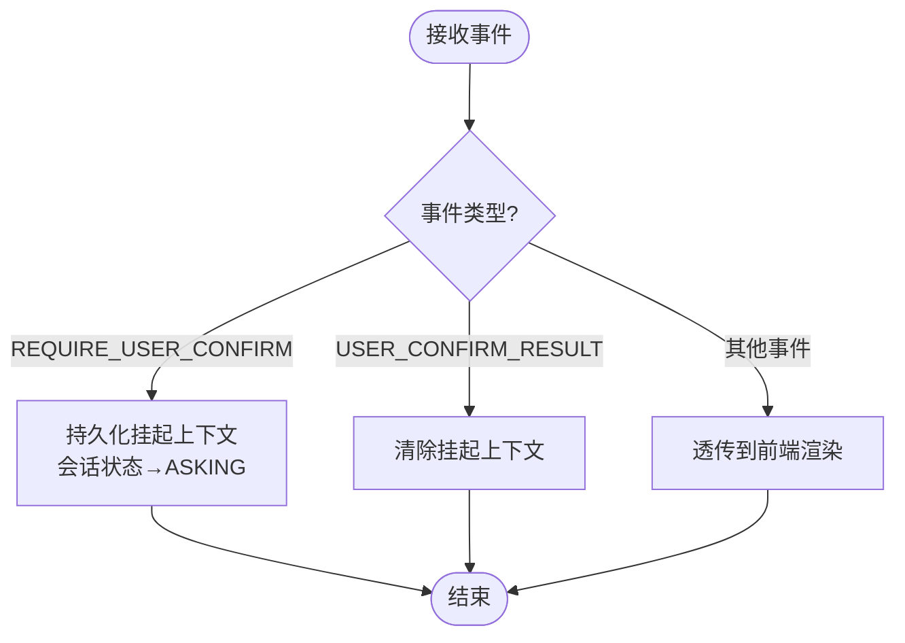
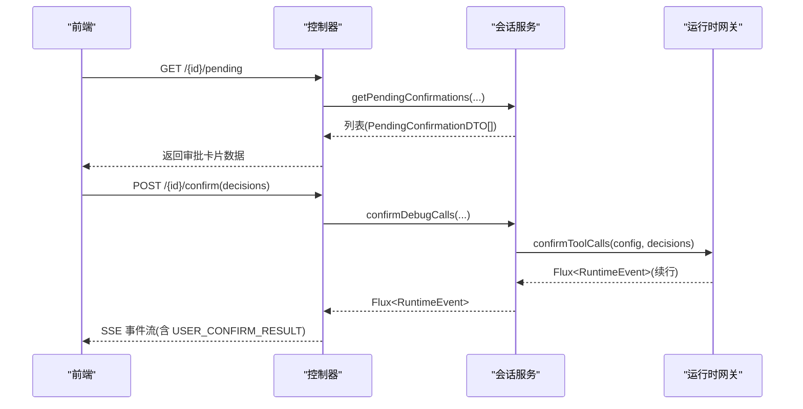
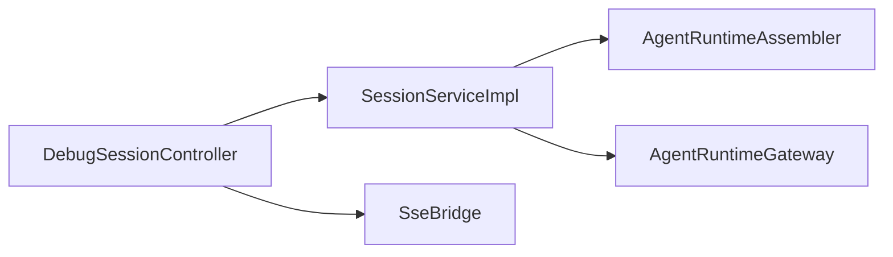

# 会话管理系统

<cite>
**本文引用的文件**
- [SessionStatus.java](file://nexai-module-ai/src/main/java/com/gkht/ai/nexai/module/ai/session/domain/model/SessionStatus.java)
- [SessionType.java](file://nexai-module-ai/nexai-module-ai/src/main/java/com/gkht/ai/nexai/module/ai/session/domain/model/SessionType.java)
- [SessionService.java](file://nexai-module-ai/src/main/java/com/gkht/ai/nexai/module/ai/session/application/service/SessionService.java)
- [SessionServiceImpl.java](file://nexai-module-ai/src/main/java/com/gkht/ai/nexai/module/ai/session/application/service/SessionServiceImpl.java)
- [DebugSessionController.java](file://nexai-module-ai/src/main/java/com/gkht/ai/nexai/module/ai/session/interfaces/controller/admin/session/DebugSessionController.java)
- [RuntimeEvent.java](file://nexai-module-ai/src/main/java/com/gkht/ai/nexai/module/ai/session/domain/valueobject/RuntimeEvent.java)
- [RuntimeEventType.java](file://nexai-module-ai/src/main/java/com/gkht/ai/nexai/module/ai/session/domain/valueobject/RuntimeEventType.java)
- [AgentRuntimeAssembler.java](file://nexai-module-ai/src/main/java/com/gkht/ai/nexai/module/ai/session/application/service/AgentRuntimeAssembler.java)
- [AgentRuntimeGateway.java](file://nexai-module-ai/src/main/java/com/gkht/ai/nexai/module/ai/session/domain/gateway/AgentRuntimeGateway.java)
- [SseBridge.java](file://nexai-module-ai/src/main/java/com/gkht/ai/nexai/module/ai/session/interfaces/sse/SseBridge.java)
- [DebugSessionCreateCommand.java](file://nexai-module-ai/src/main/java/com/gkht/ai/nexai/module/ai/session/application/command/DebugSessionCreateCommand.java)
- [DebugSessionMessageCommand.java](file://nexai-module-ai/src/main/java/com/gkht/ai/nexai/module/ai/session/application/command/DebugSessionMessageCommand.java)
- [DebugSessionConfirmCommand.java](file://nexai-module-ai/src/main/java/com/gkht/ai/nexai/module/ai/session/application/command/DebugSessionConfirmCommand.java)
- [PendingConfirmationDTO.java](file://nexai-module-ai/src/main/java/com/gkht/ai/nexai/module/ai/session/application/dto/PendingConfirmationDTO.java)
</cite>

## 目录
1. [简介](#简介)
2. [项目结构](#项目结构)
3. [核心组件](#核心组件)
4. [架构总览](#架构总览)
5. [详细组件分析](#详细组件分析)
6. [依赖关系分析](#依赖关系分析)
7. [性能考量](#性能考量)
8. [故障排查指南](#故障排查指南)
9. [结论](#结论)
10. [附录：API 使用示例](#附录api-使用示例)

## 简介
本技术文档围绕“会话管理系统”展开，聚焦以下目标：
- 会话生命周期管理：说明调试会话与生产（终端）会话的区别、用途与状态机设计。
- 运行时事件处理机制：消息传递、上下文管理与状态同步。
- 人机协作审批（HITL）：待确认消息的处理流程与用户交互模式。
- API 使用示例：创建会话、发送消息、处理响应、监控状态。
- 与 AgentScope 框架的集成方式与性能优化策略。

## 项目结构
会话管理位于 AI 模块的 session 子域，采用分层与六边形架构思想：
- 接口层：控制器暴露 REST/SSE 端点；SSE 桥接将流式事件转为服务端推送帧。
- 应用层：编排领域服务与基础设施端口，负责装配指令、持久化轮次、HITL 挂起上下文等。
- 领域层：定义会话类型、状态、运行时事件信封、工具调用决策等核心概念。
- 基础设施层：实现运行时网关（对接 AgentScope）、仓库、转换器、数据对象等。

图表来源
- [DebugSessionController.java:46-162](file://nexai-module-ai/src/main/java/com/gkht/ai/nexai/module/ai/session/interfaces/controller/admin/session/DebugSessionController.java#L46-L162)
- [SessionServiceImpl.java:55-277](file://nexai-module-ai/src/main/java/com/gkht/ai/nexai/module/ai/session/application/service/SessionServiceImpl.java#L55-L277)
- [AgentRuntimeAssembler.java:41-182](file://nexai-module-ai/src/main/java/com/gkht/ai/nexai/module/ai/session/application/service/AgentRuntimeAssembler.java#L41-L182)
- [AgentRuntimeGateway.java:25-102](file://nexai-module-ai/src/main/java/com/gkht/ai/nexai/module/ai/session/domain/gateway/AgentRuntimeGateway.java#L25-L102)
- [SseBridge.java:15-67](file://nexai-module-ai/src/main/java/com/gkht/ai/nexai/module/ai/session/interfaces/sse/SseBridge.java#L15-L67)

章节来源
- [DebugSessionController.java:46-162](file://nexai-module-ai/src/main/java/com/gkht/ai/nexai/module/ai/session/interfaces/controller/admin/session/DebugSessionController.java#L46-L162)
- [SessionServiceImpl.java:55-277](file://nexai-module-ai/src/main/java/com/gkht/ai/nexai/module/ai/session/application/service/SessionServiceImpl.java#L55-L277)
- [AgentRuntimeAssembler.java:41-182](file://nexai-module-ai/src/main/java/com/gkht/ai/nexai/module/ai/session/application/service/AgentRuntimeAssembler.java#L41-L182)
- [AgentRuntimeGateway.java:25-102](file://nexai-module-ai/src/main/java/com/gkht/ai/nexai/module/ai/session/domain/gateway/AgentRuntimeGateway.java#L25-L102)
- [SseBridge.java:15-67](file://nexai-module-ai/src/main/java/com/gkht/ai/nexai/module/ai/session/interfaces/sse/SseBridge.java#L15-L67)

## 核心组件
- 会话类型与状态
  - 会话类型：调试（DEBUG）与终端（CHAT），决定入口与恢复语义。
  - 会话状态：就绪（READY）、运行中（ACTIVE）、挂起（ASKING）、已结束（CLOSED）。
- 运行时事件信封
  - 统一事件类型枚举与不可变事件记录，承载 agentscope 事件 JSON 载荷。
- 应用服务
  - 会话创建、发消息（SSE 事件流）、HITL 审批、中断、分页查询、历史加载、workspace 文件操作。
- 装配器
  - 从规格版本快照、渠道/模型、技能挂载、MCP 服务器等组装运行时配置。
- 运行时网关
  - 对外暴露 chat、confirmToolCalls、interrupt、workspace 访问、历史加载等能力，屏蔽 agentscope 细节。
- SSE 桥接
  - 将 Flux 事件流桥接到 SseEmitter，封装订阅调度、错误收尾与完成回调。

章节来源
- [SessionType.java:7-12](file://nexai-module-ai/src/main/java/com/gkht/ai/nexai/module/ai/session/domain/model/SessionType.java#L7-L12)
- [SessionStatus.java:7-16](file://nexai-module-ai/src/main/java/com/gkht/ai/nexai/module/ai/session/domain/model/SessionStatus.java#L7-L16)
- [RuntimeEventType.java:15-47](file://nexai-module-ai/src/main/java/com/gkht/ai/nexai/module/ai/session/domain/valueobject/RuntimeEventType.java#L15-L47)
- [RuntimeEvent.java:8-47](file://nexai-module-ai/src/main/java/com/gkht/ai/nexai/module/ai/session/domain/valueobject/RuntimeEvent.java#L8-L47)
- [SessionService.java:21-78](file://nexai-module-ai/src/main/java/com/gkht/ai/nexai/module/ai/session/application/service/SessionService.java#L21-L78)
- [AgentRuntimeAssembler.java:41-182](file://nexai-module-ai/src/main/java/com/gkht/ai/nexai/module/ai/session/application/service/AgentRuntimeAssembler.java#L41-L182)
- [AgentRuntimeGateway.java:25-102](file://nexai-module-ai/src/main/java/com/gkht/ai/nexai/module/ai/session/domain/gateway/AgentRuntimeGateway.java#L25-L102)
- [SseBridge.java:15-67](file://nexai-module-ai/src/main/java/com/gkht/ai/nexai/module/ai/session/interfaces/sse/SseBridge.java#L15-L67)

## 架构总览
系统以“应用服务 + 领域模型 + 基础设施端口”的分层组织，通过运行时网关隔离 AgentScope 框架细节，SSE 桥接提供统一的流式输出。

图表来源
- [DebugSessionController.java:58-66](file://nexai-module-ai/src/main/java/com/gkht/ai/nexai/module/ai/session/interfaces/controller/admin/session/DebugSessionController.java#L58-L66)
- [SessionServiceImpl.java:92-105](file://nexai-module-ai/src/main/java/com/gkht/ai/nexai/module/ai/session/application/service/SessionServiceImpl.java#L92-L105)
- [AgentRuntimeGateway.java:27-37](file://nexai-module-ai/src/main/java/com/gkht/ai/nexai/module/ai/session/domain/gateway/AgentRuntimeGateway.java#L27-L37)
- [SseBridge.java:37-50](file://nexai-module-ai/src/main/java/com/gkht/ai/nexai/module/ai/session/interfaces/sse/SseBridge.java#L37-L50)

## 详细组件分析

### 会话生命周期与状态机
- 状态定义
  - READY：可发起消息。
  - ACTIVE：有进行中的消息轮次。
  - ASKING：HITL 挂起，等待人工审批。
  - CLOSED：已结束。
- 状态转换要点
  - 创建会话后处于 READY。
  - 发送消息进入 ACTIVE，并在需要 HITL 时转入 ASKING。
  - 审批通过后继续执行并回到 ACTIVE，最终结束至 CLOSED。
  - 中断或异常结束时进入 CLOSED。

图表来源
- [SessionStatus.java:7-16](file://nexai-module-ai/src/main/java/com/gkht/ai/nexai/module/ai/session/domain/model/SessionStatus.java#L7-L16)
- [SessionServiceImpl.java:92-145](file://nexai-module-ai/src/main/java/com/gkht/ai/nexai/module/ai/session/application/service/SessionServiceImpl.java#L92-L145)

章节来源
- [SessionStatus.java:7-16](file://nexai-module-ai/src/main/java/com/gkht/ai/nexai/module/ai/session/domain/model/SessionStatus.java#L7-L16)
- [SessionServiceImpl.java:92-145](file://nexai-module-ai/src/main/java/com/gkht/ai/nexai/module/ai/session/application/service/SessionServiceImpl.java#L92-L145)

### 运行时事件处理机制
- 事件信封
  - 统一类型枚举与不可变记录，payload 为 agentscope 事件 JSON。
  - 平台侧错误统一为 SESSION_ERROR 事件，避免异常泄漏到前端。
- 事件拦截与状态同步
  - 当收到 REQUIRE_USER_CONFIRM 时，持久化挂起上下文并将会话置为 ASKING。
  - 当收到 USER_CONFIRM_RESULT 时，清除挂起上下文，允许续行。
- SSE 桥接
  - 将 Flux 事件流转换为 SseEmitter 帧，错误时发送 SESSION_ERROR 并关闭连接。

图表来源
- [RuntimeEventType.java:15-47](file://nexai-module-ai/src/main/java/com/gkht/ai/nexai/module/ai/session/domain/valueobject/RuntimeEventType.java#L15-L47)
- [RuntimeEvent.java:8-47](file://nexai-module-ai/src/main/java/com/gkht/ai/nexai/module/ai/session/domain/valueobject/RuntimeEvent.java#L8-L47)
- [SessionServiceImpl.java:126-145](file://nexai-module-ai/src/main/java/com/gkht/ai/nexai/module/ai/session/application/service/SessionServiceImpl.java#L126-L145)
- [SseBridge.java:37-50](file://nexai-module-ai/src/main/java/com/gkht/ai/nexai/module/ai/session/interfaces/sse/SseBridge.java#L37-L50)

章节来源
- [RuntimeEventType.java:15-47](file://nexai-module-ai/src/main/java/com/gkht/ai/nexai/module/ai/session/domain/valueobject/RuntimeEventType.java#L15-L47)
- [RuntimeEvent.java:8-47](file://nexai-module-ai/src/main/java/com/gkht/ai/nexai/module/ai/session/domain/valueobject/RuntimeEvent.java#L8-L47)
- [SessionServiceImpl.java:126-145](file://nexai-module-ai/src/main/java/com/gkht/ai/nexai/module/ai/session/application/service/SessionServiceImpl.java#L126-L145)
- [SseBridge.java:37-50](file://nexai-module-ai/src/main/java/com/gkht/ai/nexai/module/ai/session/interfaces/sse/SseBridge.java#L37-L50)

### 人机协作审批（HITL）
- 触发条件
  - 智能体在运行过程中遇到敏感工具调用，发出 REQUIRE_USER_CONFIRM 事件。
- 处理流程
  - 应用层持久化挂起上下文，会话状态置 ASKING。
  - 前端读取挂起上下文，渲染审批卡片。
  - 用户提交三态决定（确认/拒绝/改参数），应用层调用 confirmToolCalls 续行。
  - 若 agentscope 接受，则清除挂起上下文并继续执行；否则保留以便重试。
- 交互模式
  - 断线重连后可恢复 ASKING 状态，重新渲染审批卡片。

图表来源
- [DebugSessionController.java:68-76](file://nexai-module-ai/src/main/java/com/gkht/ai/nexai/module/ai/session/interfaces/controller/admin/session/DebugSessionController.java#L68-L76)
- [SessionServiceImpl.java:107-124](file://nexai-module-ai/src/main/java/com/gkht/ai/nexai/module/ai/session/application/service/SessionServiceImpl.java#L107-L124)
- [AgentRuntimeGateway.java:56-67](file://nexai-module-ai/src/main/java/com/gkht/ai/nexai/module/ai/session/domain/gateway/AgentRuntimeGateway.java#L56-L67)

章节来源
- [DebugSessionController.java:68-76](file://nexai-module-ai/src/main/java/com/gkht/ai/nexai/module/ai/session/interfaces/controller/admin/session/DebugSessionController.java#L68-L76)
- [SessionServiceImpl.java:107-124](file://nexai-module-ai/src/main/java/com/gkht/ai/nexai/module/ai/session/application/service/SessionServiceImpl.java#L107-L124)
- [AgentRuntimeGateway.java:56-67](file://nexai-module-ai/src/main/java/com/gkht/ai/nexai/module/ai/session/domain/gateway/AgentRuntimeGateway.java#L56-L67)
- [PendingConfirmationDTO.java:10-23](file://nexai-module-ai/src/main/java/com/gkht/ai/nexai/module/ai/session/application/dto/PendingConfirmationDTO.java#L10-L23)

### 调试会话与生产（终端）会话
- 调试会话（DEBUG）
  - 入口：管理后台调试台。
  - 特点：支持 HITL 审批、workspace 文件浏览、历史消息加载、按规格版本装配。
- 终端会话（CHAT）
  - 入口：终端聊天页（未来扩展）。
  - 特点：复用同一装配链与运行时网关，但交互与权限控制不同。
- 区别与用途
  - DEBUG 用于管理员调试与排障，强调可控性与可观测性。
  - CHAT 面向终端用户，强调稳定性与低耦合。

章节来源
- [SessionType.java:7-12](file://nexai-module-ai/src/main/java/com/gkht/ai/nexai/module/ai/session/domain/model/SessionType.java#L7-L12)
- [DebugSessionController.java:46-162](file://nexai-module-ai/src/main/java/com/gkht/ai/nexai/module/ai/session/interfaces/controller/admin/session/DebugSessionController.java#L46-L162)

### 与 AgentScope 的集成与性能优化
- 集成方式
  - 通过运行时网关端口抽象，屏蔽 agentscope 事件类型与实例管理细节。
  - 事件以统一信封交付，控制器零 agentscope 依赖。
- 性能优化策略
  - 常驻实例：同 (userId, sessionId) 槽位串行化，不同会话并行。
  - 快路径装配：默认版本且无覆盖 → 命中缓存复用；非默认版本自然回落 per-spec 装配。
  - 技能挂载幂等物化：内容一致跳过落盘，减少 IO。
  - SSE 桥接：boundedElastic 订阅，错误收尾不挂死连接。

章节来源
- [AgentRuntimeGateway.java:25-102](file://nexai-module-ai/src/main/java/com/gkht/ai/nexai/module/ai/session/domain/gateway/AgentRuntimeGateway.java#L25-L102)
- [AgentRuntimeAssembler.java:69-102](file://nexai-module-ai/src/main/java/com/gkht/ai/nexai/module/ai/session/application/service/AgentRuntimeAssembler.java#L69-L102)
- [AgentRuntimeAssembler.java:109-139](file://nexai-module-ai/src/main/java/com/gkht/ai/nexai/module/ai/session/application/service/AgentRuntimeAssembler.java#L109-L139)
- [SseBridge.java:37-50](file://nexai-module-ai/src/main/java/com/gkht/ai/nexai/module/ai/session/interfaces/sse/SseBridge.java#L37-L50)

## 依赖关系分析
- 控制器依赖应用服务，应用服务依赖装配器与运行时网关。
- 运行时网关是外部框架的适配层，屏蔽具体实现。
- SSE 桥接独立于业务逻辑，仅负责事件到帧的转换。

图表来源
- [DebugSessionController.java:46-162](file://nexai-module-ai/src/main/java/com/gkht/ai/nexai/module/ai/session/interfaces/controller/admin/session/DebugSessionController.java#L46-L162)
- [SessionServiceImpl.java:55-277](file://nexai-module-ai/src/main/java/com/gkht/ai/nexai/module/ai/session/application/service/SessionServiceImpl.java#L55-L277)
- [AgentRuntimeAssembler.java:41-182](file://nexai-module-ai/src/main/java/com/gkht/ai/nexai/module/ai/session/application/service/AgentRuntimeAssembler.java#L41-L182)
- [AgentRuntimeGateway.java:25-102](file://nexai-module-ai/src/main/java/com/gkht/ai/nexai/module/ai/session/domain/gateway/AgentRuntimeGateway.java#L25-L102)
- [SseBridge.java:15-67](file://nexai-module-ai/src/main/java/com/gkht/ai/nexai/module/ai/session/interfaces/sse/SseBridge.java#L15-L67)

章节来源
- [DebugSessionController.java:46-162](file://nexai-module-ai/src/main/java/com/gkht/ai/nexai/module/ai/session/interfaces/controller/admin/session/DebugSessionController.java#L46-L162)
- [SessionServiceImpl.java:55-277](file://nexai-module-ai/src/main/java/com/gkht/ai/nexai/module/ai/session/application/service/SessionServiceImpl.java#L55-L277)
- [AgentRuntimeAssembler.java:41-182](file://nexai-module-ai/src/main/java/com/gkht/ai/nexai/module/ai/session/application/service/AgentRuntimeAssembler.java#L41-L182)
- [AgentRuntimeGateway.java:25-102](file://nexai-module-ai/src/main/java/com/gkht/ai/nexai/module/ai/session/domain/gateway/AgentRuntimeGateway.java#L25-L102)
- [SseBridge.java:15-67](file://nexai-module-ai/src/main/java/com/gkht/ai/nexai/module/ai/session/interfaces/sse/SseBridge.java#L15-L67)

## 性能考量
- 流式处理：SSE 桥接使用 boundedElastic 调度，避免阻塞主线程。
- 常驻实例：同会话槽位串行化，降低重复装配开销。
- 快路径装配：默认版本走生效快照单一入口，命中缓存即复用。
- 技能挂载幂等：内容指纹比对一致跳过落盘，减少磁盘 IO。
- 错误收尾：SSE 错误帧后立即 complete，避免连接悬挂。

[本节为通用指导，无需特定文件引用]

## 故障排查指南
- 常见错误事件
  - SESSION_ERROR：平台侧统一错误帧，包含 message 字段。
- 排查步骤
  - 检查会话状态是否为 ASKING；若是，先读取挂起上下文再审批。
  - 校验装配配置：模型/渠道是否启用、租户上下文是否存在。
  - 观察 SSE 事件流：确认事件类型与 payload 是否符合预期。
  - 检查中断与恢复：中断后应正常收尾；恢复时需确保槽位一致。

章节来源
- [RuntimeEvent.java:14-23](file://nexai-module-ai/src/main/java/com/gkht/ai/nexai/module/ai/session/domain/valueobject/RuntimeEvent.java#L14-L23)
- [SessionServiceImpl.java:78-89](file://nexai-module-ai/src/main/java/com/gkht/ai/nexai/module/ai/session/application/service/SessionServiceImpl.java#L78-L89)
- [AgentRuntimeAssembler.java:69-102](file://nexai-module-ai/src/main/java/com/gkht/ai/nexai/module/ai/session/application/service/AgentRuntimeAssembler.java#L69-L102)
- [SseBridge.java:37-50](file://nexai-module-ai/src/main/java/com/gkht/ai/nexai/module/ai/session/interfaces/sse/SseBridge.java#L37-L50)

## 结论
本会话管理系统通过清晰的分层与端口抽象，实现了调试与会话的全生命周期管理，结合 HITL 审批与 SSE 流式事件，提供了高可控性与可观测性的交互体验。装配器的快路径与常驻实例策略保障了性能，SSE 桥接确保了稳定的流式输出。后续可扩展终端会话（CHAT）与更多出口协议。

[本节为总结，无需特定文件引用]

## 附录：API 使用示例
以下为调试会话常用 API 的使用说明（请求/响应结构与字段含义见命令与 DTO 定义）：

- 创建调试会话
  - 方法：POST
  - 路径：/ai/session/debug/create
  - 请求体：标题、规格编号、版本号（可选）
  - 响应：会话 ID
  - 参考：[DebugSessionCreateCommand.java:15-29](file://nexai-module-ai/src/main/java/com/gkht/ai/nexai/module/ai/session/application/command/DebugSessionCreateCommand.java#L15-L29)

- 发送消息（SSE 流）
  - 方法：POST
  - 路径：/ai/session/{id}/message
  - 请求体：消息内容
  - 响应：SSE 事件流（文本增量/思考块/工具调用/用量/HITL 挂起/错误）
  - 参考：[DebugSessionMessageCommand.java:13-20](file://nexai-module-ai/src/main/java/com/gkht/ai/nexai/module/ai/session/application/command/DebugSessionMessageCommand.java#L13-L20)

- HITL 审批（SSE 流）
  - 方法：POST
  - 路径：/ai/session/{id}/confirm
  - 请求体：审批决定列表（toolCallId、toolName、approved、argumentsJson）
  - 响应：SSE 事件流（续行事件/错误）
  - 参考：[DebugSessionConfirmCommand.java:18-46](file://nexai-module-ai/src/main/java/com/gkht/ai/nexai/module/ai/session/application/command/DebugSessionConfirmCommand.java#L18-L46)

- 获取挂起审批上下文
  - 方法：GET
  - 路径：/ai/session/{id}/pending
  - 响应：待确认工具调用列表（toolCallId、toolName、argumentsJson）
  - 参考：[PendingConfirmationDTO.java:10-23](file://nexai-module-ai/src/main/java/com/gkht/ai/nexai/module/ai/session/application/dto/PendingConfirmationDTO.java#L10-L23)

- 中断会话
  - 方法：POST
  - 路径：/ai/session/{id}/interrupt
  - 响应：布尔值（成功/失败）
  - 参考：[DebugSessionController.java:78-83](file://nexai-module-ai/src/main/java/com/gkht/ai/nexai/module/ai/session/interfaces/controller/admin/session/DebugSessionController.java#L78-L83)

- 会话分页与详情
  - 方法：GET
  - 路径：/ai/session/page、/ai/session/{id}
  - 响应：分页结果、会话详情（含规格业务编码）
  - 参考：[DebugSessionController.java:85-97](file://nexai-module-ai/src/main/java/com/gkht/ai/nexai/module/ai/session/interfaces/controller/admin/session/DebugSessionController.java#L85-L97)

- 加载历史消息与 workspace 文件
  - 方法：GET
  - 路径：/ai/session/{id}/history、/ai/session/{id}/workspace/files、/ai/session/{id}/workspace/file
  - 响应：历史消息 JSON 列表、文件清单、文件内容
  - 参考：[DebugSessionController.java:107-130](file://nexai-module-ai/src/main/java/com/gkht/ai/nexai/module/ai/session/interfaces/controller/admin/session/DebugSessionController.java#L107-L130)

章节来源
- [DebugSessionCreateCommand.java:15-29](file://nexai-module-ai/src/main/java/com/gkht/ai/nexai/module/ai/session/application/command/DebugSessionCreateCommand.java#L15-L29)
- [DebugSessionMessageCommand.java:13-20](file://nexai-module-ai/src/main/java/com/gkht/ai/nexai/module/ai/session/application/command/DebugSessionMessageCommand.java#L13-L20)
- [DebugSessionConfirmCommand.java:18-46](file://nexai-module-ai/src/main/java/com/gkht/ai/nexai/module/ai/session/application/command/DebugSessionConfirmCommand.java#L18-L46)
- [PendingConfirmationDTO.java:10-23](file://nexai-module-ai/src/main/java/com/gkht/ai/nexai/module/ai/session/application/dto/PendingConfirmationDTO.java#L10-L23)
- [DebugSessionController.java:78-130](file://nexai-module-ai/src/main/java/com/gkht/ai/nexai/module/ai/session/interfaces/controller/admin/session/DebugSessionController.java#L78-L130)