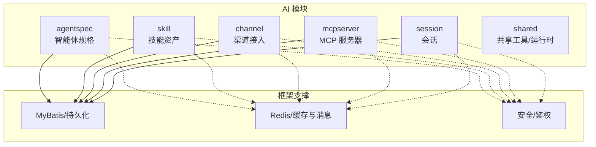
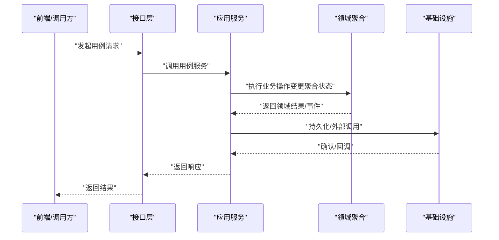
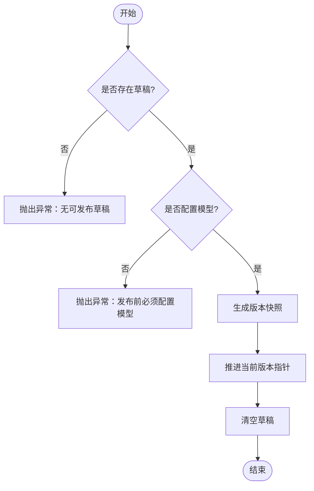
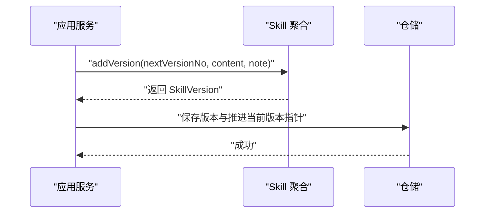
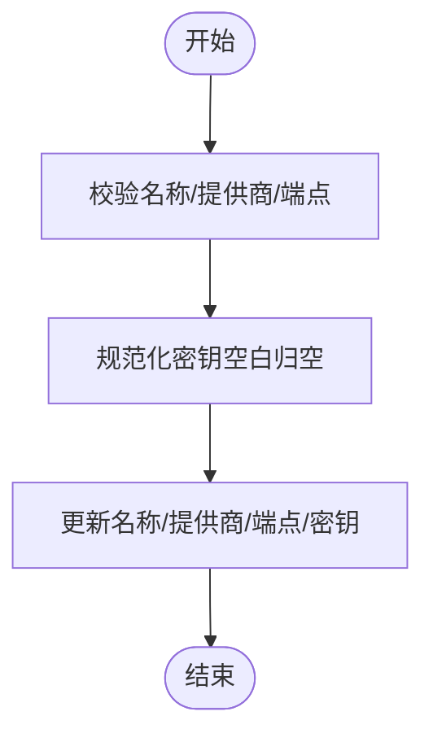
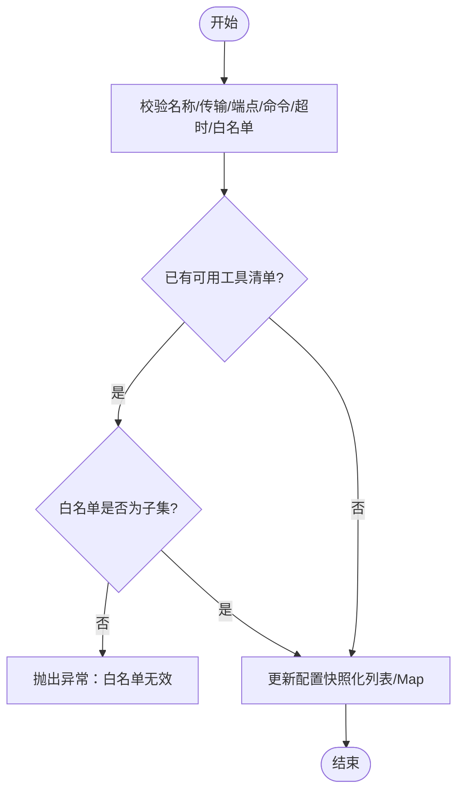
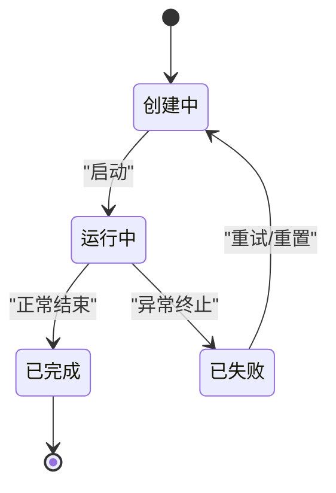
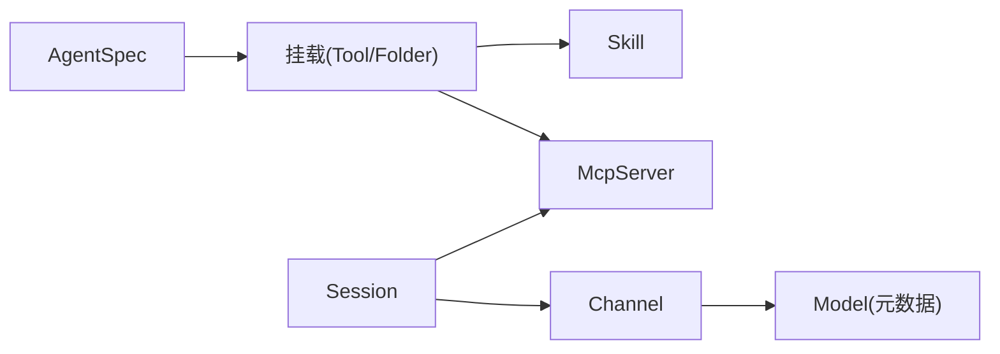

# 核心模块详解

<cite>
**本文引用的文件**
- [AgentSpec.java](file://nexai-module-ai/src/main/java/com/gkht/ai/nexai/module/ai/agentspec/domain/model/AgentSpec.java)
- [Skill.java](file://nexai-module-ai/src/main/java/com/gkht/ai/nexai/module/ai/skill/domain/model/Skill.java)
- [Channel.java](file://nexai-module-ai/src/main/java/com/gkht/ai/nexai/module/ai/channel/domain/model/Channel.java)
- [McpServer.java](file://nexai-module-ai/src/main/java/com/gkht/ai/nexai/module/ai/mcpserver/domain/model/McpServer.java)
- [SessionStatus.java](file://nexai-module-ai/src/main/java/com/gkht/ai/nexai/module/ai/session/domain/model/SessionStatus.java)
- [SessionType.java](file://nexai-module-ai/src/main/java/com/gkht/ai/nexai/module/ai/session/domain/model/SessionType.java)
- [AgentSpecService.java](file://nexai-module-ai/src/main/java/com/gkht/ai/nexai/module/ai/agentspec/application/service/AgentSpecService.java)
- [AgentSpecServiceImpl.java](file://nexai-module-ai/src/main/java/com/gkht/ai/nexai/module/ai/agentspec/application/service/AgentSpecServiceImpl.java)
- [SkillService.java](file://nexai-module-ai/src/main/java/com/gkht/ai/nexai/module/ai/skill/application/service/SkillService.java)
- [SkillServiceImpl.java](file://nexai-module-ai/src/main/java/com/gkht/ai/nexai/module/ai/skill/application/service/SkillServiceImpl.java)
- [ChannelService.java](file://nexai-module-ai/src/main/java/com/gkht/ai/nexai/module/ai/channel/application/service/ChannelService.java)
- [ChannelServiceImpl.java](file://nexai-module-ai/src/main/java/com/gkht/ai/nexai/module/ai/channel/application/service/ChannelServiceImpl.java)
- [ModelService.java](file://nexai-module-ai/src/main/java/com/gkht/ai/nexai/module/ai/channel/application/service/ModelService.java)
- [ModelServiceImpl.java](file://nexai-module-ai/src/main/java/com/gkht/ai/nexai/module/ai/channel/application/service/ModelServiceImpl.java)
- [McpServerService.java](file://nexai-module-ai/src/main/java/com/gkht/ai/nexai/module/ai/mcpserver/application/service/McpServerService.java)
- [McpServerServiceImpl.java](file://nexai-module-ai/src/main/java/com/gkht/ai/nexai/module/ai/mcpserver/application/service/McpServerServiceImpl.java)
</cite>

## 目录
1. [简介](#简介)
2. [项目结构](#项目结构)
3. [核心聚合与领域模型](#核心聚合与领域模型)
4. [架构总览](#架构总览)
5. [详细组件分析](#详细组件分析)
6. [依赖关系与通信机制](#依赖关系与通信机制)
7. [性能考虑](#性能考虑)
8. [故障排查指南](#故障排查指南)
9. [结论](#结论)
10. [附录：DDD实践要点](#附录ddd实践要点)

## 简介
本技术文档聚焦 NexAI 平台 AI 模块的“七聚合”设计，围绕 Agent 规格管理、会话管理、技能系统、渠道管理、MCP 服务器管理等核心聚合展开。文档从领域模型、业务逻辑、接口契约、DDD 模式落地（实体、值对象、聚合根、领域服务）、跨聚合依赖与通信、错误处理策略、事务管理与性能优化等方面给出系统化说明，并辅以代码级图示与使用场景指引，帮助读者快速理解与正确使用这些核心能力。

## 项目结构
AI 模块采用分层与聚合结合的架构：每个聚合内部按 domain / application / infrastructure / interfaces 组织；应用层暴露用例服务，领域层承载核心规则与不变式，基础设施层负责持久化与外部集成，接口层提供对外 API。

**章节来源**
- [AgentSpec.java:1-262](file://nexai-module-ai/src/main/java/com/gkht/ai/nexai/module/ai/agentspec/domain/model/AgentSpec.java#L1-L262)
- [Skill.java:1-200](file://nexai-module-ai/src/main/java/com/gkht/ai/nexai/module/ai/skill/domain/model/Skill.java#L1-L200)
- [Channel.java:1-213](file://nexai-module-ai/src/main/java/com/gkht/ai/nexai/module/ai/channel/domain/model/Channel.java#L1-L213)
- [McpServer.java:1-352](file://nexai-module-ai/src/main/java/com/gkht/ai/nexai/module/ai/mcpserver/domain/model/McpServer.java#L1-L352)

## 核心聚合与领域模型
本节概述各聚合的职责边界、关键实体与值对象、以及核心不变式。

- Agent 规格（AgentSpec）
  - 职责：描述智能体的声明式配置（图纸），包含名称、业务编码、归属层级、图标、草稿与当前版本指针等。
  - 关键不变式：业务编码创建后不可变；归属层级创建后不可变；发布前必须配置模型；发布即清空草稿。
  - 版本语义：草稿与已发布版本快照分离；发布推进当前版本指针并固化不可变快照。

- 技能（Skill）
  - 职责：租户/用户级可复用能力包，维护不可变版本链与当前版本指针，支持上架/下架。
  - 关键不变式：每次编辑产生新版本（版本号严格递增）；当前版本指针指向运行时采用的版本。

- 渠道（Channel）
  - 职责：模型服务接入点，包含提供商类型、端点地址与密钥（BYOK），支持启用/停用。
  - 关键不变式：密钥仅聚合内明文存在，落库加密，对外脱敏展示；必填字段校验严格。

- MCP 服务器（McpServer）
  - 职责：外部工具服务接入点（BYO-MCP），支持 stdio/SSE/Streamable HTTP 传输，含认证头、环境变量、超时、工具白名单等。
  - 关键不变式：传输与端点/命令互斥；白名单需为最近探测清单子集；可用工具清单有上限保护。

- 会话（Session）
  - 职责：会话生命周期与状态管理（状态与类型值对象）。
  - 关键不变式：状态机驱动的状态迁移（由应用服务编排）。

**章节来源**
- [AgentSpec.java:1-262](file://nexai-module-ai/src/main/java/com/gkht/ai/nexai/module/ai/agentspec/domain/model/AgentSpec.java#L1-L262)
- [Skill.java:1-200](file://nexai-module-ai/src/main/java/com/gkht/ai/nexai/module/ai/skill/domain/model/Skill.java#L1-L200)
- [Channel.java:1-213](file://nexai-module-ai/src/main/java/com/gkht/ai/nexai/module/ai/channel/domain/model/Channel.java#L1-L213)
- [McpServer.java:1-352](file://nexai-module-ai/src/main/java/com/gkht/ai/nexai/module/ai/mcpserver/domain/model/McpServer.java#L1-L352)
- [SessionStatus.java](file://nexai-module-ai/src/main/java/com/gkht/ai/nexai/module/ai/session/domain/model/SessionStatus.java)
- [SessionType.java](file://nexai-module-ai/src/main/java/com/gkht/ai/nexai/module/ai/session/domain/model/SessionType.java)

## 架构总览
AI 模块遵循 DDD 分层：
- 接口层：控制器暴露 REST/WS 接口，参数校验与响应转换。
- 应用层：用例服务编排业务流程，协调多个聚合与基础设施。
- 领域层：聚合根承载业务不变式，值对象表达概念与约束，领域服务处理跨聚合复杂逻辑。
- 基础设施层：仓储实现、数据映射、网关适配（如 MCP 探测、渠道连通性检查）。

**图表来源**
- [AgentSpecService.java](file://nexai-module-ai/src/main/java/com/gkht/ai/nexai/module/ai/agentspec/application/service/AgentSpecService.java)
- [AgentSpecServiceImpl.java](file://nexai-module-ai/src/main/java/com/gkht/ai/nexai/module/ai/agentspec/application/service/AgentSpecServiceImpl.java)
- [SkillService.java](file://nexai-module-ai/src/main/java/com/gkht/ai/nexai/module/ai/skill/application/service/SkillService.java)
- [SkillServiceImpl.java](file://nexai-module-ai/src/main/java/com/gkht/ai/nexai/module/ai/skill/application/service/SkillServiceImpl.java)
- [ChannelService.java](file://nexai-module-ai/src/main/java/com/gkht/ai/nexai/module/ai/channel/application/service/ChannelService.java)
- [ChannelServiceImpl.java](file://nexai-module-ai/src/main/java/com/gkht/ai/nexai/module/ai/channel/application/service/ChannelServiceImpl.java)
- [McpServerService.java](file://nexai-module-ai/src/main/java/com/gkht/ai/nexai/module/ai/mcpserver/application/service/McpServerService.java)
- [McpServerServiceImpl.java](file://nexai-module-ai/src/main/java/com/gkht/ai/nexai/module/ai/mcpserver/application/service/McpServerServiceImpl.java)

## 详细组件分析

### Agent 规格聚合（AgentSpec）
- 领域模型
  - 聚合根：AgentSpec（名称、业务编码、归属层级、图标、草稿、当前版本指针、创建时间）
  - 相关实体/值对象：AgentSpecConfig（草稿配置）、AgentSpecVersion（版本快照）、OwnerLevel（归属层级枚举）
- 核心行为
  - 创建规格并携带初始草稿
  - 替换草稿（编辑面）
  - 发布：校验草稿与模型引用，生成不可变版本快照，推进当前版本指针并清空草稿
  - 切换当前生效版本（回退指针）
- 不变式与约束
  - 业务编码格式与长度限制；归属层级与归属用户一致性
  - 发布前必须配置模型；发布即回到稳定态（无草稿）
- 典型流程（发布）

**图表来源**
- [AgentSpec.java:93-117](file://nexai-module-ai/src/main/java/com/gkht/ai/nexai/module/ai/agentspec/domain/model/AgentSpec.java#L93-L117)
- [AgentSpec.java:119-130](file://nexai-module-ai/src/main/java/com/gkht/ai/nexai/module/ai/agentspec/domain/model/AgentSpec.java#L119-L130)
- [AgentSpec.java:144-157](file://nexai-module-ai/src/main/java/com/gkht/ai/nexai/module/ai/agentspec/domain/model/AgentSpec.java#L144-L157)

**章节来源**
- [AgentSpec.java:1-262](file://nexai-module-ai/src/main/java/com/gkht/ai/nexai/module/ai/agentspec/domain/model/AgentSpec.java#L1-L262)
- [AgentSpecService.java](file://nexai-module-ai/src/main/java/com/gkht/ai/nexai/module/ai/agentspec/application/service/AgentSpecService.java)
- [AgentSpecServiceImpl.java](file://nexai-module-ai/src/main/java/com/gkht/ai/nexai/module/ai/agentspec/application/service/AgentSpecServiceImpl.java)

### 技能聚合（Skill）
- 领域模型
  - 聚合根：Skill（名称、描述、归属层级、归属用户、当前版本指针、上架状态、Git 同步源编号、创建时间）
  - 相关实体/值对象：SkillVersion（不可变版本）、SkillContent（版本内容）、SkillOwnerLevel（归属层级）
- 核心行为
  - 登记新版本（编辑产生，版本号严格递增）
  - 推进当前版本指针（首版与后续版本共用）
  - 上架/下架（控制终端目录曝光）
- 不变式与约束
  - 名称/描述长度限制；归属层级与归属用户一致性
  - 版本链只增不改，确保可追溯与可回退
- 典型流程（登记新版本）

**图表来源**
- [Skill.java:96-109](file://nexai-module-ai/src/main/java/com/gkht/ai/nexai/module/ai/skill/domain/model/Skill.java#L96-L109)
- [Skill.java:122-125](file://nexai-module-ai/src/main/java/com/gkht/ai/nexai/module/ai/skill/domain/model/Skill.java#L122-L125)

**章节来源**
- [Skill.java:1-200](file://nexai-module-ai/src/main/java/com/gkht/ai/nexai/module/ai/skill/domain/model/Skill.java#L1-L200)
- [SkillService.java](file://nexai-module-ai/src/main/java/com/gkht/ai/nexai/module/ai/skill/application/service/SkillService.java)
- [SkillServiceImpl.java](file://nexai-module-ai/src/main/java/com/gkht/ai/nexai/module/ai/skill/application/service/SkillServiceImpl.java)

### 渠道聚合（Channel）
- 领域模型
  - 聚合根：Channel（名称、提供商类型、端点地址、API 密钥、启用状态、归属维度、创建/更新时间）
  - 值对象：ChannelProvider（提供商）、ChannelOwnerType（归属维度）、ApiKeyMasker（脱敏）
- 核心行为
  - 创建/更新渠道基础信息（密钥保留或更换，不直接清除）
  - 启用/停用渠道
  - 脱敏展示密钥
- 不变式与约束
  - 名称/端点/密钥长度限制；必填字段校验
  - 密钥仅在聚合内存与加密列存在，对外一律脱敏
- 典型流程（更新渠道）

**图表来源**
- [Channel.java:88-101](file://nexai-module-ai/src/main/java/com/gkht/ai/nexai/module/ai/channel/domain/model/Channel.java#L88-L101)
- [Channel.java:124-134](file://nexai-module-ai/src/main/java/com/gkht/ai/nexai/module/ai/channel/domain/model/Channel.java#L124-L134)

**章节来源**
- [Channel.java:1-213](file://nexai-module-ai/src/main/java/com/gkht/ai/nexai/module/ai/channel/domain/model/Channel.java#L1-L213)
- [ChannelService.java](file://nexai-module-ai/src/main/java/com/gkht/ai/nexai/module/ai/channel/application/service/ChannelService.java)
- [ChannelServiceImpl.java](file://nexai-module-ai/src/main/java/com/gkht/ai/nexai/module/ai/channel/application/service/ChannelServiceImpl.java)
- [ModelService.java](file://nexai-module-ai/src/main/java/com/gkht/ai/nexai/module/ai/channel/application/service/ModelService.java)
- [ModelServiceImpl.java](file://nexai-module-ai/src/main/java/com/gkht/ai/nexai/module/ai/channel/application/service/ModelServiceImpl.java)

### MCP 服务器聚合（McpServer）
- 领域模型
  - 聚合根：McpServer（名称、传输类型、端点/命令、参数、环境变量、认证头、超时、工具白名单、可用工具清单、启用状态、归属维度、创建/更新时间）
  - 值对象：McpTransport（传输类型）、McpOwnerType（归属维度）、McpConnectionConfig（连接配置）
- 核心行为
  - 注册/更新 MCP Server（传输与端点/命令互斥校验）
  - 启用/停用
  - 登记探测结果（刷新可用工具清单）
  - 导出连接配置（供 SDK 建连工厂消费）
- 不变式与约束
  - 传输与端点/命令互斥；HTTP 系传输必须为 http/https URL
  - 白名单必须是最近探测清单的子集；列表与 Map 以不可变快照存储
  - 可用工具清单上限保护
- 典型流程（更新并校验白名单）

**图表来源**
- [McpServer.java:131-156](file://nexai-module-ai/src/main/java/com/gkht/ai/nexai/module/ai/mcpserver/domain/model/McpServer.java#L131-L156)
- [McpServer.java:186-232](file://nexai-module-ai/src/main/java/com/gkht/ai/nexai/module/ai/mcpserver/domain/model/McpServer.java#L186-L232)

**章节来源**
- [McpServer.java:1-352](file://nexai-module-ai/src/main/java/com/gkht/ai/nexai/module/ai/mcpserver/domain/model/McpServer.java#L1-L352)
- [McpServerService.java](file://nexai-module-ai/src/main/java/com/gkht/ai/nexai/module/ai/mcpserver/application/service/McpServerService.java)
- [McpServerServiceImpl.java](file://nexai-module-ai/src/main/java/com/gkht/ai/nexai/module/ai/mcpserver/application/service/McpServerServiceImpl.java)

### 会话聚合（Session）
- 领域模型
  - 值对象：SessionStatus（会话状态）、SessionType（会话类型）
- 核心行为
  - 由应用服务编排状态迁移（创建、运行、完成、失败等）
  - 结合渠道与 MCP 能力进行消息路由与执行
- 不变式与约束
  - 状态迁移受状态机约束，非法迁移应拒绝
- 典型流程（会话状态迁移）

**图表来源**
- [SessionStatus.java](file://nexai-module-ai/src/main/java/com/gkht/ai/nexai/module/ai/session/domain/model/SessionStatus.java)
- [SessionType.java](file://nexai-module-ai/src/main/java/com/gkht/ai/nexai/module/ai/session/domain/model/SessionType.java)

**章节来源**
- [SessionStatus.java](file://nexai-module-ai/src/main/java/com/gkht/ai/nexai/module/ai/session/domain/model/SessionStatus.java)
- [SessionType.java](file://nexai-module-ai/src/main/java/com/gkht/ai/nexai/module/ai/session/domain/model/SessionType.java)

## 依赖关系与通信机制
- 聚合间依赖
  - Agent 规格通过挂载（ToolMount/FolderMount）引用技能与 MCP 服务器能力，装配期进行跨聚合只读校验。
  - 会话在运行时组合渠道与 MCP 能力进行消息路由与执行。
- 通信机制
  - 同步调用：应用服务直接调用领域聚合方法。
  - 异步事件：基于消息队列（Redis Stream/PubSub）解耦耗时任务（如探测、物化）。
  - 缓存：Redis 缓存热点配置（如渠道、MCP 连接配置、技能目录索引）。
- 基础设施集成
  - 持久化：MyBatis Plus + 动态数据源，仓储实现聚合到 DO 的映射。
  - 安全：Spring Security 与 Token 认证，敏感字段加密存储与脱敏展示。
  - 监控：链路追踪与指标采集，便于定位问题。

**图表来源**
- [AgentSpec.java:144-157](file://nexai-module-ai/src/main/java/com/gkht/ai/nexai/module/ai/agentspec/domain/model/AgentSpec.java#L144-L157)
- [McpServer.java:300-315](file://nexai-module-ai/src/main/java/com/gkht/ai/nexai/module/ai/mcpserver/domain/model/McpServer.java#L300-L315)

**章节来源**
- [AgentSpec.java:1-262](file://nexai-module-ai/src/main/java/com/gkht/ai/nexai/module/ai/agentspec/domain/model/AgentSpec.java#L1-L262)
- [McpServer.java:1-352](file://nexai-module-ai/src/main/java/com/gkht/ai/nexai/module/ai/mcpserver/domain/model/McpServer.java#L1-L352)
- [Channel.java:1-213](file://nexai-module-ai/src/main/java/com/gkht/ai/nexai/module/ai/channel/domain/model/Channel.java#L1-L213)

## 性能考虑
- 缓存策略
  - 对渠道、MCP 连接配置、技能目录索引等热点数据进行 Redis 缓存，降低数据库与外部服务压力。
  - 缓存失效：配置变更时主动失效（如 Channel.updateTime、McpServer.updateTime 参与版本戳）。
- 并发与幂等
  - 发布与版本登记使用唯一索引与乐观锁避免重复与冲突。
  - 对外接口增加幂等键，防止重复提交。
- 资源限制
  - 白名单与可用工具清单设置上限，防止异常输入导致内存膨胀。
  - 超时与重试：MCP 请求超时可配置，避免长尾阻塞。
- IO 优化
  - 批量查询与懒加载，减少不必要的数据拉取。
  - 文件物化（技能目录）采用增量更新与缓存命中。

[本节为通用指导，无需特定文件来源]

## 故障排查指南
- 常见错误
  - 发布失败：无草稿或缺模型引用（AgentSpec.publish）
  - 白名单无效：MCP 白名单不在可用工具清单内（McpServer.update）
  - 密钥异常：渠道密钥为空或过长（Channel.update）
  - 传输配置错误：stdio 与 HTTP 传输字段互斥（McpServer.validateBasics）
- 排查步骤
  - 检查聚合不变式与输入校验（参数合法性、长度限制、格式校验）
  - 查看应用服务日志与仓储 SQL，确认事务边界与数据一致性
  - 使用链路追踪定位外部调用失败（MCP 探测、渠道连通性）
  - 核对缓存与配置版本戳，确保实例重建与配置生效
- 恢复建议
  - 修正输入后重试；必要时重置草稿或重新发布
  - 清理异常缓存项，触发配置重建
  - 调整超时与重试策略，提升稳定性

**章节来源**
- [AgentSpec.java:93-117](file://nexai-module-ai/src/main/java/com/gkht/ai/nexai/module/ai/agentspec/domain/model/AgentSpec.java#L93-L117)
- [McpServer.java:186-232](file://nexai-module-ai/src/main/java/com/gkht/ai/nexai/module/ai/mcpserver/domain/model/McpServer.java#L186-L232)
- [Channel.java:106-134](file://nexai-module-ai/src/main/java/com/gkht/ai/nexai/module/ai/channel/domain/model/Channel.java#L106-L134)

## 结论
NexAI AI 模块通过清晰的聚合边界与严格的不变式约束，实现了 Agent 规格、技能、渠道、MCP 服务器与会话的核心业务能力。DDD 分层与值对象/聚合根/领域服务的职责划分，使业务逻辑内聚、易扩展、易测试。结合缓存、幂等、超时与监控等手段，系统在性能与稳定性方面具备良好基础。建议在后续迭代中持续完善状态机、事件溯源与可观测性，进一步提升系统的可维护性与可靠性。

[本节为总结性内容，无需特定文件来源]

## 附录：DDD实践要点
- 聚合根
  - 承载核心不变式与业务规则（如 AgentSpec 发布、Skill 版本登记、Channel 密钥管理、McpServer 白名单校验）
- 值对象
  - 表达概念与约束（如 OwnerLevel、SkillOwnerLevel、ChannelProvider、McpTransport、McpOwnerType、SessionStatus/Type）
- 领域服务
  - 处理跨聚合复杂逻辑（如装配期校验、会话编排、探测与物化）
- 仓储
  - 聚合与持久化的桥梁，负责 DO 映射与事务边界
- 应用服务
  - 用例编排，协调聚合与基础设施，保证一致性与可观测性
- 接口层
  - 参数校验、响应转换、权限控制

[本节为概念性内容，无需特定文件来源]