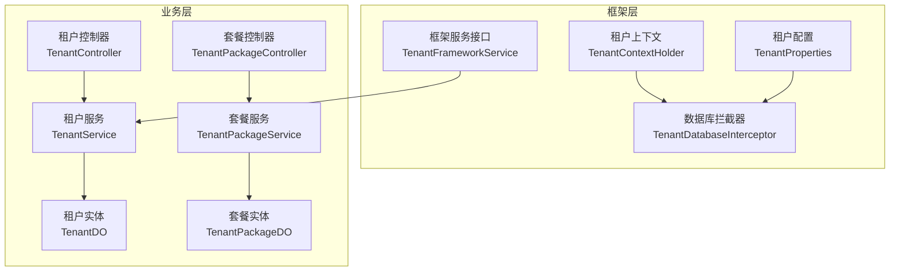
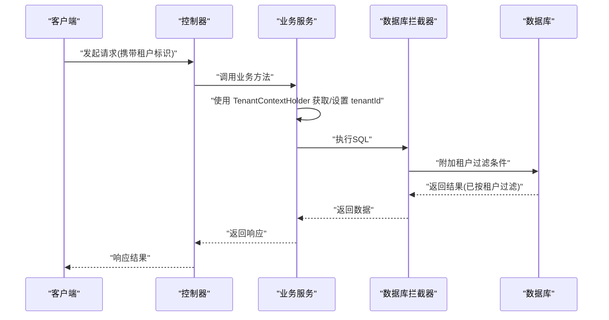
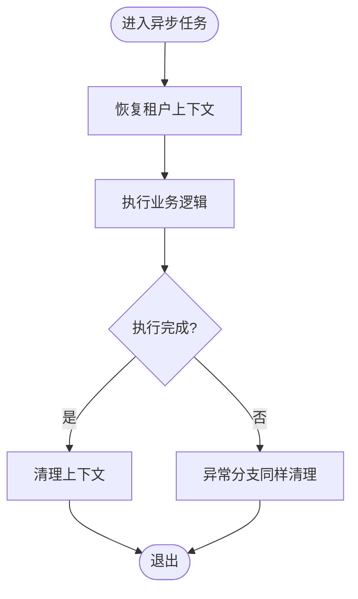
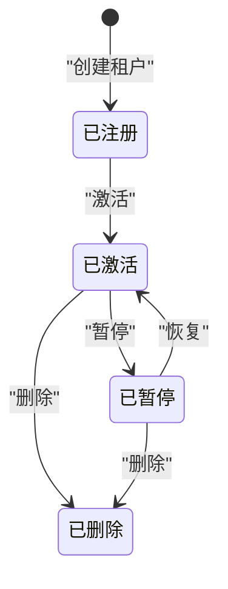
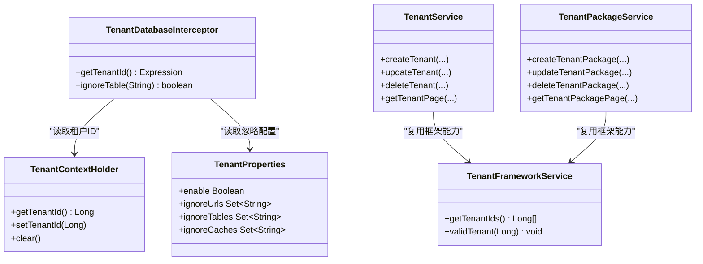
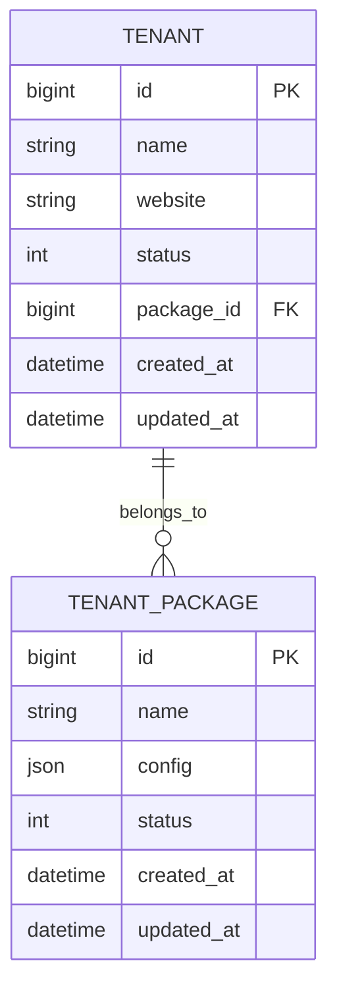

# 多租户管理

<cite>
**本文引用的文件**
- [TenantContextHolder.java](file://nexai-framework/nexai-spring-boot-starter-biz-tenant/src/main/java/com/gkht/ai/nexai/framework/tenant/core/context/TenantContextHolder.java)
- [TenantProperties.java](file://nexai-framework/nexai-spring-boot-starter-biz-tenant/src/main/java/com/gkht/ai/nexai/framework/tenant/config/TenantProperties.java)
- [TenantDatabaseInterceptor.java](file://nexai-framework/nexai-spring-boot-starter-biz-tenant/src/main/java/com/gkht/ai/nexai/framework/tenant/core/db/TenantDatabaseInterceptor.java)
- [TenantFrameworkService.java](file://nexai-framework/nexai-spring-boot-starter-biz-tenant/src/main/java/com/gkht/ai/nexai/framework/tenant/core/service/TenantFrameworkService.java)
- [TenantService.java](file://nexai-module-system/src/main/java/com/gkht/ai/nexai/module/system/service/tenant/TenantService.java)
- [TenantPackageService.java](file://nexai-module-system/src/main/java/com/gkht/ai/nexai/module/system/service/tenant/TenantPackageService.java)
- [TenantController.java](file://nexai-module-system/src/main/java/com/gkht/ai/nexai/module/system/controller/admin/tenant/TenantController.java)
- [TenantPackageController.java](file://nexai-module-system/src/main/java/com/gkht/ai/nexai/module/system/controller/admin/tenant/TenantPackageController.java)
- [TenantDO.java](file://nexai-module-system/src/main/java/com/gkht/ai/nexai/module/system/dal/dataobject/tenant/TenantDO.java)
- [TenantPackageDO.java](file://nexai-module-system/src/main/java/com/gkht/ai/nexai/module/system/dal/dataobject/tenant/TenantPackageDO.java)
- [TenantExecution.java](file://nexai-module-ai/src/main/java/com/gkht/ai/nexai/module/ai/shared/util/TenantExecution.java)
- [MultiTenantIsolationTest.java](file://nexai-module-ai/src/test/java/com/gkht/ai/nexai/module/ai/support/MultiTenantIsolationTest.java)
</cite>

## 目录
1. [简介](#简介)
2. [项目结构](#项目结构)
3. [核心组件](#核心组件)
4. [架构总览](#架构总览)
5. [详细组件分析](#详细组件分析)
6. [依赖关系分析](#依赖关系分析)
7. [性能考虑](#性能考虑)
8. [故障排查指南](#故障排查指南)
9. [结论](#结论)
10. [附录：API与集成示例](#附录api与集成示例)

## 简介
本文件面向多租户管理系统，系统性阐述数据隔离策略（共享库分schema、独立数据库）、配置隔离机制、租户上下文管理、租户生命周期状态流转、套餐管理与资源限制、租户配置管理接口、租户切换实现原理与优化建议，并提供完整的API文档与集成示例。内容基于仓库中“框架层租户能力”和“系统模块租户业务”的实现进行提炼与归纳。

## 项目结构
多租户能力由两部分构成：
- 框架层（starter）：提供租户上下文、拦截器、缓存/消息队列/任务等扩展点，以及可插拔的数据源与缓存隔离能力。
- 业务层（system模块）：提供租户与租户套餐的CRUD、状态管理、菜单与权限关联等管理能力。

图表来源
- [TenantContextHolder.java:1-69](file://nexai-framework/nexai-spring-boot-starter-biz-tenant/src/main/java/com/gkht/ai/nexai/framework/tenant/core/context/TenantContextHolder.java#L1-L69)
- [TenantProperties.java:1-58](file://nexai-framework/nexai-spring-boot-starter-biz-tenant/src/main/java/com/gkht/ai/nexai/framework/tenant/config/TenantProperties.java#L1-L58)
- [TenantDatabaseInterceptor.java:1-84](file://nexai-framework/nexai-spring-boot-starter-biz-tenant/src/main/java/com/gkht/ai/nexai/framework/tenant/core/db/TenantDatabaseInterceptor.java#L1-L84)
- [TenantFrameworkService.java:1-27](file://nexai-framework/nexai-spring-boot-starter-biz-tenant/src/main/java/com/gkht/ai/nexai/framework/tenant/core/service/TenantFrameworkService.java#L1-L27)
- [TenantService.java:1-146](file://nexai-module-system/src/main/java/com/gkht/ai/nexai/module/system/service/tenant/TenantService.java#L1-L146)
- [TenantPackageService.java:1-80](file://nexai-module-system/src/main/java/com/gkht/ai/nexai/module/system/service/tenant/TenantPackageService.java#L1-L80)
- [TenantController.java](file://nexai-module-system/src/main/java/com/gkht/ai/nexai/module/system/controller/admin/tenant/TenantController.java)
- [TenantPackageController.java](file://nexai-module-system/src/main/java/com/gkht/ai/nexai/module/system/controller/admin/tenant/TenantPackageController.java)
- [TenantDO.java](file://nexai-module-system/src/main/java/com/gkht/ai/nexai/module/system/dal/dataobject/tenant/TenantDO.java)
- [TenantPackageDO.java](file://nexai-module-system/src/main/java/com/gkht/ai/nexai/module/system/dal/dataobject/tenant/TenantPackageDO.java)

章节来源
- [TenantContextHolder.java:1-69](file://nexai-framework/nexai-spring-boot-starter-biz-tenant/src/main/java/com/gkht/ai/nexai/framework/tenant/core/context/TenantContextHolder.java#L1-L69)
- [TenantProperties.java:1-58](file://nexai-framework/nexai-spring-boot-starter-biz-tenant/src/main/java/com/gkht/ai/nexai/framework/tenant/config/TenantProperties.java#L1-L58)
- [TenantDatabaseInterceptor.java:1-84](file://nexai-framework/nexai-spring-boot-starter-biz-tenant/src/main/java/com/gkht/ai/nexai/framework/tenant/core/db/TenantDatabaseInterceptor.java#L1-L84)
- [TenantService.java:1-146](file://nexai-module-system/src/main/java/com/gkht/ai/nexai/module/system/service/tenant/TenantService.java#L1-L146)
- [TenantPackageService.java:1-80](file://nexai-module-system/src/main/java/com/gkht/ai/nexai/module/system/service/tenant/TenantPackageService.java#L1-L80)

## 核心组件
- 租户上下文：通过线程本地存储维护当前请求的租户ID，支持忽略标记，跨线程传播（TransmittableThreadLocal）。
- 租户配置：集中开关与白名单，包括是否启用、忽略URL、忽略表、忽略缓存等。
- 数据库隔离拦截：在SQL执行时自动注入租户过滤条件，支持按表/注解忽略。
- 框架服务接口：统一获取租户列表与校验合法性，供上层复用。
- 租户与套餐服务：提供租户与套餐的创建、更新、删除、分页查询、状态筛选等能力。

章节来源
- [TenantContextHolder.java:1-69](file://nexai-framework/nexai-spring-boot-starter-biz-tenant/src/main/java/com/gkht/ai/nexai/framework/tenant/core/context/TenantContextHolder.java#L1-L69)
- [TenantProperties.java:1-58](file://nexai-framework/nexai-spring-boot-starter-biz-tenant/src/main/java/com/gkht/ai/nexai/framework/tenant/config/TenantProperties.java#L1-L58)
- [TenantDatabaseInterceptor.java:1-84](file://nexai-framework/nexai-spring-boot-starter-biz-tenant/src/main/java/com/gkht/ai/nexai/framework/tenant/core/db/TenantDatabaseInterceptor.java#L1-L84)
- [TenantFrameworkService.java:1-27](file://nexai-framework/nexai-spring-boot-starter-biz-tenant/src/main/java/com/gkht/ai/nexai/framework/tenant/core/service/TenantFrameworkService.java#L1-L27)
- [TenantService.java:1-146](file://nexai-module-system/src/main/java/com/gkht/ai/nexai/module/system/service/tenant/TenantService.java#L1-L146)
- [TenantPackageService.java:1-80](file://nexai-module-system/src/main/java/com/gkht/ai/nexai/module/system/service/tenant/TenantPackageService.java#L1-L80)

## 架构总览
下图展示从HTTP请求到数据访问的多租户处理链路，涵盖上下文设置、SQL注入、以及异步场景下的上下文恢复。

图表来源
- [TenantContextHolder.java:1-69](file://nexai-framework/nexai-spring-boot-starter-biz-tenant/src/main/java/com/gkht/ai/nexai/framework/tenant/core/context/TenantContextHolder.java#L1-L69)
- [TenantDatabaseInterceptor.java:1-84](file://nexai-framework/nexai-spring-boot-starter-biz-tenant/src/main/java/com/gkht/ai/nexai/framework/tenant/core/db/TenantDatabaseInterceptor.java#L1-L84)

## 详细组件分析

### 数据隔离策略
- 共享库分Schema/独立数据库：通过动态数据源或连接级配置将不同租户路由至不同Schema或数据库实例；结合框架层的租户上下文与拦截器，保证所有SQL均带租户限定。
- 行级隔离：默认对继承基类的表自动追加租户过滤条件；可通过配置或注解跳过特定表。
- 缓存隔离：通过租户前缀或命名空间隔离Redis键，避免跨租户污染。
- 消息隔离：在MQ生产者/消费者钩子中注入租户信息，确保消息消费侧能正确恢复上下文。

章节来源
- [TenantDatabaseInterceptor.java:1-84](file://nexai-framework/nexai-spring-boot-starter-biz-tenant/src/main/java/com/gkht/ai/nexai/framework/tenant/core/db/TenantDatabaseInterceptor.java#L1-L84)
- [TenantProperties.java:1-58](file://nexai-framework/nexai-spring-boot-starter-biz-tenant/src/main/java/com/gkht/ai/nexai/framework/tenant/config/TenantProperties.java#L1-L58)

### 配置隔离机制
- 全局开关：通过配置项控制是否启用多租户。
- URL白名单：允许部分接口（如回调）不携带租户头。
- 表/缓存忽略：针对不需要租户隔离的表或缓存集合进行豁免。
- 跨租户访问豁免：某些个人信息类接口允许跨租户读取。

章节来源
- [TenantProperties.java:1-58](file://nexai-framework/nexai-spring-boot-starter-biz-tenant/src/main/java/com/gkht/ai/nexai/framework/tenant/config/TenantProperties.java#L1-L58)

### 租户上下文管理
- 上下文存取：提供获取、设置、清理租户ID的方法，并支持“必须存在”的强校验。
- 跨线程传播：使用可传递线程本地变量，确保异步任务、定时任务、消息消费等场景下上下文不丢失。
- 异步恢复：在异步采集/落库路径中，显式恢复租户上下文并在finally中清理，防止串扰。

图表来源
- [TenantExecution.java:1-25](file://nexai-module-ai/src/main/java/com/gkht/ai/nexai/module/ai/shared/util/TenantExecution.java#L1-L25)
- [TenantContextHolder.java:1-69](file://nexai-framework/nexai-spring-boot-starter-biz-tenant/src/main/java/com/gkht/ai/nexai/framework/tenant/core/context/TenantContextHolder.java#L1-L69)

章节来源
- [TenantContextHolder.java:1-69](file://nexai-framework/nexai-spring-boot-starter-biz-tenant/src/main/java/com/gkht/ai/nexai/framework/tenant/core/context/TenantContextHolder.java#L1-L69)
- [TenantExecution.java:1-25](file://nexai-module-ai/src/main/java/com/gkht/ai/nexai/module/ai/shared/util/TenantExecution.java#L1-L25)

### 租户生命周期管理
- 注册：创建租户记录，分配基础资源（如套餐、菜单、权限）。
- 激活：将租户状态置为可用，开放登录与访问。
- 暂停：限制新会话/新建资源，保留历史数据。
- 删除：软删除或归档，清理相关缓存与配额。
- 状态流转：通过服务接口进行状态变更，配合审计与事件通知。

章节来源
- [TenantService.java:1-146](file://nexai-module-system/src/main/java/com/gkht/ai/nexai/module/system/service/tenant/TenantService.java#L1-L146)

### 租户套餐管理
- 套餐定义：定义资源上限、功能开关、并发/用量限制等。
- 绑定与校验：租户创建/续费时绑定套餐；访问资源前校验是否超出套餐限制。
- 统计与预警：统计各套餐使用量，触发告警或限流。

章节来源
- [TenantPackageService.java:1-80](file://nexai-module-system/src/main/java/com/gkht/ai/nexai/module/system/service/tenant/TenantPackageService.java#L1-L80)

### 租户配置管理接口
- 数据库连接：根据租户选择数据源或Schema，或通过连接参数注入租户限定。
- Redis配置：以租户为维度组织Key前缀/命名空间，避免冲突。
- 业务开关：通过配置中心或租户级配置表控制功能开关、白名单等。

章节来源
- [TenantProperties.java:1-58](file://nexai-framework/nexai-spring-boot-starter-biz-tenant/src/main/java/com/gkht/ai/nexai/framework/tenant/config/TenantProperties.java#L1-L58)

### 租户切换实现原理与优化建议
- 切换原理：在请求入口解析租户标识并写入上下文；后续所有数据访问自动带上租户过滤。
- 性能优化：
  - 减少上下文切换开销：批量操作尽量在同一租户上下文中完成。
  - 缓存命中：合理设计缓存键包含租户维度，提升命中率。
  - SQL优化：确保表上有合适的索引，避免全表扫描。
  - 异步任务：使用上下文传播工具，避免重复解析与错误隔离。

章节来源
- [TenantContextHolder.java:1-69](file://nexai-framework/nexai-spring-boot-starter-biz-tenant/src/main/java/com/gkht/ai/nexai/framework/tenant/core/context/TenantContextHolder.java#L1-L69)
- [TenantDatabaseInterceptor.java:1-84](file://nexai-framework/nexai-spring-boot-starter-biz-tenant/src/main/java/com/gkht/ai/nexai/framework/tenant/core/db/TenantDatabaseInterceptor.java#L1-L84)
- [TenantExecution.java:1-25](file://nexai-module-ai/src/main/java/com/gkht/ai/nexai/module/ai/shared/util/TenantExecution.java#L1-L25)

## 依赖关系分析

图表来源
- [TenantContextHolder.java:1-69](file://nexai-framework/nexai-spring-boot-starter-biz-tenant/src/main/java/com/gkht/ai/nexai/framework/tenant/core/context/TenantContextHolder.java#L1-L69)
- [TenantProperties.java:1-58](file://nexai-framework/nexai-spring-boot-starter-biz-tenant/src/main/java/com/gkht/ai/nexai/framework/tenant/config/TenantProperties.java#L1-L58)
- [TenantDatabaseInterceptor.java:1-84](file://nexai-framework/nexai-spring-boot-starter-biz-tenant/src/main/java/com/gkht/ai/nexai/framework/tenant/core/db/TenantDatabaseInterceptor.java#L1-L84)
- [TenantFrameworkService.java:1-27](file://nexai-framework/nexai-spring-boot-starter-biz-tenant/src/main/java/com/gkht/ai/nexai/framework/tenant/core/service/TenantFrameworkService.java#L1-L27)
- [TenantService.java:1-146](file://nexai-module-system/src/main/java/com/gkht/ai/nexai/module/system/service/tenant/TenantService.java#L1-L146)
- [TenantPackageService.java:1-80](file://nexai-module-system/src/main/java/com/gkht/ai/nexai/module/system/service/tenant/TenantPackageService.java#L1-L80)

章节来源
- [TenantFrameworkService.java:1-27](file://nexai-framework/nexai-spring-boot-starter-biz-tenant/src/main/java/com/gkht/ai/nexai/framework/tenant/core/service/TenantFrameworkService.java#L1-L27)
- [TenantService.java:1-146](file://nexai-module-system/src/main/java/com/gkht/ai/nexai/module/system/service/tenant/TenantService.java#L1-L146)
- [TenantPackageService.java:1-80](file://nexai-module-system/src/main/java/com/gkht/ai/nexai/module/system/service/tenant/TenantPackageService.java#L1-L80)

## 性能考虑
- 上下文最小化：仅在必要处设置/恢复租户上下文，避免频繁切换。
- 缓存策略：以租户为维度设计缓存键，提高命中率并降低内存占用。
- SQL优化：确保租户字段有索引；避免大事务与长连接。
- 异步安全：使用上下文传播工具，确保异步任务中的租户隔离。
- 监控与限流：对高频接口与大数据量查询增加监控与限流保护。

## 故障排查指南
- 现象：查询未带租户过滤导致数据越界
  - 检查是否在请求入口设置了租户上下文
  - 确认数据库拦截器已生效且目标表未被忽略
- 现象：异步任务数据错乱
  - 检查是否使用上下文恢复工具，并在finally中清理
- 现象：缓存穿透/串扰
  - 检查缓存键是否包含租户维度
  - 核对忽略缓存配置
- 现象：回调接口报缺少租户
  - 将回调URL加入忽略列表

章节来源
- [TenantDatabaseInterceptor.java:1-84](file://nexai-framework/nexai-spring-boot-starter-biz-tenant/src/main/java/com/gkht/ai/nexai/framework/tenant/core/db/TenantDatabaseInterceptor.java#L1-L84)
- [TenantExecution.java:1-25](file://nexai-module-ai/src/main/java/com/gkht/ai/nexai/module/ai/shared/util/TenantExecution.java#L1-L25)
- [TenantProperties.java:1-58](file://nexai-framework/nexai-spring-boot-starter-biz-tenant/src/main/java/com/gkht/ai/nexai/framework/tenant/config/TenantProperties.java#L1-L58)

## 结论
本项目在多租户方面提供了完善的上下文管理、数据隔离拦截、配置白名单与异步上下文恢复能力；业务层提供租户与套餐的完整生命周期管理。通过合理的配置与优化，可在共享库/独立数据库等多种部署模式下稳定运行，满足企业级多租户需求。

## 附录：API与集成示例

### 租户管理API（管理员端）
- 创建租户
  - 方法：POST
  - 路径：/admin-api/tenant/create
  - 说明：创建租户并初始化基础资源
- 更新租户
  - 方法：PUT
  - 路径：/admin-api/tenant/update
  - 说明：修改租户信息与状态
- 删除租户
  - 方法：DELETE
  - 路径：/admin-api/tenant/delete
  - 说明：删除指定租户
- 分页查询租户
  - 方法：GET
  - 路径：/admin-api/tenant/page
  - 说明：支持按名称、域名、状态等筛选
- 按名称/域名获取租户
  - 方法：GET
  - 路径：/admin-api/tenant/get-by-name, /admin-api/tenant/get-by-website
  - 说明：用于快速定位租户

章节来源
- [TenantController.java](file://nexai-module-system/src/main/java/com/gkht/ai/nexai/module/system/controller/admin/tenant/TenantController.java)
- [TenantService.java:1-146](file://nexai-module-system/src/main/java/com/gkht/ai/nexai/module/system/service/tenant/TenantService.java#L1-L146)

### 租户套餐管理API（管理员端）
- 创建套餐
  - 方法：POST
  - 路径：/admin-api/tenant/package/create
  - 说明：定义资源与功能限制
- 更新套餐
  - 方法：PUT
  - 路径：/admin-api/tenant/package/update
  - 说明：调整套餐配置
- 删除套餐
  - 方法：DELETE
  - 路径：/admin-api/tenant/package/delete
  - 说明：删除指定套餐
- 分页查询套餐
  - 方法：GET
  - 路径：/admin-api/tenant/package/page
  - 说明：支持按状态等筛选

章节来源
- [TenantPackageController.java](file://nexai-module-system/src/main/java/com/gkht/ai/nexai/module/system/controller/admin/tenant/TenantPackageController.java)
- [TenantPackageService.java:1-80](file://nexai-module-system/src/main/java/com/gkht/ai/nexai/module/system/service/tenant/TenantPackageService.java#L1-L80)

### 数据模型概览

图表来源
- [TenantDO.java](file://nexai-module-system/src/main/java/com/gkht/ai/nexai/module/system/dal/dataobject/tenant/TenantDO.java)
- [TenantPackageDO.java](file://nexai-module-system/src/main/java/com/gkht/ai/nexai/module/system/dal/dataobject/tenant/TenantPackageDO.java)

### 集成示例要点
- 请求头：在HTTP请求中携带租户标识（如X-Tenant-Id），或在网关层解析后注入上下文。
- 数据访问：无需手动拼接租户条件，框架会自动注入；如需忽略某表，使用配置或注解。
- 异步任务：使用上下文恢复工具包裹业务逻辑，确保租户隔离。
- 测试验证：参考隔离测试用例，验证跨租户不可见性。

章节来源
- [MultiTenantIsolationTest.java](file://nexai-module-ai/src/test/java/com/gkht/ai/nexai/module/ai/support/MultiTenantIsolationTest.java)
- [TenantExecution.java:1-25](file://nexai-module-ai/src/main/java/com/gkht/ai/nexai/module/ai/shared/util/TenantExecution.java#L1-L25)
- [TenantDatabaseInterceptor.java:1-84](file://nexai-framework/nexai-spring-boot-starter-biz-tenant/src/main/java/com/gkht/ai/nexai/framework/tenant/core/db/TenantDatabaseInterceptor.java#L1-L84)