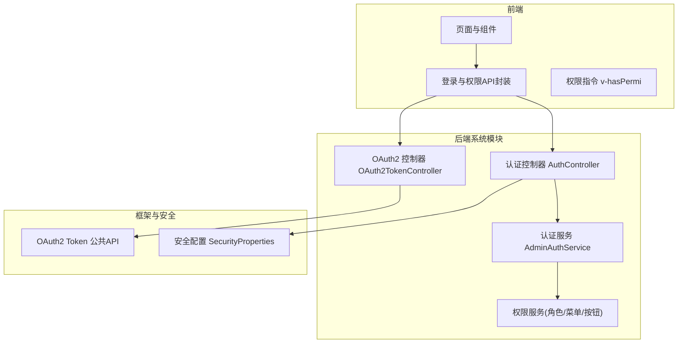
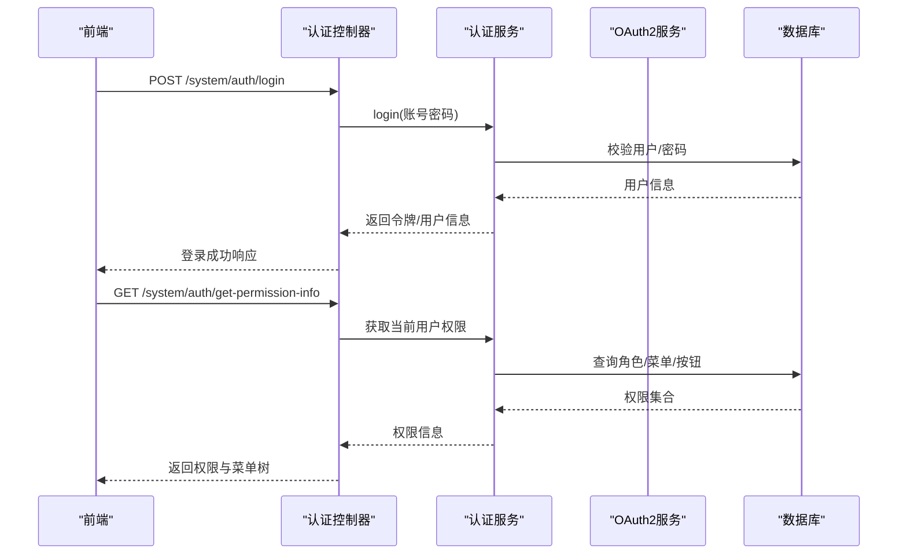
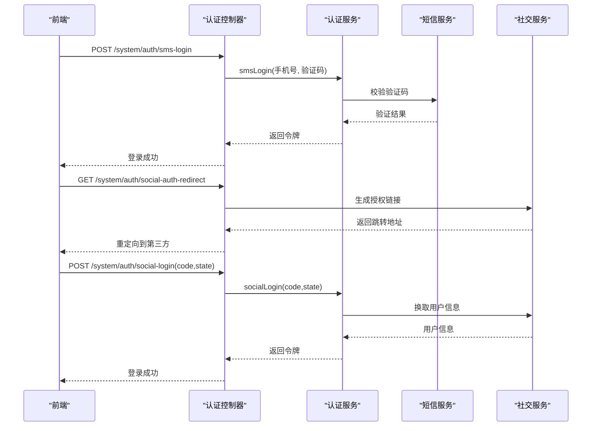
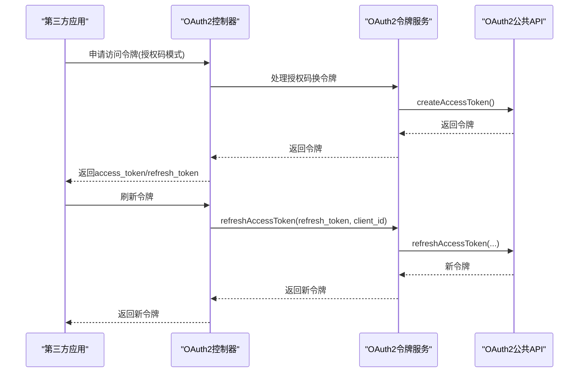
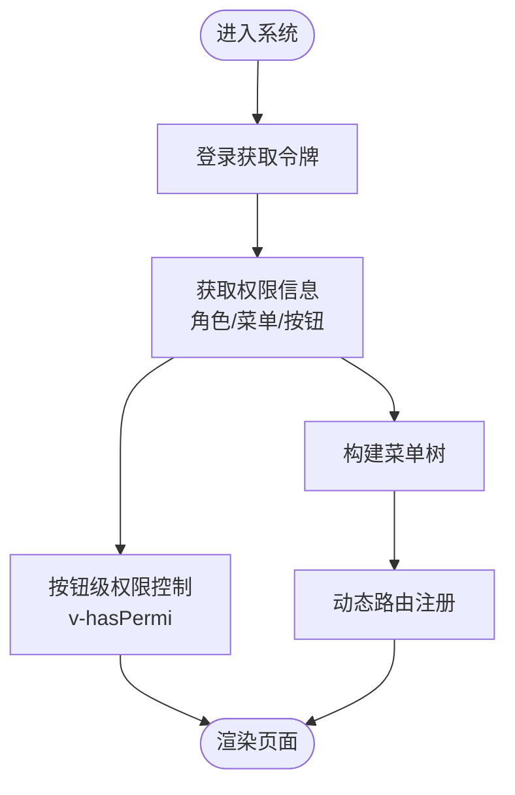
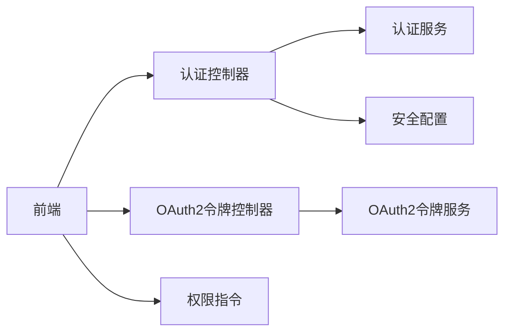

# 用户认证与权限管理

<cite>
**本文引用的文件**
- [AuthController.java](file://nexai-module-system/src/main/java/com/gkht/ai/nexai/module/system/controller/admin/auth/AuthController.java)
- [AdminAuthService.java](file://nexai-module-system/src/main/java/com/gkht/ai/nexai/module/system/service/auth/AdminAuthService.java)
- [OAuth2TokenController.java](file://nexai-module-system/src/main/java/com/gkht/ai/nexai/module/system/controller/admin/oauth2/OAuth2TokenController.java)
- [SecurityProperties.java](file://nexai-framework/nexai-spring-boot-starter-security/src/main/java/com/gkht/ai/nexai/framework/security/config/SecurityProperties.java)
- [OAuth2TokenCommonApi.java](file://nexai-framework/nexai-common/src/main/java/com/gkht/ai/nexai/framework/common/biz/system/oauth2/OAuth2TokenCommonApi.java)
- [index.ts（登录API）](file://nexai-ui/src/api/login/index.ts)
- [hasPermi.ts（前端指令）](file://nexai-ui/src/directives/permission/hasPermi.ts)
- [menu/index.vue（菜单管理页）](file://nexai-ui/src/views/system/menu/index.vue)
- [role/index.vue（角色管理页）](file://nexai-ui/src/views/system/role/index.vue)
- [RoleAssignMenuForm.vue（角色菜单授权弹窗）](file://nexai-ui/src/views/system/role/RoleAssignMenuForm.vue)
- [RoleDataPermissionForm.vue（角色数据权限弹窗）](file://nexai-ui/src/views/system/role/RoleDataPermissionForm.vue)
</cite>

## 目录
1. [简介](#简介)
2. [项目结构](#项目结构)
3. [核心组件](#核心组件)
4. [架构总览](#架构总览)
5. [详细组件分析](#详细组件分析)
6. [依赖关系分析](#依赖关系分析)
7. [性能考虑](#性能考虑)
8. [故障排查指南](#故障排查指南)
9. [结论](#结论)
10. [附录：API接口文档](#附录api接口文档)

## 简介
本文件系统性地梳理“用户认证与权限管理”子系统的实现，覆盖以下主题：
- Spring Security 集成与令牌机制（JWT/访问令牌、刷新令牌）
- OAuth2 授权码模式（客户端管理与令牌发放/校验）
- 短信验证码登录与密码重置
- 第三方社交登录（JustAuth 集成）
- RBAC 权限模型（角色-菜单-按钮级控制）、动态菜单加载
- 用户信息管理（CRUD、状态管理、资料修改、密码重置）
- 前后端协作与最佳实践

## 项目结构
后端以模块划分：系统模块负责认证、权限、用户、OAuth2、短信、社交等能力；框架层提供安全配置与通用能力；前端通过 API 调用并基于本地权限进行路由与按钮级控制。

图表来源
- [AuthController.java:43-176](file://nexai-module-system/src/main/java/com/gkht/ai/nexai/module/system/controller/admin/auth/AuthController.java#L43-L176)
- [AdminAuthService.java:15-86](file://nexai-module-system/src/main/java/com/gkht/ai/nexai/module/system/service/auth/AdminAuthService.java#L15-L86)
- [OAuth2TokenController.java:24-61](file://nexai-module-system/src/main/java/com/gkht/ai/nexai/module/system/controller/admin/oauth2/OAuth2TokenController.java#L24-L61)
- [SecurityProperties.java:12-50](file://nexai-framework/nexai-spring-boot-starter-security/src/main/java/com/gkht/ai/nexai/framework/security/config/SecurityProperties.java#L12-L50)
- [OAuth2TokenCommonApi.java:14-57](file://nexai-framework/nexai-common/src/main/java/com/gkht/ai/nexai/framework/common/biz/system/oauth2/OAuth2TokenCommonApi.java#L14-L57)

章节来源
- [AuthController.java:43-176](file://nexai-module-system/src/main/java/com/gkht/ai/nexai/module/system/controller/admin/auth/AuthController.java#L43-L176)
- [SecurityProperties.java:12-50](file://nexai-framework/nexai-spring-boot-starter-security/src/main/java/com/gkht/ai/nexai/framework/security/config/SecurityProperties.java#L12-L50)

## 核心组件
- 认证控制器：统一暴露账号密码登录、短信登录、社交登录、登出、刷新令牌、获取当前用户权限信息等接口。
- 认证服务：封装登录、登出、短信发送与登录、社交快捷登录、刷新令牌、注册、重置密码等业务逻辑。
- OAuth2 控制器：提供访问令牌分页查询、删除（强制下线）等管理能力。
- 安全配置：定义令牌传递头/参数、免登录URL列表、Mock开关、密码加密强度等。
- 前端：登录API封装、v-hasPermi 指令实现按钮级权限控制、菜单与角色管理界面。

章节来源
- [AuthController.java:66-174](file://nexai-module-system/src/main/java/com/gkht/ai/nexai/module/system/controller/admin/auth/AuthController.java#L66-L174)
- [AdminAuthService.java:15-86](file://nexai-module-system/src/main/java/com/gkht/ai/nexai/module/system/service/auth/AdminAuthService.java#L15-L86)
- [OAuth2TokenController.java:34-59](file://nexai-module-system/src/main/java/com/gkht/ai/nexai/module/system/controller/admin/oauth2/OAuth2TokenController.java#L34-L59)
- [SecurityProperties.java:12-50](file://nexai-framework/nexai-spring-boot-starter-security/src/main/java/com/gkht/ai/nexai/framework/security/config/SecurityProperties.java#L12-L50)
- [index.ts（登录API）:55-91](file://nexai-ui/src/api/login/index.ts#L55-L91)
- [hasPermi.ts:7-34](file://nexai-ui/src/directives/permission/hasPermi.ts#L7-L34)

## 架构总览
整体采用“控制器-服务-存储/外部服务”的分层架构，结合Spring Security进行统一鉴权，OAuth2用于开放平台或第三方应用接入，前端通过API获取用户信息、权限与菜单，并在客户端做细粒度展示控制。

图表来源
- [AuthController.java:66-118](file://nexai-module-system/src/main/java/com/gkht/ai/nexai/module/system/controller/admin/auth/AuthController.java#L66-L118)
- [AdminAuthService.java:26-32](file://nexai-module-system/src/main/java/com/gkht/ai/nexai/module/system/service/auth/AdminAuthService.java#L26-L32)

## 详细组件分析

### 认证流程（账号密码/短信/社交）
- 账号密码登录：控制器接收请求，服务完成用户校验与令牌签发，返回访问令牌与刷新令牌。
- 短信验证码登录：先发送验证码，再使用手机号+验证码完成登录。
- 社交快捷登录：前端跳转至第三方授权，回调后携带code调用服务端完成绑定与登录。

图表来源
- [AuthController.java:127-174](file://nexai-module-system/src/main/java/com/gkht/ai/nexai/module/system/controller/admin/auth/AuthController.java#L127-L174)
- [AdminAuthService.java:42-63](file://nexai-module-system/src/main/java/com/gkht/ai/nexai/module/system/service/auth/AdminAuthService.java#L42-L63)
- [index.ts（登录API）:55-77](file://nexai-ui/src/api/login/index.ts#L55-L77)

章节来源
- [AuthController.java:66-174](file://nexai-module-system/src/main/java/com/gkht/ai/nexai/module/system/controller/admin/auth/AuthController.java#L66-L174)
- [AdminAuthService.java:15-86](file://nexai-module-system/src/main/java/com/gkht/ai/nexai/module/system/service/auth/AdminAuthService.java#L15-L86)
- [index.ts（登录API）:55-91](file://nexai-ui/src/api/login/index.ts#L55-L91)

### OAuth2 授权码模式与令牌管理
- 开放接口：提供创建、校验、移除、刷新访问令牌的能力。
- 管理后台：支持查看访问令牌分页、删除指定令牌（强制下线）。

图表来源
- [OAuth2TokenController.java:34-59](file://nexai-module-system/src/main/java/com/gkht/ai/nexai/module/system/controller/admin/oauth2/OAuth2TokenController.java#L34-L59)
- [OAuth2TokenCommonApi.java:16-57](file://nexai-framework/nexai-common/src/main/java/com/gkht/ai/nexai/framework/common/biz/system/oauth2/OAuth2TokenCommonApi.java#L16-L57)

章节来源
- [OAuth2TokenController.java:24-61](file://nexai-module-system/src/main/java/com/gkht/ai/nexai/module/system/controller/admin/oauth2/OAuth2TokenController.java#L24-L61)
- [OAuth2TokenCommonApi.java:14-57](file://nexai-framework/nexai-common/src/main/java/com/gkht/ai/nexai/framework/common/biz/system/oauth2/OAuth2TokenCommonApi.java#L14-L57)

### 权限模型与动态菜单
- RBAC 模型：用户-角色-菜单-按钮（权限标识），服务端返回用户角色、菜单与权限集合。
- 动态菜单：登录后获取权限信息，前端据此渲染菜单与路由。
- 按钮级控制：前端通过 v-hasPermi 指令根据权限集合显示/隐藏按钮。

图表来源
- [AuthController.java:93-118](file://nexai-module-system/src/main/java/com/gkht/ai/nexai/module/system/controller/admin/auth/AuthController.java#L93-L118)
- [hasPermi.ts:7-34](file://nexai-ui/src/directives/permission/hasPermi.ts#L7-L34)
- [menu/index.vue:180-212](file://nexai-ui/src/views/system/menu/index.vue#L180-L212)

章节来源
- [AuthController.java:93-118](file://nexai-module-system/src/main/java/com/gkht/ai/nexai/module/system/controller/admin/auth/AuthController.java#L93-L118)
- [hasPermi.ts:7-34](file://nexai-ui/src/directives/permission/hasPermi.ts#L7-L34)
- [menu/index.vue:180-212](file://nexai-ui/src/views/system/menu/index.vue#L180-L212)

### 用户信息管理（CRUD、状态、资料、密码）
- 用户CRUD：通过用户管理接口完成新增、修改、删除、分页查询等。
- 状态管理：启用/禁用用户，影响登录与访问。
- 资料修改：更新个人资料、头像等。
- 密码重置：支持通过短信验证码重置密码。

章节来源
- [AuthController.java:146-152](file://nexai-module-system/src/main/java/com/gkht/ai/nexai/module/system/controller/admin/auth/AuthController.java#L146-L152)
- [index.ts（登录API）:88-91](file://nexai-ui/src/api/login/index.ts#L88-L91)

## 依赖关系分析
- 控制器依赖服务：认证控制器依赖认证服务；OAuth2控制器依赖OAuth2令牌服务。
- 安全配置：通过全局配置项控制令牌传递方式、免登录路径、Mock模式等。
- 前端依赖：登录API封装调用后端认证接口；权限指令依赖用户权限集合。

图表来源
- [AuthController.java:43-176](file://nexai-module-system/src/main/java/com/gkht/ai/nexai/module/system/controller/admin/auth/AuthController.java#L43-L176)
- [OAuth2TokenController.java:24-61](file://nexai-module-system/src/main/java/com/gkht/ai/nexai/module/system/controller/admin/oauth2/OAuth2TokenController.java#L24-L61)
- [SecurityProperties.java:12-50](file://nexai-framework/nexai-spring-boot-starter-security/src/main/java/com/gkht/ai/nexai/framework/security/config/SecurityProperties.java#L12-L50)
- [hasPermi.ts:7-34](file://nexai-ui/src/directives/permission/hasPermi.ts#L7-L34)

章节来源
- [AuthController.java:43-176](file://nexai-module-system/src/main/java/com/gkht/ai/nexai/module/system/controller/admin/auth/AuthController.java#L43-L176)
- [OAuth2TokenController.java:24-61](file://nexai-module-system/src/main/java/com/gkht/ai/nexai/module/system/controller/admin/oauth2/OAuth2TokenController.java#L24-L61)
- [SecurityProperties.java:12-50](file://nexai-framework/nexai-spring-boot-starter-security/src/main/java/com/gkht/ai/nexai/framework/security/config/SecurityProperties.java#L12-L50)
- [hasPermi.ts:7-34](file://nexai-ui/src/directives/permission/hasPermi.ts#L7-L34)

## 性能考虑
- 令牌缓存与刷新：合理设置访问令牌有效期，利用刷新令牌减少重复登录。
- 权限预取：登录后一次性拉取权限与菜单，避免多次请求。
- 短信验证码限流：对短信发送接口实施限流策略，防止滥用。
- 数据权限过滤：在查询敏感接口时按需开启数据权限，避免过度过滤导致性能下降。

## 故障排查指南
- 无法获取权限信息：检查是否已登录且令牌有效；确认权限接口未被数据权限过滤影响。
- 社交登录失败：核对第三方应用配置与回调地址；检查授权码有效性。
- 短信登录异常：确认验证码未过期、次数限制未超限；检查短信服务连通性。
- 强制下线无效：确认删除令牌接口正确调用；检查令牌存储与清理逻辑。

章节来源
- [AuthController.java:93-118](file://nexai-module-system/src/main/java/com/gkht/ai/nexai/module/system/controller/admin/auth/AuthController.java#L93-L118)
- [OAuth2TokenController.java:42-59](file://nexai-module-system/src/main/java/com/gkht/ai/nexai/module/system/controller/admin/oauth2/OAuth2TokenController.java#L42-L59)

## 结论
该子系统通过统一的认证入口、灵活的OAuth2能力、完善的RBAC权限模型以及前后端协同的权限控制，实现了多方式登录、细粒度权限管理与可运维的用户生命周期管理。建议在生产环境中结合限流、审计与监控进一步提升安全性与稳定性。

## 附录：API接口文档

### 认证相关（管理后台）
- 账号密码登录
  - 方法：POST
  - 路径：/system/auth/login
  - 说明：提交账号与密码，返回访问令牌与用户信息
  - 参考：[AuthController.java:66-71](file://nexai-module-system/src/main/java/com/gkht/ai/nexai/module/system/controller/admin/auth/AuthController.java#L66-L71)

- 登出
  - 方法：POST
  - 路径：/system/auth/logout
  - 说明：从请求中解析令牌并执行登出
  - 参考：[AuthController.java:73-83](file://nexai-module-system/src/main/java/com/gkht/ai/nexai/module/system/controller/admin/auth/AuthController.java#L73-L83)

- 刷新令牌
  - 方法：POST
  - 路径：/system/auth/refresh-token
  - 参数：refreshToken
  - 说明：使用刷新令牌获取新的访问令牌
  - 参考：[AuthController.java:85-91](file://nexai-module-system/src/main/java/com/gkht/ai/nexai/module/system/controller/admin/auth/AuthController.java#L85-L91)

- 获取权限信息
  - 方法：GET
  - 路径：/system/auth/get-permission-info
  - 说明：返回当前用户的角色、菜单与权限集合
  - 参考：[AuthController.java:93-118](file://nexai-module-system/src/main/java/com/gkht/ai/nexai/module/system/controller/admin/auth/AuthController.java#L93-L118)

- 注册用户
  - 方法：POST
  - 路径：/system/auth/register
  - 说明：创建新用户并返回令牌
  - 参考：[AuthController.java:120-125](file://nexai-module-system/src/main/java/com/gkht/ai/nexai/module/system/controller/admin/auth/AuthController.java#L120-L125)

- 短信验证码登录
  - 方法：POST
  - 路径：/system/auth/sms-login
  - 说明：使用手机号与验证码登录
  - 参考：[AuthController.java:127-136](file://nexai-module-system/src/main/java/com/gkht/ai/nexai/module/system/controller/admin/auth/AuthController.java#L127-L136)

- 发送登录短信验证码
  - 方法：POST
  - 路径：/system/auth/send-sms-code
  - 说明：向指定手机号发送验证码
  - 参考：[AuthController.java:138-144](file://nexai-module-system/src/main/java/com/gkht/ai/nexai/module/system/controller/admin/auth/AuthController.java#L138-L144)

- 重置密码
  - 方法：POST
  - 路径：/system/auth/reset-password
  - 说明：通过短信验证码重置密码
  - 参考：[AuthController.java:146-152](file://nexai-module-system/src/main/java/com/gkht/ai/nexai/module/system/controller/admin/auth/AuthController.java#L146-L152)

- 社交授权跳转
  - 方法：GET
  - 路径：/system/auth/social-auth-redirect
  - 参数：type（社交类型）、redirectUri（回调路径）
  - 说明：返回第三方授权跳转地址
  - 参考：[AuthController.java:156-167](file://nexai-module-system/src/main/java/com/gkht/ai/nexai/module/system/controller/admin/auth/AuthController.java#L156-L167)

- 社交快捷登录
  - 方法：POST
  - 路径：/system/auth/social-login
  - 说明：使用第三方授权码完成登录
  - 参考：[AuthController.java:169-174](file://nexai-module-system/src/main/java/com/gkht/ai/nexai/module/system/controller/admin/auth/AuthController.java#L169-L174)

### OAuth2 令牌管理（管理后台）
- 访问令牌分页
  - 方法：GET
  - 路径：/system/oauth2-token/page
  - 说明：仅返回有效期内的访问令牌
  - 参考：[OAuth2TokenController.java:34-40](file://nexai-module-system/src/main/java/com/gkht/ai/nexai/module/system/controller/admin/oauth2/OAuth2TokenController.java#L34-L40)

- 删除访问令牌（强制下线）
  - 方法：DELETE
  - 路径：/system/oauth2-token/delete
  - 参数：accessToken
  - 说明：删除指定访问令牌
  - 参考：[OAuth2TokenController.java:42-49](file://nexai-module-system/src/main/java/com/gkht/ai/nexai/module/system/controller/admin/oauth2/OAuth2TokenController.java#L42-L49)

- 批量删除访问令牌
  - 方法：DELETE
  - 路径：/system/oauth2-token/delete-list
  - 参数：accessTokens（数组）
  - 说明：批量删除访问令牌
  - 参考：[OAuth2TokenController.java:51-59](file://nexai-module-system/src/main/java/com/gkht/ai/nexai/module/system/controller/admin/oauth2/OAuth2TokenController.java#L51-L59)

### 前端集成要点
- 登录与社交登录API封装
  - 路径：/system/auth/sms-login、/system/auth/social-login、/system/auth/social-auth-redirect
  - 参考：[index.ts（登录API）:55-77](file://nexai-ui/src/api/login/index.ts#L55-L77)

- 按钮级权限控制
  - 指令：v-hasPermi
  - 行为：根据用户权限集合判断是否渲染按钮
  - 参考：[hasPermi.ts:7-34](file://nexai-ui/src/directives/permission/hasPermi.ts#L7-L34)

- 菜单与角色管理
  - 菜单管理页：展示菜单树、操作按钮按权限控制
  - 角色管理页：为角色分配菜单与数据权限
  - 参考：
    - [menu/index.vue:180-212](file://nexai-ui/src/views/system/menu/index.vue#L180-L212)
    - [role/index.vue:123-158](file://nexai-ui/src/views/system/role/index.vue#L123-L158)
    - [RoleAssignMenuForm.vue:72-93](file://nexai-ui/src/views/system/role/RoleAssignMenuForm.vue#L72-L93)
    - [RoleDataPermissionForm.vue:73-111](file://nexai-ui/src/views/system/role/RoleDataPermissionForm.vue#L73-L111)