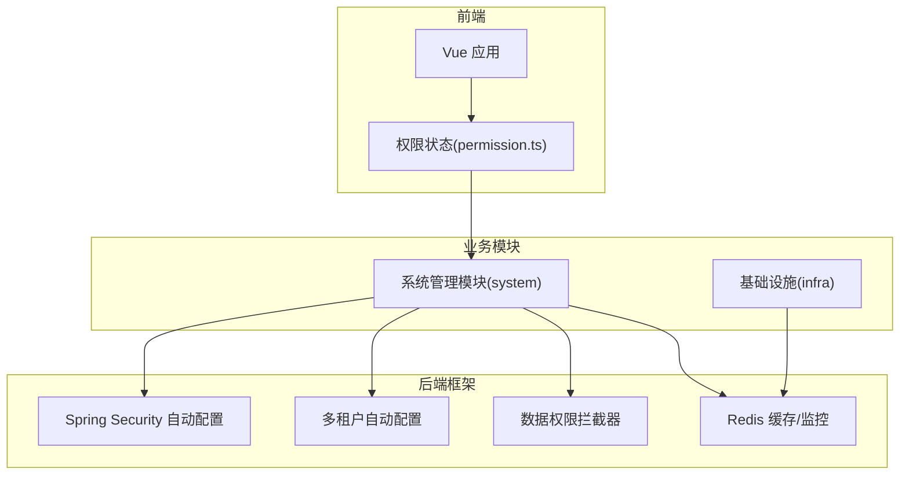
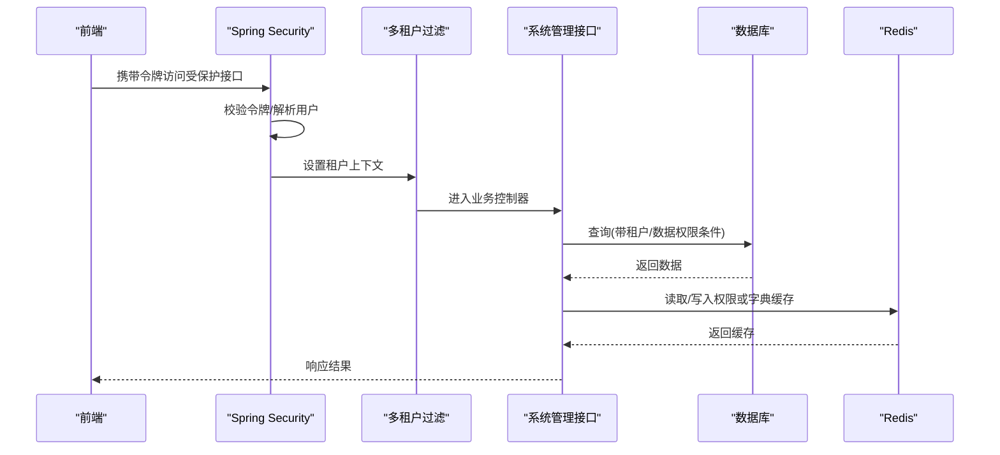
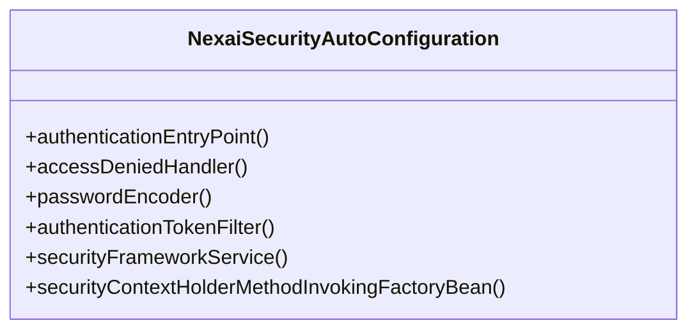
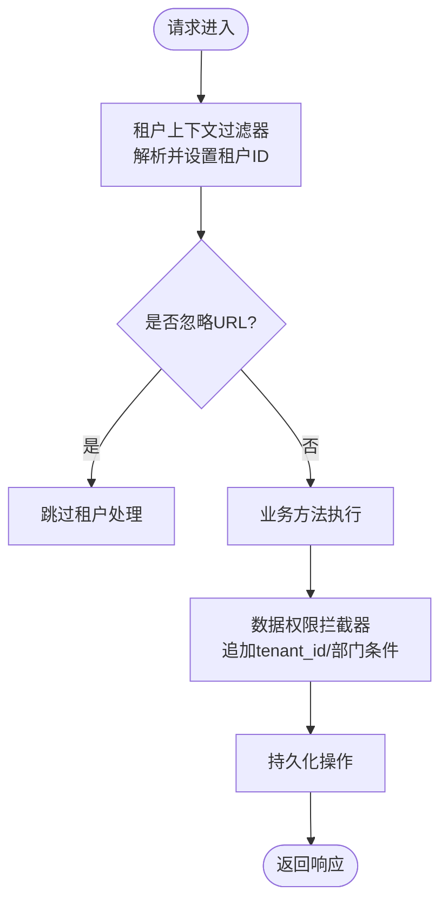
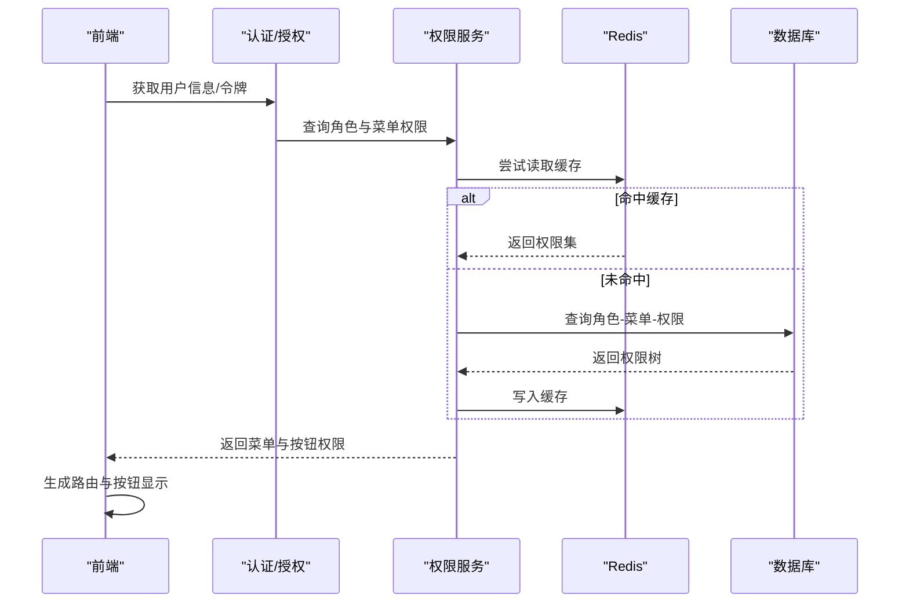
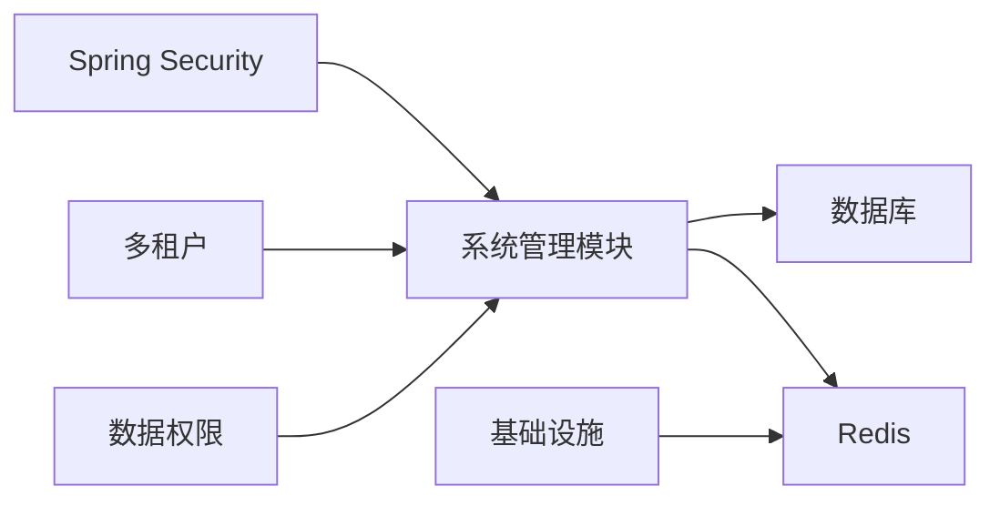

# 系统管理模块

<cite>
**本文引用的文件**
- [NexaiSecurityAutoConfiguration.java](file://nexai-framework/nexai-spring-boot-starter-security/src/main/java/com/gkht/ai/nexai/framework/security/config/NexaiSecurityAutoConfiguration.java)
- [NexaiTenantAutoConfiguration.java](file://nexai-framework/nexai-spring-boot-starter-biz-tenant/src/main/java/com/gkht/ai/nexai/framework/tenant/config/NexaiTenantAutoConfiguration.java)
- [ApiKeyAuthFilter.java](file://nexai-module-ai/src/main/java/com/gkht/ai/nexai/module/ai/apikey/infrastructure/gateway/ApiKeyAuthFilter.java)
- [HttpUtils.java](file://nexai-framework/nexai-common/src/main/java/com/gkht/ai/nexai/framework/common/util/http/HttpUtils.java)
- [create_tables.sql](file://nexai-module-system/src/test/resources/sql/create_tables.sql)
- [RedisController.java](file://nexai-module-infra/src/main/java/com/gkht/ai/nexai/module/infra/controller/admin/redis/RedisController.java)
- [RedisMonitorRespVO.java](file://nexai-module-infra/src/main/java/com/gkht/ai/nexai/module/infra/controller/admin/redis/vo/RedisMonitorRespVO.java)
- [permission.ts](file://nexai-ui/src/store/modules/permission.ts)
</cite>

## 目录
1. [简介](#简介)
2. [项目结构](#项目结构)
3. [核心组件](#核心组件)
4. [架构总览](#架构总览)
5. [详细组件分析](#详细组件分析)
6. [依赖关系分析](#依赖关系分析)
7. [性能考虑](#性能考虑)
8. [故障排查指南](#故障排查指南)
9. [结论](#结论)
10. [附录](#附录)

## 简介
本章节面向 NexAI 平台的系统管理模块，围绕用户管理、角色权限、菜单管理、部门管理、岗位管理等核心能力，结合多租户架构（租户隔离、数据权限控制、配置隔离）与 Spring Security 认证授权流程进行系统化说明。同时阐述动态权限菜单的实现原理（含按钮级权限控制与 Redis 缓存优化），并给出字典管理、地区管理、短信邮件通知等辅助功能的配置与使用要点，以及 API 调用示例与前端集成指引。

## 项目结构
系统管理相关代码主要分布在以下层次：
- 框架层：安全、租户、数据权限、Web、Redis 等通用能力封装在 nexai-framework 中
- 业务模块：系统管理功能集中在 nexai-module-system；基础设施支撑（如 Redis 监控）在 nexai-module-infra
- 前端：权限路由与菜单渲染在 nexai-ui 的 store 与视图层

图表来源
- [NexaiSecurityAutoConfiguration.java:1-95](file://nexai-framework/nexai-spring-boot-starter-security/src/main/java/com/gkht/ai/nexai/framework/security/config/NexaiSecurityAutoConfiguration.java#L1-L95)
- [NexaiTenantAutoConfiguration.java:1-228](file://nexai-framework/nexai-spring-boot-starter-biz-tenant/src/main/java/com/gkht/ai/nexai/framework/tenant/config/NexaiTenantAutoConfiguration.java#L1-L228)
- [RedisController.java:1-43](file://nexai-module-infra/src/main/java/com/gkht/ai/nexai/module/infra/controller/admin/redis/RedisController.java#L1-L43)
- [permission.ts:1-15](file://nexai-ui/src/store/modules/permission.ts#L1-L15)

章节来源
- [NexaiSecurityAutoConfiguration.java:1-95](file://nexai-framework/nexai-spring-boot-starter-security/src/main/java/com/gkht/ai/nexai/framework/security/config/NexaiSecurityAutoConfiguration.java#L1-L95)
- [NexaiTenantAutoConfiguration.java:1-228](file://nexai-framework/nexai-spring-boot-starter-biz-tenant/src/main/java/com/gkht/ai/nexai/framework/tenant/config/NexaiTenantAutoConfiguration.java#L1-L228)
- [RedisController.java:1-43](file://nexai-module-infra/src/main/java/com/gkht/ai/nexai/module/infra/controller/admin/redis/RedisController.java#L1-L43)
- [permission.ts:1-15](file://nexai-ui/src/store/modules/permission.ts#L1-L15)

## 核心组件
- 认证与授权：基于 Spring Security 的 Token 认证过滤器、统一异常处理、密码加密器、全局安全上下文策略
- 多租户：请求级租户识别、数据库行级隔离、缓存键隔离、MQ/Job 租户上下文透传
- 数据权限：基于角色的数据范围（全公司、本部门、本人、自定义部门集合）与 MyBatis Plus 拦截器组合
- 权限模型：用户-角色-菜单-按钮（权限标识）的 RBAC 模型，支持动态菜单与按钮级控制
- 辅助能力：字典、地区、短信、邮件、通知、日志、OAuth2、社交登录等

章节来源
- [NexaiSecurityAutoConfiguration.java:1-95](file://nexai-framework/nexai-spring-boot-starter-security/src/main/java/com/gkht/ai/nexai/framework/security/config/NexaiSecurityAutoConfiguration.java#L1-L95)
- [NexaiTenantAutoConfiguration.java:1-228](file://nexai-framework/nexai-spring-boot-starter-biz-tenant/src/main/java/com/gkht/ai/nexai/framework/tenant/config/NexaiTenantAutoConfiguration.java#L1-L228)
- [create_tables.sql:37-103](file://nexai-module-system/src/test/resources/sql/create_tables.sql#L37-L103)

## 架构总览
下图展示了从前端到后端的完整链路：前端通过权限状态驱动路由与菜单渲染；后端由 Spring Security 统一鉴权，多租户与数据权限在请求处理链中注入；系统管理模块提供用户、角色、菜单、部门、岗位等管理能力，并通过 Redis 做缓存与监控。

图表来源
- [NexaiSecurityAutoConfiguration.java:60-79](file://nexai-framework/nexai-spring-boot-starter-security/src/main/java/com/gkht/ai/nexai/framework/security/config/NexaiSecurityAutoConfiguration.java#L60-L79)
- [NexaiTenantAutoConfiguration.java:74-125](file://nexai-framework/nexai-spring-boot-starter-biz-tenant/src/main/java/com/gkht/ai/nexai/framework/tenant/config/NexaiTenantAutoConfiguration.java#L74-L125)
- [RedisController.java:21-43](file://nexai-module-infra/src/main/java/com/gkht/ai/nexai/module/infra/controller/admin/redis/RedisController.java#L21-L43)

## 详细组件分析

### 认证与授权（Spring Security 集成）
- 自动装配：注册认证失败处理器、权限不足处理器、BCrypt 密码编码器、Token 认证过滤器、安全框架服务
- 线程上下文：使用可传递的 Security 上下文策略，确保异步/线程切换时身份不丢失
- 外部终端：除 Web 令牌外，还支持 Basic 认证提取（用于客户端凭证模式）与 API Key 网关鉴权（将租户 ID 注入上下文）

图表来源
- [NexaiSecurityAutoConfiguration.java:1-95](file://nexai-framework/nexai-spring-boot-starter-security/src/main/java/com/gkht/ai/nexai/framework/security/config/NexaiSecurityAutoConfiguration.java#L1-L95)

章节来源
- [NexaiSecurityAutoConfiguration.java:1-95](file://nexai-framework/nexai-spring-boot-starter-security/src/main/java/com/gkht/ai/nexai/framework/security/config/NexaiSecurityAutoConfiguration.java#L1-L95)
- [HttpUtils.java:195-216](file://nexai-framework/nexai-common/src/main/java/com/gkht/ai/nexai/framework/common/util/http/HttpUtils.java#L195-L216)
- [ApiKeyAuthFilter.java:44-65](file://nexai-module-ai/src/main/java/com/gkht/ai/nexai/module/ai/apikey/infrastructure/gateway/ApiKeyAuthFilter.java#L44-L65)

### 多租户架构（隔离、数据权限、配置隔离）
- 请求级租户识别：通过 Web Filter 与 MVC Interceptor 设置租户上下文，支持忽略 URL 列表
- 数据库隔离：MyBatis Plus 的 TenantLineInnerInterceptor 自动追加 tenant_id 条件，实现行级隔离
- 缓存隔离：以租户维度构建缓存键，避免跨租户污染；事务感知下延迟清缓存
- MQ/Job 透传：消息与定时任务执行时携带租户上下文，保证一致性

图表来源
- [NexaiTenantAutoConfiguration.java:74-125](file://nexai-framework/nexai-spring-boot-starter-biz-tenant/src/main/java/com/gkht/ai/nexai/framework/tenant/config/NexaiTenantAutoConfiguration.java#L74-L125)

章节来源
- [NexaiTenantAutoConfiguration.java:1-228](file://nexai-framework/nexai-spring-boot-starter-biz-tenant/src/main/java/com/gkht/ai/nexai/framework/tenant/config/NexaiTenantAutoConfiguration.java#L1-L228)

### 权限模型与动态菜单（RBAC、按钮级权限、Redis 缓存）
- 数据模型：用户-角色-菜单-权限标识（按钮级）；角色具备数据范围与部门范围
- 动态菜单：后端根据当前用户角色计算可用菜单与按钮权限，前端基于权限状态生成路由与菜单
- 缓存优化：菜单与按钮权限可通过 Redis 缓存，减少重复计算与数据库压力

图表来源
- [create_tables.sql:37-103](file://nexai-module-system/src/test/resources/sql/create_tables.sql#L37-L103)
- [RedisController.java:21-43](file://nexai-module-infra/src/main/java/com/gkht/ai/nexai/module/infra/controller/admin/redis/RedisController.java#L21-L43)
- [permission.ts:1-15](file://nexai-ui/src/store/modules/permission.ts#L1-L15)

章节来源
- [create_tables.sql:37-103](file://nexai-module-system/src/test/resources/sql/create_tables.sql#L37-L103)
- [RedisController.java:21-43](file://nexai-module-infra/src/main/java/com/gkht/ai/nexai/module/infra/controller/admin/redis/RedisController.java#L21-L43)
- [permission.ts:1-15](file://nexai-ui/src/store/modules/permission.ts#L1-L15)

### 用户、角色、菜单、部门、岗位管理
- 用户管理：创建、更新、启用/禁用、重置密码、分配角色
- 角色管理：定义角色、数据范围（全部/本部门/本人/自定义）、关联菜单与按钮权限
- 菜单管理：维护菜单树、路径、组件、图标、可见性、是否缓存、是否始终显示
- 部门管理：组织树形结构，作为数据权限的维度之一
- 岗位管理：与用户绑定，参与数据权限与展示

章节来源
- [create_tables.sql:37-103](file://nexai-module-system/src/test/resources/sql/create_tables.sql#L37-L103)

### 辅助功能：字典、地区、短信、邮件、通知
- 字典管理：按类型维护键值对，供前端下拉框、标签等复用
- 地区管理：省市区三级联动数据，支持导入与维护
- 短信/邮件/通知：统一发送通道，支持模板、重试、记录
- 使用建议：将高频读的配置放入 Redis，降低数据库压力

章节来源
- [RedisController.java:21-43](file://nexai-module-infra/src/main/java/com/gkht/ai/nexai/module/infra/controller/admin/redis/RedisController.java#L21-L43)

## 依赖关系分析
- 安全与租户：安全自动配置与租户自动配置相互独立但协同工作，前者负责认证授权，后者负责租户上下文与数据隔离
- 数据权限：依赖 MyBatis Plus 拦截器与角色数据范围规则，在 SQL 层面注入条件
- 缓存与监控：Redis 作为权限、字典等热点数据的缓存载体，并提供监控接口

图表来源
- [NexaiSecurityAutoConfiguration.java:1-95](file://nexai-framework/nexai-spring-boot-starter-security/src/main/java/com/gkht/ai/nexai/framework/security/config/NexaiSecurityAutoConfiguration.java#L1-L95)
- [NexaiTenantAutoConfiguration.java:1-228](file://nexai-framework/nexai-spring-boot-starter-biz-tenant/src/main/java/com/gkht/ai/nexai/framework/tenant/config/NexaiTenantAutoConfiguration.java#L1-L228)
- [RedisController.java:1-43](file://nexai-module-infra/src/main/java/com/gkht/ai/nexai/module/infra/controller/admin/redis/RedisController.java#L1-L43)

章节来源
- [NexaiSecurityAutoConfiguration.java:1-95](file://nexai-framework/nexai-spring-boot-starter-security/src/main/java/com/gkht/ai/nexai/framework/security/config/NexaiSecurityAutoConfiguration.java#L1-L95)
- [NexaiTenantAutoConfiguration.java:1-228](file://nexai-framework/nexai-spring-boot-starter-biz-tenant/src/main/java/com/gkht/ai/nexai/framework/tenant/config/NexaiTenantAutoConfiguration.java#L1-L228)
- [RedisController.java:1-43](file://nexai-module-infra/src/main/java/com/gkht/ai/nexai/module/infra/controller/admin/redis/RedisController.java#L1-L43)

## 性能考虑
- 缓存优先：菜单、按钮权限、字典等热点数据优先走 Redis，减少数据库 IO
- 事务感知缓存：在事务内延迟清缓存，避免并发写脏读
- 分页与索引：列表查询务必分页，并为常用查询字段建立索引
- 租户隔离：确保所有表包含 tenant_id，利用拦截器自动拼接条件，避免遗漏导致越权
- 监控与限流：借助 Redis 监控了解命令耗时与命中率，必要时引入限流与熔断

[本节为通用性能建议，无需特定文件引用]

## 故障排查指南
- 认证失败：检查 Token 是否正确传递、是否过期；确认安全配置中的过滤器顺序与白名单
- 权限不足：核对用户角色与菜单/按钮权限是否已正确分配；检查前端指令与后端注解是否一致
- 租户数据错乱：确认请求头/参数是否携带正确的租户 ID；检查忽略 URL 配置是否误配
- 缓存不一致：清理对应缓存键；检查事务边界与缓存失效策略
- Redis 监控：通过监控接口查看命令统计与内存使用，定位慢查询与热点 key

章节来源
- [NexaiSecurityAutoConfiguration.java:1-95](file://nexai-framework/nexai-spring-boot-starter-security/src/main/java/com/gkht/ai/nexai/framework/security/config/NexaiSecurityAutoConfiguration.java#L1-L95)
- [NexaiTenantAutoConfiguration.java:1-228](file://nexai-framework/nexai-spring-boot-starter-biz-tenant/src/main/java/com/gkht/ai/nexai/framework/tenant/config/NexaiTenantAutoConfiguration.java#L1-L228)
- [RedisController.java:21-43](file://nexai-module-infra/src/main/java/com/gkht/ai/nexai/module/infra/controller/admin/redis/RedisController.java#L21-L43)

## 结论
本模块以 Spring Security 为核心完成认证授权，结合多租户与数据权限实现企业级安全与隔离；通过 RBAC 与动态菜单机制满足复杂权限场景；借助 Redis 提升性能并提供可观测性。配合字典、地区、短信邮件等辅助能力，形成完整的系统管理基座，便于上层业务快速扩展。

[本节为总结性内容，无需特定文件引用]

## 附录

### API 调用示例（概念性）
- 获取用户信息：GET /system/user/info（需登录态）
- 获取菜单列表：GET /system/menu/list（返回菜单树与按钮权限）
- 角色权限：POST /system/role/permission（为角色分配菜单与按钮）
- 部门管理：POST /system/dept/create（新增部门）
- 字典项：GET /system/dict/data/type/{type}（按类型获取字典）
- Redis 监控：GET /infra/redis/get-monitor-info（需相应权限）

提示：以上为常见接口形态，具体路径请以实际 Controller 为准。

### 前端集成指南
- 权限状态：在 store 中维护路由与菜单，登录后拉取用户权限并生成动态路由
- 按钮级控制：使用指令或函数判断当前用户是否拥有某按钮权限
- 缓存策略：对菜单与字典等静态资源进行本地缓存，减少重复请求
- 错误处理：统一捕获 401/403，引导重新登录或提示无权限

章节来源
- [permission.ts:1-15](file://nexai-ui/src/store/modules/permission.ts#L1-L15)