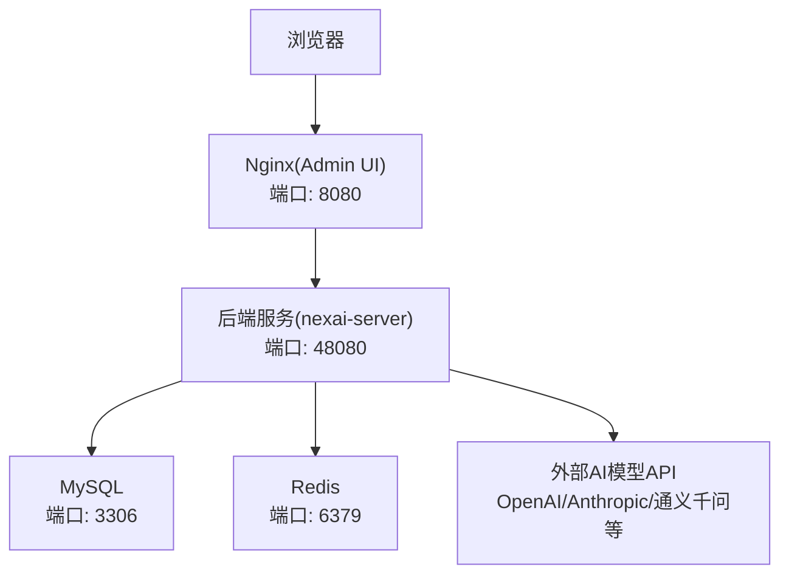
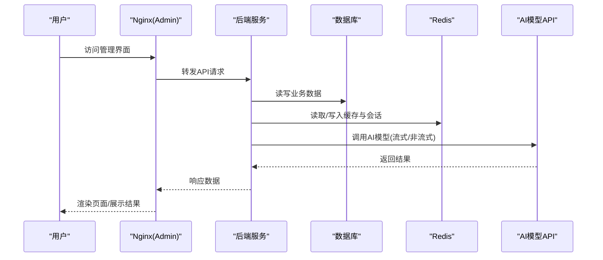
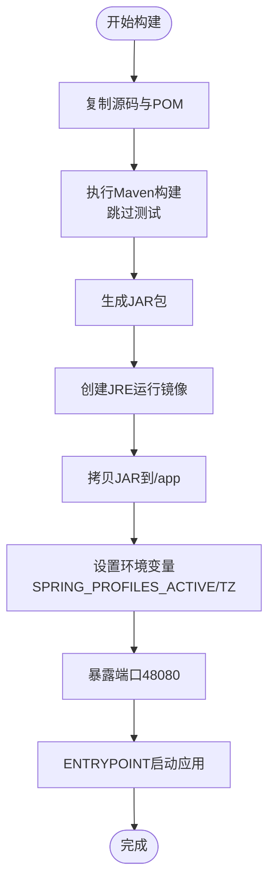
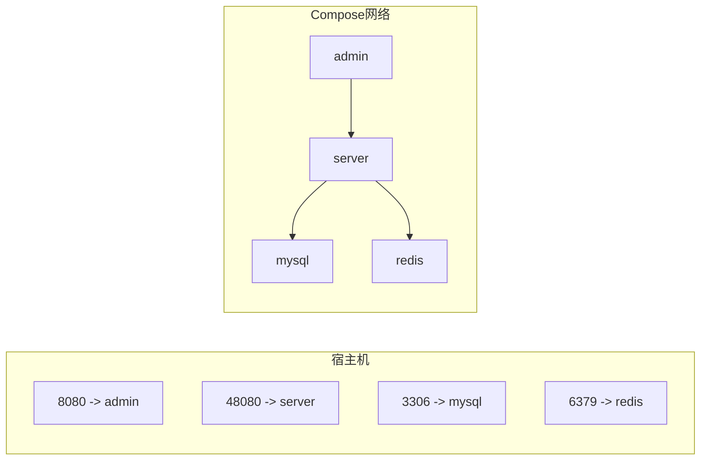
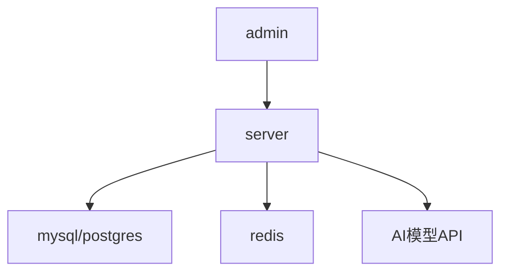

# Docker容器化部署

<cite>
**本文引用的文件**
- [Dockerfile](file://Dockerfile)
- [nexai-server/Dockerfile](file://nexai-server/Dockerfile)
- [script/docker/docker-compose.yml](file://script/docker/docker-compose.yml)
- [script/docker/docker.env](file://script/docker/docker.env)
- [script/docker/Docker-HOWTO.md](file://script/docker/Docker-HOWTO.md)
- [nexai-server/src/main/resources/application.yaml](file://nexai-server/src/main/resources/application.yaml)
- [nexai-server/src/main/resources/application-docker.yaml](file://nexai-server/src/main/resources/application-docker.yaml)
- [script/shell/deploy.sh](file://script/shell/deploy.sh)
</cite>

## 目录
1. [简介](#简介)
2. [项目结构](#项目结构)
3. [核心组件](#核心组件)
4. [架构总览](#架构总览)
5. [详细组件分析](#详细组件分析)
6. [依赖关系分析](#依赖关系分析)
7. [性能与优化](#性能与优化)
8. [运维配置](#运维配置)
9. [故障排查指南](#故障排查指南)
10. [结论](#结论)
11. [附录](#附录)

## 简介
本文件面向NexAI平台的容器化部署，覆盖镜像构建、编排、环境变量与敏感信息管理、单机/多节点部署方案、监控日志与健康检查、故障排查与性能调优等。文档基于仓库中现有的Dockerfile、docker-compose与环境配置文件进行说明，并结合应用配置给出可操作的实践建议。

## 项目结构
- 后端服务：Spring Boot应用，提供API与管理后台接口，默认端口48080
- 前端管理界面：静态资源由Nginx托管（compose中通过admin服务暴露8080）
- 数据层：MySQL（示例）、PostgreSQL（应用默认docker profile使用），Redis缓存与会话存储
- 编排：docker-compose统一管理数据库、缓存、后端与前端服务
- 构建：根级Dockerfile采用多阶段构建；nexai-server下提供独立Dockerfile用于单独打包

图表来源
- [script/docker/docker-compose.yml:6-78](file://script/docker/docker-compose.yml#L6-L78)
- [nexai-server/src/main/resources/application.yaml:137-259](file://nexai-server/src/main/resources/application.yaml#L137-L259)

章节来源
- [script/docker/docker-compose.yml:1-85](file://script/docker/docker-compose.yml#L1-L85)
- [script/docker/Docker-HOWTO.md:1-50](file://script/docker/Docker-HOWTO.md#L1-L50)

## 核心组件
- 镜像构建
  - 根级Dockerfile：Maven多阶段构建，仅将最终JAR复制到JRE运行镜像，启用BuildKit缓存加速
  - nexai-server/Dockerfile：单阶段运行镜像，支持通过环境变量覆盖JVM参数与启动参数
- 服务编排
  - docker-compose定义mysql、redis、server、admin四个服务，包含端口映射、数据卷挂载、环境变量注入与服务依赖
- 应用配置
  - application.yaml：全局配置，含AI模型接入、向量库、消息队列、安全与Websocket等
  - application-docker.yaml：docker环境下的数据库、Redis、微信/小程序桩配置及功能开关
- 环境变量
  - docker.env集中管理数据库、Redis、JVM与前端构建参数，便于compose加载

章节来源
- [Dockerfile:1-23](file://Dockerfile#L1-L23)
- [nexai-server/Dockerfile:1-24](file://nexai-server/Dockerfile#L1-L24)
- [script/docker/docker-compose.yml:1-85](file://script/docker/docker-compose.yml#L1-L85)
- [script/docker/docker.env:1-26](file://script/docker/docker.env#L1-L26)
- [nexai-server/src/main/resources/application.yaml:1-390](file://nexai-server/src/main/resources/application.yaml#L1-L390)
- [nexai-server/src/main/resources/application-docker.yaml:1-74](file://nexai-server/src/main/resources/application-docker.yaml#L1-L74)

## 架构总览
NexAI平台在容器中由四层组成：
- 前端UI（Nginx）：对外暴露8080，反向代理到后端API
- 后端服务：Spring Boot应用，处理业务逻辑、AI调用、会话管理等
- 数据与缓存：MySQL/PostgreSQL持久化，Redis缓存与会话
- 外部AI能力：通过环境变量注入各厂商API Key与Base URL

图表来源
- [script/docker/docker-compose.yml:29-78](file://script/docker/docker-compose.yml#L29-L78)
- [nexai-server/src/main/resources/application.yaml:137-259](file://nexai-server/src/main/resources/application.yaml#L137-L259)

## 详细组件分析

### 镜像构建与优化
- 多阶段构建
  - 构建阶段：使用maven镜像编译全部模块，利用BuildKit缓存减少重复构建时间
  - 运行阶段：仅复制最终JAR到轻量JRE镜像，最小化攻击面与体积
- 关键优化点
  - 使用BuildKit缓存挂载Maven本地仓库，提升增量构建速度
  - 仅暴露必要端口，关闭不必要的调试与特性
  - 时区与安全随机数源设置，保证生产稳定性

图表来源
- [Dockerfile:1-23](file://Dockerfile#L1-L23)

章节来源
- [Dockerfile:1-23](file://Dockerfile#L1-L23)
- [nexai-server/Dockerfile:1-24](file://nexai-server/Dockerfile#L1-L24)

### docker-compose编排
- 服务定义
  - mysql：初始化数据库脚本挂载为只读，数据持久化到命名卷
  - redis：数据持久化到命名卷
  - server：后端服务，依赖mysql与redis，通过命令行参数注入数据源与Redis连接信息
  - admin：前端构建与运行，依赖server
- 网络与端口
  - 各服务通过Compose内部网络通信，宿主机端口映射仅暴露对外服务
- 数据卷
  - mysql与redis数据持久化，避免容器重建丢失数据

图表来源
- [script/docker/docker-compose.yml:6-78](file://script/docker/docker-compose.yml#L6-L78)

章节来源
- [script/docker/docker-compose.yml:1-85](file://script/docker/docker-compose.yml#L1-L85)

### 环境变量与敏感信息管理
- 数据库连接
  - master/slave数据源URL、用户名、密码通过compose环境变量注入，支持默认值
  - docker-profile下默认指向PostgreSQL，可按需切换
- Redis配置
  - host/port/database通过环境变量或profile覆盖
- AI模型API密钥
  - OpenAI、Anthropic、通义千问、DeepSeek、Gemini、字节豆包、腾讯混元、讯飞星火、百川、文心一言、智谱、MiniMax、月之暗面、阶跃星辰、Grok、Midjourney、Suno、Web Search等Key均通过环境变量注入，避免硬编码
- 最佳实践
  - 使用.dockerenv或CI/CD密钥管理工具注入敏感信息
  - 不在代码与镜像中保留明文密钥
  - 结合租户API Key机制进行运行时鉴权与限流

章节来源
- [script/docker/docker-compose.yml:37-56](file://script/docker/docker-compose.yml#L37-L56)
- [script/docker/docker.env:1-26](file://script/docker/docker.env#L1-L26)
- [nexai-server/src/main/resources/application.yaml:137-259](file://nexai-server/src/main/resources/application.yaml#L137-L259)
- [nexai-server/src/main/resources/application-docker.yaml:25-47](file://nexai-server/src/main/resources/application-docker.yaml#L25-L47)

### 单机部署与多节点部署
- 单机部署
  - 使用现有docker-compose一键拉起所有依赖与服务
  - 首次运行自动构建镜像并初始化数据库
- 多节点部署
  - 将数据库与Redis迁移至独立集群或云托管服务
  - 后端服务水平扩展，通过负载均衡器统一入口
  - 前端静态资源可通过CDN分发，减轻后端压力
  - 使用外部配置中心或Kubernetes ConfigMap管理环境变量

章节来源
- [script/docker/Docker-HOWTO.md:21-50](file://script/docker/Docker-HOWTO.md#L21-L50)
- [script/docker/docker-compose.yml:29-78](file://script/docker/docker-compose.yml#L29-L78)

### 健康检查与就绪探针
- 后端健康检查
  - 部署脚本通过HTTP端点轮询确认服务就绪
- Compose健康检查（建议）
  - 可为server服务添加healthcheck，确保依赖就绪后再启动
- 就绪策略
  - 数据库与Redis先于后端启动，后端等待其可用

章节来源
- [script/shell/deploy.sh:106-143](file://script/shell/deploy.sh#L106-L143)
- [script/docker/docker-compose.yml:54-56](file://script/docker/docker-compose.yml#L54-L56)

## 依赖关系分析
- 服务间依赖
  - server依赖mysql与redis，admin依赖server
- 外部依赖
  - AI模型API通过环境变量配置，按需启用
- 配置优先级
  - 命令行参数 > 环境变量 > profile配置 > 默认配置

图表来源
- [script/docker/docker-compose.yml:29-78](file://script/docker/docker-compose.yml#L29-L78)
- [nexai-server/src/main/resources/application.yaml:137-259](file://nexai-server/src/main/resources/application.yaml#L137-L259)

章节来源
- [script/docker/docker-compose.yml:1-85](file://script/docker/docker-compose.yml#L1-L85)
- [nexai-server/src/main/resources/application.yaml:1-390](file://nexai-server/src/main/resources/application.yaml#L1-L390)

## 性能与优化
- JVM参数
  - 通过JAVA_OPTS调整堆大小与随机数源，避免启动慢问题
- 构建优化
  - 使用BuildKit缓存Maven仓库，减少重复构建时间
- 网络与I/O
  - 合理设置数据库连接池与Redis超时，避免阻塞
- 前端优化
  - 启用Nginx gzip压缩，静态资源缓存

章节来源
- [nexai-server/Dockerfile:13-14](file://nexai-server/Dockerfile#L13-L14)
- [Dockerfile:11-13](file://Dockerfile#L11-L13)
- [script/docker/docker-compose.yml:37-45](file://script/docker/docker-compose.yml#L37-L45)

## 运维配置
- 日志收集
  - 应用日志输出到标准输出，便于容器日志系统收集
  - 可结合ELK/Loki等集中式日志平台
- 监控指标
  - 框架已集成Micrometer与Prometheus支持，可暴露指标端点供采集
  - 可选接入SkyWalking/OpenTelemetry进行链路追踪
- 健康检查
  - 使用部署脚本中的健康检查逻辑，或通过Kubernetes探针实现自愈
- 安全加固
  - 限制镜像最小权限，定期更新基础镜像
  - 敏感信息通过环境变量或密钥管理服务注入

章节来源
- [nexai-framework/nexai-spring-boot-starter-monitor/pom.xml:44-76](file://nexai-framework/nexai-spring-boot-starter-monitor/pom.xml#L44-L76)
- [script/shell/deploy.sh:106-143](file://script/shell/deploy.sh#L106-L143)

## 故障排查指南
- 启动失败
  - 检查数据库与Redis连接配置是否正确
  - 查看容器日志定位异常堆栈
- 健康检查不通过
  - 确认后端服务是否成功启动，检查依赖服务状态
- 性能问题
  - 调整JVM参数与数据库连接池大小
  - 分析慢查询与热点接口
- 外部API调用失败
  - 验证AI模型API Key与Base URL配置
  - 检查网络连通性与防火墙规则

章节来源
- [script/shell/deploy.sh:106-143](file://script/shell/deploy.sh#L106-L143)
- [nexai-server/src/main/resources/application.yaml:137-259](file://nexai-server/src/main/resources/application.yaml#L137-L259)

## 结论
NexAI平台提供了完整的容器化部署方案，涵盖多阶段构建、服务编排、环境变量管理与敏感信息保护。通过合理的性能调优与运维配置，可实现稳定高效的单机与多节点部署。建议在生产环境中结合外部依赖与监控体系，进一步提升系统的可观测性与可靠性。

## 附录
- 快速启动
  - 使用docker-compose一键拉起所有服务
  - 首次运行自动构建镜像并初始化数据库
- 常用命令
  - 构建镜像：docker compose build
  - 启动服务：docker compose up -d
  - 查看日志：docker compose logs -f
  - 停止服务：docker compose down

章节来源
- [script/docker/Docker-HOWTO.md:21-50](file://script/docker/Docker-HOWTO.md#L21-L50)
- [script/docker/docker-compose.yml:1-85](file://script/docker/docker-compose.yml#L1-L85)