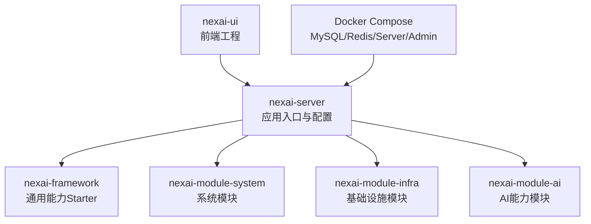
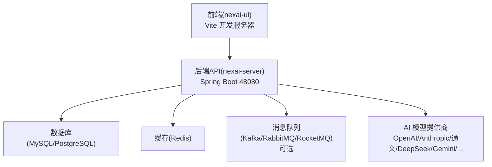
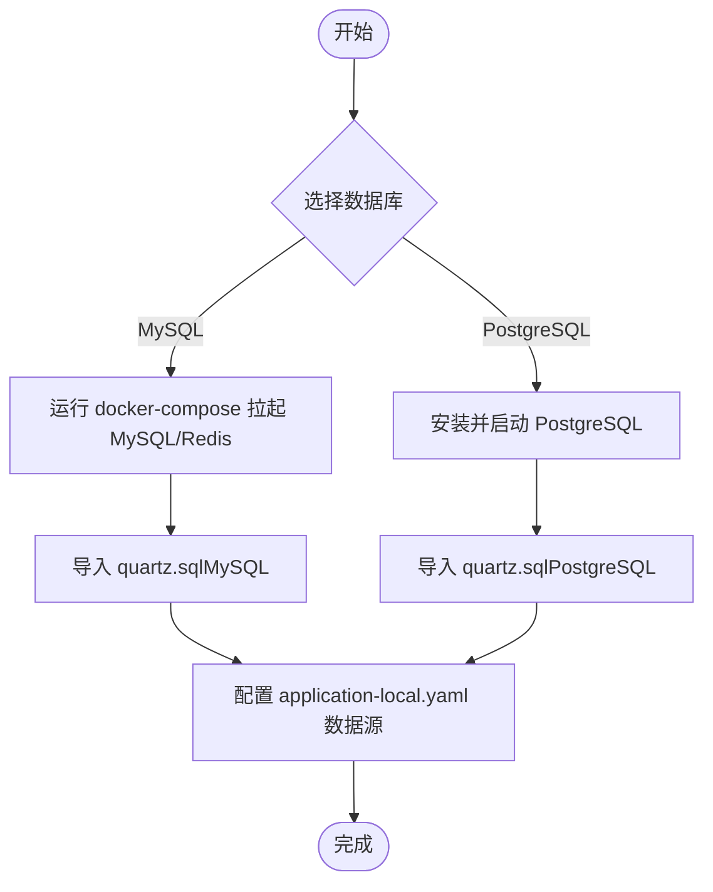
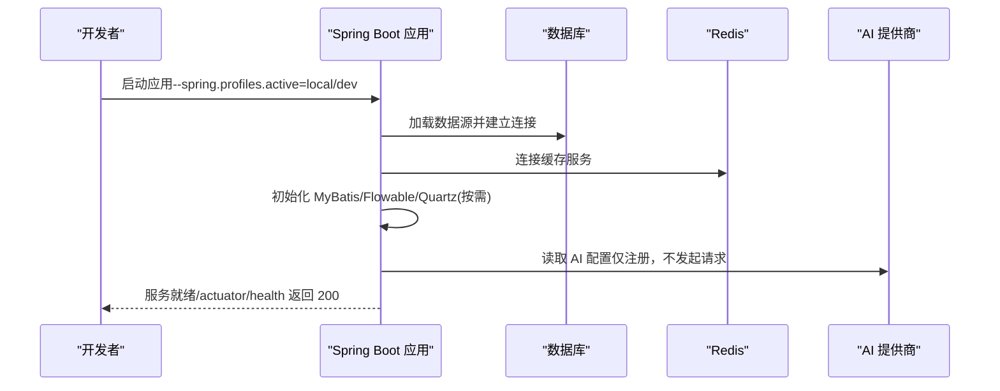
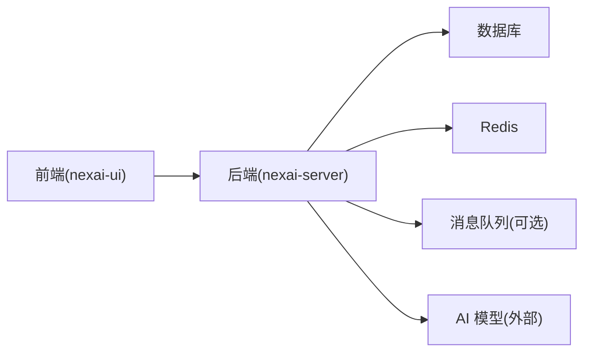

# 环境搭建

<cite>
**本文引用的文件**
- [pom.xml](file://pom.xml)
- [application.yaml](file://nexai-server/src/main/resources/application.yaml)
- [application-dev.yaml](file://nexai-server/src/main/resources/application-dev.yaml)
- [application-local-example.yaml](file://nexai-server/src/main/resources/application-local-example.yaml)
- [docker-compose.yml](file://script/docker/docker-compose.yml)
- [docker.env](file://script/docker/docker.env)
- [package.json](file://nexai-ui/package.json)
- [quartz.sql（MySQL）](file://sql/mysql/quartz.sql)
- [quartz.sql（PostgreSQL）](file://sql/postgresql/quartz.sql)
- [deploy.sh](file://script/shell/deploy.sh)
</cite>

## 目录
1. [简介](#简介)
2. [项目结构](#项目结构)
3. [核心组件](#核心组件)
4. [架构总览](#架构总览)
5. [详细组件分析](#详细组件分析)
6. [依赖关系分析](#依赖关系分析)
7. [性能注意事项](#性能注意事项)
8. [故障排查指南](#故障排查指南)
9. [结论](#结论)
10. [附录](#附录)

## 简介
本指南面向首次接触 NexAI 平台的开发者，提供从本地到容器化的完整环境搭建步骤。内容覆盖 JDK、Maven、Node.js、数据库与缓存等依赖安装与配置；数据库初始化脚本执行；后端配置文件（数据库连接、Redis、AI 模型提供商等）设置；前端开发环境搭建与启动；以及常见问题排查方案。

## 项目结构
NexAI 采用多模块 Maven 工程：
- nexai-server：应用入口与运行配置
- nexai-framework：通用能力 Starter（Web、Redis、MyBatis、MQ、安全等）
- nexai-module-system / infra / ai：业务模块
- nexai-ui：Vue3 管理端前端
- script/docker：一键拉起 MySQL/Redis/Server/Admin 的 Docker Compose
- sql：Quartz 定时任务表结构脚本

图表来源
- [pom.xml:10-32](file://pom.xml#L10-L32)
- [docker-compose.yml:5-78](file://script/docker/docker-compose.yml#L5-L78)

章节来源
- [pom.xml:1-32](file://pom.xml#L1-L32)
- [docker-compose.yml:1-85](file://script/docker/docker-compose.yml#L1-L85)

## 核心组件
- 后端运行时
  - Spring Boot 应用，默认端口 48080
  - 数据源：支持 MySQL 与 PostgreSQL（示例配置分别给出）
  - 缓存：Redis（用于验证码、会话、向量索引前缀等）
  - 消息队列：Kafka/RabbitMQ/RocketMQ（按需启用）
  - 定时任务：Quartz（JDBC 模式，需手动建表）
  - AI 集成：OpenAI、Anthropic、Ollama、通义千问、DeepSeek、Gemini、豆包、混元、硅基流动、讯飞星火、百川、文心一言、智谱、MiniMax、月之暗面、阶跃星辰、Grok、Midjourney、Suno 等（通过环境变量注入密钥）
- 前端工程
  - Vue3 + Vite + Element Plus + TypeScript
  - 开发命令：pnpm dev / pnpm dev-server
  - Node 版本要求：>= 20.19.0（推荐），pnpm >= 8.6.0

章节来源
- [application.yaml:1-390](file://nexai-server/src/main/resources/application.yaml#L1-L390)
- [application-dev.yaml:1-226](file://nexai-server/src/main/resources/application-dev.yaml#L1-L226)
- [application-local-example.yaml:1-259](file://nexai-server/src/main/resources/application-local-example.yaml#L1-L259)
- [package.json:1-156](file://nexai-ui/package.json#L1-L156)

## 架构总览
下图展示本地开发时各组件交互关系：前端通过 API 访问后端，后端连接数据库与 Redis，并可选接入 MQ；AI 调用通过配置的外部服务完成。

图表来源
- [application.yaml:135-259](file://nexai-server/src/main/resources/application.yaml#L135-L259)
- [application-dev.yaml:25-78](file://nexai-server/src/main/resources/application-dev.yaml#L25-L78)

## 详细组件分析

### 后端环境准备（JDK 与 Maven）
- JDK 25：项目使用 Java 25 编译与运行
- Maven：用于构建多模块工程
- 建议开启镜像加速以提升依赖下载速度（已在根 POM 中配置华为/阿里云仓库）

章节来源
- [pom.xml:38-52](file://pom.xml#L38-L52)
- [pom.xml:151-163](file://pom.xml#L151-L163)

### 数据库与环境准备（MySQL 或 PostgreSQL）
- 使用 Docker Compose 快速拉起 MySQL + Redis（默认数据库名 ruoyi-vue-pro，root 密码 123456）
- 若使用 PostgreSQL，可参考本地示例配置中的 JDBC URL、用户名与密码占位符
- Quartz 表结构需手动导入对应数据库脚本（MySQL 或 PostgreSQL）

图表来源
- [docker-compose.yml:6-28](file://script/docker/docker-compose.yml#L6-L28)
- [application-local-example.yaml:66-83](file://nexai-server/src/main/resources/application-local-example.yaml#L66-L83)
- [quartz.sql（MySQL）](file://sql/mysql/quartz.sql)
- [quartz.sql（PostgreSQL）](file://sql/postgresql/quartz.sql)

章节来源
- [docker-compose.yml:1-85](file://script/docker/docker-compose.yml#L1-L85)
- [application-local-example.yaml:1-259](file://nexai-server/src/main/resources/application-local-example.yaml#L1-L259)
- [application-dev.yaml:25-78](file://nexai-server/src/main/resources/application-dev.yaml#L25-L78)
- [quartz.sql（MySQL）](file://sql/mysql/quartz.sql)
- [quartz.sql（PostgreSQL）](file://sql/postgresql/quartz.sql)

### Redis 配置
- 默认端口 6379，开发环境可无密码
- 验证码、缓存、向量索引键名前缀等均基于 Redis
- 可通过环境变量或 application-local.yaml 指定 host/port/database/password

章节来源
- [application.yaml:22-27](file://nexai-server/src/main/resources/application.yaml#L22-L27)
- [application.yaml:79-84](file://nexai-server/src/main/resources/application.yaml#L79-L84)
- [application-local-example.yaml:77-83](file://nexai-server/src/main/resources/application-local-example.yaml#L77-L83)

### AI 模型提供商配置
- 通过 spring.ai.* 与 nexai.ai.* 节点配置多个厂商
- 敏感信息通过环境变量注入（如 OPENAI_API_KEY、ANTHROPIC_API_KEY、DASHSCOPE_API_KEY、DEEPSEEK_API_KEY、GEMINI_API_KEY、DOUBAO_API_KEY、HUNYUAN_API_KEY、SILICONFLOW_API_KEY、XINGHUO_API_KEY、BAICHUAN_API_KEY、YIYAN_API_KEY、ZHIPU_API_KEY、MINIMAX_API_KEY、MOONSHOT_API_KEY、STEPFUN_API_KEY、GROK_API_KEY、MIDJOURNEY_API_KEY、WEB_SEARCH_API_KEY）
- 向量存储支持 Redis/Qdrant/Milvus（开发环境默认禁用自动创建，需手动初始化）

章节来源
- [application.yaml:135-259](file://nexai-server/src/main/resources/application.yaml#L135-L259)
- [application-dev.yaml:6-24](file://nexai-server/src/main/resources/application-dev.yaml#L6-L24)

### 后端启动流程（序列图）

图表来源
- [application.yaml:1-390](file://nexai-server/src/main/resources/application.yaml#L1-L390)
- [application-dev.yaml:1-226](file://nexai-server/src/main/resources/application-dev.yaml#L1-L226)

章节来源
- [application.yaml:1-390](file://nexai-server/src/main/resources/application.yaml#L1-L390)
- [application-dev.yaml:1-226](file://nexai-server/src/main/resources/application-dev.yaml#L1-L226)

### 前端开发环境搭建
- 安装 Node.js（>= 20.19.0）与 pnpm（>= 8.6.0）
- 进入 nexai-ui 目录，执行依赖安装与开发服务器启动
- 开发模式命令：pnpm dev（本地模式）、pnpm dev-server（dev 模式）
- 构建命令：pnpm build:local / build:dev / build:test / build:stage / build:prod

章节来源
- [package.json:7-29](file://nexai-ui/package.json#L7-L29)
- [package.json:151-154](file://nexai-ui/package.json#L151-L154)

### 容器化一键启动（可选）
- 使用 script/docker/docker-compose.yml 拉起 MySQL、Redis、后端服务与管理端
- 通过 script/docker/docker.env 注入数据库与 Redis 等环境变量
- 后端服务暴露 48080，管理端暴露 8080

章节来源
- [docker-compose.yml:1-85](file://script/docker/docker-compose.yml#L1-L85)
- [docker.env:1-26](file://script/docker/docker.env#L1-L26)

## 依赖关系分析
- 后端依赖：数据库（MySQL/PostgreSQL）、缓存（Redis）、可选消息队列（Kafka/RabbitMQ/RocketMQ）
- 前端依赖：Node.js、pnpm、Vite、Element Plus、TypeScript
- 外部依赖：AI 模型提供商（通过 HTTP 调用）

图表来源
- [application.yaml:135-259](file://nexai-server/src/main/resources/application.yaml#L135-L259)
- [application-dev.yaml:111-127](file://nexai-server/src/main/resources/application-dev.yaml#L111-L127)
- [package.json:1-156](file://nexai-ui/package.json#L1-L156)

章节来源
- [application.yaml:135-259](file://nexai-server/src/main/resources/application.yaml#L135-L259)
- [application-dev.yaml:111-127](file://nexai-server/src/main/resources/application-dev.yaml#L111-L127)
- [package.json:1-156](file://nexai-ui/package.json#L1-L156)

## 性能注意事项
- 数据库连接池：Druid 已配置连接池参数，可根据并发调整初始/最大连接数
- 慢 SQL 监控：已开启 slow-sql 日志，便于定位瓶颈
- 缓存策略：合理使用 Redis 缓存热点数据，避免大对象频繁序列化
- 向量存储：开发环境默认禁用自动创建，按需手动初始化以减少启动开销
- 前端构建：生产构建已启用压缩插件，注意内存限制（脚本中设置了较大的堆大小）

章节来源
- [application-dev.yaml:27-59](file://nexai-server/src/main/resources/application-dev.yaml#L27-L59)
- [package.json:12-16](file://nexai-ui/package.json#L12-L16)

## 故障排查指南
- 无法连接数据库
  - 检查 application-local.yaml 或 application-dev.yaml 中的 JDBC URL、用户名、密码
  - 确认数据库服务已启动且端口可达
  - 确认已导入 Quartz 表结构（quartz.sql）
- Redis 连接失败
  - 检查 host/port/database/password 是否与本地或容器一致
  - 若使用容器，确保 redis 服务在 compose 网络中可用
- 启动时报 AI 相关自动配置冲突
  - 开发环境已排除部分自动配置（Qdrant/Redis/Milvus/DashScope 等），如需启用请按需调整
- 前端无法访问后端接口
  - 确认后端服务已启动并在 48080 端口监听
  - 检查前端代理或跨域配置（如有）
- 部署后健康检查失败
  - 使用 deploy.sh 的健康检查逻辑，查看 /actuator/health 返回状态码
  - 检查 JVM 参数与日志输出

章节来源
- [application-local-example.yaml:66-83](file://nexai-server/src/main/resources/application-local-example.yaml#L66-L83)
- [application-dev.yaml:6-24](file://nexai-server/src/main/resources/application-dev.yaml#L6-L24)
- [application-dev.yaml:25-78](file://nexai-server/src/main/resources/application-dev.yaml#L25-L78)
- [deploy.sh:106-143](file://script/shell/deploy.sh#L106-L143)

## 结论
按照本指南完成 JDK、Maven、Node.js、数据库与缓存的安装与配置，导入 Quartz 脚本，设置 application-local.yaml 的数据源与 Redis，并根据需要配置 AI 模型提供商密钥，即可顺利启动 NexAI 后端与前端。推荐使用 Docker Compose 快速搭建一体化环境，结合 deploy.sh 进行自动化部署与健康检查。

## 附录

### 常用命令速查
- 后端构建与运行
  - mvn clean package -DskipTests
  - java -jar nexai-server/target/nexai-server.jar --spring.profiles.active=local
- 前端开发
  - cd nexai-ui && pnpm i && pnpm dev
- 容器化
  - cd script/docker && docker compose up -d

章节来源
- [pom.xml:10-32](file://pom.xml#L10-L32)
- [package.json:7-29](file://nexai-ui/package.json#L7-L29)
- [docker-compose.yml:1-85](file://script/docker/docker-compose.yml#L1-L85)