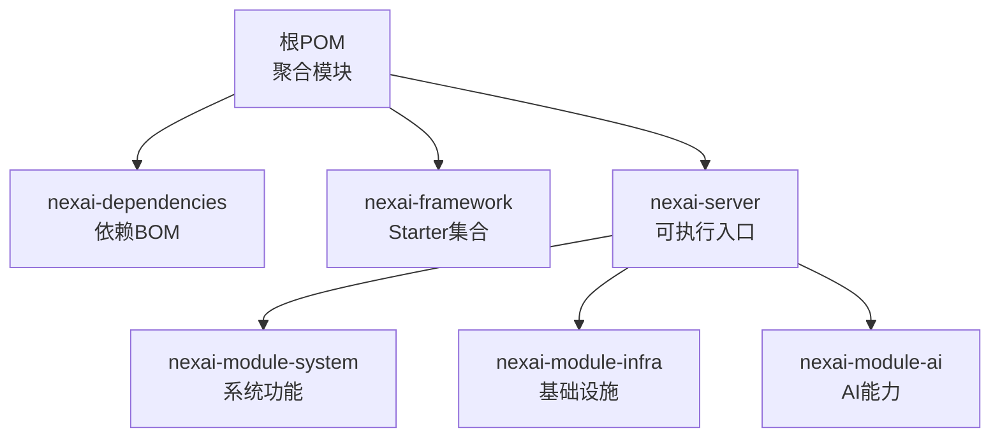
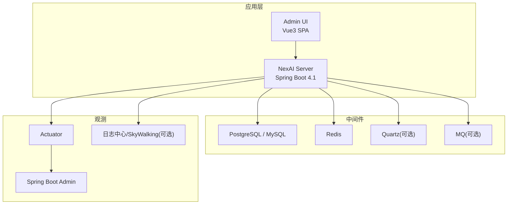
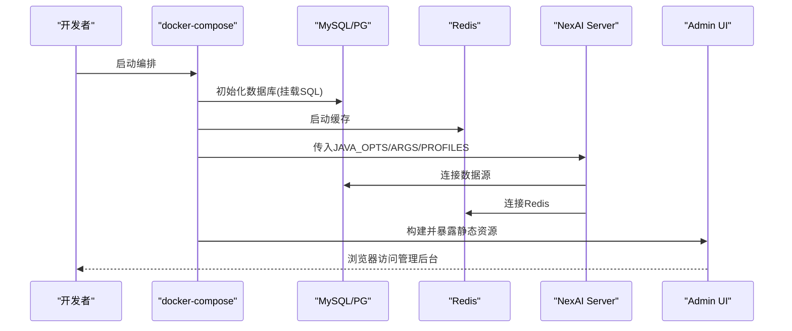
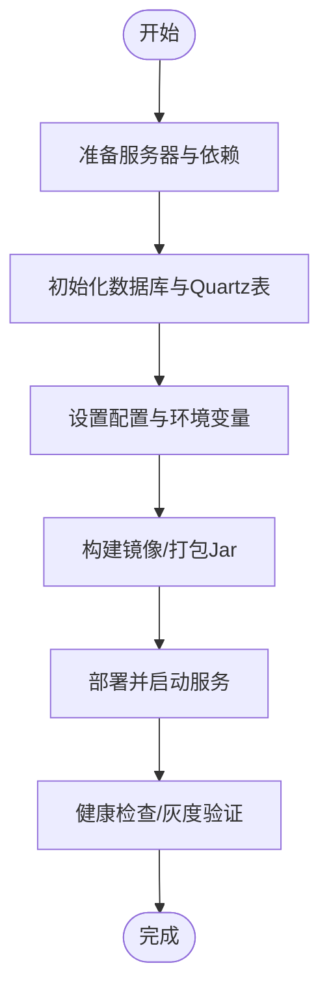
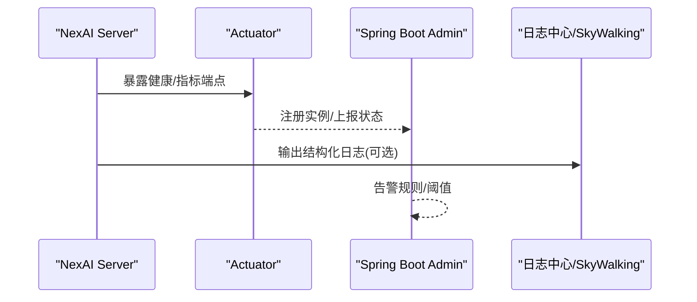
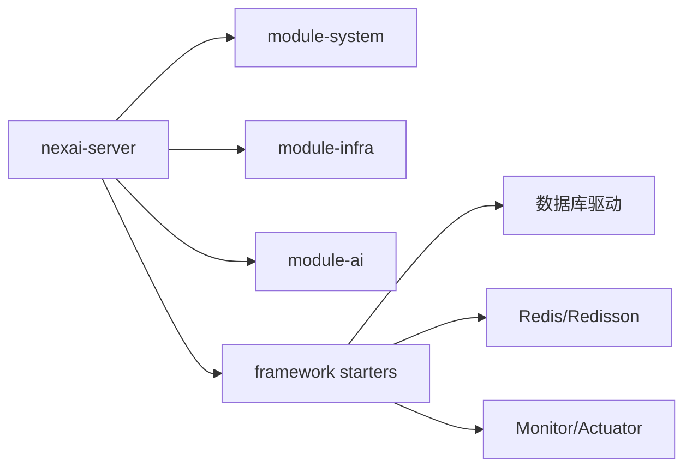

# 部署运维

<cite>
**本文引用的文件**
- [README.md](file://README.md)
- [pom.xml](file://pom.xml)
- [nexai-server/pom.xml](file://nexai-server/pom.xml)
- [application.yaml](file://nexai-server/src/main/resources/application.yaml)
- [application-dev.yaml](file://nexai-server/src/main/resources/application-dev.yaml)
- [application-docker.yaml](file://nexai-server/src/main/resources/application-docker.yaml)
- [logback-spring.xml](file://nexai-server/src/main/resources/logback-spring.xml)
- [Dockerfile](file://Dockerfile)
- [nexai-server/Dockerfile](file://nexai-server/Dockerfile)
- [script/docker/docker-compose.yml](file://script/docker/docker-compose.yml)
- [script/docker/docker.env](file://script/docker/docker.env)
- [script/shell/deploy.sh](file://script/shell/deploy.sh)
- [sql/mysql/quartz.sql](file://sql/mysql/quartz.sql)
</cite>

## 目录
1. [简介](#简介)
2. [项目结构](#项目结构)
3. [核心组件](#核心组件)
4. [架构总览](#架构总览)
5. [详细组件分析](#详细组件分析)
6. [依赖关系分析](#依赖关系分析)
7. [性能考虑](#性能考虑)
8. [故障排查指南](#故障排查指南)
9. [结论](#结论)
10. [附录](#附录)

## 简介
本运维文档面向 NexAI 平台，覆盖开发环境搭建、容器化与编排、生产部署流程、监控告警、故障排查、性能调优以及备份恢复策略。NexAI 后端基于 Spring Boot 4.1 + JDK 25，默认使用 PostgreSQL（亦支持 MySQL），集成 Redis、Quartz 定时任务、Spring Boot Admin 监控、日志中心可选接入等能力；前端为 Vue 3 SPA，通过 Nginx 或容器静态资源服务暴露。

## 项目结构
- 多模块 Maven 工程：根 pom 聚合 dependencies、framework、server、system、infra、ai 等模块。
- 可执行产物：nexai-server 打包为 fat jar，由 Spring Boot 启动。
- 配置与环境：application.yaml 为主配置，dev/docker/local 等 profile 覆盖差异；docker-compose 编排数据库、缓存、应用与前端。
- 脚本：提供 shell 一键部署与健康检查，Docker 构建镜像与运行参数。

**图表来源**
- [pom.xml:10-32](file://pom.xml#L10-L32)
- [nexai-server/pom.xml:23-112](file://nexai-server/pom.xml#L23-L112)

**章节来源**
- [README.md:76-90](file://README.md#L76-L90)
- [pom.xml:10-32](file://pom.xml#L10-L32)

## 核心组件
- 运行时与依赖
  - JDK 25、Spring Boot 4.1、Maven 3.9+、Node.js + pnpm（前端）。
  - 数据库：PostgreSQL（默认）、MySQL（兼容）；连接池 Druid；ORM MyBatis Plus。
  - 缓存与会话：Redis/Redisson。
  - 任务调度：Quartz（JDBC 存储，支持集群）。
  - 监控：Actuator、Spring Boot Admin Client、可选 SkyWalking 日志收集。
- 关键配置
  - application.yaml 定义全局行为（接口文档、AI 客户端、Websocket、租户、验证码等）。
  - dev/docker 等 profile 覆盖数据源、端口、自动装配排除项等。
  - Dockerfile 多阶段构建，最终 JRE 镜像运行 app.jar。
  - docker-compose 编排 MySQL/Redis/Server/Admin UI，环境变量集中管理。

**章节来源**
- [README.md:126-140](file://README.md#L126-L140)
- [application.yaml:1-390](file://nexai-server/src/main/resources/application.yaml#L1-L390)
- [application-dev.yaml:1-226](file://nexai-server/src/main/resources/application-dev.yaml#L1-L226)
- [application-docker.yaml:1-74](file://nexai-server/src/main/resources/application-docker.yaml#L1-L74)
- [Dockerfile:1-23](file://Dockerfile#L1-L23)
- [script/docker/docker-compose.yml:1-85](file://script/docker/docker-compose.yml#L1-L85)

## 架构总览
NexAI 采用“单体可执行 Jar + 外部依赖”的部署形态：应用通过 Spring Boot 启动，连接数据库与缓存，可选接入消息队列与链路追踪；前端静态资源由独立服务或容器提供，通过反向代理访问后端 API。

**图表来源**
- [application.yaml:135-259](file://nexai-server/src/main/resources/application.yaml#L135-L259)
- [application-dev.yaml:82-110](file://nexai-server/src/main/resources/application-dev.yaml#L82-L110)
- [application-dev.yaml:137-162](file://nexai-server/src/main/resources/application-dev.yaml#L137-L162)
- [logback-spring.xml:38-54](file://nexai-server/src/main/resources/logback-spring.xml#L38-L54)

## 详细组件分析

### 开发环境搭建
- 基础依赖
  - JDK 25、Maven 3.9+、Node.js（pnpm）。
  - 数据库：本地安装 PostgreSQL 或 MySQL；缓存：Redis。
- 构建与启动
  - 后端：在根目录执行 Maven 构建指定模块并打包；运行 nexai-server 主类，默认 profile local，端口 48080。
  - 前端：进入 nexai-ui，安装依赖后启动开发服务器。
- 配置文件
  - application-dev.yaml 中配置数据源、Redis、Quartz、消息队列等；如需切换数据库类型，参考 application-docker.yaml 中的 JDBC URL 与验证查询。

**章节来源**
- [README.md:126-140](file://README.md#L126-L140)
- [application-dev.yaml:25-79](file://nexai-server/src/main/resources/application-dev.yaml#L25-L79)
- [application-docker.yaml:25-47](file://nexai-server/src/main/resources/application-docker.yaml#L25-L47)

### Docker 容器化与编排
- 镜像构建
  - 根目录 Dockerfile 使用多阶段构建：第一阶段用 Maven 编译所有依赖模块并打包；第二阶段以 JRE 运行 app.jar，设置时区与端口。
  - nexai-server/Dockerfile 提供最小运行镜像示例，支持通过环境变量注入 JVM 参数与应用参数。
- 编排与服务
  - docker-compose.yml 定义 mysql、redis、server、admin 四个服务，映射端口、挂载数据卷、注入环境变量。
  - docker.env 集中管理数据库账号、JVM 参数、数据源地址、Redis 主机及前端构建参数。
- 环境变量要点
  - SPRING_PROFILES_ACTIVE：选择激活的 profile（如 local/docker）。
  - JAVA_OPTS：JVM 内存与安全随机数优化。
  - ARGS：传递 --spring.datasource.* 等启动参数，便于覆盖数据源与 Redis 地址。
  - 前端构建参数：NODE_ENV、PUBLIC_PATH、VUE_APP_BASE_API 等控制 API 前缀与标题。

**图表来源**
- [script/docker/docker-compose.yml:5-78](file://script/docker/docker-compose.yml#L5-L78)
- [script/docker/docker.env:1-26](file://script/docker/docker.env#L1-L26)
- [Dockerfile:1-23](file://Dockerfile#L1-L23)
- [nexai-server/Dockerfile:1-24](file://nexai-server/Dockerfile#L1-L24)

**章节来源**
- [Dockerfile:1-23](file://Dockerfile#L1-L23)
- [nexai-server/Dockerfile:1-24](file://nexai-server/Dockerfile#L1-L24)
- [script/docker/docker-compose.yml:1-85](file://script/docker/docker-compose.yml#L1-L85)
- [script/docker/docker.env:1-26](file://script/docker/docker.env#L1-L26)

### 生产环境部署流程
- 服务器准备
  - 安装 JDK 25（或按镜像要求）、Maven（用于CI）、Node.js（前端构建）。
  - 安装并配置数据库（PostgreSQL/MySQL）与 Redis，开放必要端口。
- 数据库初始化
  - 执行 Quartz 相关 SQL 脚本（根据数据库类型选择对应脚本）。
  - 若使用 docker-compose，可在首次启动时自动导入初始化脚本。
- 配置文件设置
  - 通过 application-docker.yaml 或环境变量覆盖数据源、Redis、端口、自动装配排除项等。
  - 建议将敏感信息（密码、密钥）放入环境变量或配置中心，避免硬编码。
- 服务启动
  - 使用 docker-compose 拉起全部依赖与应用；或通过 shell 脚本 deploy.sh 进行二进制部署与健康检查。
  - 健康检查端点：/actuator/health，确保服务就绪后再对外提供服务。

**图表来源**
- [script/shell/deploy.sh:28-158](file://script/shell/deploy.sh#L28-L158)
- [application-docker.yaml:1-74](file://nexai-server/src/main/resources/application-docker.yaml#L1-L74)
- [sql/mysql/quartz.sql](file://sql/mysql/quartz.sql)

**章节来源**
- [script/shell/deploy.sh:1-161](file://script/shell/deploy.sh#L1-L161)
- [application-docker.yaml:1-74](file://nexai-server/src/main/resources/application-docker.yaml#L1-L74)
- [sql/mysql/quartz.sql](file://sql/mysql/quartz.sql)

### 监控告警配置
- Actuator 与 Spring Boot Admin
  - Actuator 暴露 /actuator/** 端点，便于健康检查与指标采集。
  - 配置 Spring Boot Admin Client 指向 Admin Server，统一纳管实例。
- 日志收集
  - Logback 异步输出到文件，支持按天/大小滚动；可选接入 SkyWalking 日志中心。
- 性能监控
  - 可通过 Micrometer + Prometheus（starter 已包含依赖）暴露指标；结合 Grafana 可视化。
  - 链路追踪：OpenTelemetry 或 SkyWalking Agent 可按需启用。

**图表来源**
- [application-dev.yaml:137-162](file://nexai-server/src/main/resources/application-dev.yaml#L137-L162)
- [logback-spring.xml:38-54](file://nexai-server/src/main/resources/logback-spring.xml#L38-L54)
- [nexai-framework/nexai-spring-boot-starter-monitor/pom.xml:44-76](file://nexai-framework/nexai-spring-boot-starter-monitor/pom.xml#L44-L76)

**章节来源**
- [application-dev.yaml:137-162](file://nexai-server/src/main/resources/application-dev.yaml#L137-L162)
- [logback-spring.xml:1-58](file://nexai-server/src/main/resources/logback-spring.xml#L1-L58)
- [nexai-framework/nexai-spring-boot-starter-monitor/pom.xml:44-76](file://nexai-framework/nexai-spring-boot-starter-monitor/pom.xml#L44-L76)

### 故障排查方法
- 常见问题定位
  - 启动失败：检查数据源连接、Redis 连通性、端口占用、profile 是否正确激活。
  - 健康检查不通过：查看 /actuator/health 返回与最近日志，确认依赖服务可用。
  - 登录/验证码问题：核对验证码配置与前端构建参数（如 VUE_APP_BASE_API）。
- 诊断步骤
  - 查看应用日志（文件滚动输出，必要时开启更细粒度日志级别）。
  - 使用 Actuator 端点获取运行期信息（线程、内存、GC、连接池等）。
  - 通过 Spring Boot Admin 面板观察实例状态与异常堆栈。
  - 若启用 SkyWalking，结合 TraceId 关联日志与调用链。

**章节来源**
- [application-dev.yaml:137-162](file://nexai-server/src/main/resources/application-dev.yaml#L137-L162)
- [logback-spring.xml:15-36](file://nexai-server/src/main/resources/logback-spring.xml#L15-L36)
- [script/shell/deploy.sh:106-143](file://script/shell/deploy.sh#L106-L143)

### 性能调优建议与最佳实践
- JVM 与容器
  - 合理设置 -Xms/-Xmx，避免频繁 GC；容器环境下注意内存限制与 OOM 保护。
  - 使用安全随机数优化（已在镜像中配置）。
- 数据库与连接池
  - 调整 Druid 连接池初始/最大连接数、超时与验证策略；慢 SQL 记录开启以便分析。
  - 针对 PG/MySQL 使用合适的 validation-query 与批处理参数。
- 缓存与会话
  - 合理使用 Redis 缓存热点数据；设置合理的过期时间与容量上限。
- 日志与监控
  - 生产环境关闭不必要的 DEBUG 日志；使用异步写入减少 IO 阻塞。
  - 接入指标与链路追踪，建立基线与告警阈值。

**章节来源**
- [application-dev.yaml:25-79](file://nexai-server/src/main/resources/application-dev.yaml#L25-L79)
- [application-docker.yaml:25-47](file://nexai-server/src/main/resources/application-docker.yaml#L25-L47)
- [logback-spring.xml:30-36](file://nexai-server/src/main/resources/logback-spring.xml#L30-L36)

### 备份恢复与灾难恢复
- 数据备份
  - 数据库：定期全量/增量备份（pg_dump/mysqldump 或云厂商备份方案），保留周期与异地存储。
  - 缓存：Redis 持久化策略（RDB/AOF）与快照备份。
  - 文件与配置：对象存储（S3/MinIO）与配置中心版本化管理。
- 恢复演练
  - 制定恢复流程与回滚策略，定期演练恢复时间目标（RTO/RPO）。
  - 使用 docker-compose 快速重建依赖环境，优先恢复数据库与缓存。
- 高可用
  - 数据库主从/集群、Redis 哨兵/集群、应用多副本与负载均衡。
  - 定时任务（Quartz）集群模式避免重复执行。

[本节为通用运维实践说明，未直接引用具体代码文件]

## 依赖关系分析
- 模块耦合
  - nexai-server 聚合 system、infra、ai 等业务模块，形成单一可部署单元。
  - framework 提供通用 Starter（MyBatis、Redis、Security、Monitor 等），降低业务模块耦合。
- 外部依赖
  - 数据库驱动由 server 引入（PostgreSQL/MySQL）；消息队列与向量库按需启用。
  - 监控与追踪通过 starter 与配置开关灵活接入。

**图表来源**
- [nexai-server/pom.xml:23-112](file://nexai-server/pom.xml#L23-L112)
- [nexai-framework/nexai-spring-boot-starter-monitor/pom.xml:44-76](file://nexai-framework/nexai-spring-boot-starter-monitor/pom.xml#L44-L76)

**章节来源**
- [nexai-server/pom.xml:23-112](file://nexai-server/pom.xml#L23-L112)
- [pom.xml:10-32](file://pom.xml#L10-L32)

## 性能考虑
- 构建与发布
  - 使用多阶段构建与缓存挂载加速重复构建；仅打包必要模块减少镜像体积。
- 运行期
  - 合理设置连接池与缓存 TTL；对高频接口增加缓存与限流。
  - 日志异步化与分级输出，避免 I/O 成为瓶颈。
- 观测
  - 建立指标看板与告警规则，关注 CPU、内存、GC、连接池、慢 SQL 等关键指标。

[本节为通用性能指导，未直接引用具体代码文件]

## 故障排查指南
- 启动阶段
  - 检查 profile 激活与数据源/Redis 连通性；查看 Actuator 健康端点。
- 运行阶段
  - 通过 Admin 面板查看实例状态；结合日志与链路追踪定位异常。
  - 对慢请求与慢 SQL 进行分析，优化索引与查询。
- 变更回滚
  - 使用 deploy.sh 的备份机制与优雅停机；必要时回滚至上一版本 Jar。

**章节来源**
- [application-dev.yaml:137-162](file://nexai-server/src/main/resources/application-dev.yaml#L137-L162)
- [logback-spring.xml:15-36](file://nexai-server/src/main/resources/logback-spring.xml#L15-L36)
- [script/shell/deploy.sh:28-158](file://script/shell/deploy.sh#L28-L158)

## 结论
NexAI 提供了完善的开发与部署基座：多模块 Maven 工程、容器化与编排、丰富的监控与日志能力、以及可扩展的 AI 能力。通过合理的配置与运维实践，可实现稳定、可观测、易扩展的生产环境。

## 附录
- 常用命令
  - 后端构建：mvn -pl nexai-server -am package
  - 启动后端：运行 NexaiServerApplication（默认端口 48080）
  - 前端开发：pnpm i && pnpm dev
- 关键路径
  - 应用配置：application.yaml、application-dev.yaml、application-docker.yaml
  - 日志配置：logback-spring.xml
  - 容器编排：script/docker/docker-compose.yml、script/docker/docker.env
  - 部署脚本：script/shell/deploy.sh

**章节来源**
- [README.md:126-140](file://README.md#L126-L140)
- [application.yaml:1-390](file://nexai-server/src/main/resources/application.yaml#L1-L390)
- [application-dev.yaml:1-226](file://nexai-server/src/main/resources/application-dev.yaml#L1-L226)
- [application-docker.yaml:1-74](file://nexai-server/src/main/resources/application-docker.yaml#L1-L74)
- [logback-spring.xml:1-58](file://nexai-server/src/main/resources/logback-spring.xml#L1-L58)
- [script/docker/docker-compose.yml:1-85](file://script/docker/docker-compose.yml#L1-L85)
- [script/docker/docker.env:1-26](file://script/docker/docker.env#L1-L26)
- [script/shell/deploy.sh:1-161](file://script/shell/deploy.sh#L1-L161)