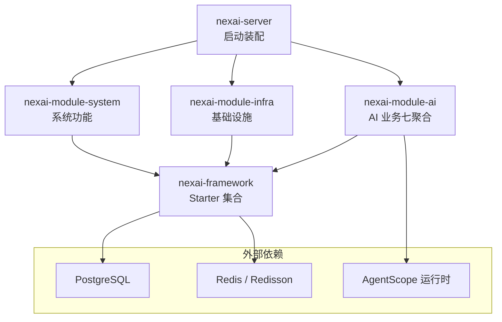
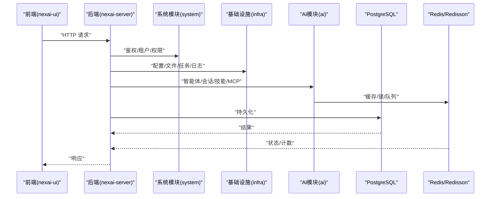
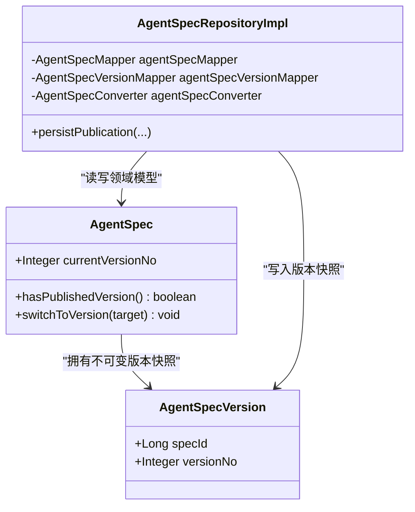
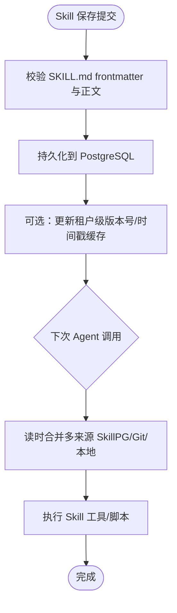
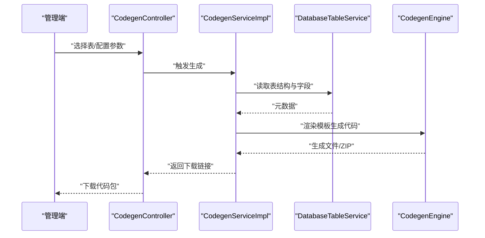
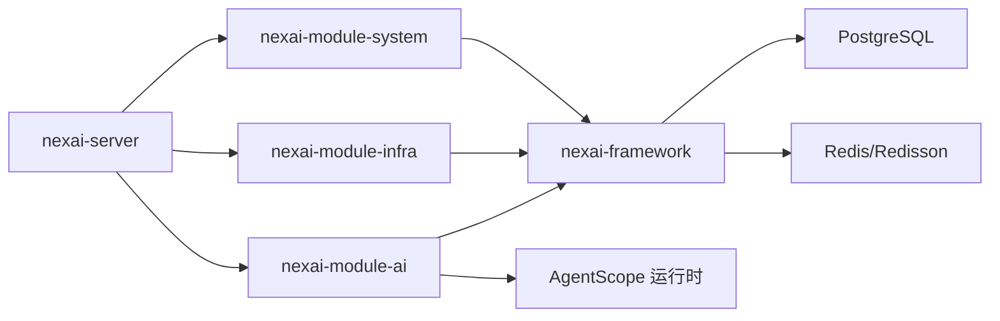

# 项目概述

<cite>
**本文引用的文件**
- [README.md](file://README.md)
- [pom.xml](file://pom.xml)
- [NexaiServerApplication.java](file://nexai-server/src/main/java/com/gkht/ai/nexai/server/NexaiServerApplication.java)
- [application.yaml](file://nexai-server/src/main/resources/application.yaml)
- [package-info.java (AI 模块)](file://nexai-module-ai/src/main/java/com/gkht/ai/nexai/module/ai/package-info.java)
- [AgentSpecRepositoryImpl.java](file://nexai-module-ai/src/main/java/com/gkht/ai/nexai/module/ai/agentspec/infrastructure/repository/AgentSpecRepositoryImpl.java)
- [AgentSpec.java](file://nexai-module-ai/src/main/java/com/gkht/ai/nexai/module/ai/agentspec/domain/model/AgentSpec.java)
- [CodegenServiceImpl.java](file://nexai-module-infra/src/main/java/com/gkht/ai/nexai/module/infra/service/codegen/CodegenServiceImpl.java)
- [CodegenController.java](file://nexai-module-infra/src/main/java/com/gkht/ai/nexai/module/infra/controller/admin/codegen/CodegenController.java)
- [CodegenProperties.java](file://nexai-module-infra/src/main/java/com/gkht/ai/nexai/module/infra/framework/codegen/config/CodegenProperties.java)
- [2026-08-25-agentscope-skill-管理三种存储与同步机制.md](file://docs/research/2026-08-25-agentscope-skill-管理三种存储与同步机制.md)
- [2026-08-25-agentscope-examples-service-使用盘点.md](file://docs/research/2026-08-25-agentscope-examples-service-使用盘点.md)
</cite>

## 目录
1. [简介](#简介)
2. [项目结构](#项目结构)
3. [核心组件](#核心组件)
4. [架构总览](#架构总览)
5. [详细组件分析](#详细组件分析)
6. [依赖关系分析](#依赖关系分析)
7. [性能考量](#性能考量)
8. [故障排查指南](#故障排查指南)
9. [结论](#结论)
10. [附录：快速开始](#附录快速开始)

## 简介
NexAI 是企业级 AI 智能体开发平台，基于 Spring Boot 4.1 + Vue 3 的多模块架构，面向“系统管理、基础设施、AI 业务”三大职责域进行分层与切分。平台采用领域驱动设计（DDD），在 AI 模块中按七聚合垂直切分（agentspec、channel、skill、mcpserver、session、audit、usage），以“领域模型 + 应用服务 + 基础设施适配”的清晰边界组织代码，便于扩展与维护。

平台提供多租户 SaaS 能力、微服务化基础组件（消息队列、缓存、监控、安全等 Starter）、以及高效的代码生成器，支持一键生成 Java、Vue、SQL、接口文档，覆盖单表、树表、主子表等常见场景。技术栈涵盖 Java 25、PostgreSQL、Redis、AgentScope 等，满足企业级高可用、可扩展、可观测的诉求。

**章节来源**
- [README.md:10-28](file://README.md#L10-L28)
- [README.md:76-142](file://README.md#L76-L142)

## 项目结构
项目采用 Maven 多模块工程，核心模块如下：
- nexai-dependencies：统一依赖版本管理（BOM）
- nexai-framework：自研 Spring Boot Starter 集合（Web、Security、Redis、MyBatis、MQ、Job、Monitor、Protection、Excel、Test、Tenant、DataPermission、IP 等）
- nexai-server：装配型启动应用（空壳装配，扫描 server 与 module 包）
- nexai-module-system：系统功能模块（用户、角色、菜单、租户、字典、短信、邮件、日志、OAuth2 等）
- nexai-module-infra：基础设施模块（配置、文件、任务调度、API 日志、数据库监控、Redis 监控、消息队列、代码生成器等）
- nexai-module-ai：AI 业务模块（七聚合垂直切分：agentspec/channel/skill/mcpserver/session/audit/usage）
- nexai-ui：Vue 3 管理后台前端 SPA（Vite + TypeScript + Element Plus + UnoCSS）
- sql/script/docs：数据库脚本、部署脚本、设计与研究文档

**图表来源**
- [pom.xml:10-32](file://pom.xml#L10-L32)
- [NexaiServerApplication.java:16-17](file://nexai-server/src/main/java/com/gkht/ai/nexai/server/NexaiServerApplication.java#L16-L17)
- [package-info.java (AI 模块):1-4](file://nexai-module-ai/src/main/java/com/gkht/ai/nexai/module/ai/package-info.java#L1-L4)

**章节来源**
- [pom.xml:10-32](file://pom.xml#L10-L32)
- [README.md:76-90](file://README.md#L76-L90)

## 核心组件
- 启动装配：Spring Boot 应用通过 NexaiServerApplication 扫描 server 与 module 包，装配各模块控制器与服务。
- 框架层：提供 Web、Security、Redis、MyBatis、MQ、Job、Monitor、Protection、Excel、Test、Tenant、DataPermission、IP 等 Starter，屏蔽底层差异，统一配置与扩展点。
- 系统模块：提供用户、角色、菜单、部门、岗位、租户、租户套餐、字典、短信、邮件、站内信、操作日志、登录日志、错误码、通知、地区、SSO 应用管理等。
- 基础设施模块：提供代码生成器、动态数据源、配置管理、定时任务、文件服务、API 日志、数据库监控、Redis 监控、消息队列、Java 监控、服务保障（分布式锁、幂等、限流）、日志中心等。
- AI 模块：基于 AgentScope 运行时，实现智能体规格（agentspec）、渠道（channel）、技能资产（skill）、MCP 服务器（mcpserver）、会话（session）、审计（audit）、用量（usage）七大聚合，遵循 DDD 约定布局。

**章节来源**
- [NexaiServerApplication.java:16-17](file://nexai-server/src/main/java/com/gkht/ai/nexai/server/NexaiServerApplication.java#L16-L17)
- [nexai-framework/pom.xml:12-31](file://nexai-framework/pom.xml#L12-L31)
- [README.md:30-74](file://README.md#L30-L74)
- [package-info.java (AI 模块):1-4](file://nexai-module-ai/src/main/java/com/gkht/ai/nexai/module/ai/package-info.java#L1-L4)

## 架构总览
平台采用“前后端分离 + 多模块后端 + DDD 领域建模”的总体架构：
- 前端：Vue 3 SPA，模块化 API 调用与页面路由，Element Plus 组件库与 UnoCSS 原子化样式。
- 后端：Spring Boot 4.1 多模块，按系统、基础设施、AI 业务划分；AI 模块内部按七聚合垂直切分，每个聚合包含 application/domain/infrastructure/interfaces 四层。
- 数据层：PostgreSQL 为主数据库，Redis/Redisson 用于缓存、分布式锁、消息队列；MyBatis Plus 作为 ORM。
- 可观测性：集成 Springdoc/Knife4j 接口文档、Spring Boot Admin 监控、OpenTelemetry 埋点预留。
- 多租户：通过 Tenant Starter 提供透明化的租户上下文、数据隔离与权限控制。
- 微服务化基础：MQ（Redis/RocketMQ/Kafka/RabbitMQ 可选）、WebSocket、Job、Protection、Monitor 等 Starter 为未来拆分微服务提供支撑。

**图表来源**
- [application.yaml:1-27](file://nexai-server/src/main/resources/application.yaml#L1-L27)
- [application.yaml:135-259](file://nexai-server/src/main/resources/application.yaml#L135-L259)
- [application.yaml:338-367](file://nexai-server/src/main/resources/application.yaml#L338-L367)

**章节来源**
- [application.yaml:1-27](file://nexai-server/src/main/resources/application.yaml#L1-L27)
- [application.yaml:135-259](file://nexai-server/src/main/resources/application.yaml#L135-L259)
- [application.yaml:338-367](file://nexai-server/src/main/resources/application.yaml#L338-L367)

## 详细组件分析

### 智能体规格聚合（AgentSpec）
- 领域模型：AgentSpec 聚合根维护当前生效版本指针与发布状态，AgentSpecVersion 为不可变快照，保证版本回溯与一致性。
- 仓储实现：AgentSpecRepositoryImpl 负责 DO 与领域模型的转换，封装版本簿记（max+1、快照插入、指针更新）于单一方法内，确保事务一致性与领域语义。
- 切换版本：switchToVersion 校验目标版本归属并更新当前版本号，保障“当前生效版本”的一致性。

**图表来源**
- [AgentSpec.java:144-167](file://nexai-module-ai/src/main/java/com/gkht/ai/nexai/module/ai/agentspec/domain/model/AgentSpec.java#L144-L167)
- [AgentSpecRepositoryImpl.java:1-31](file://nexai-module-ai/src/main/java/com/gkht/ai/nexai/module/ai/agentspec/infrastructure/repository/AgentSpecRepositoryImpl.java#L1-L31)

**章节来源**
- [AgentSpec.java:144-167](file://nexai-module-ai/src/main/java/com/gkht/ai/nexai/module/ai/agentspec/domain/model/AgentSpec.java#L144-L167)
- [AgentSpecRepositoryImpl.java:1-31](file://nexai-module-ai/src/main/java/com/gkht/ai/nexai/module/ai/agentspec/infrastructure/repository/AgentSpecRepositoryImpl.java#L1-L31)

### 技能资产（Skill）管理与 AgentScope 集成
- 存储与同步：参考 AgentScope 官方实践，Skill 管理可采用 PostgreSQL 仓储，读时合成策略（每次调用合并多来源 Skill 内容），避免复杂同步任务；若需优化，可在应用服务层引入租户级版本号/更新时间戳缓存。
- 多租户映射：结合平台已有的多租户行级过滤，Skill 表天然获得租户隔离；也可实现“平台公共 Skill + 租户覆盖 Skill”的两级合成。
- 管理端对接：列表/搜索、编辑器（SKILL.md frontmatter + 正文）、校验（复用解析器与校验逻辑）与管理端 CRUD 对齐；发布控制位可参考 harness 的 Canary/AllowList/Environment 过滤思路。

**图表来源**
- [2026-08-25-agentscope-skill-管理三种存储与同步机制.md:398-414](file://docs/research/2026-08-25-agentscope-skill-管理三种存储与同步机制.md#L398-L414)

**章节来源**
- [2026-08-25-agentscope-skill-管理三种存储与同步机制.md:398-414](file://docs/research/2026-08-25-agentscope-skill-管理三种存储与同步机制.md#L398-L414)

### 代码生成器（Codegen）
- 入口与流程：CodegenController 暴露管理端接口，CodegenServiceImpl 协调 DatabaseTableService、DataSourceConfigService、CodegenBuilder、CodegenEngine 完成元数据采集、模板渲染与代码输出。
- 配置项：CodegenProperties 定义基础包、数据库 schema、前端类型、VO 类型、是否生成批量删除/单元测试/导入接口等开关。
- 测试与质量：配套单元测试验证生成逻辑与异常路径，保障生成产物的一致性与正确性。

**图表来源**
- [CodegenController.java:1-23](file://nexai-module-infra/src/main/java/com/gkht/ai/nexai/module/infra/controller/admin/codegen/CodegenController.java#L1-L23)
- [CodegenServiceImpl.java:21-66](file://nexai-module-infra/src/main/java/com/gkht/ai/nexai/module/infra/service/codegen/CodegenServiceImpl.java#L21-L66)
- [CodegenProperties.java:13-64](file://nexai-module-infra/src/main/java/com/gkht/ai/nexai/module/infra/framework/codegen/config/CodegenProperties.java#L13-L64)

**章节来源**
- [CodegenController.java:1-23](file://nexai-module-infra/src/main/java/com/gkht/ai/nexai/module/infra/controller/admin/codegen/CodegenController.java#L1-L23)
- [CodegenServiceImpl.java:21-66](file://nexai-module-infra/src/main/java/com/gkht/ai/nexai/module/infra/service/codegen/CodegenServiceImpl.java#L21-L66)
- [CodegenProperties.java:13-64](file://nexai-module-infra/src/main/java/com/gkht/ai/nexai/module/infra/framework/codegen/config/CodegenProperties.java#L13-L64)

### 多租户与微服务基础
- 多租户：Tenant Starter 提供透明化的租户上下文注入、URL 忽略、表忽略、缓存忽略等配置，支持按租户隔离数据与权限。
- 微服务基础：MQ（Redis/RocketMQ/Kafka/RabbitMQ）、WebSocket、Job、Protection、Monitor 等 Starter 为未来拆分为独立服务提供通信、调度、保护与观测能力。

**章节来源**
- [application.yaml:346-367](file://nexai-server/src/main/resources/application.yaml#L346-L367)
- [nexai-framework/pom.xml:12-31](file://nexai-framework/pom.xml#L12-L31)

## 依赖关系分析
- 模块依赖：nexai-server 装配 system、infra、ai 三个业务模块；所有业务模块依赖 nexai-framework 提供的通用 Starter。
- 外部依赖：PostgreSQL 作为主数据库，Redis/Redisson 用于缓存与分布式能力；AgentScope 作为 AI 运行时嵌入 AI 模块。
- 配置依赖：application.yaml 集中管理 Spring、MyBatis、Redis、AI、租户、代码生成等配置项。

**图表来源**
- [pom.xml:10-32](file://pom.xml#L10-L32)
- [application.yaml:1-27](file://nexai-server/src/main/resources/application.yaml#L1-L27)
- [application.yaml:135-259](file://nexai-server/src/main/resources/application.yaml#L135-L259)

**章节来源**
- [pom.xml:10-32](file://pom.xml#L10-L32)
- [application.yaml:1-27](file://nexai-server/src/main/resources/application.yaml#L1-L27)

## 性能考量
- 缓存与限流：Redis 作为缓存与分布式锁/限流的基础，合理设置过期时间与并发控制，避免热点 Key 与雪崩。
- 数据库访问：MyBatis Plus 开启驼峰映射与逻辑删除，合理使用分页与查询条件，减少全表扫描。
- 消息队列：根据场景选择 Redis Stream（集群消费）或 Pub/Sub（广播消费），平衡吞吐与可靠性。
- 可观测性：启用 OpenTelemetry 埋点与 Spring Boot Admin 监控，定位慢请求与资源瓶颈。

[本节为通用指导，不直接分析具体文件]

## 故障排查指南
- 启动问题：检查 NexaiServerApplication 的扫描包配置是否正确，确认依赖模块已编译并加入类路径。
- 数据库连接：核对 application.yaml 中的数据库与连接池配置，确保 PostgreSQL 可达且账号权限正确。
- Redis 连接：确认 Redis/Redisson 配置与网络连通性，必要时关闭不必要的 Repository 以提升启动速度。
- 代码生成失败：检查 CodegenProperties 配置（基础包、数据库 schema、前端/VO 类型），确认数据库表存在且可读。
- AI 运行时：核对 AgentScope 相关配置（向量库、模型提供商、MCP 客户端/服务端开关），确保密钥与环境变量正确。

**章节来源**
- [NexaiServerApplication.java:16-17](file://nexai-server/src/main/java/com/gkht/ai/nexai/server/NexaiServerApplication.java#L16-L17)
- [application.yaml:1-27](file://nexai-server/src/main/resources/application.yaml#L1-L27)
- [application.yaml:135-259](file://nexai-server/src/main/resources/application.yaml#L135-L259)
- [CodegenProperties.java:13-64](file://nexai-module-infra/src/main/java/com/gkht/ai/nexai/module/infra/framework/codegen/config/CodegenProperties.java#L13-L64)

## 结论
NexAI 以 DDD 为指导思想，将系统管理、基础设施与 AI 业务清晰切分，AI 模块进一步按七聚合垂直切分，形成高内聚、低耦合的可扩展架构。平台在多租户、微服务基础、代码生成等方面提供了企业级能力，结合 AgentScope 运行时，能够快速构建与交付 AI 智能体解决方案。

[本节为总结性内容，不直接分析具体文件]

## 附录：快速开始
- 环境要求：JDK 25 + Maven 3.9+（后端），Node.js + pnpm（前端）。
- 后端构建与启动：
  - 构建指定模块及其依赖：mvn -pl nexai-module-system -am package
  - 启动应用：运行 nexai-server 中的 NexaiServerApplication（默认 profile local，端口 48080）
- 前端启动：
  - 进入 nexai-ui 目录：pnpm i && pnpm dev（vite，mode env.local，端口 5173）

**章节来源**
- [README.md:126-142](file://README.md#L126-L142)